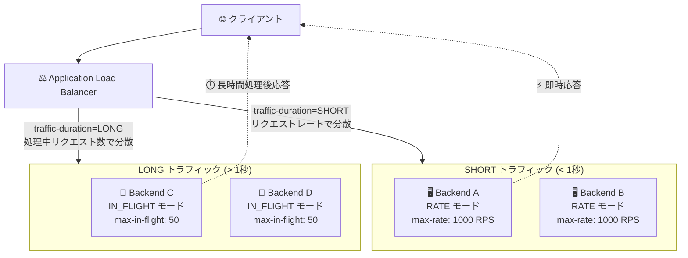

# Cloud Load Balancing: Traffic Duration 設定と In-Flight バランシングモードが GA

**リリース日**: 2026-05-22

**サービス**: Cloud Load Balancing

**機能**: Traffic Duration 設定 / In-Flight バランシングモード

**ステータス**: General Availability (GA)

📊 [このアップデートのインフォグラフィックを見る](https://takech9203.github.io/google-cloud-news-summary/20260522-cloud-load-balancing-traffic-duration-in-flight.html)

## 概要

Application Load Balancer において、バックエンドサービスにバックエンドを追加する際に **Traffic Duration (トラフィック持続時間) 設定** を構成できるようになりました。この設定は `SHORT` または `LONG` の値を指定でき、バックエンドが HTTP リクエストを完了するために必要な応答時間に基づいて選択します。

さらに、**In-Flight バランシングモード** が利用可能になり、リクエストの完了に 1 秒以上かかる場合に、ロードバランサーのトラフィック分散をより適切に制御できるようになりました。この機能は General Availability として正式リリースされています。

これらの機能は、長時間処理を行うバックエンド (AI/ML 推論、大規模データ処理、ストリーミングレスポンスなど) を持つアプリケーションにおいて、より適切なトラフィック分散を実現するための重要なアップデートです。

**アップデート前の課題**

- Application Load Balancer のバランシングモードは RATE (リクエスト毎秒) または UTILIZATION (CPU 使用率) ベースであり、リクエストの処理時間が長い場合にトラフィック分散が不均等になりやすかった
- 1 秒以上かかるリクエスト (AI 推論、大規模クエリ、ファイル生成など) では、RATE モードが完了前の新規リクエストの割り当てを正確に制御できなかった
- バックエンドの応答時間特性に応じた最適なバランシング戦略を選択する手段がなかった

**アップデート後の改善**

- `--traffic-duration` フラグにより、バックエンドの応答時間特性を明示的に宣言し、最適なバランシング戦略を自動選択できるようになった
- `IN_FLIGHT` バランシングモードにより、処理中リクエスト数に基づいたトラフィック分散が可能になり、長時間リクエストでも均等な負荷分散を実現
- GA として本番環境での利用が SLA で保証され、エンタープライズワークロードでの安定した運用が可能に

## アーキテクチャ図



Traffic Duration 設定により、バックエンドの応答時間特性に応じてバランシング戦略が最適化されます。SHORT 設定ではリクエストレートベース、LONG 設定では処理中リクエスト数ベースのトラフィック分散が適用されます。

## サービスアップデートの詳細

### 主要機能

1. **Traffic Duration 設定**
   - バックエンドサービスにバックエンドを追加する際に `SHORT` または `LONG` を指定
   - `SHORT`: バックエンドが 1 秒未満で HTTP レスポンスを返すことを想定 (デフォルト動作)
   - `LONG`: バックエンドが 1 秒以上かけて HTTP レスポンスを生成するケースを想定
   - バックエンドとバックエンドサービス間のマッピングごとに個別設定が可能

2. **In-Flight バランシングモード (IN_FLIGHT)**
   - 処理中 (in-progress) の HTTP リクエスト数に基づいてトラフィックを分散
   - RATE モードの代替として、リクエスト完了に 1 秒以上かかる場合に使用
   - `traffic-duration=LONG` との組み合わせが必須
   - ゾーン単位、インスタンス単位、エンドポイント単位でターゲット容量を設定可能

3. **対応するターゲット容量パラメータ**
   - `max-in-flight-requests`: ゾーンあたりの処理中リクエスト数の上限
   - `max-in-flight-requests-per-instance`: VM インスタンスあたりの処理中リクエスト数の上限
   - `max-in-flight-requests-per-endpoint`: NEG エンドポイントあたりの処理中リクエスト数の上限

## 技術仕様

### Traffic Duration 設定値

| 設定値 | 推奨ユースケース | 利用可能なバランシングモード |
|--------|-----------------|---------------------------|
| `SHORT` (デフォルト) | 1 秒未満でレスポンスを返すバックエンド | RATE, UTILIZATION, CONNECTION, CUSTOM_METRICS |
| `LONG` | 1 秒以上かかるバックエンド | IN_FLIGHT, UTILIZATION, CONNECTION, CUSTOM_METRICS |
| 未指定 | SHORT と同じ動作 | SHORT と同じ |

### 対応するロードバランサーとバックエンドタイプ

| ロードバランサー | サポート状況 |
|----------------|-------------|
| グローバル外部 Application Load Balancer | 対応 |
| リージョナル外部 Application Load Balancer | 対応 |
| リージョナル内部 Application Load Balancer | 対応 |
| クロスリージョン内部 Application Load Balancer | 対応 |
| クラシック Application Load Balancer | 非対応 |

| バックエンドタイプ | サポート状況 |
|-------------------|-------------|
| ゾーナルインスタンスグループ (マネージド/アンマネージド) | 対応 |
| リージョナルマネージドインスタンスグループ | 対応 (per-instance パラメータのみ) |
| ゾーナル NEG (GCE_VM_IP_PORT) | 対応 |
| ゾーナルハイブリッド接続 NEG | 対応 |

### In-Flight リクエスト数の計算

| パラメータ | 計算方法 |
|-----------|---------|
| `max-in-flight-requests=X` | ゾーン容量 = X、インスタンスあたり = X / h (h = ヘルシーインスタンス数) |
| `max-in-flight-requests-per-instance=Y` | ゾーン容量 = Y * h (h = ヘルシーインスタンス数) |
| `max-in-flight-requests-per-endpoint=Z` | ゾーン容量 = Z * h (h = ヘルシーエンドポイント数) |

## 設定方法

### 前提条件

1. Application Load Balancer (クラシック以外) が構成済みであること
2. バックエンドサービスが作成済みであること
3. `gcloud` CLI が最新バージョンであること

### 手順

#### ステップ 1: Traffic Duration を LONG に設定してバックエンドを追加

```bash
gcloud compute backend-services add-backend BACKEND_SERVICE_NAME \
    --instance-group=INSTANCE_GROUP_NAME \
    --instance-group-zone=ZONE \
    --balancing-mode=IN_FLIGHT \
    --traffic-duration=LONG \
    --max-in-flight-requests-per-instance=100 \
    --global
```

IN_FLIGHT バランシングモードを使用する場合、`--traffic-duration=LONG` の指定が必須です。

#### ステップ 2: 既存バックエンドの Traffic Duration を更新

```bash
gcloud compute backend-services update-backend BACKEND_SERVICE_NAME \
    --instance-group=INSTANCE_GROUP_NAME \
    --instance-group-zone=ZONE \
    --traffic-duration=LONG \
    --balancing-mode=IN_FLIGHT \
    --max-in-flight-requests=500 \
    --global
```

#### ステップ 3: SHORT 設定での RATE モード構成 (比較用)

```bash
gcloud compute backend-services add-backend BACKEND_SERVICE_NAME \
    --instance-group=INSTANCE_GROUP_NAME \
    --instance-group-zone=ZONE \
    --balancing-mode=RATE \
    --traffic-duration=SHORT \
    --max-rate-per-instance=1000 \
    --global
```

## メリット

### ビジネス面

- **AI/ML ワークロードの安定運用**: 推論リクエストなど長時間処理のトラフィック分散が最適化され、ユーザー体験が向上
- **SLA 保証付き本番利用**: GA リリースにより、エンタープライズ環境でのミッションクリティカルなワークロードへの適用が可能
- **運用コスト削減**: バックエンドの過負荷を防止し、不要なスケールアウトを抑制

### 技術面

- **処理中リクエスト数ベースの精密な負荷分散**: 長時間リクエストでも各バックエンドに均等に処理が分散される
- **ゾーン間の負荷平準化**: ターゲット容量に達したゾーンから別ゾーンへ自動的にトラフィックをリダイレクト
- **柔軟な容量パラメータ**: ゾーン単位、インスタンス単位、エンドポイント単位で粒度を選択可能

## デメリット・制約事項

### 制限事項

- クラシック Application Load Balancer では利用不可
- IN_FLIGHT バランシングモードは `traffic-duration=LONG` との組み合わせが必須
- リージョナルマネージドインスタンスグループでは `max-in-flight-requests` (ゾーン単位) パラメータは非対応 (`per-instance` を使用する必要がある)
- UTILIZATION バランシングモードでセッションアフィニティを使用している場合は IN_FLIGHT への切り替えを検討する必要がある

### 考慮すべき点

- Traffic Duration の設定はバックエンドごとに行うため、同一バックエンドサービス内で異なる設定のバックエンドを混在させる場合は設計を慎重に行う必要がある
- ターゲット容量はサーキットブレーカーではないため、全ゾーンが容量に達した場合は比例的にオーバーフィルされる
- 既存環境での設定変更時は、トラフィックパターンの変化に注意が必要

## ユースケース

### ユースケース 1: AI/ML 推論サービスのロードバランシング

**シナリオ**: Vertex AI や自前の推論サーバーに対するリクエストが 2-30 秒かかるケースで、バックエンド間の負荷を均等化したい

**実装例**:
```bash
# AI 推論バックエンドに IN_FLIGHT モードを設定
gcloud compute backend-services add-backend ml-inference-backend \
    --instance-group=inference-gpu-ig \
    --instance-group-zone=us-central1-a \
    --balancing-mode=IN_FLIGHT \
    --traffic-duration=LONG \
    --max-in-flight-requests-per-instance=10 \
    --global
```

**効果**: GPU インスタンスごとに同時処理リクエスト数が制御され、特定のインスタンスへの過集中を防止。推論レイテンシの安定化とリソース利用効率の向上を実現。

### ユースケース 2: 大規模レポート生成 API

**シナリオ**: ユーザーリクエストに応じて大規模な PDF レポートやデータエクスポートを生成する API で、処理に 5-60 秒かかる

**実装例**:
```bash
# レポート生成バックエンドの設定
gcloud compute backend-services add-backend report-gen-backend \
    --network-endpoint-group=report-gen-neg \
    --network-endpoint-group-zone=asia-northeast1-a \
    --balancing-mode=IN_FLIGHT \
    --traffic-duration=LONG \
    --max-in-flight-requests-per-endpoint=5 \
    --region=asia-northeast1
```

**効果**: 各エンドポイントの同時処理数を制限し、メモリ・CPU リソースの枯渇を防止。安定したレスポンスタイムを維持しながらスループットを最大化。

### ユースケース 3: ストリーミングレスポンス (SSE/WebSocket)

**シナリオ**: Server-Sent Events や長時間のストリーミングレスポンスを返すバックエンドで、接続時間が数十秒から数分に及ぶ

**効果**: 処理中の接続数に基づいてバランシングされるため、新しいストリーミング接続が既に多くの接続を処理中のバックエンドに集中することを防止。

## 料金

Cloud Load Balancing の料金は、従来のロードバランシング料金体系に準拠します。Traffic Duration 設定や IN_FLIGHT バランシングモードの利用に追加料金は発生しません。

主な料金構成要素:
- フォワーディングルール料金
- データ処理料金 (インバウンド/アウトバウンド)

詳細は [Cloud Load Balancing の料金ページ](https://cloud.google.com/vpc/network-pricing#lb) を参照してください。

## 利用可能リージョン

グローバル外部 Application Load Balancer およびクロスリージョン内部 Application Load Balancer はグローバルに利用可能です。リージョナル Application Load Balancer は Google Cloud の全リージョンで利用できます。

## 関連サービス・機能

- **Cloud Service Mesh**: 同様に Traffic Duration 設定と IN_FLIGHT バランシングモードをサポート
- **Cloud Monitoring**: ロードバランサーのメトリクス (処理中リクエスト数、レイテンシ分布) をモニタリング
- **Cloud Armor**: Application Load Balancer と統合し、セキュリティポリシーを適用可能
- **Managed Instance Group (MIG)**: オートスケーラーと組み合わせることで、IN_FLIGHT リクエスト数に応じた動的スケーリングを実現
- **Custom Metrics バランシングモード**: Traffic Duration 設定と組み合わせて、アプリケーション固有のメトリクスに基づくトラフィック分散も可能

## 参考リンク

- 📊 [インフォグラフィック](https://takech9203.github.io/google-cloud-news-summary/20260522-cloud-load-balancing-traffic-duration-in-flight.html)
- [公式リリースノート](https://cloud.google.com/release-notes#May_22_2026)
- [バックエンドサービスの概要](https://cloud.google.com/load-balancing/docs/backend-service)
- [Traffic Duration 設定ドキュメント](https://cloud.google.com/load-balancing/docs/backend-service#applb-csm-traffic-duration)
- [In-Flight バランシングモード](https://cloud.google.com/load-balancing/docs/backend-service#bmtc-inflight)
- [gcloud compute backend-services add-backend リファレンス](https://cloud.google.com/sdk/gcloud/reference/compute/backend-services/add-backend)
- [料金ページ](https://cloud.google.com/vpc/network-pricing#lb)

## まとめ

Cloud Load Balancing の Traffic Duration 設定と In-Flight バランシングモードの GA リリースは、AI/ML 推論やデータ処理など長時間リクエストを処理するアプリケーションのトラフィック管理に大きな改善をもたらします。従来の RATE ベースのバランシングでは対応が困難だった長時間リクエストのシナリオにおいて、処理中リクエスト数に基づく精密な負荷分散が SLA 保証付きで利用可能になりました。長時間処理を持つバックエンドを運用している場合は、`--traffic-duration=LONG` と `--balancing-mode=IN_FLIGHT` の組み合わせの導入を検討してください。

---

**タグ**: #CloudLoadBalancing #ApplicationLoadBalancer #TrafficDuration #InFlightBalancing #GA #ネットワーキング #負荷分散 #トラフィック管理
