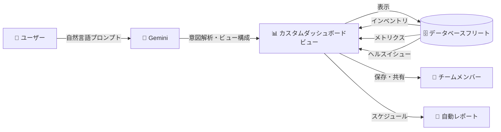

# Database Center: Generative Views (Gemini によるダッシュボードビュー生成)

**リリース日**: 2026-05-22

**サービス**: Database Center

**機能**: Generative Views (生成型ビュー)

**ステータス**: Preview

📊 [このアップデートのインフォグラフィックを見る](https://takech9203.github.io/google-cloud-news-summary/20260522-database-center-generative-views-gemini.html)

## 概要

Database Center に Generative Views (生成型ビュー) 機能が Preview として追加された。この機能は Gemini と自然言語プロンプトを活用し、データベースフリートのインベントリやメトリクスに関するカスタマイズされたダッシュボードビューを自動生成・保存できるものである。

従来の Database Center ダッシュボードビューでは、ユーザーが手動でフィルタリング条件やヘルスイシューの設定を組み合わせてカスタムビューを作成する必要があった。Generative Views では、「本番環境の PostgreSQL インスタンスでストレージ使用率が 80% を超えているものを表示して」のような自然言語プロンプトを入力するだけで、Gemini が意図を解釈し、適切なダッシュボードビューを自動的に生成する。

この機能は、大規模なデータベースフリートを管理するデータベース管理者 (DBA) やプラットフォームエンジニアに特に有用であり、複雑なフィルタリング条件の設定にかかる時間を大幅に削減し、インサイトへの到達時間を短縮する。

**アップデート前の課題**

- ダッシュボードビューの作成には、フィルタリング条件やヘルスイシュー設定を手動で一つずつ設定する必要があった
- 複雑な条件の組み合わせ (特定リージョン + 特定プロダクトバージョン + 特定ヘルスイシュー) を構築するには、UI の操作手順を熟知している必要があった
- 多様な視点からフリートを分析したい場合、複数のビューを都度手動で作成する必要があり、時間がかかっていた

**アップデート後の改善**

- 自然言語プロンプトを入力するだけで、Gemini が適切なダッシュボードビューを自動生成する
- UI の操作手順を詳しく知らなくても、意図を自然言語で伝えるだけでカスタムビューを作成可能になった
- 生成されたビューは保存可能で、チームメンバーとの共有やレポートのスケジュール設定にも対応する

## アーキテクチャ図



ユーザーが自然言語でプロンプトを入力すると、Gemini がその意図を解析してカスタムダッシュボードビューの構成を決定し、データベースフリートのインベントリ・メトリクス・ヘルスイシューを可視化するビューを生成する。

## サービスアップデートの詳細

### 主要機能

1. **自然言語によるビュー生成**
   - 日常的な言葉でダッシュボードビューを作成可能
   - Gemini がプロンプトを解析し、最適なフィルタリング条件とメトリクス表示を自動構成
   - 複雑な条件の組み合わせも自然言語で表現可能

2. **生成ビューの保存と管理**
   - 生成されたビューを永続的に保存可能
   - 個人用ビューまたはプロジェクト共有ビューとして設定可能
   - ビューの名前変更や更新にも対応

3. **レポートとの連携**
   - 生成したビューに対して自動レポート (日次・週次・月次) をスケジュール設定可能
   - Database Center の既存ダッシュボードレポート機能 (2026年4月 Preview) との統合

4. **フリートインベントリとメトリクスの可視化**
   - Cloud SQL、AlloyDB、Spanner、Bigtable、Memorystore、Firestore、BigQuery、Oracle Database@Google Cloud のリソースに対応
   - ヘルスイシュー、パフォーマンスメトリクス、セキュリティ状態などを包括的に表示

## 技術仕様

### 対応データベースプロダクト

| データベースプロダクト | インベントリ | ヘルスイシュー | メトリクス |
|----------------------|:----------:|:----------:|:--------:|
| Cloud SQL | 対応 | 対応 | 対応 |
| AlloyDB for PostgreSQL | 対応 | 対応 | 対応 |
| Spanner | 対応 | 対応 | 対応 |
| Bigtable | 対応 | 対応 | 対応 |
| Memorystore | 対応 | 対応 | 対応 |
| Firestore | 対応 | 対応 | 対応 |
| BigQuery | 対応 (Preview) | - | - |
| Oracle Database@Google Cloud | 対応 (GA) | 対応 (GA) | 対応 |

### 前提条件と権限

| 項目 | 詳細 |
|------|------|
| 必要な IAM ロール | Database Center Admin (`roles/databasecenter.admin`) |
| Gemini の有効化 | プロジェクトまたはフォルダレベルで Gemini Cloud Assist を有効化する必要あり |
| サービスの状態 | Preview (Pre-GA Offerings Terms が適用) |

## 設定方法

### 前提条件

1. Database Center が組織に対してセットアップ済みであること
2. Gemini Cloud Assist が有効化されていること
3. IAM ロール `Database Center Admin` が付与されていること

### 手順

#### ステップ 1: Database Center にアクセス

Google Cloud コンソールで Database Center ページに移動する。

#### ステップ 2: Generative View を作成

自然言語プロンプトを入力して、表示したいデータベースフリートの条件を記述する。例:
- 「アジアリージョンの Cloud SQL インスタンスでバックアップが 24 時間以上前のものを表示」
- 「本番環境のすべての PostgreSQL データベースのパフォーマンスサマリー」

#### ステップ 3: ビューの保存

生成されたビューを確認し、以下を設定して保存する:
- ダッシュボードビュー名
- 公開範囲 (個人用 / プロジェクト共有)

#### ステップ 4: レポートのスケジュール設定 (任意)

保存したビューに対して、自動レポートのスケジュール (日次・週次・月次) を設定できる。

## メリット

### ビジネス面

- **運用効率の向上**: 自然言語でビューを生成できるため、ダッシュボード作成にかかる時間を大幅に削減
- **属人化の防止**: 特定の UI 操作スキルに依存せず、誰でも複雑なビューを作成可能
- **迅速な意思決定**: データベースフリートの状態を素早く把握し、問題の早期発見・対応が可能

### 技術面

- **Gemini による意図理解**: 複雑なフィルタリング条件をコンテキストに基づいて自動構成
- **既存機能との統合**: ダッシュボードビュー、レポート、アラートなど Database Center の既存機能とシームレスに連携
- **マルチプロダクト対応**: 複数のデータベースプロダクトを横断した統合ビューを一度に生成可能

## デメリット・制約事項

### 制限事項

- Preview 段階のため、本番環境での利用は推奨されない (Pre-GA Offerings Terms が適用)
- Gemini の生成結果は事実と異なる場合があるため、生成されたビューの内容を検証する必要がある
- サポートが限定的である可能性がある

### 考慮すべき点

- Gemini Cloud Assist の有効化が前提条件であり、追加の利用規約への同意が必要
- 自然言語プロンプトの表現方法によって生成結果が変わる可能性がある
- データベーススキーマやリソースの情報が Gemini に送信される (データガバナンスポリシーを確認すること)

## ユースケース

### ユースケース 1: 大規模フリートの定期ヘルスチェック

**シナリオ**: 数百のデータベースインスタンスを管理する DBA チームが、毎朝のヘルスチェックで問題のあるインスタンスを迅速に特定したい。

**プロンプト例**:
```
過去24時間にクリティカルまたは高優先度のヘルスイシューが検出された
本番環境のデータベースを、プロダクト別にグループ化して表示して
```

**効果**: 手動でフィルタを設定する手間なく、毎朝のヘルスチェックの所要時間を大幅に短縮。生成ビューを保存して日次レポートを設定すれば、自動的にチームに配信される。

### ユースケース 2: コンプライアンス監査対応

**シナリオ**: セキュリティチームが、特定のコンプライアンス要件 (暗号化設定、バックアップポリシー) を満たしていないデータベースを一覧化する必要がある。

**プロンプト例**:
```
暗号化が有効になっていない、またはバックアップ保持期間が7日未満の
すべてのデータベースリソースをリージョン別に表示して
```

**効果**: 監査対応のための情報収集を迅速化し、セキュリティポスチャの改善に必要なアクションを即座に特定可能。

## 料金

Database Center は Google Cloud コンソールの一部として追加料金なしで利用可能。ただし、Gemini Cloud Assist の利用に関しては Gemini for Google Cloud の料金が適用される場合がある。詳細は公式料金ページを参照のこと。

## 利用可能リージョン

Database Center はグローバルサービスとして提供されており、組織レベルで利用可能。Generative Views 機能の Preview におけるリージョン制限については公式ドキュメントを参照のこと。

## 関連サービス・機能

- **Database Center ダッシュボードビュー**: 従来の手動カスタムビュー機能。Generative Views はこの機能を AI で拡張したもの
- **Database Center Fleet Insights (Preview)**: Gemini が生成するインベントリとパフォーマンスに関するインサイト。2026年4月に Preview として追加
- **Database Center ダッシュボードレポート (Preview)**: ビューに対する自動レポート機能。日次・週次・月次のスケジュール設定が可能
- **Database Center MCP サーバー (GA)**: AI アプリケーションから Database Center に接続してフリートヘルスを確認するための MCP サーバー
- **Database Center REST/RPC API (Preview)**: プログラムによるフリートヘルスデータへのアクセスを提供する API
- **Gemini Cloud Assist**: Database Center 内での AI アシスタント機能の基盤

## 参考リンク

- 📊 [インフォグラフィック](https://takech9203.github.io/google-cloud-news-summary/20260522-database-center-generative-views-gemini.html)
- [公式リリースノート](https://cloud.google.com/release-notes#May_22_2026)
- [Database Center ダッシュボードビュー ドキュメント](https://cloud.google.com/database-center/docs/dashboard-views)
- [Database Center 概要](https://cloud.google.com/database-center/docs/overview)
- [Database Center セットアップガイド](https://cloud.google.com/database-center/docs/set-up-database-center)
- [Gemini for Google Cloud データガバナンス](https://cloud.google.com/gemini/docs/discover/data-governance)

## まとめ

Database Center の Generative Views は、Gemini の自然言語理解能力を活用してデータベースフリート管理の UX を大幅に改善する機能である。大規模なデータベース環境を管理するチームにとって、複雑なフィルタリング条件の手動設定から解放され、意図を自然言語で伝えるだけで必要なインサイトに到達できるようになる。Preview 段階であるため本番運用への適用は慎重に検討すべきだが、Database Center の他の AI 機能 (Fleet Insights、MCP サーバー) と合わせて、データベースフリート管理の AI 化が着実に進展していることを示すアップデートである。

---

**タグ**: #DatabaseCenter #Gemini #GenerativeViews #Dashboard #Preview #FleetManagement #AI #NaturalLanguage
