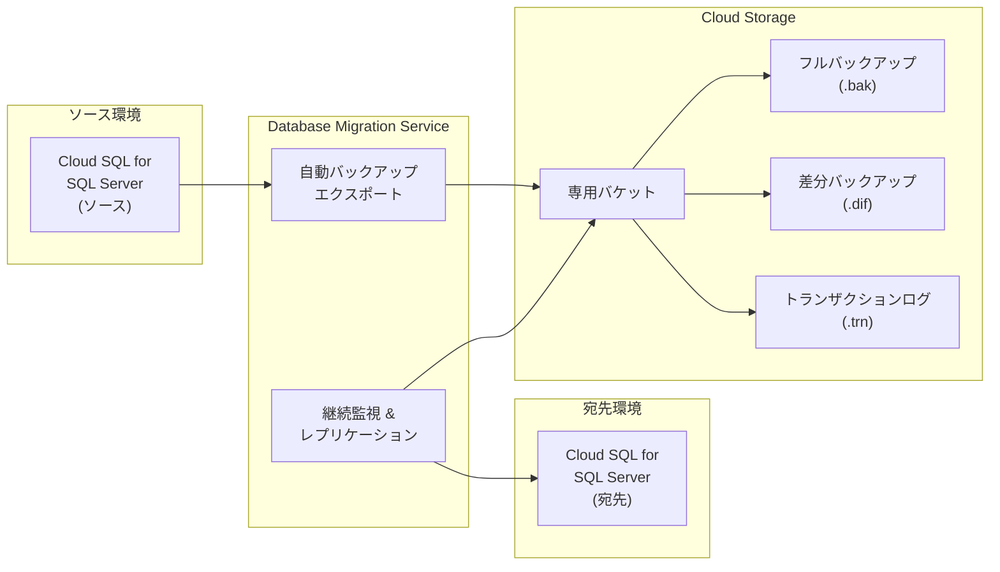

# Cloud Database Migration Service: Cloud SQL for SQL Server ソースの専用サポート

**リリース日**: 2026-05-22

**サービス**: Cloud Database Migration Service

**機能**: Cloud SQL for SQL Server ソースからの同種マイグレーション専用サポート

**ステータス**: GA (一般提供)

[このアップデートのインフォグラフィックを見る](https://takech9203.github.io/google-cloud-news-summary/20260522-dms-cloud-sql-sql-server-source.html)

## 概要

Database Migration Service (DMS) が、同種 SQL Server マイグレーションにおいて Cloud SQL for SQL Server をソースとして利用する場合の専用サポートを GA (一般提供) としてリリースしました。この機能により、Cloud SQL for SQL Server インスタンスから別の Cloud SQL for SQL Server インスタンスへのマイグレーションが大幅に簡素化されます。

従来の同種 SQL Server マイグレーションでは、ユーザーが手動でバックアップファイルをエクスポートし、Cloud Storage バケットにアップロードする必要がありましたが、Cloud SQL for SQL Server をソースとして使用する場合、DMS が自動的に必要なバックアップファイルのエクスポートと専用 Cloud Storage バケットへのアップロードを実行します。

この機能は、Google Cloud 内で SQL Server ワークロードの統合、リージョン間移行、またはインスタンスのアップグレードを計画している組織にとって特に有用です。

**アップデート前の課題**

- Cloud SQL for SQL Server から別の Cloud SQL for SQL Server への移行時に、手動でフルバックアップ、差分バックアップ、トランザクションログのエクスポートとアップロードが必要だった
- バックアップファイルの命名規則やディレクトリ構造を手動で管理する必要があった
- トランザクションログの継続的なエクスポートを自動化するために、追加のスクリプトやスケジューラの構築が必要だった

**アップデート後の改善**

- DMS が Cloud SQL for SQL Server ソースから自動的に全バックアップファイルをエクスポート
- 専用の Cloud Storage バケットへのアップロードが自動化され、手動操作が不要に
- エンドツーエンドのマイグレーションフローが簡素化され、運用負荷が大幅に軽減

## アーキテクチャ図



DMS が Cloud SQL for SQL Server ソースからバックアップファイルを自動エクスポートし、専用 Cloud Storage バケットを経由して宛先インスタンスにデータを継続的にレプリケートするフローを示しています。

## サービスアップデートの詳細

### 主要機能

1. **自動バックアップエクスポート**
   - Cloud SQL for SQL Server ソースインスタンスから必要なバックアップファイルを自動的にエクスポート
   - フルバックアップ、差分バックアップ、トランザクションログの全種類に対応
   - ユーザーによる手動バックアップ操作が完全に不要

2. **専用 Cloud Storage バケット管理**
   - DMS がマイグレーション用の専用 Cloud Storage バケットを自動作成・管理
   - 正しいディレクトリ構造とファイル命名規則を自動的に適用
   - バケットのライフサイクル管理を含む運用の簡素化

3. **継続的データレプリケーション**
   - 初期フルロード後のトランザクションログによる差分同期
   - ソースデータベースの変更をリアルタイムで追跡・反映
   - 最小ダウンタイムでのカットオーバーをサポート

## 技術仕様

### サポート対象バージョン

| 項目 | 詳細 |
|------|------|
| ソース | Cloud SQL for SQL Server 2017, 2019, 2022 |
| 宛先 | Cloud SQL for SQL Server 2017, 2019, 2022 |
| マイグレーションタイプ | 継続的 (Continuous) マイグレーション |
| バックアップ種類 | フルバックアップ (.bak)、差分バックアップ (.dif)、トランザクションログ (.trn) |
| 暗号化 | 暗号化されたバックアップファイルのサポート |

### 必要な IAM ロール

```json
{
  "user_account_roles": [
    "roles/datamigration.admin",
    "roles/storage.admin",
    "roles/cloudsql.editor"
  ],
  "dms_service_account_roles": [
    "roles/datamigration.admin",
    "roles/storage.admin",
    "roles/cloudsql.editor",
    "roles/cloudsql.studioUser"
  ]
}
```

## 設定方法

### 前提条件

1. Google Cloud プロジェクトで Database Migration Service API、Compute Engine API、Cloud Storage API、Cloud SQL Admin API が有効であること
2. 必要な IAM ロールがユーザーアカウントと DMS サービスアカウントに付与されていること
3. ソースとなる Cloud SQL for SQL Server インスタンスが稼働中であること

### 手順

#### ステップ 1: ソース接続プロファイルの作成

```bash
gcloud database-migration connection-profiles create sqlserver \
    SOURCE_CP_NAME \
    --region=REGION \
    --type=CLOUDSQL \
    --cloudsql-instance=SOURCE_INSTANCE_ID \
    --project=PROJECT_ID
```

Cloud SQL for SQL Server ソースインスタンスの接続プロファイルを作成します。ソースタイプとして `CLOUDSQL` を指定することで、自動バックアップエクスポート機能が有効になります。

#### ステップ 2: 宛先 Cloud SQL インスタンスと接続プロファイルの作成

```bash
gcloud database-migration connection-profiles create sqlserver \
    DESTINATION_CP_NAME \
    --region=REGION \
    --type=CLOUDSQL \
    --cloudsql-instance=DESTINATION_INSTANCE_ID \
    --project=PROJECT_ID
```

宛先となる Cloud SQL for SQL Server インスタンスの接続プロファイルを作成します。

#### ステップ 3: マイグレーションジョブの作成と実行

```bash
gcloud database-migration migration-jobs create \
    MIGRATION_JOB_NAME \
    --region=REGION \
    --type=CONTINUOUS \
    --source=SOURCE_CP_NAME \
    --destination=DESTINATION_CP_NAME \
    --project=PROJECT_ID
```

マイグレーションジョブを作成します。DMS が自動的にバックアップエクスポートとアップロードを処理します。

#### ステップ 4: マイグレーションのプロモート

```bash
gcloud database-migration migration-jobs promote \
    MIGRATION_JOB_NAME \
    --region=REGION \
    --project=PROJECT_ID
```

データの同期が完了したら、マイグレーションジョブをプロモートして宛先インスタンスをプライマリとして使用開始します。

## メリット

### ビジネス面

- **運用コスト削減**: バックアップの手動管理が不要になり、マイグレーション作業の工数を大幅に削減
- **リスク低減**: 自動化により人為的ミス (ファイル名の誤り、アップロード漏れ等) を排除
- **迅速なマイグレーション**: セットアップからカットオーバーまでの時間を短縮

### 技術面

- **フルマネージドフロー**: バックアップエクスポートからレプリケーションまで DMS が一貫管理
- **最小ダウンタイム**: 継続的レプリケーションにより、カットオーバー時のダウンタイムを最小限に抑制
- **シンプルな構成**: 追加のスクリプトやスケジューラの構築・保守が不要

## デメリット・制約事項

### 制限事項

- Cloud SQL for SQL Server の既知の制限事項 (一部の SQL Server 機能がサポートされない) が適用される
- DMS は完全なリージョナルプロダクトであり、ソース、宛先、ストレージバケットはすべて同一リージョンに配置する必要がある
- 同一バージョンまたは上位バージョンへの移行のみサポート (ダウングレードは不可)

### 考慮すべき点

- マイグレーション中はソースデータベースへの書き込みが継続可能だが、カットオーバー時に最終的な書き込み停止が必要
- 大規模データベースの場合、初期フルロードに相応の時間と Cloud Storage 容量が必要
- 暗号化バックアップを使用する場合は追加の設定が必要

## ユースケース

### ユースケース 1: リージョン間マイグレーション

**シナリオ**: 米国リージョンで稼働中の Cloud SQL for SQL Server インスタンスを、レイテンシ改善のためにアジアリージョンに移行する必要がある場合。

**実装例**:
```bash
# ソース接続プロファイル (us-central1)
gcloud database-migration connection-profiles create sqlserver \
    src-profile --region=asia-northeast1 \
    --type=CLOUDSQL \
    --cloudsql-instance=us-source-instance

# 宛先接続プロファイル (asia-northeast1)
gcloud database-migration connection-profiles create sqlserver \
    dst-profile --region=asia-northeast1 \
    --type=CLOUDSQL \
    --cloudsql-instance=asia-dest-instance

# マイグレーションジョブ作成
gcloud database-migration migration-jobs create \
    region-migration --region=asia-northeast1 \
    --type=CONTINUOUS \
    --source=src-profile --destination=dst-profile
```

**効果**: 手動バックアップ・転送の手間なく、DMS が自動的にバックアップエクスポートとレプリケーションを実行し、最小ダウンタイムでリージョン間移行を完了。

### ユースケース 2: SQL Server バージョンアップグレード

**シナリオ**: Cloud SQL for SQL Server 2017 から SQL Server 2022 へのアップグレードを、サービス停止を最小限にして実施したい場合。

**効果**: DMS の継続的レプリケーション機能により、バージョンアップグレードを最小ダウンタイムで実現。自動バックアップエクスポートにより、アップグレード作業の複雑さを大幅に軽減。

## 料金

Database Migration Service の同種マイグレーション (SQL Server から SQL Server) は追加料金なしで提供されます。ただし、マイグレーション中に使用される以下のリソースについては通常の料金が適用されます。

### 料金例

| コンポーネント | 料金体系 |
|---------------|----------|
| Database Migration Service (同種マイグレーション) | 無料 |
| Cloud Storage (バックアップファイル保存) | ストレージ容量 + ネットワーク転送量に基づく従量課金 |
| Cloud SQL for SQL Server (宛先インスタンス) | インスタンスタイプ、CPU、メモリ、ストレージに基づく従量課金 |

詳細な料金見積もりには [Google Cloud 料金計算ツール](https://cloud.google.com/products/calculator) をご利用ください。

## 利用可能リージョン

Database Migration Service は完全なリージョナルプロダクトです。Cloud SQL for SQL Server が利用可能なすべてのリージョンでこの機能を使用できます。マイグレーションに関連するすべてのエンティティ (ソース接続プロファイル、宛先接続プロファイル、マイグレーションジョブ、ストレージバケット) は同一リージョンに配置する必要があります。

## 関連サービス・機能

- **Cloud SQL for SQL Server**: マイグレーションのソースおよび宛先として使用されるフルマネージド SQL Server サービス
- **Cloud Storage**: バックアップファイルの一時保存に使用されるオブジェクトストレージ
- **Cloud Monitoring**: マイグレーションジョブの進捗とヘルスの監視に使用
- **IAM**: マイグレーションに必要な権限管理

## 参考リンク

- [インフォグラフィック](https://takech9203.github.io/google-cloud-news-summary/20260522-dms-cloud-sql-sql-server-source.html)
- [公式リリースノート](https://cloud.google.com/release-notes#May_22_2026)
- [Cloud SQL for SQL Server ソースガイド](https://cloud.google.com/database-migration/docs/sqlserver/csql-sql-server-src-guide)
- [SQL Server マイグレーション概要](https://cloud.google.com/database-migration/docs/sqlserver/scenario-overview)
- [マイグレーションガイド](https://cloud.google.com/database-migration/docs/sqlserver/guide)
- [料金ページ](https://cloud.google.com/database-migration/pricing)

## まとめ

Cloud Database Migration Service の Cloud SQL for SQL Server ソースサポートの GA リリースは、Google Cloud 内での SQL Server マイグレーションを大幅に簡素化する重要なアップデートです。自動バックアップエクスポート機能により、従来必要だった手動のバックアップ管理とアップロード作業が完全に排除され、より迅速かつ信頼性の高いマイグレーションが実現します。Cloud SQL for SQL Server を利用中で、インスタンスの統合やバージョンアップグレードを計画している組織は、この機能の活用を検討することを推奨します。

---

**タグ**: #CloudDatabaseMigrationService #CloudSQL #SQLServer #Migration #GA #データベース移行
