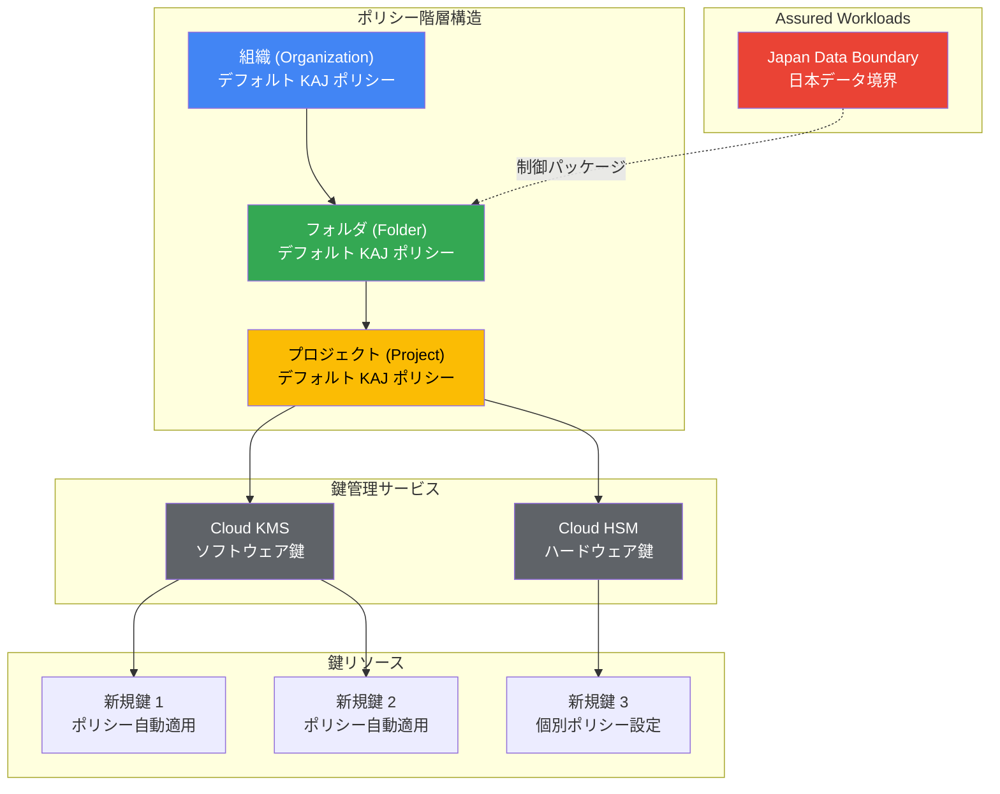

# Key Access Justifications: デフォルトポリシーの一般提供開始 (GA)

**リリース日**: 2026-05-22

**サービス**: Key Access Justifications

**機能**: デフォルト Key Access Justifications ポリシー

**ステータス**: GA (一般提供)

📊 [このアップデートのインフォグラフィックを見る](https://takech9203.github.io/google-cloud-news-summary/20260522-key-access-justifications-default-policies.html)

## 概要

Google Cloud は、Key Access Justifications のデフォルトポリシー機能を一般提供 (GA) として正式リリースしました。この機能により、Assured Workloads の日本データ境界 (Japan Data Boundary) において、Cloud Key Management Service (Cloud KMS) または Cloud HSM を使用する際に、組織、フォルダ、またはプロジェクトレベルでデフォルトの Key Access Justifications ポリシーを設定できるようになります。

Key Access Justifications は、Google のシステムが暗号鍵にアクセスする際にアクセス理由コード (Justification Code) を生成し、顧客がそのアクセスを承認または拒否するポリシーを設定できる機能です。今回のデフォルトポリシー機能の GA により、新しく作成される鍵に対して自動的にポリシーが適用されるため、運用負荷を大幅に軽減しながらデータ主権要件を満たすことができます。

この機能は、日本国内のデータ主権要件を持つ金融機関、政府機関、医療機関などの組織にとって特に有益であり、鍵ごとに個別にポリシーを設定する必要がなくなります。

**アップデート前の課題**

- 鍵を作成するたびに個別に Key Access Justifications ポリシーを手動設定する必要があった
- 大規模な組織で多数の鍵を管理する場合、ポリシーの設定漏れが発生するリスクがあった
- 組織全体で一貫した鍵アクセスポリシーを強制する仕組みがなかった

**アップデート後の改善**

- 組織、フォルダ、プロジェクトレベルでデフォルトポリシーを一度設定すれば、新しい鍵に自動適用される
- ポリシーの設定漏れリスクが大幅に軽減され、コンプライアンスの一貫性が向上
- 階層構造によるポリシー管理が可能になり、大規模組織での運用が効率化された

## アーキテクチャ図



この図は、デフォルト KAJ ポリシーが組織の階層構造に沿って継承される仕組みと、Cloud KMS/HSM および Assured Workloads Japan Data Boundary との連携を示しています。新規に作成される鍵には、上位階層で設定されたデフォルトポリシーが自動的に適用されます (個別にポリシーを指定した場合はそちらが優先)。

## サービスアップデートの詳細

### 主要機能

1. **階層的なデフォルトポリシー設定**
   - 組織レベル: 組織全体に適用されるデフォルトポリシーを設定
   - フォルダレベル: 特定のフォルダ配下のリソースに適用
   - プロジェクトレベル: 個別プロジェクト内の鍵に適用
   - 下位レベルのポリシーは上位レベルを上書き可能

2. **自動ポリシー適用**
   - デフォルトポリシー設定後に新規作成される鍵に自動的に適用
   - 鍵作成時に個別のポリシーを明示的に設定した場合は、そちらが優先
   - 既存の鍵には適用されない (新規鍵のみ対象)

3. **実効ポリシーの確認**
   - `showEffectiveKeyAccessJustificationsPolicyConfig` 権限により、リソースに対して実際に適用される実効ポリシーを確認可能
   - 階層構造における継承関係を含めたポリシーの可視化

## 技術仕様

### 必要な IAM 権限

| 項目 | 詳細 |
|------|------|
| IAM ロール | `roles/cloudkms.keyAccessJustificationsPolicyConfigAdmin` |
| 権限 1 | `cloudkms.keyAccessJustificationsConfig.getKeyAccessJustificationsPolicyConfig` |
| 権限 2 | `cloudkms.keyAccessJustificationsConfig.updateKeyAccessJustificationsPolicyConfig` |
| 権限 3 | `cloudkms.keyAccessJustificationsConfig.showEffectiveKeyAccessJustificationsPolicyConfig` |

### 対応する制御パッケージ

| 項目 | 詳細 |
|------|------|
| 対象制御パッケージ | Japan Data Boundary (日本データ境界) |
| 対応する鍵タイプ | Cloud KMS ソフトウェア鍵、Cloud HSM ハードウェア鍵 |
| ステータス | GA (一般提供) |

### 設定例

```json
{
  "keyAccessJustificationsPolicy": {
    "allowedAccessReasons": [
      "CUSTOMER_INITIATED_ACCESS",
      "GOOGLE_INITIATED_SERVICE",
      "THIRD_PARTY_DATA_REQUEST",
      "GOOGLE_INITIATED_REVIEW"
    ]
  }
}
```

## 設定方法

### 前提条件

1. Assured Workloads の日本データ境界 (Japan Data Boundary) が有効化されたフォルダが存在すること
2. `roles/cloudkms.keyAccessJustificationsPolicyConfigAdmin` IAM ロールが付与されていること
3. Cloud KMS API が有効化されていること

### 手順

#### ステップ 1: 組織レベルでのデフォルトポリシー設定

```bash
# 組織のデフォルト KAJ ポリシーを設定
curl -X PATCH \
  "https://cloudkms.googleapis.com/v1/organizations/${ORG_ID}/keyAccessJustificationsPolicyConfig" \
  -H "Authorization: Bearer $(gcloud auth print-access-token)" \
  -H "Content-Type: application/json" \
  -d '{
    "defaultKeyAccessJustificationsPolicy": {
      "allowedAccessReasons": [
        "CUSTOMER_INITIATED_ACCESS",
        "GOOGLE_INITIATED_SERVICE"
      ]
    }
  }'
```

組織全体に適用されるデフォルトの Key Access Justifications ポリシーを設定します。ここで許可するアクセス理由コードを指定します。

#### ステップ 2: フォルダまたはプロジェクトレベルでのポリシー設定 (オプション)

```bash
# プロジェクトレベルでのデフォルト KAJ ポリシー設定
curl -X PATCH \
  "https://cloudkms.googleapis.com/v1/projects/${PROJECT_ID}/keyAccessJustificationsPolicyConfig" \
  -H "Authorization: Bearer $(gcloud auth print-access-token)" \
  -H "Content-Type: application/json" \
  -d '{
    "defaultKeyAccessJustificationsPolicy": {
      "allowedAccessReasons": [
        "CUSTOMER_INITIATED_ACCESS"
      ]
    }
  }'
```

より厳格なポリシーが必要なプロジェクトに対して、個別のデフォルトポリシーを設定できます。このポリシーは組織レベルのポリシーを上書きします。

#### ステップ 3: 実効ポリシーの確認

```bash
# 実効ポリシーの確認
curl -X GET \
  "https://cloudkms.googleapis.com/v1/projects/${PROJECT_ID}/keyAccessJustificationsPolicyConfig:showEffective" \
  -H "Authorization: Bearer $(gcloud auth print-access-token)"
```

設定されたデフォルトポリシーが正しく継承されているかを確認します。

## メリット

### ビジネス面

- **コンプライアンスの自動化**: 日本のデータ主権要件を満たすポリシーが自動的に新規鍵に適用され、コンプライアンス違反のリスクを低減
- **運用コスト削減**: 鍵ごとに個別のポリシー設定が不要になり、管理者の運用負荷を大幅に軽減
- **ガバナンスの強化**: 組織全体で一貫したデータアクセスポリシーを強制でき、セキュリティガバナンスが強化される

### 技術面

- **階層的なポリシー管理**: 組織・フォルダ・プロジェクトの階層に沿った柔軟なポリシー設定が可能
- **設定漏れの防止**: デフォルトポリシーにより、新規鍵が必ずポリシー付きで作成されることを保証
- **きめ細かな制御**: プロジェクトレベルで上位ポリシーをオーバーライドし、ワークロードに応じた制御が可能

## デメリット・制約事項

### 制限事項

- 日本データ境界 (Japan Data Boundary) の Assured Workloads 制御パッケージでのみ利用可能
- 既存の鍵にはデフォルトポリシーが適用されない (新規鍵のみ対象)
- Cloud EKM (外部鍵管理) の鍵には適用されない

### 考慮すべき点

- デフォルトポリシーの設定変更は、変更後に新規作成される鍵にのみ影響する
- 階層構造が複雑な組織では、実効ポリシーの確認が重要 (意図しないオーバーライドの防止)
- Assured Workloads フォルダ作成後に Key Access Justifications が有効化されるまで最大 24 時間かかる場合がある

## ユースケース

### ユースケース 1: 金融機関における統一セキュリティポリシー

**シナリオ**: 日本国内でサービスを展開する金融機関が、全部門にわたって一貫した鍵アクセスポリシーを適用したい場合

**実装例**:
```bash
# 組織レベルで最も厳格なポリシーを設定
# 顧客起動のアクセスのみ許可
gcloud alpha kms key-access-justifications-policy-config update \
  --organization=${ORG_ID} \
  --allowed-access-reasons="CUSTOMER_INITIATED_ACCESS"
```

**効果**: 全ての新規鍵に対して顧客起動のアクセスのみが許可され、Google によるサービス目的のアクセスも明示的な承認が必要になる。金融規制への準拠を自動的に確保。

### ユースケース 2: 開発環境と本番環境での差別化ポリシー

**シナリオ**: 開発環境では柔軟なアクセスを許可しつつ、本番環境では厳格なポリシーを適用したい場合

**効果**: フォルダレベルでポリシーを分離することで、開発の俊敏性を維持しながら本番環境のデータ保護を強化。デフォルトポリシーの階層構造を活用して環境ごとのガバナンスを実現。

## 料金

Key Access Justifications 自体には追加料金は発生しませんが、基盤となる Cloud KMS / Cloud HSM の鍵管理費用が必要です。

### 料金例

| 使用量 | 月額料金 (概算) |
|--------|-----------------|
| Cloud KMS ソフトウェア鍵 (アクティブバージョン) | $0.06 / 鍵バージョン / 月 |
| Cloud KMS 暗号化/復号化操作 | $0.03 / 10,000 操作 |
| Cloud HSM 鍵 (AES256, RSA2048) | $1.00 / 鍵バージョン / 月 |
| Cloud HSM 鍵 (RSA 3072/4096, EC P256/P384) | $2.50 / 鍵バージョン / 月 (2,000 バージョンまで) |
| Cloud KMS 管理操作 | 無料 |

## 利用可能リージョン

本機能は Assured Workloads の日本データ境界 (Japan Data Boundary) 制御パッケージが利用可能な日本リージョンで使用できます。

- `asia-northeast1` (東京)
- `asia-northeast2` (大阪)

## 関連サービス・機能

- **Assured Workloads**: データ主権とコンプライアンス要件を満たすためのワークロード管理フレームワーク。KAJ のデフォルトポリシーはこの基盤上で動作
- **Cloud KMS (Key Management Service)**: 暗号鍵のライフサイクル管理サービス。KAJ ポリシーの適用対象
- **Cloud HSM**: ハードウェアセキュリティモジュールによる FIPS 140-2 Level 3 準拠の鍵保護。KAJ との併用が可能
- **Access Transparency**: Google スタッフによるデータアクセスの可視化。KAJ と組み合わせて包括的なアクセス制御を実現
- **Access Approval**: Google スタッフのアクセスリクエストに対する承認ワークフロー。KAJ と連携して多層防御を提供

## 参考リンク

- 📊 [インフォグラフィック](https://takech9203.github.io/google-cloud-news-summary/20260522-key-access-justifications-default-policies.html)
- [公式リリースノート](https://cloud.google.com/release-notes#May_22_2026)
- [デフォルト KAJ ポリシー設定ドキュメント](https://cloud.google.com/assured-workloads/key-access-justifications/docs/set-default-policy)
- [Key Access Justifications 概要](https://cloud.google.com/assured-workloads/key-access-justifications/docs/overview)
- [Cloud KMS と Cloud HSM での KAJ 設定](https://cloud.google.com/assured-workloads/key-access-justifications/docs/configure-kaj)
- [Cloud KMS 料金ページ](https://cloud.google.com/kms/pricing)

## まとめ

Key Access Justifications のデフォルトポリシー機能の GA リリースにより、Assured Workloads Japan Data Boundary を利用する組織は、暗号鍵に対するアクセス制御を組織全体で統一的かつ自動的に適用できるようになりました。日本国内のデータ主権要件を持つ組織は、この機能を活用してコンプライアンスの自動化と運用効率の向上を同時に実現することを推奨します。既存の Assured Workloads 環境を持つ組織は、まず組織レベルでのデフォルトポリシー設定を検討し、新規鍵に対する一貫したアクセス制御の適用を開始してください。

---

**タグ**: #KeyAccessJustifications #CloudKMS #CloudHSM #AssuredWorkloads #JapanDataBoundary #Security #Compliance #GA #DataSovereignty
