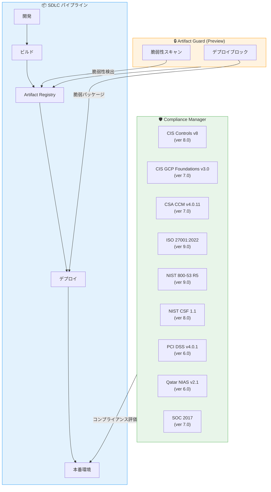

# Security Command Center: Compliance Manager フレームワーク更新 & Artifact Guard Preview

**リリース日**: 2026-05-22

**サービス**: Security Command Center

**機能**: Compliance Manager フレームワーク更新 / Artifact Guard (Preview)

**ステータス**: Change (フレームワーク更新) / Feature (Artifact Guard - Preview)

📊 [このアップデートのインフォグラフィックを見る](https://takech9203.github.io/google-cloud-news-summary/20260522-security-command-center-compliance-artifact-guard.html)

## 概要

Security Command Center に 2 つの重要なアップデートが発表された。1 つ目は Compliance Manager のビルトインフレームワーク 9 種の更新で、CIS、CSA CCM、ISO 27001、NIST、PCI DSS、Qatar NIAS、SOC の各コンプライアンス基準が最新バージョンに引き上げられた。これにより、最新のセキュリティ基準に基づいたクラウドコントロールの評価と監視が可能になる。

2 つ目は Artifact Guard の Preview リリースで、Enterprise および Premium ティアのユーザーが利用可能になった。Artifact Guard はソフトウェア開発ライフサイクル (SDLC) 全体を通じて、脆弱性を含むパッケージのデプロイメントを防止する機能を提供する。これにより、脆弱なコンテナイメージやパッケージが本番環境に到達する前に検出・ブロックすることが可能になる。

これらのアップデートは、コンプライアンス管理とサプライチェーンセキュリティの両面から、Google Cloud 環境のセキュリティ態勢を強化するものである。

**アップデート前の課題**

- Compliance Manager のフレームワークが古いバージョンのままで、最新のコンプライアンス基準 (PCI DSS v4.0.1、NIST 800-53 R5 最新版など) に完全対応していなかった
- 脆弱なパッケージを含むアーティファクトのデプロイを SDLC の早い段階で自動的にブロックする統合的な仕組みがなかった
- 脆弱性の検出はできても、デプロイ前の予防的ブロックは別途 Binary Authorization 等の設定が必要だった

**アップデート後の改善**

- 9 つのフレームワークが最新バージョンに更新され、最新のコンプライアンス要件に即した評価・監査が可能になった
- Artifact Guard により、SDLC パイプライン全体で脆弱なパッケージのデプロイメントを予防的にブロックできるようになった
- Security Command Center の統合ダッシュボードから、コンプライアンスとアーティファクトセキュリティの両方を一元管理できるようになった

## アーキテクチャ図



Compliance Manager が本番環境のコンプライアンス状態を 9 つの最新フレームワークで評価し、Artifact Guard が SDLC パイプラインの Artifact Registry 段階で脆弱なパッケージのデプロイを予防的にブロックする構成を示す。

## サービスアップデートの詳細

### 主要機能

1. **Compliance Manager フレームワーク更新 (9 フレームワーク)**
   - 全フレームワークのクラウドコントロールが最新バージョンの規制要件にマッピングされた
   - 更新されたフレームワークは Premium および Enterprise ティアで利用可能
   - 既存のフレームワークデプロイメントは自動的に更新される

2. **Artifact Guard (Preview)**
   - ソフトウェア開発ライフサイクル全体を通じた脆弱パッケージのデプロイ防止
   - Enterprise および Premium ティアで利用可能
   - Artifact Registry との統合による自動脆弱性チェック

3. **統合セキュリティ管理**
   - Compliance Manager のフレームワークと Artifact Guard が Security Command Center のダッシュボードで一元管理可能
   - コンプライアンス状態とアーティファクトセキュリティの統合的な可視化

## 技術仕様

### 更新フレームワーク一覧

| フレームワーク | バージョン | 対象分野 |
|------|------|------|
| CIS Critical Security Controls v8 | version 8.0 | セキュリティ制御ベストプラクティス |
| CIS GCP Foundations Benchmark v3.0 | version 7.0 | Google Cloud 基盤セキュリティ |
| CSA Cloud Controls Matrix v4.0.11 | version 7.0 | クラウドセキュリティ制御 |
| ISO 27001:2022 | version 9.0 | 情報セキュリティマネジメント |
| NIST 800-53 Revision 5 | version 9.0 | セキュリティ・プライバシー制御 |
| NIST Cybersecurity Framework 1.1 | version 8.0 | サイバーセキュリティフレームワーク |
| PCI DSS v4.0.1 | version 6.0 | クレジットカードデータセキュリティ |
| Qatar National Information Assurance Standard v2.1 | version 6.0 | カタール情報保証基準 |
| SOC 2017 | version 7.0 | サービス組織統制 |

### 利用可能ティア

| 機能 | Standard | Premium | Enterprise |
|------|----------|---------|------------|
| Compliance Manager (ビルトインフレームワーク) | Security Essentials のみ | 全フレームワーク | 全フレームワーク |
| Artifact Guard | - | Preview | Preview |
| カスタムフレームワーク作成 | - | 対応 | 対応 |
| 監査機能 | - | 対応 | 対応 |

## 設定方法

### 前提条件

1. Security Command Center Premium または Enterprise ティアが有効化されていること
2. Compliance Manager が有効化されていること
3. Artifact Guard 利用時は Container Scanning API が有効であること

### 手順

#### ステップ 1: Compliance Manager の有効化確認

```bash
# Security Command Center の設定を確認
gcloud scc settings describe --organization=ORGANIZATION_ID
```

Compliance Manager が既に有効化されている場合、フレームワークの更新は自動的に適用される。

#### ステップ 2: 更新済みフレームワークのデプロイ

Google Cloud Console から Security Command Center > Compliance Manager に移動し、更新されたフレームワークを確認する。既存のデプロイメントは自動更新されるが、新規にフレームワークをデプロイする場合は以下の手順に従う:

1. Compliance Manager ダッシュボードでフレームワーク一覧を確認
2. デプロイしたいフレームワークを選択
3. 対象の組織、フォルダ、またはプロジェクトを指定
4. デプロイを実行

#### ステップ 3: Artifact Guard の有効化 (Preview)

```bash
# Container Scanning API の有効化
gcloud services enable containerscanning.googleapis.com --project=PROJECT_ID
```

Security Command Center のコンソールから Artifact Guard を有効化し、対象のリポジトリとポリシーを設定する。

## メリット

### ビジネス面

- **コンプライアンス対応の効率化**: 9 つの主要規制フレームワークの最新版に自動的に対応でき、監査準備の負担が軽減される
- **リスク低減**: 脆弱なパッケージが本番環境にデプロイされることを事前に防止し、セキュリティインシデントのリスクを低減
- **規制遵守の証明**: 最新の PCI DSS v4.0.1 や ISO 27001:2022 への準拠状態をダッシュボードで証明可能

### 技術面

- **シフトレフトセキュリティ**: Artifact Guard により SDLC の早い段階で脆弱性を検出・ブロックし、修正コストを削減
- **自動化された継続的コンプライアンス**: フレームワーク更新が自動適用され、手動でのマッピング更新が不要
- **統合的な可視性**: コンプライアンスとアーティファクトセキュリティを単一のプラットフォームで管理

## デメリット・制約事項

### 制限事項

- Artifact Guard は現在 Preview 段階であり、本番環境での利用には注意が必要 (Pre-GA Offerings Terms が適用)
- Artifact Guard は Enterprise および Premium ティアでのみ利用可能 (Standard ティアでは利用不可)
- Compliance Manager のビルトインフレームワーク (Security Essentials 以外) は Premium 以上のティアが必要

### 考慮すべき点

- Security Health Analytics と Compliance Manager を同時に有効化すると重複した findings が生成される可能性がある
- Compliance Manager はグローバルエンドポイントを使用するため、データレジデンシー設定とは独立して動作する
- Preview 機能はサポートが限定的であり、SLA の対象外

## ユースケース

### ユースケース 1: PCI DSS v4.0.1 準拠の自動監視

**シナリオ**: EC サイトを運営する企業が PCI DSS v4.0.1 に準拠する必要がある。カード情報を扱うシステムのセキュリティ制御を継続的に監視したい。

**効果**: Compliance Manager の PCI DSS v4.0.1 (version 6.0) フレームワークをデプロイすることで、対象リソースのセキュリティ設定を自動的にチェックし、違反を検出して通知する。監査時にはコンプライアンスレポートを自動生成できる。

### ユースケース 2: コンテナベースのマイクロサービスにおけるサプライチェーンセキュリティ

**シナリオ**: GKE 上でマイクロサービスを運用する組織が、サードパーティパッケージの脆弱性によるインシデントを防止したい。

**効果**: Artifact Guard を有効化することで、Artifact Registry に push されたコンテナイメージ内の脆弱なパッケージを検出し、GKE へのデプロイを自動的にブロックする。SDLC パイプライン全体でセキュリティゲートとして機能する。

### ユースケース 3: 多規制対応のグローバル企業

**シナリオ**: グローバルに展開する金融機関が、ISO 27001、NIST、SOC 2 など複数の規制フレームワークに同時に準拠する必要がある。

**効果**: Compliance Manager で複数のフレームワークを同時にデプロイし、単一のダッシュボードから全フレームワークの準拠状態を横断的に可視化・管理できる。

## 料金

Security Command Center の料金は、保護対象のクラウド環境内のアセット総数に基づく。

| ティア | 料金体系 |
|--------|-----------------|
| Standard | 無料 |
| Premium | Pay-as-you-go または年間サブスクリプション |
| Enterprise | 年間サブスクリプション (1 年または複数年) |

Compliance Manager と Artifact Guard は Premium / Enterprise ティアの機能として含まれており、追加料金は発生しない。詳細は [Security Command Center 料金ページ](https://cloud.google.com/security-command-center/pricing) を参照。

## 関連サービス・機能

- **Artifact Registry**: コンテナイメージとパッケージのレジストリ。Artifact Guard がスキャン対象とする
- **Artifact Analysis**: 脆弱性スキャンエンジン。Container Scanning API を通じて脆弱性を検出
- **Binary Authorization**: デプロイ時のポリシー適用。Artifact Guard と補完的に機能
- **Security Health Analytics**: セキュリティ設定の自動検出。Compliance Manager のクラウドコントロールと部分的に重複
- **Cloud Audit Logs**: 監査証跡の記録。Compliance Manager の監査機能で活用
- **Security Posture Service**: セキュリティ態勢の定義とドリフト監視

## 参考リンク

- 📊 [インフォグラフィック](https://takech9203.github.io/google-cloud-news-summary/20260522-security-command-center-compliance-artifact-guard.html)
- [公式リリースノート](https://cloud.google.com/release-notes#May_22_2026)
- [Compliance Manager 概要](https://docs.cloud.google.com/security-command-center/docs/compliance-manager-overview)
- [Compliance Manager フレームワーク一覧](https://docs.cloud.google.com/security-command-center/docs/compliance-manager-frameworks)
- [Artifact Registry 脆弱性スキャン](https://docs.cloud.google.com/artifact-registry/docs/analysis)
- [Security Command Center サービスティア](https://docs.cloud.google.com/security-command-center/docs/service-tiers)
- [Security Command Center 料金ページ](https://cloud.google.com/security-command-center/pricing)

## まとめ

今回のアップデートは、Security Command Center の「コンプライアンス管理」と「サプライチェーンセキュリティ」の両面を強化する重要な変更である。9 つのフレームワーク更新により最新の規制基準に即したコンプライアンス監視が可能になり、Artifact Guard により SDLC パイプライン全体で脆弱なパッケージのデプロイを予防的にブロックできるようになった。Premium / Enterprise ティアのユーザーは、Compliance Manager のフレームワーク更新を確認し、Artifact Guard の Preview を評価することを推奨する。

---

**タグ**: #SecurityCommandCenter #ComplianceManager #ArtifactGuard #SDLC #PCI-DSS #ISO27001 #NIST #CIS #コンプライアンス #サプライチェーンセキュリティ
