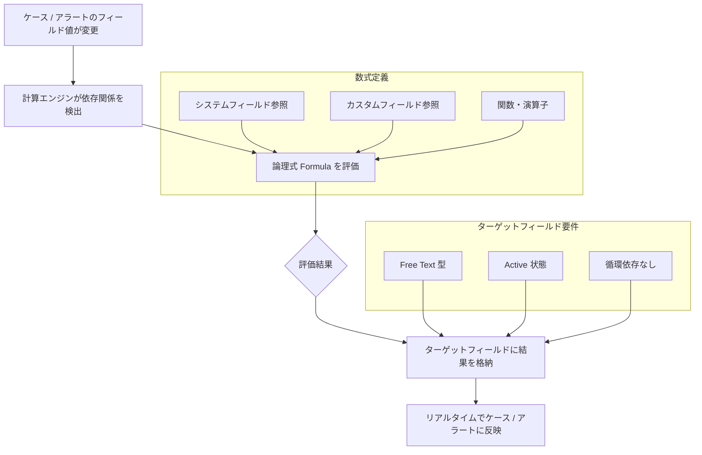

# Google SecOps SOAR: Calculated Fields (計算フィールド)

**リリース日**: 2026-05-24

**サービス**: Google SecOps / Google SecOps SOAR

**機能**: Calculated Fields (計算フィールド) / UDM Search 時間範囲オプション

**ステータス**: Preview

📊 [このアップデートのインフォグラフィックを見る](https://takech9203.github.io/google-cloud-news-summary/20260524-google-secops-calculated-fields.html)

## 概要

Google SecOps SOAR に新機能「Calculated Fields (計算フィールド)」がプレビューとして追加されました。この機能により、セキュリティオペレーションのケースおよびアラート内で、論理的な数式を定義することで既存のシステムフィールドやカスタムフィールドの値に基づいた新しいデータポイントを動的に導出できるようになります。計算された値はリアルタイムで自動的に評価され、ユーザーが事前に選択した既存のカスタムフィールド (ターゲットフィールド) に格納されます。

さらに、UDM Search において相対時間範囲と絶対時間範囲のオプションが追加され、検索結果の取得に必要な期間をより柔軟に定義できるようになりました。これにより、SOC チームはインシデント調査時の時間ベースのクエリをより直感的かつ正確に実行できます。

これらのアップデートは、SOC アナリストや SOC マネージャーがインシデントトリアージを加速し、手動データ入力を排除するために設計されており、セキュリティ運用の分析能力を大幅に向上させます。

**アップデート前の課題**

- ケースやアラートに基づく派生データ (リスクスコアの分類、環境の判定など) を手動で入力する必要があった
- フィールド値の変更時に関連する派生フィールドが自動更新されず、データの不整合が発生する可能性があった
- UDM Search の時間範囲指定が限定的で、特定のイベントを起点とした時間枠の設定が困難だった
- テスト環境と本番環境のアラートを区別するためのフィルタリングに手動での判断が必要だった

**アップデート後の改善**

- 論理式による計算フィールドの定義で、データ導出が完全に自動化された
- 依存フィールドの値が変更された際にリアルタイムで再評価が行われ、常に最新の値が保持される
- 相対時間範囲と絶対時間範囲の両方をサポートし、柔軟な時間ベースの検索が可能になった
- 自動リスクスコアリングやデータ正規化により、インシデントトリアージが加速された

## アーキテクチャ図



この図は Calculated Fields の動作フローを示しています。ケースまたはアラートのフィールド値が変更されると、計算エンジンが依存関係を検出し、定義された論理式を評価して結果をターゲットフィールドにリアルタイムで格納します。

## サービスアップデートの詳細

### 主要機能

1. **Calculated Fields (計算フィールド)**
   - 論理式を定義してケースやアラート内の既存フィールドから新しい値を動的に計算
   - IF/THEN/ELSE 構文による条件分岐ロジックのサポート
   - 依存フィールドの値変更時に同期的にリアルタイム再評価を実行
   - 計算結果は事前に作成された Free Text 型のカスタムフィールド (ターゲットフィールド) に自動格納

2. **フィールドスコーピング**
   - ケーススコープ: `CaseCustom.YourField` (例: `CaseCustom.RiskLevel`)
   - アラートスコープ: `AlertCustom.YourField` (例: `AlertCustom.RiskLevel`)
   - Both スコープで作成したカスタムフィールドは、ケースとアラートで個別のロジックを維持可能

3. **UDM Search 時間範囲オプション**
   - **相対時間範囲**: 現在時刻から逆算して検索ウィンドウを設定 (秒、分、時、日、週、月、年単位)
   - **絶対時間範囲**: カレンダープリセット、正確な日時選択、イベントベースのタイムフレームで固定の開始・終了時刻を定義
   - イベント時間タブによる特定イベントを起点とした時間バッファの設定

## 技術仕様

### Calculated Fields の要件

| 項目 | 詳細 |
|------|------|
| ターゲットフィールド型 | Free Text 型のみ |
| フィールド状態 | Active (アクティブ) である必要あり |
| 循環依存 | 禁止 (他の計算フィールドの依存先になっているフィールドはターゲットに指定不可) |
| 評価タイミング | 依存フィールド変更時にリアルタイム (同期的) |
| スコープ | Case / Alert / Both |
| ステータス | Preview (Pre-GA) |

### UDM Search 時間範囲オプション

| モード | 設定方法 | 用途 |
|--------|----------|------|
| 相対時間範囲 | 数値 + 単位 (Seconds/Minutes/Hours/Days/Weeks/Months/Years) | 直近の期間を動的に検索 |
| 絶対時間範囲 - プリセット | サイドバーからプリセット範囲を選択 (例: All Time) | 定型的な期間の検索 |
| 絶対時間範囲 - 日付選択 | カレンダーで開始日と終了日をクリック | 特定期間の精密な検索 |
| 絶対時間範囲 - イベント時間 | Event Time タブで日付を選択し時間バッファを設定 | イベント前後の調査 |

### 数式の構文例

```
IF ([case.priority] == "High") THEN "Urgent" ELSE "Standard"
```

数式では関数、演算子、フィールド参照を組み合わせて論理式を構築します。IF 条件には括弧が必要で、キーワードは大文字で記述する必要があります。

## 設定方法

### 前提条件

1. Google SecOps SOAR の Settings メニューおよび Case Data 管理権限を持つ管理者アクセス
2. ターゲットフィールドとして使用する Free Text 型のカスタムフィールドが事前に作成されていること

### 手順

#### ステップ 1: カスタムフィールドの作成 (未作成の場合)

Settings > Case Data > Custom Fields に移動し、新しいカスタムフィールドを作成します。

- タイプを「Free Text」に設定
- スコープを Case、Alert、または Both に設定
- フィールドを Active 状態にする

#### ステップ 2: Calculated Field の作成

1. Settings > Case Data > Calculated Fields に移動
2. 「Add」をクリック
3. Calculated Field Name フィールドに一意の名前と説明を入力
4. Target Field エリアで結果を格納する既存のカスタムフィールドを選択
5. テキストエディタで数式を構築

```
IF ([case.priority] == "High") THEN "Urgent" ELSE "Standard"
```

6. 「Save」をクリックして保存

#### ステップ 3: UDM Search での時間範囲設定

1. Investigation > SIEM Search に移動
2. 検索バー横の「Time Range」をクリック
3. Absolute または Relative を選択
4. 時間範囲を設定して「Run Search」をクリック

## メリット

### ビジネス面

- **インシデントトリアージの加速**: 自動リスクスコアリングにより、高優先度のインシデントが即座に SOC チームに可視化される
- **運用コストの削減**: 手動データ入力の排除により、アナリストがより付加価値の高い調査活動に集中できる
- **データ品質の向上**: リアルタイム再評価により、派生フィールドの値が常に最新かつ正確な状態を維持

### 技術面

- **リアルタイム同期評価**: 依存フィールドの変更時に即座に再計算が実行され、データ整合性が保証される
- **循環依存検出**: システムが自動的に循環依存を防止し、無限ループの発生を回避
- **柔軟な時間範囲クエリ**: イベントベースのタイムフレーム設定により、インシデント調査の精度が向上

## デメリット・制約事項

### 制限事項

- Preview (Pre-GA) であるため、機能の変更や互換性の問題が発生する可能性がある
- ターゲットフィールドは Free Text 型に限定されており、数値型やブール型のフィールドには直接格納できない
- 既に他の計算フィールドの依存先となっているフィールドはターゲットとして使用不可
- 削除済みまたは無効化されたフィールドには書き込みできない

### 考慮すべき点

- 複雑な数式は構文エラーが発生しやすいため、IF 条件の括弧やキーワードの大文字表記に注意が必要
- 多数の計算フィールドを定義する場合、依存関係の管理が複雑になる可能性がある
- Pre-GA の機能であるため、本番環境での使用前に十分なテストが推奨される
- UDM Search の時間範囲機能も Pre-GA であり、サポートが限定的な場合がある

## ユースケース

### ユースケース 1: 自動リスクスコアリング

**シナリオ**: SOC チームがケースの優先度とイベント量に基づいて自動的にリスクレベルを分類し、トリアージを効率化したい。

**実装例**:
```
IF ([case.priority] == "Critical" OR [case.priority] == "High") THEN "Urgent - Immediate Response Required" ELSE IF ([case.priority] == "Medium") THEN "Moderate - Review Within 4 Hours" ELSE "Low - Standard Queue"
```

**効果**: 高リスクのインシデントが即座に分類され、適切な対応チームに自動的にエスカレーションされる。手動での優先度判断が不要になり、平均応答時間 (MTTR) の短縮に貢献。

### ユースケース 2: テスト環境フィルタリング

**シナリオ**: テスト環境からのアラートを自動的に識別し、本番環境のアラートと区別することでアナリストのノイズを削減したい。

**実装例**:
```
IF (CONTAINS([alert.name], "test") OR CONTAINS([alert.name], "staging")) THEN "Test Environment" ELSE "Production"
```

**効果**: テスト環境由来のアラートが自動的にラベル付けされ、アナリストは本番環境のセキュリティイベントに集中できる。フィルタリングによりアラート疲れ (alert fatigue) が軽減される。

### ユースケース 3: イベントベースのタイムフレーム検索

**シナリオ**: 特定のセキュリティインシデントが検出された時刻の前後30分間のイベントを調査し、攻撃の全体像を把握したい。

**効果**: 絶対時間範囲のイベント時間タブを使用することで、インシデント発生時刻を基準に前後の時間バッファを設定し、関連イベントを漏れなく調査できる。従来の固定時間範囲では見逃しがちだった攻撃の準備段階や横展開の痕跡を捕捉可能。

## 料金

Calculated Fields および UDM Search の時間範囲オプションは Google SecOps のライセンスに含まれる機能です。追加料金は発生しません。ただし、Preview 機能であるため、GA 移行時に料金体系が変更される可能性があります。

### 料金例

| プラン | 含まれる機能 |
|--------|-------------|
| Google SecOps Standard | Calculated Fields (Preview) 利用可能 |
| Google SecOps Enterprise | Calculated Fields (Preview) + 高度な UDM Search 機能 |

## 利用可能リージョン

Google SecOps は全てのサポート対象リージョンで利用可能です。ただし、UDM Search の時間範囲オプションについては Pre-GA 機能のため、全てのリージョンで利用可能とは限りません。詳細は Google SecOps のドキュメントを参照してください。

## 関連サービス・機能

- **Google SecOps SIEM**: UDM イベントの検索・分析プラットフォーム。Calculated Fields と連携してアラートデータを活用
- **Google SecOps SOAR Playbooks**: 計算フィールドの値に基づいてプレイブックの自動実行をトリガー可能
- **Custom Fields**: Calculated Fields のターゲットとなる Free Text 型フィールド。事前に作成が必要
- **UDM Search**: 相対・絶対時間範囲オプションの追加により、より精密なイベント調査が可能に
- **Chronicle Alerts Connector**: アラートの取り込みと Google SecOps SOAR との同期を担当

## 参考リンク

- 📊 [インフォグラフィック](https://takech9203.github.io/google-cloud-news-summary/20260524-google-secops-calculated-fields.html)
- [公式リリースノート](https://docs.cloud.google.com/release-notes#May_24_2026)
- [Calculated Fields ドキュメント](https://docs.cloud.google.com/chronicle/docs/soar/investigate/working-with-cases/calculated-fields)
- [UDM Search 時間範囲設定](https://docs.cloud.google.com/chronicle/docs/investigation/udm-search#setDateTime)

## まとめ

Google SecOps SOAR の Calculated Fields は、SOC チームがケースやアラートのデータ導出を自動化し、インシデントトリアージを大幅に加速する強力な機能です。論理式による柔軟な条件定義とリアルタイム評価により、手動データ入力のオーバーヘッドを排除し、データ品質を向上させます。併せて追加された UDM Search の時間範囲オプションにより、インシデント調査の精度と効率も向上しています。Preview 段階ではありますが、セキュリティ運用の自動化・効率化を目指す組織は早期に検証を開始することを推奨します。

---

**タグ**: #GoogleSecOps #SOAR #CalculatedFields #SecurityOperations #UDMSearch #Preview #SOC #IncidentResponse #Automation
