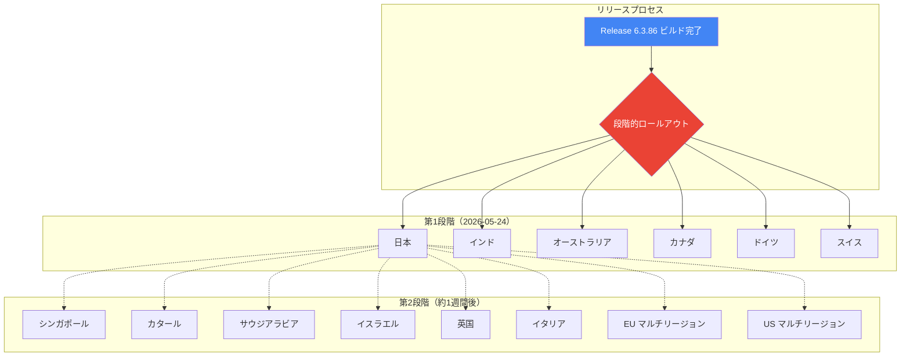

# Google SecOps SOAR: Release 6.3.86 第1段階リージョン展開開始

**リリース日**: 2026-05-24

**サービス**: Google SecOps SOAR

**機能**: Release 6.3.86 段階的ロールアウト開始

**ステータス**: ロールアウト中（第1段階）

📊 [このアップデートのインフォグラフィックを見る](https://takech9203.github.io/google-cloud-news-summary/20260524-google-secops-soar-release-6-3-86.html)

## 概要

Google Security Operations (SecOps) SOAR プラットフォームの Release 6.3.86 が、第1段階のリージョンへのロールアウトを開始しました。本リリースには、内部バグ修正およびお客様報告のバグ修正が含まれています。

Google SecOps SOAR は、セキュリティオーケストレーション・自動化・レスポンス（SOAR）プラットフォームとして、脅威の検出・調査・対応を効率化する統合セキュリティ運用環境を提供しています。先週リリースされた Release 6.3.85 に続く定期的なメンテナンスリリースであり、プラットフォームの安定性とパフォーマンスの継続的な向上を目的としています。

## アーキテクチャ図

Google SecOps SOAR のリリースは 2 段階のロールアウトプロセスに従います。第1段階のリージョンで安定性が確認された後、約1週間後に第2段階のリージョンへ展開されます。これにより、問題の早期検出とリスク軽減を実現しています。

## サービスアップデートの詳細

### リリース内容

1. **内部バグ修正**
   - Google SecOps SOAR プラットフォームの安定性向上に関する内部修正が含まれています

2. **お客様報告のバグ修正**
   - お客様から報告された問題に対する修正が含まれています

### 段階的ロールアウトスケジュール

| 段階 | リージョン | 展開予定 |
|------|-----------|----------|
| 第1段階 | 日本、インド、オーストラリア、カナダ、ドイツ、スイス | 2026-05-24（展開中） |
| 第2段階 | シンガポール、カタール、サウジアラビア、イスラエル、英国（ロンドン）、イタリア、EU（マルチリージョン）、US（マルチリージョン） | 約1週間後 |

## 技術仕様

| 項目 | 詳細 |
|------|------|
| バージョン | 6.3.86 |
| リリースタイプ | メンテナンスリリース（バグ修正） |
| 第1段階展開日 | 2026-05-24 |
| 全リージョン展開予定 | 約1週間後（第2段階） |
| メンテナンスウィンドウ | 毎週日曜日 |

## 関連サービス・機能

- **Google SecOps SIEM**: セキュリティ情報・イベント管理。SOAR と統合されたプラットフォームとして脅威検出を担当
- **Google SecOps Playbook エンジン**: セキュリティ対応の自動化ワークフローを構築・実行するエンジン
- **Google SecOps Marketplace**: 300 以上の SOAR インテグレーションを提供するマーケットプレイス
- **Gemini in Security Operations**: AI を活用した Playbook 作成、調査支援、レスポンス推奨

## 参考リンク

- 📊 [インフォグラフィック](https://takech9203.github.io/google-cloud-news-summary/20260524-google-secops-soar-release-6-3-86.html)
- [公式リリースノート](https://docs.cloud.google.com/release-notes#May_24_2026)
- [Google SecOps SOAR リリースノート](https://docs.cloud.google.com/chronicle/docs/soar/release-notes)
- [段階的リリース計画](https://docs.cloud.google.com/chronicle/docs/soar/overview-and-introduction/soar-gradual-release)
- [Google SecOps SOAR 概要](https://docs.cloud.google.com/chronicle/docs/soar/overview-and-introduction/soar-overview)

## まとめ

Google SecOps SOAR Release 6.3.86 は、内部およびお客様報告のバグ修正を含むメンテナンスリリースとして第1段階リージョン（日本、インド、オーストラリア、カナダ、ドイツ、スイス）への展開が開始されました。第2段階のリージョンへは約1週間後に展開される予定です。セキュリティ運用の安定性維持のため、メンテナンスウィンドウ中に自動アップデートが適用されます。

---

**タグ**: #GoogleSecOps #SOAR #SecurityOperations #BugFix #Release #Chronicle
