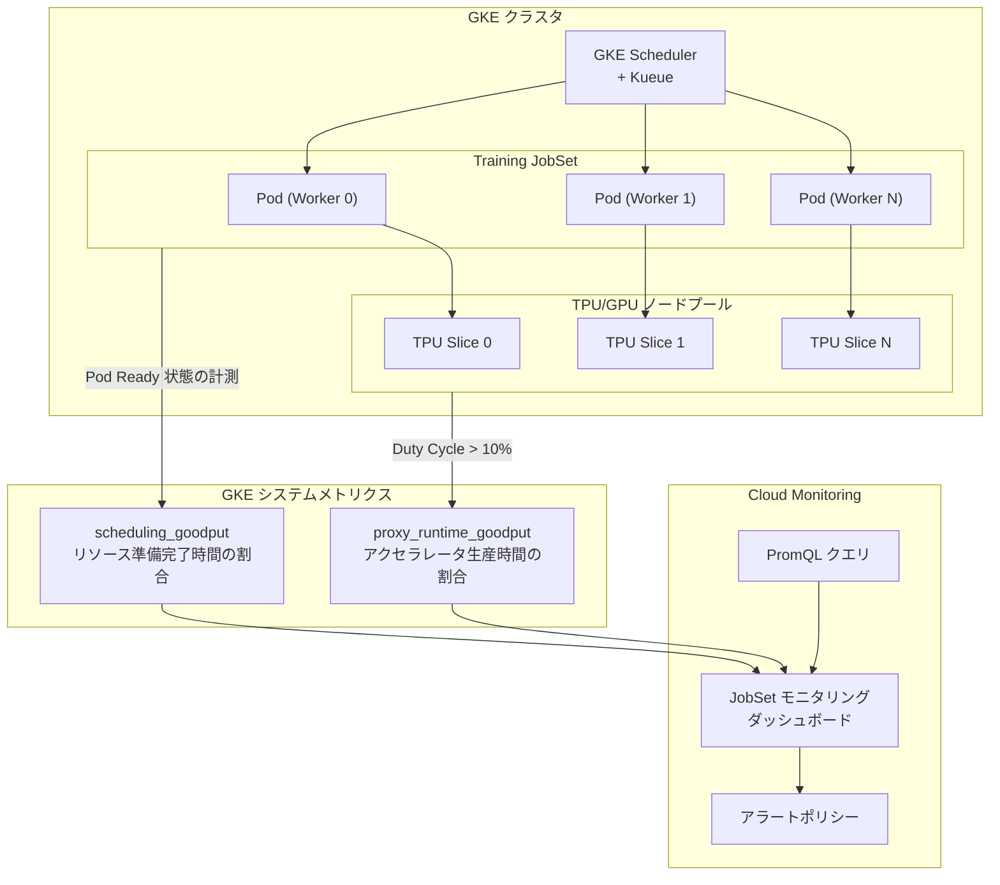

# Google Kubernetes Engine (GKE): トレーニング JobSet Goodput メトリクスの追加

**リリース日**: 2026-05-25

**サービス**: Google Kubernetes Engine (GKE)

**機能**: トレーニング JobSet の効率性を測定する Goodput システムメトリクス

**ステータス**: Preview

📊 [このアップデートのインフォグラフィックを見る](https://takech9203.github.io/google-cloud-news-summary/20260525-gke-training-jobset-metrics.html)

## 概要

Google Kubernetes Engine (GKE) において、ML/AI トレーニング JobSet の効率性をモニタリングするための 2 つの新しいシステムメトリクスが Preview として利用可能になりました。`kubernetes.io/jobset/scheduling_goodput` と `kubernetes.io/jobset/proxy_runtime_goodput` の 2 つのメトリクスにより、GKE 上で実行されるトレーニングワークロードのインフラストラクチャレベルでの効率性を定量的に把握できるようになります。

これらのメトリクスは「Goodput」(生産的な時間の割合) という概念に基づいており、トレーニングジョブがリソースを確保してから実際にアクセラレータが生産的に活用されるまでの一連のプロセスを可視化します。特に TPU マルチスライス環境での大規模分散トレーニングにおいて、スケジューリングの遅延やリソース利用の非効率性を特定するための重要な指標となります。

これらのメトリクスは Cloud Monitoring の JobSet モニタリングダッシュボードで可視化でき、PromQL クエリを使用してカスタムアラートやダッシュボードの構築も可能です。

**アップデート前の課題**

これまで GKE 上で ML トレーニング JobSet を運用する際、インフラストラクチャレベルでの効率性を定量的に測定する手段が限られていました。

- GKE のスケジューリングによるリソース確保の遅延を直接的に計測する標準メトリクスがなかった
- アクセラレータ (TPU/GPU) の実効利用率を JobSet 単位で俯瞰的に把握する方法がなかった
- トレーニングジョブの非効率性がインフラ起因なのかアプリケーション起因なのかの切り分けが困難だった
- ML Goodput Measurement ライブラリによるアプリケーションレベルの計測のみに依存しており、アプリケーションコードへの組み込みが必須だった

**アップデート後の改善**

今回のアップデートにより、アプリケーションの計装なしにインフラストラクチャレベルでの効率性が自動的に計測されるようになりました。

- `scheduling_goodput` により、Pod のスケジューリング遅延やイメージプル時間、リソース割り当ての問題を即座に検出可能になった
- `proxy_runtime_goodput` により、アクセラレータのデューティサイクルに基づく実効生産性の推定が自動で行われるようになった
- JobSet モニタリングダッシュボードの「Training Goodput」タブで両メトリクスを一元的に確認できるようになった
- GKE インフラ起因の問題と ML アプリケーション起因の問題を明確に切り分けられるようになった

## アーキテクチャ図



この図は、GKE クラスタ内の Training JobSet がスケジューラによって TPU/GPU ノードプールに配置され、2 つの Goodput メトリクスがそれぞれ異なるレイヤー (スケジューリング層とランタイム層) から収集されて Cloud Monitoring に送信される流れを示しています。

## サービスアップデートの詳細

### 主要機能

1. **kubernetes.io/jobset/scheduling_goodput (スケジューリング Goodput)**
   - JobSet の作成時刻を起点として、すべての必要な Pod がReady 状態になっている時間の割合を測定
   - 値が低い場合、Pod のスケジューリング遅延、コンテナイメージのプル時間、GKE 内でのリソース割り当ての問題を示唆
   - メトリクスタイプ: GAUGE, DOUBLE (0.0 - 1.0 の範囲)
   - サンプリング間隔: 60 秒ごと
   - データ可視化までの遅延: 最大 3600 秒

2. **kubernetes.io/jobset/proxy_runtime_goodput (プロキシランタイム Goodput)**
   - すべてのアクティブなアクセラレータが生産的に動作している時間の割合を推定
   - アクセラレータのデューティサイクルが 10% を超えている時間に基づいて計算
   - アプリケーションの計装 (instrumentation) なしに、システムレベルのシグナルから実行時の生産性を推定
   - メトリクスタイプ: GAUGE, DOUBLE (0.0 - 1.0 の範囲)
   - サンプリング間隔: 60 秒ごと
   - データ可視化までの遅延: 最大 3600 秒

3. **JobSet モニタリングダッシュボード統合**
   - Google Cloud コンソールの JobSet モニタリングダッシュボードに「Training Goodput」タブとして統合
   - ノードプールの健全性メトリクスとの相関分析が可能
   - Goodput の低下とノードプールの障害・中断との関連を視覚的に確認可能

## 技術仕様

### メトリクス詳細

| 項目 | scheduling_goodput | proxy_runtime_goodput |
|------|------|------|
| メトリクスパス | `kubernetes.io/jobset/scheduling_goodput` | `kubernetes.io/jobset/proxy_runtime_goodput` |
| リソースタイプ | `k8s_entity` | `k8s_entity` |
| エンティティタイプ | `jobset` | `jobset` |
| 値の型 | DOUBLE (0.0 - 1.0) | DOUBLE (0.0 - 1.0) |
| メトリクス種別 | GAUGE | GAUGE |
| サンプリング間隔 | 60 秒 | 60 秒 |
| データ遅延 | 最大 3600 秒 | 最大 3600 秒 |
| ステージ | BETA (Preview) | BETA (Preview) |
| 計測対象 | Pod の Ready 状態 | アクセラレータの Duty Cycle |
| 判定閾値 | 全 Pod が Ready | Duty Cycle > 10% |

### Goodput と Badput の関係

| 区分 | 説明 | 対応メトリクス |
|------|------|------|
| Scheduling Goodput | 全リソースが利用可能な時間の割合 | `scheduling_goodput` |
| Scheduling Badput | スケジューリング待ち・リソース不足の時間 | 1 - `scheduling_goodput` |
| Runtime Goodput | アクセラレータが生産的に動作する時間の割合 | `proxy_runtime_goodput` |
| Runtime Badput | アクセラレータがアイドルまたは非生産的な時間 | 1 - `proxy_runtime_goodput` |

### PromQL クエリ例

```promql
# Scheduling Goodput の時系列平均
avg_over_time(
  kubernetes_io:jobset_scheduling_goodput{
    monitored_resource="k8s_entity",
    entity_type="jobset",
    entity_name=~"my-training-job-.*",
    cluster_name="my-cluster"
  }[${__interval}]
)

# Proxy Runtime Goodput の時系列平均
avg_over_time(
  kubernetes_io:jobset_proxy_runtime_goodput{
    monitored_resource="k8s_entity",
    entity_type="jobset",
    entity_name=~"my-training-job-.*",
    cluster_name="my-cluster"
  }[${__interval}]
)
```

## 設定方法

### 前提条件

1. GKE クラスタが稼働していること (JobSet メトリクスをサポートするバージョン)
2. TPU または GPU ノードプールが構成されていること
3. JobSet API が有効化されていること
4. Cloud Monitoring API が有効であること

### 手順

#### ステップ 1: JobSet を使用したトレーニングワークロードのデプロイ

```yaml
apiVersion: jobset.x-k8s.io/v1alpha2
kind: JobSet
metadata:
  name: my-training-jobset
spec:
  replicatedJobs:
  - name: worker
    replicas: 2
    template:
      spec:
        parallelism: 4
        completions: 4
        template:
          spec:
            containers:
            - name: training
              image: my-training-image:latest
              resources:
                limits:
                  google.com/tpu: 4
```

JobSet リソースをデプロイすると、GKE は自動的に Goodput メトリクスの収集を開始します。

#### ステップ 2: JobSet モニタリングダッシュボードで確認

```bash
# Google Cloud コンソールで JobSet モニタリングダッシュボードにアクセス
# Navigation: Kubernetes Engine > JobSets > [JobSet名] > Monitoring
# または Cloud Monitoring > Dashboards > JobSet Monitoring Dashboard
```

ダッシュボードの「Training Goodput」タブを選択すると、scheduling_goodput と proxy_runtime_goodput の両方のメトリクスが時系列グラフとして表示されます。

#### ステップ 3: アラートの設定 (オプション)

```bash
# gcloud を使用してアラートポリシーを作成
gcloud alpha monitoring policies create \
  --display-name="Low Scheduling Goodput Alert" \
  --condition-display-name="Scheduling Goodput below 80%" \
  --condition-filter='resource.type="k8s_entity" AND metric.type="kubernetes.io/jobset/scheduling_goodput"' \
  --condition-threshold-value=0.8 \
  --condition-threshold-comparison=COMPARISON_LT \
  --notification-channels="projects/my-project/notificationChannels/12345"
```

Scheduling Goodput が一定の閾値を下回った場合にアラートを発報する設定により、リソース確保の問題を早期に検出できます。

## メリット

### ビジネス面

- **トレーニングコストの最適化**: Goodput メトリクスにより非効率な時間を特定し、TPU/GPU リソースの無駄な課金を削減できる
- **トレーニング完了時間の予測精度向上**: 実効的な生産時間の割合が分かることで、ジョブの完了時刻をより正確に見積もれる
- **SLA モニタリング**: インフラストラクチャレベルでのサービス品質を定量的に追跡し、改善活動のベースラインを設定できる

### 技術面

- **問題の切り分けの迅速化**: スケジューリング層とランタイム層を分離して計測するため、ボトルネックの特定が容易になる
- **アプリケーション計装不要**: proxy_runtime_goodput はシステムレベルのシグナルから推定されるため、アプリケーションコードの変更なしに利用可能
- **既存ツールとの統合**: Cloud Monitoring、PromQL、JobSet ダッシュボードとシームレスに統合され、既存のモニタリングワークフローに組み込みやすい
- **ML Goodput Measurement ライブラリとの補完関係**: GKE レベルの Goodput (インフラ) と ML Goodput (アプリケーション) を組み合わせることで、エンドツーエンドの効率性分析が可能

## デメリット・制約事項

### 制限事項

- Preview ステータスのため、本番環境での利用には注意が必要 (「Pre-GA Offerings Terms」が適用される)
- データ可視化までの遅延が最大 3600 秒 (1 時間) と長く、リアルタイムのトラブルシューティングには不向きな場合がある
- `proxy_runtime_goodput` はアクセラレータの Duty Cycle に基づく推定値であり、正確なランタイム Goodput を得るには ML Goodput Measurement ライブラリの計装が別途必要
- サンプリング間隔が 60 秒のため、短時間のスパイクや一時的な問題は検出されない可能性がある

### 考慮すべき点

- Duty Cycle > 10% の閾値が全てのワークロードに適切とは限らない (データロード中心のワークロードでは誤検出の可能性)
- 7 日以上経過した JobSet に対しては一部のメトリクスが利用できない制約がある (`startup_duration` 等)
- GA (一般提供) への移行時に仕様変更が発生する可能性がある
- GPU ワークロードでの `proxy_runtime_goodput` の精度は TPU ワークロードと異なる場合がある

## ユースケース

### ユースケース 1: TPU マルチスライス分散トレーニングの最適化

**シナリオ**: 大規模言語モデル (LLM) のトレーニングを TPU v5p マルチスライス構成で実行しており、トレーニング完了までの実時間が理論値より大幅に長い。原因がスケジューリングの問題なのか、アクセラレータ利用率の問題なのかを切り分けたい。

**実装例**:
```promql
# スケジューリングの問題を確認
avg_over_time(
  kubernetes_io:jobset_scheduling_goodput{
    entity_name="llm-training-job",
    cluster_name="tpu-training-cluster"
  }[1h]
)

# ランタイム効率を確認
avg_over_time(
  kubernetes_io:jobset_proxy_runtime_goodput{
    entity_name="llm-training-job",
    cluster_name="tpu-training-cluster"
  }[1h]
)
```

**効果**: scheduling_goodput が 0.95、proxy_runtime_goodput が 0.60 であれば、スケジューリングは良好だがアクセラレータの利用効率に問題があることが明確になり、チェックポイント保存頻度やデータパイプラインの最適化に注力すべきことが判断できる。

### ユースケース 2: Kueue を使用したマルチテナント環境での公平性モニタリング

**シナリオ**: 複数のチームが共有 GKE クラスタ上で Kueue を使用してトレーニングジョブをキューイングしている。特定チームの JobSet で scheduling_goodput が著しく低いという報告があり、リソース割り当ての公平性を検証したい。

**効果**: チーム間の scheduling_goodput を比較することで、Kueue の ResourceFlavor や ClusterQueue の設定が適切かどうかを客観的に評価でき、リソース割り当てポリシーの調整根拠として活用できる。

### ユースケース 3: ノードプール障害の影響評価

**シナリオ**: TPU ノードプールでメンテナンスイベントが発生した後、トレーニングジョブの再開に時間がかかっている。Goodput メトリクスとノードプールの健全性メトリクスを相関させて影響範囲を評価したい。

**効果**: scheduling_goodput の急落タイミングとノードプールの中断イベントを照合することで、インフラストラクチャ障害がトレーニング効率に与えた影響を定量的にレポートでき、SRE チームへの改善要求の根拠となる。

## 料金

GKE の Goodput メトリクスは GKE システムメトリクスの一部として提供されます。

### 料金体系

| 項目 | 料金 |
|------|------|
| メトリクスの収集 | GKE クラスタ料金に含まれる (追加料金なし) |
| Cloud Monitoring での保存 | システムメトリクスとして無料枠に含まれる |
| カスタムダッシュボード | Cloud Monitoring の無料枠内で利用可能 |
| アラートポリシー | Cloud Monitoring のアラート料金に準拠 |

※ メトリクスの収集自体に追加料金は発生しませんが、Cloud Monitoring の取り込み量やアラート通知に応じた料金が別途発生する場合があります。

## 利用可能リージョン

GKE システムメトリクスとして、TPU または GPU ノードプールをサポートするすべての GKE クラスタリージョンで利用可能です。特に以下のリージョンで TPU マルチスライスワークロードと組み合わせて活用できます:

- us-central1 (TPU v5p, v5e)
- us-east5 (TPU v5p)
- europe-west4 (TPU v5e)
- asia-northeast1 (TPU v5e)

## 関連サービス・機能

- **Cloud Monitoring**: メトリクスの保存・可視化・アラートを担うモニタリング基盤
- **ML Goodput Measurement ライブラリ**: アプリケーションレベルの Goodput を計測する Python パッケージ (GKE メトリクスと補完的に使用)
- **Kueue**: GKE 上のジョブキューイングシステム。JobSet のスケジューリングを制御
- **Cloud TPU**: Goodput メトリクスの主要な計測対象となるアクセラレータ
- **GKE JobSet API**: Kubernetes の JobSet リソースを管理する API。メトリクスの収集対象
- **Cloud ML Goodput ダッシュボード**: アプリケーション層の Goodput/Badput 分析用ダッシュボード

## 参考リンク

- 📊 [インフォグラフィック](https://takech9203.github.io/google-cloud-news-summary/20260525-gke-training-jobset-metrics.html)
- [公式リリースノート](https://docs.cloud.google.com/release-notes#May_25_2026)
- [Kubernetes メトリクス一覧](https://docs.cloud.google.com/monitoring/api/metrics_kubernetes#kubernetes-kubernetes)
- [ML Goodput Measurement ライブラリ](https://docs.cloud.google.com/tpu/docs/goodput#jobset-dashboard)
- [JobSet モニタリングダッシュボード](https://docs.cloud.google.com/kubernetes-engine/docs/tutorials/tpu-multislice-kueue#monitor_the_workloads)
- [ML Goodput Measurement GitHub リポジトリ](https://github.com/AI-Hypercomputer/ml-goodput-measurement)

## まとめ

今回の GKE トレーニング JobSet Goodput メトリクスの追加は、大規模 ML/AI トレーニングワークロードの運用効率を定量的に把握するための重要なアップデートです。scheduling_goodput によるインフラ層の可視化と proxy_runtime_goodput によるアクセラレータ効率の推定を組み合わせることで、トレーニングの非効率性の原因を迅速に特定し、コスト最適化とトレーニング時間の短縮を実現できます。TPU/GPU を使用した大規模トレーニングを運用しているチームは、まず JobSet モニタリングダッシュボードで現状の Goodput を確認し、ベースラインを設定することを推奨します。

---

**タグ**: #GKE #Kubernetes #JobSet #Goodput #MLTraining #TPU #CloudMonitoring #Metrics #Preview #AI #MachineLearning
