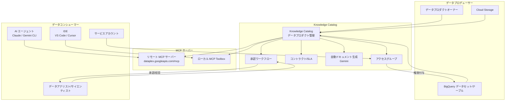

# Knowledge Catalog (Dataplex): データプロダクト機能が GA (一般提供) に

**リリース日**: 2026-05-25
**サービス**: Knowledge Catalog (Dataplex)
**機能**: データプロダクト (Data Products) の一般提供
**ステータス**: GA (Generally Available)

[このアップデートのインフォグラフィックを見る](https://takech9203.github.io/google-cloud-news-summary/20260525-knowledge-catalog-data-products-ga.html)

## 概要

Knowledge Catalog (旧 Dataplex Universal Catalog) のデータプロダクト機能が GA (一般提供) となりました。データプロダクトは、特定のビジネス課題を解決するために設計された、データアセットとコンテキストの論理的かつキュレーションされたパッケージです。データエンジニアやデータスチュワードが個別のテーブルやデータセットを超えて、ビジネス的な意味を持つ単位でデータを整理・配布できるようになります。

今回の GA リリースでは、承認ワークフロー、Gemini による自動ドキュメント生成、サービスアカウントサポート、そしてリモート MCP サーバーサポート (Preview) という 4 つの主要な新機能が追加されました。これにより、データプロデューサーとデータコンシューマー間のセルフサービスワークフローが大幅に強化され、AI エージェントとの統合も可能になります。

Knowledge Catalog は、物理的なデータアセットにビジネスセマンティクス、ガバナンスルール、利用関係をリンクする統合コンテキストグラフを中心とした、データガバナンスと AI 統合のためのフルマネージドプラットフォームです。データプロダクトの GA により、エンタープライズ全体でのデータの民主化とデータメッシュアーキテクチャの実現が一段と進みます。

**アップデート前の課題**
- データアセットが個別に管理されており、ビジネスコンテキストが欠如した状態でコンシューマーに提供されていた
- データへのアクセス申請・承認が手動プロセスに依存し、時間がかかっていた
- データプロダクトのドキュメント作成が手作業で、品質にばらつきがあった
- AI エージェントがプログラム的にデータプロダクトにアクセスする標準化された手段がなかった
- サービスアカウントでのデータプロダクトアクセスが制限されていた

**アップデート後の改善**
- データアセットをビジネス課題に対応する論理的な単位でパッケージ化し、SLA やガバナンス制約を含めて配布可能
- Google Cloud Console または API を通じた承認ワークフローにより、アクセスリクエストの送信・追跡・承認・拒否が効率化
- Gemini を活用した自動ドキュメント生成により、サンプルクエリ、ビジネスインサイト、ドキュメントテンプレートを自動作成
- リモート MCP サーバーを通じて AI エージェントがデータプロダクトとプログラム的に連携可能
- サービスアカウントをアクセスグループに設定し、自動化パイプラインからのデータプロダクト利用を実現

## アーキテクチャ図



## サービスアップデートの詳細

### 主要機能

#### 1. データプロダクト消費のための承認ワークフロー

データプロダクトコンシューマーは、公開されたデータプロダクトを閲覧し、アクセスリクエストを送信し、そのステータスを追跡できます。データプロダクトオーナーは Google Cloud Console または API を使用して、アクセスリクエストの追跡・承認・拒否が可能です。

- コンシューマーはアクセスタイプを選択し、アクセスの正当性を説明してリクエストを送信
- オーナーにはメール通知が送信される
- 承認後、コンシューマーは該当するデータプロダクトとそのアセットにアクセス可能

#### 2. 自動ドキュメント生成とインサイト

データプロダクトオーナーは Knowledge Catalog のデータインサイトと Gemini を活用して、以下を自動生成できます。

- サンプル SQL クエリ
- ビジネスインサイト
- ドキュメントテンプレート

データインサイトは「生成して公開」モードと「公開せずに生成」モードの 2 つのモードを提供し、エンタープライズ全体でのデータドキュメントの標準化に貢献します。

#### 3. サービスアカウントサポート

データプロダクトオーナーはアクセスグループにサービスアカウントを設定でき、データプロダクトコンシューマーは自身のサービスアカウント用にアクセスをリクエストできます。これにより、自動化パイプラインや ETL ジョブからデータプロダクトを利用するワークフローが標準化されます。

#### 4. リモート Model Context Protocol (MCP) サーバーサポート (Preview)

データアプリケーションや AI エージェントがデータプロダクトとプログラム的に対話可能になります。Knowledge Catalog リモート MCP サーバーをデプロイすることで、開発者は外部 IDE や LLM クライアントからデータプロダクトの作成・発見・メタデータ検査が可能です。

- エンドポイント: `https://dataplex.googleapis.com/mcp`
- トランスポート: HTTP
- 認証: OAuth 2.0 + IAM
- 対応クライアント: Claude、Gemini CLI、VS Code、Cursor、Windsurf など

## 技術仕様

### IAM ロール

| ロール | 説明 |
|--------|------|
| `roles/dataplex.dataProductsAdmin` | データプロダクトのフルアクセス (作成・更新・削除・権限管理) |
| `roles/dataplex.dataProductsEditor` | データプロダクトの書き込みアクセス |
| `roles/dataplex.dataProductsViewer` | データプロダクトの読み取りアクセス |
| `roles/dataplex.dataProductsConsumer` | データプロダクトの検索・アクセスリクエスト |
| `roles/dataplex.catalogViewer` | カタログ全体の閲覧 |

### MCP サーバー OAuth スコープ

| スコープ URI | 説明 |
|-------------|------|
| `https://www.googleapis.com/auth/dataplex.readonly` | 読み取りアクセスのみ |
| `https://www.googleapis.com/auth/dataplex.read-write` | 読み書きアクセス |

### API エンドポイント

- データプロダクト検索: `POST https://dataplex.googleapis.com/v1/projects/{PROJECT_ID}/locations/global:searchEntries`
- データプロダクト作成: Dataplex API v1
- MCP ツール呼び出し: `POST https://dataplex.googleapis.com/mcp`

### サポートされるアセットタイプ

- BigQuery データセット
- BigQuery テーブル
- BigQuery ビュー
- 1 データプロダクトあたり最大 10 アセット

## 設定方法

### 前提条件

1. Dataplex API と BigQuery API を有効化
2. 適切な IAM ロールを付与

### データプロダクトの作成 (コンソール)

1. Google Cloud Console で Knowledge Catalog の「データプロダクト」ページに移動
2. 「作成」をクリック
3. 以下の詳細を入力:
   - データプロダクト名
   - プロジェクト ID
   - リージョン
   - 説明
   - オーナーの連絡先
4. 「データプロダクトを作成」をクリック

### データプロダクトの作成 (REST API)

```bash
curl -X POST \
  -H "Authorization: Bearer $(gcloud auth print-access-token)" \
  -H "Content-Type: application/json" \
  -d '{
    "displayName": "My Data Product",
    "description": "説明文"
  }' \
  "https://dataplex.googleapis.com/v1/projects/PROJECT_ID/locations/LOCATION/dataProducts?dataProductId=DATA_PRODUCT_ID"
```

### アクセスグループの設定 (Terraform)

```hcl
resource "google_dataplex_entry" "data_product_metadata" {
  project        = "PROJECT_NUMBER"
  location       = "LOCATION"
  entry_group_id = "@dataplex"
  entry_id       = "projects/PROJECT_NUMBER/locations/LOCATION/dataProducts/DATA_PRODUCT_ID"
  entry_type     = "projects/655216118709/locations/global/entryTypes/data-product"

  aspects {
    aspect_key = "655216118709.global.overview"
    aspect {
      data = jsonencode({
        content = "ドキュメント内容"
      })
    }
  }

  provider = google-beta
}
```

### MCP サーバーへの接続設定

```json
{
  "mcpServers": {
    "knowledge-catalog": {
      "url": "https://dataplex.googleapis.com/mcp",
      "transport": "http",
      "auth": {
        "type": "oauth2",
        "scope": "https://www.googleapis.com/auth/dataplex.read-write"
      }
    }
  }
}
```

## メリット

### ビジネス面

- **データの民主化**: セルフサービスワークフローにより、データコンシューマーが独立してデータプロダクトを発見・アクセス可能
- **ガバナンスの強化**: コントラクト (SLA) とアクセスグループによる体系的なデータ配布
- **Time-to-Insight の短縮**: キュレーションされたデータプロダクトにより、データ活用までの時間を大幅削減
- **ドキュメントの品質向上**: Gemini による自動生成で一貫性のあるドキュメントを維持
- **AI 活用の加速**: MCP サーバーを通じた AI エージェントとの標準化された連携

### 技術面

- **標準化されたアクセス制御**: IAM ロールとアクセスグループによる細かい権限管理
- **API ファースト設計**: REST API と MCP を通じたプログラム的なアクセス
- **Terraform サポート**: Infrastructure as Code によるデータプロダクトの管理
- **サービスアカウント対応**: 自動化パイプラインとの統合が容易
- **マルチクライアント対応**: Claude、Gemini CLI、各種 IDE から利用可能

## デメリット・制約事項

- アセットはデータプロダクトと同じリージョンに存在する必要がある
- 1 データプロダクトあたり最大 10 アセットの制限
- リモート MCP サーバーサポートは Preview 段階であり、GA ではない
- 承認ワークフローはメールベースであり、メールアプリケーションの設定が必要
- データインサイト機能は Geo/JSON カラムタイプに非対応
- マルチクラウド環境では他のクラウドのデータが利用できない場合がある

## ユースケース

### 1. エンタープライズデータメッシュの構築

大規模組織でドメインチームがそれぞれのデータプロダクトを作成・管理し、他チームにセルフサービスで提供。承認ワークフローにより適切なアクセス制御を維持しながらデータの民主化を実現。

### 2. AI エージェントへのデータ提供

MCP サーバーを通じて AI エージェントがデータプロダクトのメタデータにアクセスし、ビジネスコンテキストに基づいた正確な回答を生成。AI ハルシネーションの削減に貢献。

### 3. 自動化パイプラインの構築

サービスアカウントを使用して ETL/ELT パイプラインがデータプロダクトにアクセスし、定期的なデータ処理を自動化。コントラクトで定義されたリフレッシュスケジュールに基づく信頼性の高いデータフロー。

### 4. データカタログの自動整備

Gemini を活用したデータインサイト機能により、新しいテーブルやデータセットのドキュメントを自動生成。データスチュワードの手動作業を大幅に削減。

## 料金

Knowledge Catalog の料金は従量課金制です。

| 項目 | 料金 |
|------|------|
| Standard 処理 (データ検出) | $0.060/DCU-hour から |
| Premium 処理 (リネージ、品質、プロファイリング) | $0.089/DCU-hour から |
| Standard 処理の無料枠 | 月間 100 DCU-hour |
| メタデータストレージ | $2/GiB/月 (1 MiB まで無料) |
| API 呼び出し | $10/100,000 呼び出し (月間 100 万まで無料) |
| シャッフルストレージ | $0.040/GB-month から |

データプロダクト関連の操作 (作成・管理) は、上記の API 呼び出しとメタデータストレージの料金に含まれます。Gemini によるデータインサイト機能は Gemini in BigQuery の料金に準じます。

## 利用可能リージョン

Knowledge Catalog は BigQuery が利用可能な全リージョンで利用できます。データプロダクトは作成時にリージョンまたはマルチリージョンを指定します。MCP サーバーのエンドポイントはグローバル (`dataplex.googleapis.com/mcp`) で提供されます。

## 関連サービス・機能

| サービス | 関係性 |
|---------|--------|
| **BigQuery** | データプロダクトの主要なアセットソース。テーブル、ビュー、データセットをデータプロダクトに含める |
| **Vertex AI** | AI エージェントの構築プラットフォーム。Knowledge Catalog API を通じてコンテキストを取得 |
| **Cloud Storage** | 非構造化データアセットのソース。Knowledge Catalog がメタデータを自動検出 |
| **Gemini in BigQuery** | データインサイトによる自動ドキュメント生成を提供 |
| **IAM** | アクセスグループとロールベースの権限管理を提供 |
| **Pub/Sub** | メタデータ変更フィードによるリアルタイム通知 |
| **Agent Development Kit (ADK)** | カスタム AI エージェントの構築に使用 |
| **Cloud Run** | リモート MCP サーバーを利用するサーバーレスエージェントのデプロイ先 |

## 参考リンク

- [インフォグラフィック](https://takech9203.github.io/google-cloud-news-summary/20260525-knowledge-catalog-data-products-ga.html)
- [公式リリースノート](https://docs.cloud.google.com/release-notes#May_25_2026)
- [データプロダクトの概要](https://docs.cloud.google.com/dataplex/docs/data-products-overview)
- [データプロダクトの作成](https://docs.cloud.google.com/dataplex/docs/create-data-products)
- [データプロダクトの管理](https://docs.cloud.google.com/dataplex/docs/manage-data-products)
- [データプロダクトの利用](https://docs.cloud.google.com/dataplex/docs/use-data-products)
- [リモート MCP サーバーの使用](https://docs.cloud.google.com/dataplex/docs/use-remote-mcp)
- [Knowledge Catalog と AI の統合](https://docs.cloud.google.com/dataplex/docs/ai-overview)
- [Knowledge Catalog の料金](https://cloud.google.com/dataplex/pricing)

## まとめ

Knowledge Catalog のデータプロダクト機能の GA リリースは、Google Cloud のデータガバナンス戦略における重要なマイルストーンです。データプロダクトにより、組織はデータメッシュアーキテクチャを実現し、データの民主化とガバナンスの両立が可能になります。

特に注目すべきは、承認ワークフローによるセルフサービスアクセス、Gemini を活用した自動ドキュメント生成、そしてリモート MCP サーバーによる AI エージェントとの統合です。これらの機能により、データプロデューサーの負担を軽減しつつ、データコンシューマー (人間と AI エージェントの両方) がデータに迅速かつ安全にアクセスできる環境が整備されます。

今後のデータプラットフォーム戦略において、Knowledge Catalog のデータプロダクトは中核的な役割を果たすことが期待されます。

---
**タグ**: #KnowledgeCatalog #Dataplex #DataProducts #DataMesh #DataGovernance #MCP #Gemini #GA #AIAgents #DataCatalog
