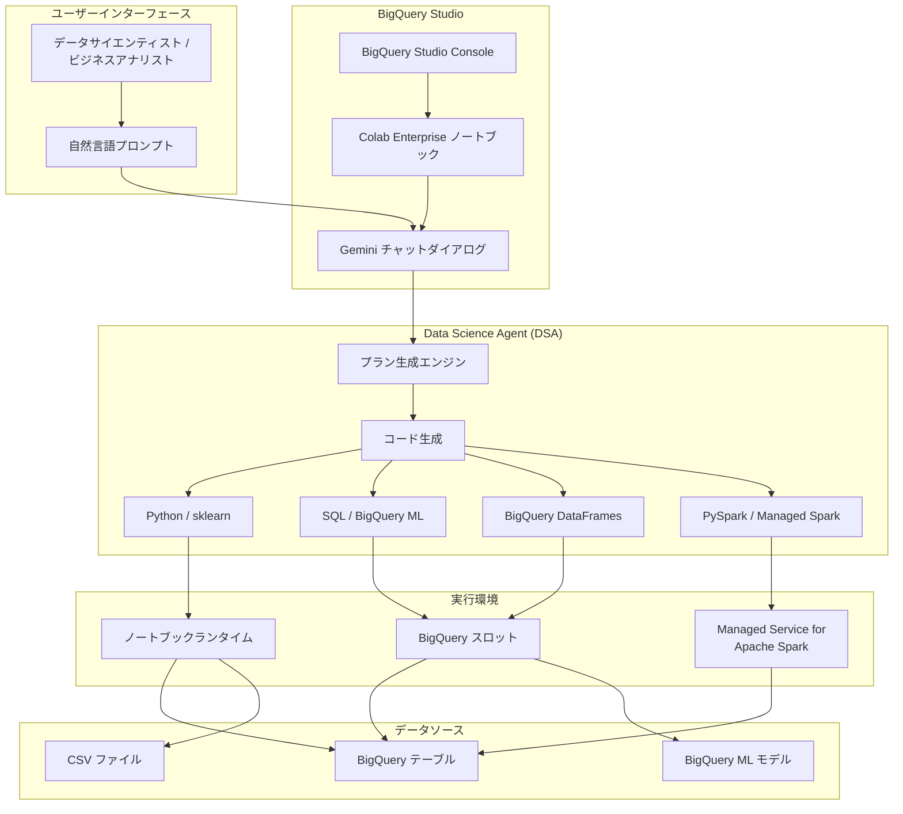

# BigQuery / Colab Enterprise: Data Science Agent が GA (一般提供) に

**リリース日**: 2026-05-26

**サービス**: BigQuery / Colab Enterprise

**機能**: Data Science Agent (DSA) の一般提供

**ステータス**: GA (Generally Available)

[このアップデートのインフォグラフィックを見る](https://takech9203.github.io/google-cloud-news-summary/20260526-bigquery-data-science-agent-ga.html)

## 概要

BigQuery および Colab Enterprise 向けの Data Science Agent (DSA) が GA (一般提供) となりました。Data Science Agent は、Colab Enterprise ノートブック内から探索的データ分析 (EDA) の自動化、機械学習タスクの実行、インサイトの提供を行う AI エージェントです。自然言語によるプロンプトを入力するだけで、データサイエンティストやアナリストが複雑なデータ分析ワークフローを効率的に実行できるようになります。

DSA は Python、SQL (BigQuery ML)、BigQuery DataFrames、PySpark (Managed Service for Apache Spark) といった複数のツールをサポートしており、ユーザーのプロンプトに応じて最適なアプローチを自動的に選択します。データの前処理から特徴量エンジニアリング、モデル学習、評価、推論まで、データサイエンスワークフロー全体をカバーする包括的なエージェントです。

今回の GA リリースにより、これまで Preview として提供されていた DSA が本番環境での利用に推奨される安定したサービスとなりました。BigQuery Studio から直接ノートブックを作成し、Gemini チャットインターフェースを通じてエージェントと対話しながらデータ分析を進めることが可能です。データサイエンスの専門知識が限られたビジネスアナリストから、反復的な作業を効率化したい上級データサイエンティストまで、幅広いユーザーに価値を提供します。

**アップデート前の課題**

- データ分析や機械学習タスクに Python/SQL のコーディングスキルが必須であり、ビジネスアナリストのデータ活用に障壁があった
- 探索的データ分析 (EDA) は反復的かつ時間のかかる作業であり、データサイエンティストの生産性を圧迫していた
- BigQuery のデータを Colab Enterprise で分析する際、データ参照やコード生成を手動で行う必要があった
- 機械学習モデルの構築には、データ前処理・特徴量エンジニアリング・モデル選択・ハイパーパラメータ調整など多くのステップを手動で管理する必要があった
- 大規模データの分散処理を行う場合、PySpark や BigQuery DataFrames の知識が別途必要だった

**アップデート後の改善**

- 自然言語プロンプトだけでデータ分析や ML タスクを実行可能になり、コーディングの障壁が大幅に低減
- DSA が自動的に分析プランを生成し、ユーザーの承認後にコードを実行するため、EDA のスピードが飛躍的に向上
- BigQuery テーブルを @メンション機能やテーブルセレクターで直接参照でき、シームレスなデータアクセスが実現
- 適切なキーワード (SQL、BigFrames、PySpark) を指定するだけで、最適な実行エンジンを選択可能
- GA となったことで SLA に基づく本番環境での利用が可能になり、エンタープライズでの採用が加速

## アーキテクチャ図



Data Science Agent は BigQuery Studio 内の Colab Enterprise ノートブックで動作し、ユーザーの自然言語プロンプトからプランを生成、承認後にコードを自動実行します。利用するツール (Python、SQL、BigQuery DataFrames、PySpark) に応じて適切な実行環境にタスクをディスパッチし、BigQuery テーブルや CSV ファイルからデータを取得して分析を行います。

## サービスアップデートの詳細

### 主要機能

#### 1. 自動プラン生成と実行

Data Science Agent は、ユーザーのプロンプトに基づいてデータ分析のプランを自動生成します。ユーザーはプランを確認し、必要に応じて修正を依頼した上で「Accept & run」をクリックすることで実行を開始できます。

- プロンプトの意図を解析し、必要なステップ (データ読み込み、前処理、分析、可視化) を自動構成
- プラン実行中に生成されたコードとテキストがノートブックセルとして表示される
- 途中で「Cancel」をクリックして実行を停止可能

#### 2. マルチツールサポート

DSA はデフォルトで Python (sklearn 等のオープンソースライブラリ) を使用しますが、プロンプト内のキーワードに応じて異なるツールを選択します。

- **Python (デフォルト)**: sklearn、pandas、matplotlib 等を使用した汎用的なデータ分析と ML
- **SQL / BigQuery ML**: プロンプトに「SQL」キーワードを含めることで BigQuery ML を使用
- **BigQuery DataFrames**: 「BigFrames」または「BigQuery DataFrames」キーワードで指定
- **PySpark**: 「Apache Spark」または「PySpark」キーワードで Managed Service for Apache Spark 4.0 を使用

#### 3. 柔軟なデータ参照方法

BigQuery テーブルや CSV ファイルを複数の方法でエージェントに提供できます。

- CSV ファイルのアップロード (チャットダイアログの「Add to Gemini > Upload」)
- テーブルセレクターによる BigQuery テーブルの選択 (プロジェクト横断検索対応)
- プロンプト内でテーブルを直接参照 (`project_id:dataset.table` 形式)
- @メンション機能によるテーブル検索 (現在のプロジェクト内)
- `+` 記号によるファイル検索

#### 4. 包括的なデータサイエンスワークフロー対応

DSA は以下のタスク全般をカバーします。

- **大規模データ処理**: BigQuery ML、BigQuery DataFrames、Managed Service for Apache Spark による分散処理
- **データ探索**: データ構造の理解、欠損値・外れ値の特定、変数分布の調査
- **データクリーニング**: 外れ値の除去、欠損値の補完
- **データラングリング**: カテゴリ変数のエンコーディング、特徴量変換
- **データ分析**: 変数間の関係分析、相関計算、パターン・トレンドの発見
- **データ可視化**: ヒストグラム、ボックスプロット、散布図、棒グラフの作成
- **特徴量エンジニアリング**: 新しい特徴量の生成
- **モデル学習**: pandas DataFrame、BigQuery DataFrames、PySpark、BigQuery ML でのモデルトレーニング
- **モデル最適化**: バリデーションセットを使用したモデル最適化、代替モデルの比較
- **モデル評価**: テストデータでの性能評価
- **モデル推論**: 学習済みモデル、インポートモデル、リモートモデルでの推論

## 技術仕様

### 必要な API と権限

| 項目 | 詳細 |
|------|------|
| 必要な API | BigQuery API、Vertex AI API、Dataform API、Compute Engine API |
| 必要な IAM ロール | `roles/aiplatform.colabEnterpriseUser` (Colab Enterprise User) |
| 追加ロール (API 有効化) | `roles/serviceusage.serviceUsageAdmin` (Service Usage Admin) |
| Gemini 機能の無効化 | `roles/cloudaicompanion.user` を取り消し |
| 認証 | Google アカウント認証 (CSV アップロード時) |

### サポートされるデータソース

| データソース | 参照方法 |
|------------|---------|
| BigQuery テーブル | テーブルセレクター、@メンション、プロンプト内で直接参照 |
| CSV ファイル | アップロード機能、`+` 記号による検索 |

### サポートされる実行エンジン

| エンジン | キーワード | 用途 |
|---------|-----------|------|
| Python (sklearn 等) | (デフォルト) | 汎用データ分析、ML |
| BigQuery ML | 「SQL」 | SQL ベースの ML、大規模データ処理 |
| BigQuery DataFrames | 「BigFrames」/「BigQuery DataFrames」 | DataFrame API での BigQuery 処理 |
| PySpark | 「Apache Spark」/「PySpark」 | 分散データ処理 (Spark 4.0) |

## 設定方法

### 前提条件

1. Google Cloud プロジェクトで BigQuery API、Vertex AI API、Dataform API、Compute Engine API が有効であること
2. ユーザーに `roles/aiplatform.colabEnterpriseUser` IAM ロールが付与されていること
3. ノートブックが Data Science Agent がサポートするリージョンに作成されていること

### 手順

#### ステップ 1: BigQuery Studio でノートブックを作成

```
1. Google Cloud Console で BigQuery ページに移動
2. BigQuery Studio ウェルカムページの「Create new」から「Notebook」を選択
   (または、タブバーの「+」アイコンのドロップダウンから「Notebook > Empty notebook」を選択)
```

#### ステップ 2: Data Science Agent を起動

```
1. ノートブック内の「Toggle Gemini in Colab」ボタンをクリックしてチャットダイアログを開く
2. 必要に応じて「Move to panel」アイコンでチャットを別パネルに移動
```

#### ステップ 3: データを参照してプロンプトを入力

```
# CSV ファイルを分析する場合
1. チャットダイアログで「Add to Gemini > Upload」をクリック
2. CSV ファイルを選択して開く
3. プロンプトを入力 (例: "Identify trends and anomalies in this file.")

# BigQuery テーブルを分析する場合
1. 「Add to Gemini > BigQuery tables」でテーブルを選択
   または、プロンプトに「project_id:dataset.table」形式で直接記述
   または、「@」を入力してテーブルを検索
2. プロンプトを入力 (例: "Help me perform exploratory data analysis on this table.")
```

#### ステップ 4: プランを確認して実行

```
1. DSA が生成したプランを確認
2. 必要に応じてプランの変更を依頼
3. 「Accept & run」をクリックして実行
4. 生成されたコードとテキストがノートブックに表示される
5. 追加ステップがある場合は再度「Accept & run」をクリック
```

## メリット

### ビジネス面

- **データ分析の民主化**: コーディングスキルがなくても自然言語で高度なデータ分析が可能になり、データドリブンな意思決定をより多くのチームメンバーが実行可能
- **Time-to-Insight の大幅短縮**: EDA やモデル構築のプロセスが自動化され、数時間かかっていた分析が数分で完了
- **データサイエンティストの生産性向上**: 反復的なコーディング作業から解放され、より高付加価値な分析設計やビジネス解釈に集中可能
- **GA による本番利用の安心感**: SLA に基づくサービス品質保証により、エンタープライズでの本格採用が可能

### 技術面

- **マルチエンジン対応**: 単一のインターフェースから Python、SQL、BigQuery DataFrames、PySpark を使い分けられる
- **エンドツーエンドの ML ワークフロー**: データ前処理からモデル推論まで一貫してエージェントがサポート
- **BigQuery とのネイティブ統合**: テーブル参照、BigQuery ML、BigQuery DataFrames がシームレスに利用可能
- **コード生成の透明性**: 生成されたコードがノートブックセルに表示されるため、学習やカスタマイズが容易
- **プラン駆動型の実行**: ユーザーが実行前にプランを確認・修正でき、予期しない操作を防止

## デメリット・制約事項

### 制限事項

- Data Science Agent は Colab Enterprise 環境内でのみ利用可能 (ローカル Jupyter 等では不可)
- サポートされるデータソースは CSV ファイルと BigQuery テーブルに限定
- 生成されたコードはノートブックのランタイムでのみ実行される
- @メンション機能によるテーブル検索は現在のプロジェクトに限定 (クロスプロジェクト検索はテーブルセレクターを使用)
- PySpark は Managed Service for Apache Spark 4.0 のコードのみ生成 (旧バージョンには非対応)
- 初回実行時にプロジェクトあたり約 5-10 分のレイテンシが発生する場合がある (初期セットアップ)

### 考慮すべき点

- ノートブックが DSA サポート対象リージョンに存在する必要がある
- 生成されたコードの品質はプロンプトの明確さに依存するため、具体的なプロンプトの作成が重要
- 大規模データ処理では BigQuery スロットのコストが発生する
- VPC Service Controls 環境での利用にはサポートの確認が必要
- Gemini による処理のため、データレジデンシーに関して入力データがリージョン外で処理される可能性がある

## ユースケース

### ユースケース 1: 売上データの探索的分析

**シナリオ**: マーケティングチームのビジネスアナリストが、過去 1 年間の売上データからトレンドと異常値を特定したい。

**実装例**:
```
プロンプト: "Explore the sales data in my-project:sales.transactions 
for the past year. Identify trends, seasonal patterns, and anomalies. 
Create visualizations showing monthly revenue trends and product 
category distribution."
```

**効果**: SQL やPython のスキルがなくても、数分で包括的な EDA レポートが自動生成される。ヒストグラム、時系列プロット、カテゴリ別分布が自動的に可視化される。

### ユースケース 2: 顧客チャーン予測モデルの構築

**シナリオ**: データサイエンティストが顧客の離反を予測する分類モデルを迅速にプロトタイプしたい。

**実装例**:
```
プロンプト: "Using the table my-project:customers.behavior, build a 
classification model to predict customer churn. Split the data into 
training and testing sets, try multiple algorithms (XGBoost, Random 
Forest, Logistic Regression), compare their performance, and create 
a confusion matrix for the best model."
```

**効果**: データの前処理、特徴量エンジニアリング、複数モデルの比較評価が自動実行され、最適なモデルが特定される。

### ユースケース 3: BigQuery ML を使った需要予測

**シナリオ**: サプライチェーンチームが BigQuery ML の時系列モデルを使って今後 6 ヶ月の製品需要を予測したい。

**実装例**:
```
プロンプト: "Using SQL, forecast the product demand for the next 6 months 
based on my-project:supply_chain.daily_orders. Then, plot the historical 
and forecasted values with confidence intervals."
```

**効果**: BigQuery ML の ARIMA_PLUS モデルが自動構築され、予測結果とともに信頼区間付きの可視化が生成される。BigQuery のスケーラビリティを活かした大規模データの予測が可能。

### ユースケース 4: PySpark による大規模データクレンジング

**シナリオ**: データエンジニアが数十 TB のログデータに対して分散処理でクレンジングを実行したい。

**実装例**:
```
プロンプト: "Using PySpark, clean and transform the data in 
my-project:logs.raw_events. Remove duplicates, handle missing values, 
and create aggregated features by user_id and event_type."
```

**効果**: Managed Service for Apache Spark 4.0 を活用した分散データ処理コードが自動生成され、大規模データのクレンジングが効率的に実行される。

## 料金

Data Science Agent の利用自体には追加料金は発生しませんが、以下のコンポーネントに対する課金が発生します。

### 料金例

| コンポーネント | 料金体系 |
|--------------|---------|
| Colab Enterprise ランタイム | ランタイムの使用時間に基づく課金 (マシンタイプにより異なる) |
| BigQuery スロット (SQL/BigQuery ML 使用時) | オンデマンド: $6.25/TiB (分析)、エディション: $0.04-0.06/スロット時間 |
| Managed Service for Apache Spark (PySpark 使用時) | Dataproc Serverless の料金に準拠 |
| BigQuery ストレージ | $0.02/GB/月 (アクティブ)、$0.01/GB/月 (長期) |

Gemini 機能 (Data Science Agent を含む) の利用には、Gemini for Google Cloud の有効化が必要です。詳細は [Colab Enterprise の料金ページ](https://cloud.google.com/colab/pricing) を参照してください。

## 利用可能リージョン

Data Science Agent は以下のリージョンで利用可能です (Colab Enterprise ロケーションに準拠)。

**Americas**:
- us-central1 (Iowa)、us-east1 (South Carolina)、us-east4 (Virginia)、us-east5 (Ohio)
- us-south1 (Texas)、us-west1 (Oregon)、us-west2 (California)、us-west4 (Nevada)
- northamerica-northeast1 (Montreal)、southamerica-east1 (Sao Paulo)

**Asia Pacific**:
- asia-east1 (Taiwan)、asia-east2 (Hong Kong)、asia-northeast1 (Tokyo)、asia-northeast3 (Seoul)
- asia-south1 (Mumbai)、asia-southeast1 (Singapore)、asia-southeast2 (Jakarta)
- australia-southeast1 (Sydney)

**Europe**:
- europe-west1 (Belgium)、europe-west2 (London)、europe-west3 (Frankfurt)、europe-west4 (Netherlands)

注意: 一部のリージョン (asia-east1、asia-east2、asia-northeast3、asia-southeast2) では、Data Science Agent のデータ処理が同一リージョン内で行われることが保証されません。

## 関連サービス・機能

| サービス | 関係性 |
|---------|--------|
| **BigQuery** | DSA の主要データソース。BigQuery テーブルへのアクセスと BigQuery ML によるモデル構築を提供 |
| **Colab Enterprise** | DSA の実行環境。マネージドノートブックとランタイムを提供 |
| **Vertex AI** | Colab Enterprise の基盤プラットフォーム。Gemini モデルによる DSA のコード生成を支援 |
| **BigQuery ML** | SQL ベースの機械学習。DSA が SQL キーワード指定時に使用 |
| **BigQuery DataFrames** | Python DataFrame API で BigQuery を操作。DSA がキーワード指定時に使用 |
| **Managed Service for Apache Spark** | 分散処理エンジン。DSA が PySpark キーワード指定時に使用 |
| **Gemini for Google Cloud** | DSA の基盤となる AI モデル。コード生成、プラン作成、チャット機能を提供 |
| **Dataform** | ノートブック管理の基盤。DSA 利用時に Dataform API の有効化が必要 |

## 参考リンク

- [インフォグラフィック](https://takech9203.github.io/google-cloud-news-summary/20260526-bigquery-data-science-agent-ga.html)
- [公式リリースノート](https://docs.cloud.google.com/release-notes#May_26_2026)
- [BigQuery での Data Science Agent の使用](https://docs.cloud.google.com/bigquery/docs/colab-data-science-agent)
- [Colab Enterprise Data Science Agent の使用](https://docs.cloud.google.com/colab/docs/use-data-science-agent)
- [Colab Enterprise ロケーション](https://docs.cloud.google.com/colab/docs/locations)
- [BigQuery ML の概要](https://docs.cloud.google.com/bigquery/docs/bqml-introduction)
- [Colab Enterprise の料金](https://cloud.google.com/colab/pricing)

## まとめ

Data Science Agent の GA リリースは、Google Cloud のデータ分析と AI プラットフォーム戦略における重要なマイルストーンです。自然言語だけでデータ分析から機械学習モデルの構築まで実行できるようになることで、データサイエンスの民主化が大きく前進します。

特に、Python、SQL (BigQuery ML)、BigQuery DataFrames、PySpark というマルチエンジン対応と、BigQuery テーブルへのシームレスなアクセスにより、データの規模や分析の複雑さに応じた最適なアプローチを単一のインターフェースから選択できる点が大きな強みです。GA となったことで本番ワークロードでの利用が推奨されるようになったため、データ活用の効率化を目指す組織は早期の導入検討をお勧めします。

---
**タグ**: #BigQuery #ColabEnterprise #DataScienceAgent #GA #MachineLearning #EDA #Gemini #VertexAI #BigQueryML #PySpark
