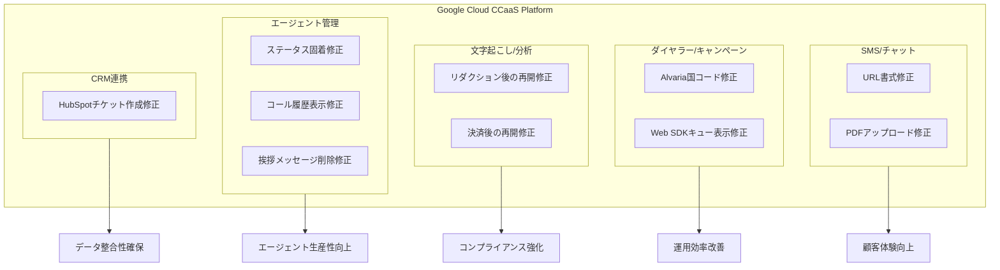

# Google Cloud Contact Center as a Service (CCaaS): 2026年5月バグ修正リリース

**リリース日**: 2026-05-26

**サービス**: Google Cloud Contact Center as a Service (CCaaS) / CCAI Platform

**機能**: 複数のバグ修正 (SMS/チャット、ダイヤラー、リアルタイム文字起こし、エージェントステータス、CRM連携)

**ステータス**: Fixed (修正済み)

[このアップデートのインフォグラフィックを見る](https://takech9203.github.io/google-cloud-news-summary/20260526-ccaas-bug-fixes-may-26.html)

## 概要

Google Cloud Contact Center as a Service (CCaaS) の2026年5月26日リリースでは、コンタクトセンター運用に影響を与える10件の重要なバグ修正が実施されました。修正対象は、SMS/チャットセッションにおけるURL書式やファイルアップロードの問題、アウトバウンドキャンペーンのダイヤラー動作、リアルタイム文字起こしとセンチメント分析の中断、エージェントのステータス固着、CRM連携のチケット作成失敗など、多岐にわたります。

これらの修正は、Google Cloud のフルスタック型オムニチャネルコンタクトセンタープラットフォームである CCAI Platform の安定性と信頼性を大幅に向上させるものです。特に、エージェントが通話中ステータスから抜け出せなくなる問題や、決済処理後にリアルタイム文字起こしが再開しない問題は、コンタクトセンターの生産性と顧客体験に直接的な悪影響を及ぼしていたため、今回の修正は運用効率の改善に大きく貢献します。

**アップデート前の課題**

- SMSチャットセッションでMicrosoft WordからコピーしたURLが隣接テキストと結合し、リンクが正常に機能しなかった
- Alvariaキャンペーンのダイヤラーが@COUNTRYCODEフィールドの国コードを正しく使用せず、誤った番号にダイヤルされていた
- IVR決済カード収集時にリダクションを有効/無効にした後、リアルタイム文字起こしが再開しなかった
- エージェントがチャットセッションでPDFファイルをアップロードできなかった
- 通話終了直後にコール履歴にアクセスするとエラーや空の詳細が表示された
- エージェントが通話中ステータスに固着し、新しいインタラクションを処理できなかった
- デフォルト挨拶メッセージの削除が永続化されなかった
- Web SDKでキュー間のスケジュール通話画面が混在した
- 決済バーチャルタスクアシスタント使用後にリアルタイム文字起こしとセンチメント分析が復旧しなかった
- HubSpotチケット作成がCRMアカウント作成スキップ設定時に失敗した

**アップデート後の改善**

- SMSチャットでのURL書式が正しく保持され、リンクが正常に機能するようになった
- Alvariaキャンペーンで国コードが正しく適用され、正確な番号にダイヤルされるようになった
- リダクション設定変更後もリアルタイム文字起こしが自動的に再開するようになった
- チャットセッションでのPDFファイルアップロードが正常に動作するようになった
- 通話終了後のコール履歴が即座に正しく表示されるようになった
- エージェントのステータス管理が正常化し、インタラクション間の遷移がスムーズになった
- 設定変更の永続化が確実に行われるようになった
- Web SDKでキューごとのスケジュール画面が正しく表示されるようになった
- 決済処理後の文字起こしとセンチメント分析が自動再開するようになった
- HubSpot連携でのチケット作成が設定に関わらず正常に動作するようになった

## アーキテクチャ図

この図は、今回の修正が CCaaS プラットフォームの5つの主要領域にわたり、それぞれが異なるビジネス価値に貢献することを示しています。

## サービスアップデートの詳細

### カテゴリ1: SMS/チャットセッションの修正

1. **Microsoft Word からのURL書式修正**
   - 問題: Microsoft Word からSMSチャットセッションにURLをコピーペーストすると、不正な書式が適用され、リンクが隣接テキストと結合していた
   - 影響: エージェントが顧客にリンクを共有する際、クリック不能なリンクが送信されていた
   - 修正: URLの解析ロジックが改善され、Word固有の書式情報が正しく除去されるようになった

2. **PDFファイルアップロード修正**
   - 問題: エージェントがチャットセッション中にPDFファイルをアップロードできなかった
   - 影響: ドキュメント共有が必要な顧客サポートシナリオ (契約書、請求書、マニュアルなど) で業務が滞っていた
   - 修正: ファイルアップロードハンドラーがPDF MIMEタイプを正しく処理するよう修正された

### カテゴリ2: ダイヤラー/キャンペーンの修正

3. **Alvaria キャンペーン国コード修正**
   - 問題: Alvaria キャンペーンのダイヤラーが @COUNTRYCODE フィールドから国コードを正しく取得せず、連絡先番号の選択時に誤った番号をダイヤルしていた
   - 影響: アウトバウンドキャンペーンで国際電話が正しく発信されず、コンタクト率が低下していた
   - 修正: ダイヤラーのフィールドマッピングロジックが修正され、@COUNTRYCODEフィールドが正しく参照されるようになった

4. **Web SDK スケジュール通話画面修正**
   - 問題: あるキューでコールをスケジュールすると、別のキューのリスケジュール画面が誤って表示されていた
   - 影響: エージェントのスケジュール管理に混乱が生じ、顧客への折り返し通話が誤ったキューで処理される可能性があった
   - 修正: Web SDKのキューコンテキスト管理が修正され、各キューのスケジュール画面が独立して表示されるようになった

### カテゴリ3: リアルタイム文字起こし/センチメント分析の修正

5. **IVR決済カード収集後の文字起こし再開修正**
   - 問題: エージェントがIVR決済カード収集中にリダクション (マスキング) を有効にした後、無効に戻しても、リアルタイム文字起こしが再開しなかった
   - 影響: 決済処理後の通話内容が記録されず、コンプライアンス監査やQA評価に必要な記録が欠落していた
   - 修正: リダクションステート変更後の文字起こしセッション復旧ロジックが修正された

6. **決済バーチャルタスクアシスタント後の文字起こし/センチメント分析再開修正**
   - 問題: 人間のエージェントが決済バーチャルタスクアシスタントを呼び出してカード情報を収集した後、通話がエージェントに戻された際にリアルタイム文字起こしとセンチメント分析が再開しなかった
   - 影響: 決済処理後の顧客とのやり取りの感情分析が欠落し、顧客満足度の正確な把握ができなかった
   - 修正: バーチャルタスクアシスタントからの転送復帰時に文字起こしとセンチメント分析のセッションが自動的に再確立されるようになった

### カテゴリ4: エージェント管理の修正

7. **エージェントステータス固着修正**
   - 問題: エージェントが「通話中」ステータスに固着し、通話を終了したりステータスを変更したりできず、新しいインタラクションを処理できなかった
   - 影響: エージェントの生産性が大幅に低下し、手動でのステータスリセットや再ログインが必要だった。結果としてキュー待ち時間が増加していた
   - 修正: ステータス管理のステートマシンが修正され、通話終了時のクリーンアップが確実に実行されるようになった

8. **コール履歴表示修正**
   - 問題: エンドユーザーが通話終了直後にコール履歴にアクセスすると、エラーまたは空の詳細が表示された
   - 影響: 顧客がセルフサービスで通話内容を確認しようとした際にフラストレーションが発生していた
   - 修正: コール履歴のデータ同期タイミングが改善され、通話終了後即座に正しい情報が表示されるようになった

9. **デフォルト挨拶メッセージ削除の永続化修正**
   - 問題: 言語のデフォルト挨拶メッセージを削除しても、変更が永続化されなかった
   - 影響: 管理者が設定変更を行っても元に戻ってしまい、不要なメッセージが顧客に表示され続けていた
   - 修正: 設定変更のデータベース書き込みロジックが修正され、削除操作が正しく永続化されるようになった

### カテゴリ5: CRM連携の修正

10. **HubSpot チケット作成修正**
    - 問題: 「CRMアカウント作成をスキップ」および「アカウントルックアップをスキップ」が有効な場合、HubSpotチケットの作成が失敗していた
    - 影響: HubSpot を CRM として使用している組織で、顧客インタラクションのチケット記録が作成されず、フォローアップが漏れる可能性があった
    - 修正: CRM連携のチケット作成ロジックが、アカウント作成/ルックアップのスキップ設定と独立して動作するよう修正された

## 技術仕様

### 修正対象コンポーネント一覧

| カテゴリ | 修正件数 | 影響範囲 | 重要度 |
|----------|----------|----------|--------|
| SMS/チャット | 2件 | デジタルチャネル全般 | 中 |
| ダイヤラー/キャンペーン | 2件 | アウトバウンド運用 | 高 |
| 文字起こし/分析 | 2件 | AI機能、コンプライアンス | 高 |
| エージェント管理 | 3件 | エージェントデスクトップ | 高 |
| CRM連携 | 1件 | HubSpot連携 | 中 |

### 関連するプラットフォーム機能

| 機能 | 説明 | 修正との関連 |
|------|------|--------------|
| Agent Assist | AIによるリアルタイムエージェント支援 | 文字起こし/センチメント分析の修正 |
| Virtual Task Assistant | 決済処理などの自動化タスク | 決済後の転送復帰処理の修正 |
| Alvaria Integration | アウトバウンドキャンペーン管理 | ダイヤラーの国コード処理修正 |
| Web SDK | 組み込み型コンタクトセンター | スケジュール画面のキュー管理修正 |
| CRM Connector | HubSpot/Salesforce連携 | チケット作成ロジックの修正 |

## 対応方法

### 前提条件

1. Google Cloud CCaaS のアクティブなインスタンスを保有していること
2. CCAI Platform ポータルへの管理者アクセス権があること

### 手順

#### ステップ 1: アップデートの適用確認

本修正はプラットフォーム側で自動的に適用されます。個別のアクションは不要ですが、以下の手順で修正が反映されていることを確認できます。

1. CCAI Platform ポータルにログイン
2. Settings > System Information でプラットフォームバージョンを確認
3. 2026年5月26日以降のバージョンであることを確認

#### ステップ 2: 動作確認

各修正項目について、以下の観点で動作確認を実施することを推奨します:

- SMSチャットでのURLコピーペーストテスト
- Alvariaキャンペーンの国際番号ダイヤルテスト
- IVR決済フロー後の文字起こし確認
- エージェントステータス遷移の確認
- HubSpotチケット作成の確認

## メリット

### ビジネス面

- **顧客満足度の向上**: URL書式の修正やコール履歴の即時表示により、顧客体験が改善される
- **運用効率の改善**: エージェントステータスの固着が解消されることで、エージェントの稼働率が向上し、キュー待ち時間が短縮される
- **アウトバウンドキャンペーンの精度向上**: 国コードが正しく適用されることで、コンタクト率が改善される
- **コンプライアンスリスクの低減**: 決済処理後の文字起こし再開により、通話記録の完全性が確保される

### 技術面

- **プラットフォーム安定性の向上**: ステートマシンの修正によりエッジケースでのエラーが減少
- **データ整合性の確保**: CRM連携やコール履歴の修正により、データの一貫性が改善
- **AI機能の信頼性向上**: リアルタイム文字起こしとセンチメント分析の継続性が保証される
- **Web SDKの正確性向上**: キューコンテキストの適切な管理により、UIの整合性が改善

## デメリット・制約事項

### 制限事項

- 本修正は CCaaS プラットフォーム固有の問題に対する修正であり、カスタム統合やサードパーティプラグインに起因する類似の問題は対象外
- Alvaria 連携の修正は @COUNTRYCODE フィールドに正しい値が設定されていることが前提
- HubSpot 連携の修正は、HubSpot API の正常動作が前提

### 考慮すべき点

- 修正適用後、既存のワークアラウンド (手動でのステータスリセットスクリプトなど) が不要になる可能性があるため、運用手順の見直しを推奨
- 文字起こし再開の修正により、以前は記録されなかった通話部分が記録されるようになるため、データ保持ポリシーの確認を推奨

## ユースケース

### ユースケース 1: 金融機関のカード決済処理

**シナリオ**: 銀行のコンタクトセンターで、エージェントが顧客のクレジットカード情報を収集する際に、PCI-DSS準拠のためにバーチャルタスクアシスタントに処理を委譲し、完了後にエージェントに通話を戻すフロー。

**効果**: 決済処理完了後もリアルタイム文字起こしとセンチメント分析が自動的に再開されるため、通話全体のコンプライアンス記録と品質監視が途切れることなく維持される。QAチームは完全な通話記録に基づいて品質評価を実施できる。

### ユースケース 2: グローバル企業のアウトバウンドキャンペーン

**シナリオ**: 多国籍企業が Alvaria キャンペーンを使用して、複数の国の顧客にアウトバウンドコールを実施。各コンタクトレコードに @COUNTRYCODE フィールドで国コードを指定。

**効果**: ダイヤラーが各コンタクトの国コードを正しく適用するため、国際電話が正確に発信され、コンタクト率が向上する。不正な番号へのダイヤルによる通信コストの無駄も削減される。

### ユースケース 3: Eコマース企業のチャットサポート

**シナリオ**: Eコマース企業のサポートチームが、顧客とのSMSチャットで商品ページのURLや返品ポリシーのPDFを共有する業務フロー。

**効果**: Microsoft Word で管理しているURLリストからのコピーペーストが正しく機能し、PDFファイルのアップロードも可能になることで、エージェントはスムーズに顧客に情報を提供できる。

## 料金

本バグ修正リリースは CCaaS プラットフォームのメンテナンスアップデートとして提供されます。追加料金は発生しません。

### CCaaS 利用料金 (参考)

| 項目 | 詳細 |
|------|------|
| 料金体系 | エージェント数ベースのサブスクリプション |
| SLA | 月間稼働率 99.9% 以上 |
| 追加費用 | 本修正に関する追加費用なし |

## 利用可能リージョン

Google Cloud CCaaS は複数のリージョンで利用可能です。詳細な対応国およびリージョン情報は [CCAI Platform ロケーションページ](https://docs.cloud.google.com/contact-center/ccai-platform/docs/localities) を参照してください。

## 関連サービス・機能

- **Gemini Enterprise for CX**: CCaaS が統合される上位ソリューション。Dialogflow CX、Customer Experience Insights、Agent Assist を含む
- **Dialogflow CX**: バーチャルエージェントの構築に使用。今回の修正ではバーチャルタスクアシスタントとの転送処理が関連
- **Agent Assist**: リアルタイムのエージェント支援機能。文字起こしとセンチメント分析の修正が直接関連
- **HubSpot CRM 連携**: サードパーティCRM連携機能。チケット作成修正が該当
- **Alvaria Workforce Management**: アウトバウンドキャンペーン管理。ダイヤラーの国コード修正が該当

## 参考リンク

- [インフォグラフィック](https://takech9203.github.io/google-cloud-news-summary/20260526-ccaas-bug-fixes-may-26.html)
- [公式リリースノート](https://docs.cloud.google.com/release-notes#May_26_2026)
- [CCAI Platform ドキュメント](https://docs.cloud.google.com/contact-center/ccai-platform/docs)
- [CCaaS ソリューションページ](https://cloud.google.com/solutions/contact-center-as-a-service)
- [CCAI Platform SLA](https://cloud.google.com/terms/contact-center/ccai-platform/sla)

## まとめ

今回の Google Cloud CCaaS バグ修正リリースは、コンタクトセンター運用の5つの主要領域にわたる10件の修正を含み、エージェントの生産性、顧客体験、コンプライアンス対応を包括的に改善するものです。特にエージェントステータスの固着や決済処理後の文字起こし中断は、日常運用に直接的な影響を与える問題であったため、早急な対応が推奨されます。CCaaS をご利用の組織は、修正が正しく適用されていることを確認し、既存のワークアラウンドの見直しを行うことをお勧めします。

---

**タグ**: #GoogleCloud #CCaaS #CCAI-Platform #ContactCenter #BugFix #SMS #Chat #LiveTranscription #SentimentAnalysis #CRM #HubSpot #Alvaria #AgentManagement #WebSDK
