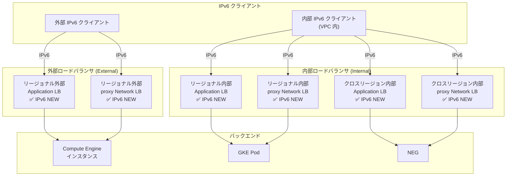

# Cloud Load Balancing: リージョナル/クロスリージョン ロードバランサにおける IPv6 フロントエンド構成サポート

**リリース日**: 2026-05-26

**サービス**: Cloud Load Balancing

**機能**: IPv6 フロントエンド構成 (Frontend configuration for IPv6 traffic)

**ステータス**: Preview

📊 [このアップデートのインフォグラフィックを見る](https://takech9203.github.io/google-cloud-news-summary/20260526-cloud-load-balancing-ipv6-frontend.html)

## 概要

Google Cloud は、リージョナルおよびクロスリージョンのロードバランサにおいて、受信 IPv6 トラフィックに対するフロントエンド構成のサポートを Preview として発表しました。これにより、従来はグローバル外部ロードバランサでのみ利用可能だった IPv6 フロントエンド (フォワーディングルール) が、リージョナルおよびクロスリージョンの複数のロードバランサタイプでも構成可能になります。

この機能は、IPv6 への移行を進める組織にとって重要なマイルストーンです。クライアントからロードバランサまでの IPv6 接続をリージョナルレベルで実現することで、デュアルスタックネットワーキングの導入がより柔軟になります。特に、内部ロードバランサでの IPv6 サポートは、組織内部のマイクロサービス間通信における IPv6 対応を加速させます。

対象ユーザーは、リージョナルロードバランサを使用しているネットワークエンジニア、IPv6 移行計画を進めているインフラストラクチャチーム、および内部通信での IPv6 導入を検討しているクラウドアーキテクトです。

**アップデート前の課題**

従来、IPv6 フロントエンド (フォワーディングルール) のサポートは限定的でした。

- IPv6 フロントエンドの構成は、グローバル外部 Application Load Balancer およびグローバル外部 proxy Network Load Balancer (Premium Tier) でのみサポートされていた
- リージョナル外部 Application Load Balancer やリージョナル外部 proxy Network Load Balancer では IPv6 フォワーディングルールが利用できず、IPv4 のみの対応だった
- 内部ロードバランサ (リージョナル内部、クロスリージョン内部) のフロントエンドは IPv4 アドレスのみをサポートしており、内部通信での IPv6 利用ができなかった
- IPv6 クライアントからのリージョナルロードバランサへの直接接続ができず、グローバルロードバランサを経由する必要があった

**アップデート後の改善**

今回のアップデートにより、以下のことが可能になりました。

- リージョナル外部 Application Load Balancer で IPv6 フロントエンドを構成し、IPv6 クライアントからのリージョナルトラフィックを直接受信できるようになった
- リージョナル内部およびクロスリージョン内部のロードバランサで IPv6 フロントエンドが利用可能になり、VPC 内部の IPv6 通信が実現した
- グローバルロードバランサを経由せずに、リージョナルレベルで IPv6 トラフィックを処理できるようになった
- デュアルスタック構成の選択肢が大幅に拡大し、段階的な IPv6 移行がより容易になった

## アーキテクチャ図



今回の Preview で IPv6 フロントエンドが新たにサポートされた 6 種類のロードバランサタイプと、それぞれが処理する外部/内部 IPv6 トラフィックの流れを示しています。

## サービスアップデートの詳細

### 主要機能

1. **IPv6 フロントエンド構成のサポート拡大**
   - 従来はグローバル外部ロードバランサのみだった IPv6 フォワーディングルールが、6 種類のリージョナル/クロスリージョンロードバランサに対応
   - フロントエンドの IP バージョンを IPv6 に設定するだけで、IPv6 トラフィックを受信可能

2. **対応ロードバランサタイプ**
   - Regional external Application Load Balancer (リージョナル外部アプリケーション LB)
   - Regional external proxy Network Load Balancer (リージョナル外部プロキシネットワーク LB)
   - Regional internal Application Load Balancer (リージョナル内部アプリケーション LB)
   - Regional internal proxy Network Load Balancer (リージョナル内部プロキシネットワーク LB)
   - Cross-region internal Application Load Balancer (クロスリージョン内部アプリケーション LB)
   - Cross-region internal proxy Network Load Balancer (クロスリージョン内部プロキシネットワーク LB)

3. **デュアルスタックネットワーキングの推進**
   - IPv4 と IPv6 の両方のフォワーディングルールを同一のロードバランサに構成可能
   - 段階的な IPv6 移行戦略をサポート
   - バックエンドへのトラフィックは IPv4/IPv6 いずれも選択可能 (IP address selection policy)

## 技術仕様

### IPv6 フロントエンド対応状況一覧

| ロードバランサタイプ | スキーム | IPv6 フロントエンド (従来) | IPv6 フロントエンド (今回) |
|------|------|------|------|
| Global external Application LB | EXTERNAL_MANAGED | 対応済み | 対応済み |
| Classic Application LB (Premium) | EXTERNAL | 対応済み | 対応済み |
| Regional external Application LB | EXTERNAL_MANAGED | 非対応 | **Preview** |
| Regional internal Application LB | INTERNAL_MANAGED | 非対応 | **Preview** |
| Cross-region internal Application LB | INTERNAL_MANAGED | 非対応 | **Preview** |
| Global external proxy Network LB | EXTERNAL_MANAGED | 対応済み | 対応済み |
| Classic proxy Network LB (Premium) | EXTERNAL | 対応済み | 対応済み |
| Regional external proxy Network LB | EXTERNAL_MANAGED | 非対応 | **Preview** |
| Regional internal proxy Network LB | INTERNAL_MANAGED | 非対応 | **Preview** |
| Cross-region internal proxy Network LB | INTERNAL_MANAGED | 非対応 | **Preview** |

### ネットワーク要件

| 項目 | 詳細 |
|------|------|
| VPC ネットワーク | カスタムモード VPC のみ (自動モード VPC は非対応) |
| サブネット | デュアルスタック (IPv4 + IPv6) に設定する必要あり |
| proxy-only サブネット | デュアルスタック構成が推奨 |
| IPv6 アクセスタイプ (外部 LB) | External |
| IPv6 アクセスタイプ (内部 LB) | Internal (ULA: fd20::/20 範囲) |
| ファイアウォールルール | IPv6 ソースレンジ 2600:2d00:1:b029::/64 を許可 |

## 設定方法

### 前提条件

1. カスタムモード VPC ネットワークが作成されていること
2. サブネットがデュアルスタック (IPv4 + IPv6) に設定されていること
3. proxy-only サブネットがデュアルスタック構成であること (Envoy ベースの LB の場合)
4. 適切なファイアウォールルールが構成されていること

### 手順

#### ステップ 1: サブネットのデュアルスタック化

```bash
# サブネットの IPv6 スタックタイプを有効化
gcloud compute networks subnets update SUBNET_NAME \
  --region=REGION \
  --stack-type=IPV4_IPV6 \
  --ipv6-access-type=EXTERNAL  # 外部 LB の場合
```

内部ロードバランサの場合は、VPC ネットワークに内部 IPv6 範囲を割り当てた上で `--ipv6-access-type=INTERNAL` を使用します。

#### ステップ 2: proxy-only サブネットのデュアルスタック化

```bash
# バックアップ proxy-only サブネットをデュアルスタックで作成
gcloud compute networks subnets create BACKUP_PROXY_ONLY_SUBNET_NAME \
  --purpose=REGIONAL_MANAGED_PROXY \
  --role=BACKUP \
  --region=REGION \
  --network=VPC_NETWORK_NAME \
  --range=BACKUP_PROXY_ONLY_SUBNET_RANGE \
  --stack-type=IPV4_IPV6

# バックアップサブネットをアクティブに昇格
gcloud compute networks subnets update BACKUP_PROXY_ONLY_SUBNET_NAME \
  --region=REGION \
  --role=ACTIVE \
  --drain-timeout=300s
```

proxy-only サブネットはリージョンごとに 1 つのみアクティブにできるため、バックアップ作成後に昇格させる手順が必要です。

#### ステップ 3: IPv6 ファイアウォールルールの作成

```bash
# IPv6 トラフィックを許可するファイアウォールルール
gcloud compute firewall-rules create fw-allow-lb-access-ipv6 \
  --network=NETWORK \
  --action=allow \
  --direction=ingress \
  --target-tags=allow-health-check-ipv6 \
  --source-ranges=2600:2d00:1:b029::/64 \
  --rules=all
```

#### ステップ 4: IPv6 フォワーディングルールの作成

```bash
# リージョナル外部 Application LB の IPv6 フォワーディングルール作成例
gcloud compute forwarding-rules create FORWARDING_RULE_NAME \
  --region=REGION \
  --load-balancing-scheme=EXTERNAL_MANAGED \
  --network=VPC_NETWORK_NAME \
  --subnet=SUBNET_NAME \
  --ip-version=IPV6 \
  --target-http-proxy=TARGET_HTTP_PROXY \
  --target-http-proxy-region=REGION \
  --ports=80
```

Cloud Console を使用する場合は、ロードバランサの Frontend configuration で「Add frontend IP and port」をクリックし、IP version を「IPv6」に設定します。

## メリット

### ビジネス面

- **IPv6 移行の柔軟性向上**: リージョナルロードバランサレベルでの IPv6 対応により、段階的かつリージョン単位での IPv6 移行が可能になり、移行リスクを最小化
- **コンプライアンス対応**: IPv6 対応を要求する政府機関や企業のコンプライアンス要件に、内部通信レベルでも対応可能
- **将来への準備**: IPv4 アドレス枯渇に備えたデュアルスタック戦略の実装が容易に

### 技術面

- **アーキテクチャの一貫性**: 内部/外部問わずすべてのプロキシベースロードバランサで IPv6 をサポートし、ネットワークアーキテクチャを統一
- **レイテンシ改善の可能性**: グローバルロードバランサを経由せず、リージョナルレベルで直接 IPv6 を終端できるため、特定のユースケースでレイテンシ削減が期待
- **マイクロサービス間 IPv6 通信**: 内部ロードバランサでの IPv6 サポートにより、サービスメッシュ内での IPv6 ネイティブ通信が実現

## デメリット・制約事項

### 制限事項

- 本機能は Preview ステータスであり、本番環境での使用は推奨されない (SLA の適用外)
- カスタムモード VPC のみ対応 (自動モード VPC やレガシーネットワークでは利用不可)
- サブネットをデュアルスタックに変更した後、IPv4 のみに戻すことはできない
- proxy-only サブネットのデュアルスタック化には、バックアップサブネットの作成と昇格という複雑な手順が必要

### 考慮すべき点

- IPv6 フロントエンドを使用する場合、対応するファイアウォールルールの追加が必要
- バックエンドサービスの IP address selection policy (Prefer IPv6 など) の適切な設定が必要
- 既存の IPv4 のみの構成からの移行には、サブネット変更やファイアウォールルールの更新が伴う
- Preview 期間中は機能変更や制限追加の可能性がある

## ユースケース

### ユースケース 1: 政府機関向け IPv6 対応 Web アプリケーション

**シナリオ**: 政府機関のコンプライアンス要件により IPv6 対応が必須だが、アプリケーションはリージョナルに展開する必要があるケース。従来はグローバル外部ロードバランサを使用する必要があったが、データローカリティ要件との両立が困難だった。

**実装例**:
```bash
# リージョナル外部 Application LB に IPv6 フロントエンドを追加
gcloud compute forwarding-rules create gov-app-ipv6-frontend \
  --region=asia-northeast1 \
  --load-balancing-scheme=EXTERNAL_MANAGED \
  --network=gov-vpc \
  --subnet=gov-subnet-dual-stack \
  --ip-version=IPV6 \
  --target-https-proxy=gov-app-https-proxy \
  --target-https-proxy-region=asia-northeast1 \
  --ports=443
```

**効果**: データを特定リージョンに留めつつ、IPv6 クライアントからの直接アクセスを実現。コンプライアンスとデータローカリティ要件の両方を満たせる。

### ユースケース 2: 内部マイクロサービス間の IPv6 通信

**シナリオ**: 大規模なマイクロサービスアーキテクチャにおいて、IPv4 プライベートアドレス空間が不足しつつある。内部ロードバランサで IPv6 を利用することで、アドレス空間の問題を解消したい。

**効果**: 内部 IPv6 アドレス (ULA: fd20::/20) を活用することで、事実上無制限のアドレス空間を確保。サービス間通信のスケーラビリティが大幅に向上する。

### ユースケース 3: マルチリージョン内部サービスの IPv6 統合

**シナリオ**: 複数リージョンに展開された内部サービスを、クロスリージョン内部ロードバランサで統合しつつ IPv6 ネイティブ通信を実現したい。

**効果**: クロスリージョン内部 Application/proxy Network LB の IPv6 フロントエンドにより、リージョン間の内部通信を IPv6 で統一し、ネットワーク設計を簡素化。

## 料金

Cloud Load Balancing の料金は、IPv6 フロントエンドの追加によって基本的に変更はありません。標準のロードバランサ料金が適用されます。

### 料金例

| 項目 | 月額料金 (概算) |
|--------|-----------------|
| フォワーディングルール (最初の 5 件) | 各 $0.025/時間 (約 $18/月) |
| 追加フォワーディングルール | 各 $0.01/時間 (約 $7.20/月) |
| データ処理料金 | $0.008 - $0.012/GB (リージョンにより異なる) |

注: IPv6 フォワーディングルールは追加のフォワーディングルールとしてカウントされます。Preview 期間中の料金については公式ドキュメントを確認してください。

## 利用可能リージョン

Preview 機能として提供されるため、利用可能なリージョンは段階的に拡大される可能性があります。詳細は公式ドキュメントを確認してください。リージョナルロードバランサは該当リージョンの VPC サブネットがデュアルスタック構成に対応している必要があります。

## 関連サービス・機能

- **VPC ネットワーク**: デュアルスタックサブネットの構成が前提条件。カスタムモード VPC が必要
- **Cloud Armor**: IPv6 フロントエンドと組み合わせた IPv6 ソースアドレスベースのセキュリティポリシー
- **Cloud DNS**: IPv6 アドレス (AAAA レコード) の DNS 解決
- **Proxy-only サブネット**: Envoy ベースのロードバランサで必要。デュアルスタック構成が推奨
- **Network Service Tiers**: 内部ロードバランサは Premium Tier で動作。外部リージョナル LB は Premium/Standard Tier の両方をサポート

## 参考リンク

- 📊 [インフォグラフィック](https://takech9203.github.io/google-cloud-news-summary/20260526-cloud-load-balancing-ipv6-frontend.html)
- [公式リリースノート](https://docs.google.com/release-notes#May_26_2026)
- [フォワーディングルールの概念](https://docs.cloud.google.com/load-balancing/docs/forwarding-rule-concepts)
- [IPv6 終端に関するドキュメント](https://docs.cloud.google.com/load-balancing/docs/ipv6)
- [Application LB のデュアルスタック変換](https://docs.cloud.google.com/load-balancing/docs/https/convert-applb-dualstack)
- [proxy Network LB のデュアルスタック変換](https://docs.cloud.google.com/load-balancing/docs/tcp/convert-proxynetlb-dualstack)
- [proxy-only サブネット](https://docs.cloud.google.com/load-balancing/docs/proxy-only-subnets#proxy_only_subnet_create)
- [Cloud Load Balancing 料金](https://cloud.google.com/vpc/network-pricing#lb)

## まとめ

今回の Preview リリースにより、Cloud Load Balancing の IPv6 フロントエンドサポートがリージョナルおよびクロスリージョンのロードバランサ 6 タイプに拡大されました。これは Google Cloud のデュアルスタックネットワーキング戦略における重要な進展であり、特に内部ロードバランサでの IPv6 対応は、大規模な VPC 環境での IPv4 アドレス空間の制約を解消する手段として有効です。Preview ステータスであるため、まずは開発・テスト環境での検証を推奨しますが、IPv6 移行計画を持つ組織は早期にこの機能を評価し、GA 時にスムーズに移行できるよう準備を進めることをお勧めします。

---

**タグ**: #CloudLoadBalancing #IPv6 #DualStack #Networking #Preview #ForwardingRule #ApplicationLoadBalancer #ProxyNetworkLoadBalancer #Regional #CrossRegion
