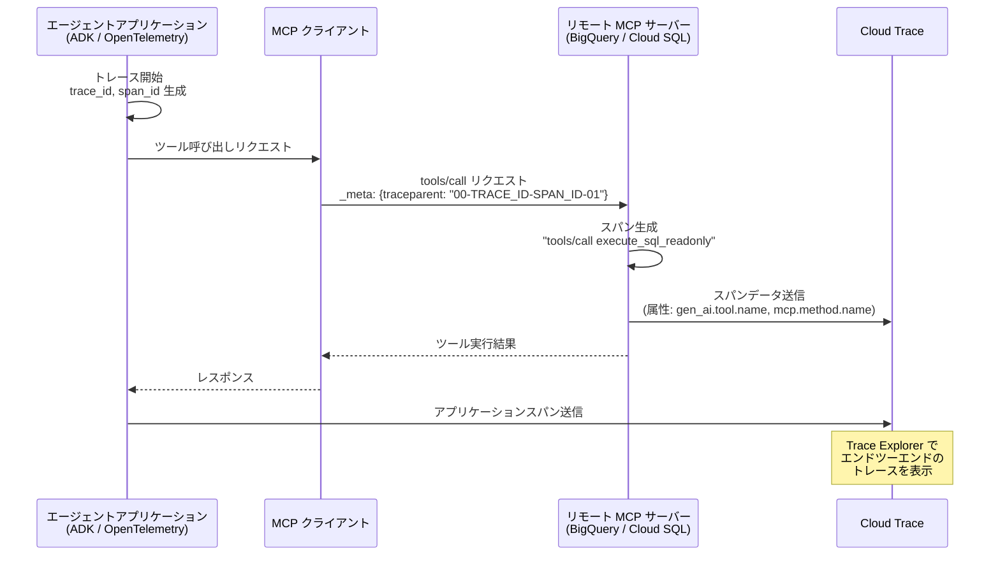

# Cloud Trace: リモート MCP サーバーの tools/call オペレーションに対するトレーススパン自動生成

**リリース日**: 2026-05-26

**サービス**: Cloud Trace

**機能**: リモート MCP サーバーによる tools/call トレーススパン自動生成

**ステータス**: GA (一般提供)

📊 [このアップデートのインフォグラフィックを見る](https://takech9203.github.io/google-cloud-news-summary/20260526-cloud-trace-mcp-server-spans.html)

## 概要

Google Cloud は、リモート MCP (Model Context Protocol) サーバーが `tools/call` オペレーションに対してトレーススパンを自動生成する機能をリリースしました。この機能により、エージェント型 AI アプリケーションが MCP サーバーを介して Google Cloud サービスを呼び出す際の動作を Cloud Trace で可視化・分析できるようになります。

今回のリリースノートでは、BigQuery と Cloud SQL の MCP サーバーがこのトレーススパン生成をサポートすることが発表されています。アプリケーション側で W3C Trace Context 標準に準拠したトレースコンテキストを MCP リクエストの `_meta` フィールドに含めることで、MCP サーバー側でスパンが生成され、Cloud Trace に送信されます。

この機能は、AI エージェントが外部ツールを呼び出す際のレイテンシ分析、エラー診断、ボトルネック特定を大幅に容易にするもので、エージェント型アプリケーションの本番運用において不可欠なオブザーバビリティ基盤を提供します。

**アップデート前の課題**

- AI エージェントが MCP サーバー経由で BigQuery や Cloud SQL を呼び出した際、ツール呼び出しの内部動作がブラックボックスであり、レイテンシの原因特定が困難だった
- エージェントの失敗原因がツール選択の誤りなのか、MCP サーバー側のエラーなのかを切り分けるための情報が不足していた
- MCP クライアント、ネットワーク、MCP サーバーのどこでレイテンシが発生しているかを判別する手段がなかった

**アップデート後の改善**

- BigQuery および Cloud SQL の MCP サーバーが `tools/call` に対してトレーススパンを自動生成し、Cloud Trace Explorer で可視化可能になった
- W3C Trace Context 標準に基づくトレースコンテキスト伝播により、エンドツーエンドの分散トレーシングが実現された
- OpenTelemetry Semantic Conventions for MCP に準拠したスパン命名規則 (`tools/call NAME`) により、フィルタリングや分析が容易になった

## アーキテクチャ図



この図は、エージェントアプリケーションが MCP サーバーを呼び出す際のトレースコンテキスト伝播フローを示しています。アプリケーションが生成したトレースコンテキストが `_meta` フィールドを通じて MCP サーバーに渡され、MCP サーバーが独自にスパンを生成して Cloud Trace に送信します。

## サービスアップデートの詳細

### 主要機能

1. **tools/call スパン自動生成**
   - リモート MCP サーバーが `tools/call` オペレーションを受信した際に、自動的にトレーススパンを生成
   - スパン名は OpenTelemetry Semantic Conventions for MCP に準拠した `tools/call NAME` 形式 (例: `tools/call execute_sql_readonly`)
   - 認証済み・認可済みリクエストに対してのみスパンが生成される

2. **W3C Trace Context による分散トレーシング**
   - MCP リクエストの `params._meta` フィールドに `traceparent` を含めることでトレースコンテキストを伝播
   - HTTP ヘッダーの `traceparent` でもコンテキスト伝播が可能
   - エージェントアプリケーションのスパンと MCP サーバーのスパンが同一トレース内で関連付けられる

3. **豊富なスパン属性**
   - `gen_ai.tool.name`: 呼び出された MCP ツール名
   - `mcp.method.name`: MCP オペレーション名 (`tools/call`)
   - `mcp.protocol.version`: 使用された MCP プロトコルバージョン
   - `error.message` / `error.type`: エラー発生時の詳細情報
   - `gcp.mcp.server.id`: MCP サーバーの URN

## 技術仕様

### サポート対象 MCP サーバー

| プロダクト | エンドポイント | MCP リファレンス |
|-----------|--------------|-----------------|
| BigQuery | `https://bigquery.googleapis.com/mcp` | [BigQuery MCP reference](https://docs.cloud.google.com/bigquery/docs/reference/mcp) |
| Cloud SQL | `https://sqladmin.googleapis.com/mcp` | [Cloud SQL MCP reference](https://docs.cloud.google.com/sql/docs/mysql/use-cloudsql-mcp) |

### スパン属性一覧

| 属性カテゴリ | 属性名 | 説明 |
|-------------|--------|------|
| リソース属性 | `cloud.account.id` | 課金プロジェクト ID |
| リソース属性 | `gcp.mcp.server.id` | MCP サーバーの URN |
| リソース属性 | `gcp.project_id` | テレメトリデータ送信先プロジェクト ID |
| スパン属性 | `gen_ai.operation.name` | 常に `execute_tool` |
| スパン属性 | `gen_ai.tool.name` | 呼び出されたツール名 |
| スパン属性 | `mcp.method.name` | MCP オペレーション名 |
| スパン属性 | `mcp.protocol.version` | MCP プロトコルバージョン |
| スコープ属性 | `gcp.server.service` | MCP サーバーサービス名 (例: `bigquery.googleapis.com`) |

### トレースコンテキストの形式

```json
{
  "jsonrpc": "2.0",
  "method": "tools/call",
  "params": {
    "name": "execute_sql_readonly",
    "arguments": {
      "project_id": "my-project",
      "sql": "SELECT * FROM dataset.table LIMIT 10"
    },
    "_meta": {
      "traceparent": "00-4bf92f3577b34da6a3ce929d0e0e4736-00f067aa0ba902b7-01",
      "tracestate": "gcp=project:my-project"
    }
  },
  "id": 1
}
```

## 設定方法

### 前提条件

1. Google Cloud プロジェクトで Cloud Trace API が有効化されていること
2. 対象の MCP サーバー API (BigQuery API または Cloud SQL Admin API) が有効化されていること
3. OpenTelemetry SDK またはトレースコンテキスト伝播をサポートするフレームワーク (ADK など) を使用していること

### 手順

#### ステップ 1: OpenTelemetry SDK のセットアップ (Python の例)

```python
from opentelemetry import trace
from opentelemetry.sdk.trace import TracerProvider
from opentelemetry.sdk.trace.export import BatchSpanProcessor
from opentelemetry.exporter.otlp.proto.grpc.trace_exporter import OTLPSpanExporter

# TracerProvider の設定
provider = TracerProvider()
processor = BatchSpanProcessor(
    OTLPSpanExporter(endpoint="https://telemetry.googleapis.com")
)
provider.add_span_processor(processor)
trace.set_tracer_provider(provider)
```

#### ステップ 2: MCP クライアントでのトレースコンテキスト伝播

```python
from opentelemetry import trace
from opentelemetry.trace.propagation.tracecontext import TraceContextTextMapPropagator

tracer = trace.get_tracer("my-agent-app")

with tracer.start_as_current_span("agent-tool-call") as span:
    # トレースコンテキストを抽出
    carrier = {}
    TraceContextTextMapPropagator().inject(carrier)
    
    # MCP リクエストに _meta フィールドとしてコンテキストを付与
    mcp_request = {
        "jsonrpc": "2.0",
        "method": "tools/call",
        "params": {
            "name": "execute_sql_readonly",
            "arguments": {"project_id": "my-project", "sql": "SELECT 1"},
            "_meta": {
                "traceparent": carrier.get("traceparent")
            }
        },
        "id": 1
    }
```

#### ステップ 3: Agent Development Kit (ADK) を使用する場合

```python
# ADK は OpenTelemetry 統合を内蔵しているため、
# 設定するだけでトレースコンテキストが自動的に伝播される
# 詳細: https://docs.cloud.google.com/stackdriver/docs/instrumentation/ai-agent-adk
```

#### ステップ 4: Trace Explorer でスパンを確認

```
Google Cloud Console > Trace > Trace Explorer
フィルタ: mcp.method.name = "tools/call"
```

## メリット

### ビジネス面

- **エージェント AI の本番運用信頼性向上**: MCP ツール呼び出しの成功率やレイテンシを定量的に測定・監視できるため、SLA/SLO の設定と維持が容易になる
- **障害対応時間の短縮**: ツール呼び出しの失敗原因を即座に特定できるため、MTTR (Mean Time To Resolution) を大幅に削減できる
- **コスト最適化**: レイテンシの高いツール呼び出しを特定し、クエリの最適化やアーキテクチャの改善につなげられる

### 技術面

- **エンドツーエンドの可視性**: エージェントアプリケーションから MCP サーバーまでの完全な分散トレースが得られる
- **標準規格準拠**: W3C Trace Context と OpenTelemetry Semantic Conventions for MCP に準拠しており、既存のオブザーバビリティスタックとの統合が容易
- **自動インストルメンテーション**: MCP サーバー側のスパン生成は自動的に行われるため、サーバー側のコード変更は不要

## デメリット・制約事項

### 制限事項

- `tools/call` オペレーションのみがスパンを生成する (他の MCP オペレーション `resources/read` や `prompts/get` などは対象外)
- MCP サーバーは単一のスパンのみを生成し、子スパンは生成しない (ツール内部の詳細な処理フローは追跡不可)
- W3C Trace Context 標準のみサポート (`X-Cloud-Trace-Context` ヘッダーは非サポート)
- `sampled` フラグが `1` に設定されている場合のみスパンが生成される

### 考慮すべき点

- トレースコンテキスト伝播をサポートするフレームワーク (ADK、OpenTelemetry Semantic Conventions for MCP 対応 SDK) の使用が推奨される
- 認証されていないリクエストや認可チェックに失敗したリクエストではスパンが生成されない場合がある
- スパン取り込み量の増加により Cloud Trace の費用が増加する可能性があるため、サンプリング戦略の検討が必要

## ユースケース

### ユースケース 1: エージェント AI アプリケーションのパフォーマンス分析

**シナリオ**: ADK (Agent Development Kit) で構築されたカスタマーサポートエージェントが、BigQuery MCP サーバーを使って顧客データを参照し、Cloud SQL MCP サーバーでサポートチケットを更新する。エンドユーザーから「応答が遅い」というフィードバックがあった場合に、ボトルネックを特定したい。

**実装例**:
```python
# ADK アプリケーションで OpenTelemetry を有効化
# トレースコンテキストは自動的に MCP サーバーに伝播される

# Trace Explorer でのフィルタ例:
# span_name: "tools/call execute_sql_readonly"
# gen_ai.tool.name: "execute_sql_readonly"
# duration > 2000ms
```

**効果**: BigQuery クエリの実行時間が 3 秒を超えていることが判明し、クエリの最適化 (パーティションプルーニングの追加) により応答時間を 70% 短縮できた。

### ユースケース 2: MCP ツール呼び出しエラーの根本原因分析

**シナリオ**: エージェントが特定のユーザーリクエストに対して Cloud SQL のツール呼び出しで断続的に失敗する。エラーが MCP クライアント側の問題なのか、Cloud SQL サーバー側の問題なのかを切り分けたい。

**効果**: `error.type` 属性と `error.message` 属性により、Cloud SQL インスタンスの接続プール枯渇が原因であることが特定され、`max_connections` パラメータの調整で解決できた。

### ユースケース 3: マルチサービスエージェントのトレース統合

**シナリオ**: 一つのエージェントが BigQuery でデータ分析を行い、その結果を Cloud SQL に書き込むワークフローを実行する。各ステップのレイテンシを一つのトレースとして把握し、全体のパフォーマンスバジェットを管理したい。

**効果**: 単一のトレース ID で BigQuery と Cloud SQL 両方のスパンが関連付けられ、ウォーターフォールビューで各ステップの所要時間を一目で確認でき、パフォーマンス SLO の遵守状況を継続的に監視できるようになった。

## 料金

Cloud Trace の料金は取り込まれたスパン数に基づきます。

### 料金例

| 使用量 | 月額料金 (概算) |
|--------|-----------------|
| 最初の 250 万スパン/月 | 無料 |
| 250 万 - 1 億スパン/月 | $0.20 / 100 万スパン |
| 1 億スパン超/月 | $0.02 / 100 万スパン |

※ MCP サーバーが生成するスパンも通常の Cloud Trace スパンとして課金対象になります。サンプリングレートの調整により費用を制御できます。

## 利用可能リージョン

Cloud Trace はグローバルサービスとして提供されており、すべての Google Cloud リージョンで利用可能です。BigQuery MCP サーバー (`bigquery.googleapis.com/mcp`) はグローバルエンドポイント、Cloud SQL MCP サーバー (`sqladmin.googleapis.com/mcp`) もグローバルエンドポイントとして提供されています。

## 関連サービス・機能

- **Cloud Logging**: MCP サーバーのログとトレーススパンを相関付けて分析可能
- **Cloud Monitoring**: トレーススパンの取り込み量や API エラー率を監視するアラートポリシーを設定可能
- **Agent Development Kit (ADK)**: OpenTelemetry 統合により、ADK アプリケーションから MCP サーバーへのトレースコンテキスト自動伝播をサポート
- **OpenTelemetry**: W3C Trace Context 標準と OpenTelemetry Semantic Conventions for MCP に基づくインストルメンテーション
- **BigQuery**: データ分析クエリの実行を MCP 経由で提供するリモートサーバー
- **Cloud SQL**: データベース操作を MCP 経由で提供するリモートサーバー

## 参考リンク

- 📊 [インフォグラフィック](https://takech9203.github.io/google-cloud-news-summary/20260526-cloud-trace-mcp-server-spans.html)
- [公式リリースノート](https://docs.cloud.google.com/release-notes#May_26_2026)
- [Investigate MCP calls using Trace ドキュメント](https://docs.cloud.google.com/stackdriver/docs/instrumentation/trace-remote-mcp-server-calls)
- [Monitor MCP tool use with Cloud Trace](https://docs.cloud.google.com/mcp/monitor-mcp-tool-use-with-cloud-trace)
- [Cloud Trace 概要](https://docs.cloud.google.com/trace/docs/overview)
- [Cloud Trace 料金](https://cloud.google.com/trace/pricing)
- [OpenTelemetry Semantic Conventions for MCP](https://opentelemetry.io/docs/specs/semconv/gen-ai/mcp)

## まとめ

今回のアップデートにより、BigQuery と Cloud SQL のリモート MCP サーバーが `tools/call` オペレーションのトレーススパンを自動生成するようになり、エージェント型 AI アプリケーションのオブザーバビリティが大幅に向上しました。ADK や OpenTelemetry を活用したアプリケーションでは、トレースコンテキストの伝播設定を行うだけで、MCP ツール呼び出しのパフォーマンスとエラーを Cloud Trace で詳細に分析できます。エージェント AI を本番運用しているチームは、早期にこの機能を導入してオブザーバビリティ基盤を整備することを推奨します。

---

**タグ**: #CloudTrace #MCP #ModelContextProtocol #Observability #BigQuery #CloudSQL #OpenTelemetry #AgenticAI #DistributedTracing #W3CTraceContext
