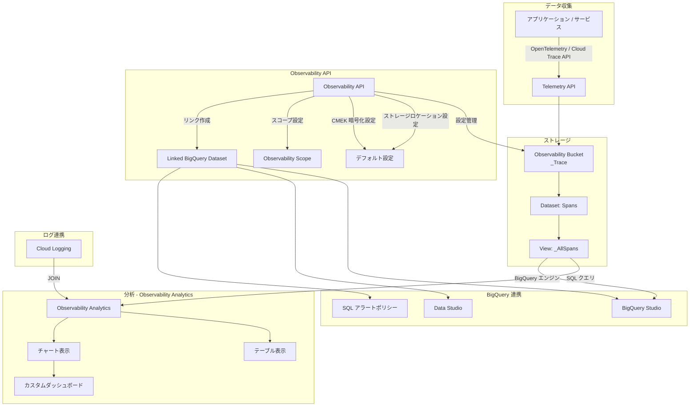

# Cloud Trace: Observability Analytics GA + Observability API GA

**リリース日**: 2026-05-26

**サービス**: Cloud Trace

**機能**: Observability Analytics GA + Observability API GA

**ステータス**: Generally Available (GA)

📊 [このアップデートのインフォグラフィックを見る](https://takech9203.github.io/google-cloud-news-summary/20260526-cloud-trace-observability-analytics-ga.html)

## 概要

Google Cloud は、Cloud Trace における Observability Analytics と Observability API の一般提供 (GA) を発表しました。Observability Analytics は SQL ベースのクエリインターフェースを提供し、トレースデータの集計分析、トレンドの特定、ログデータとの結合を可能にします。クエリ結果はテーブルやチャートとして可視化でき、カスタムダッシュボードへの保存も可能です。

Observability API は、オブザーバビリティバケットのデフォルトストレージロケーションや暗号化キーの設定、オブザーバビリティスコープの構成、BigQuery リンクデータセットの作成を API 経由で制御できるようにします。これにより、組織のコンプライアンス要件に対応したトレースデータ管理の自動化が実現します。

これらの GA リリースにより、SRE チーム、DevOps エンジニア、プラットフォームチームは、トレースデータをより柔軟かつ強力に分析・管理できるようになります。特に大規模なマイクロサービス環境において、パフォーマンス問題の根本原因分析やサービス間の依存関係の把握が大幅に効率化されます。

**アップデート前の課題**

- トレースデータの分析には Trace Explorer による個別トレースの参照が中心で、集計分析やトレンドの把握が困難だった
- トレースデータとログデータを結合して横断的に分析するには、手動でデータをエクスポートする必要があった
- トレースデータのストレージロケーションや暗号化設定をプログラマティックに管理する標準 API がなかった
- マルチプロジェクト環境でのトレースデータの一元管理が複雑だった

**アップデート後の改善**

- SQL を使用したトレースデータの集計分析、パターン検出、トレンド特定が直接可能になった
- Observability Analytics 上でトレースデータとログデータを JOIN して横断分析が可能になった
- クエリ結果のチャート化とカスタムダッシュボードへの保存が可能になった
- Observability API により、ストレージロケーション、CMEK 暗号化、スコープ設定をプログラマティックに管理できるようになった
- BigQuery リンクデータセットを通じて、他のビジネスデータとトレースデータの結合分析が可能になった

## アーキテクチャ図



この図は、トレースデータの収集からストレージ、Observability API による管理、Observability Analytics による分析、BigQuery 連携までの全体的なデータフローを示しています。

## サービスアップデートの詳細

### 主要機能

1. **Observability Analytics (SQL ベースのトレース分析)**
   - 標準 SQL を使用してトレースデータをクエリ・分析可能
   - `_Trace.Spans._AllSpans` ビューに対して直接 SQL クエリを実行
   - Query Builder インターフェースによるメニュー選択からのクエリ構築にも対応
   - システム定義クエリのロードと編集が可能
   - 複雑な JOIN、ネストクエリ、集計関数の使用が可能

2. **チャート作成とダッシュボード保存**
   - クエリ結果をテーブル、チャート、または両方で表示可能
   - チャートタイプの選択とカラム設定による可視化のカスタマイズ
   - 生成したチャートをカスタムダッシュボードに保存可能
   - ダッシュボード変数によるフィルタリングに対応

3. **トレース・ログデータの結合分析**
   - Observability Analytics 上でトレースデータとログデータを SQL JOIN で横断分析
   - BigQuery リンクデータセットを使用した他のビジネスデータとの結合
   - 集約分析によるサービス間のパターンとトレンドの特定

4. **Observability API による管理機能**
   - デフォルトストレージロケーションの設定 (組織、フォルダ、プロジェクト単位)
   - Cloud KMS キーによるデフォルト暗号化 (CMEK) の設定
   - オブザーバビリティスコープの構成 (マルチプロジェクトクエリ対応)
   - BigQuery リンクデータセットの作成と管理

5. **BigQuery エンジンでのクエリ実行**
   - BigQuery 予約スロットを使用したクエリ実行によるパフォーマンス向上
   - SQL ベースのアラートポリシーの作成
   - 他の BigQuery テーブルとのデータ結合

## 技術仕様

### 必要な IAM ロール

| 操作 | 必要なロール |
|------|-------------|
| Observability Analytics の使用 | `roles/observability.viewAccessor`, `roles/observability.analyticsUser`, `roles/logging.viewer` |
| チャートのダッシュボード保存 | `roles/monitoring.editor` |
| リンクデータセットの作成 | `roles/observability.editor`, `roles/bigquery.user`, `roles/logging.viewer` |
| BigQuery からのクエリ | `roles/bigquery.dataViewer` |

### オブザーバビリティバケットのサポートリージョン

| リージョン | ステータス |
|-----------|-----------|
| us-central1, us-east4, us-west1, us-west4 | 利用可能 |
| europe-west1, europe-west2, europe-west3, europe-west4, europe-west10, europe-west12 | 利用可能 |
| europe-north1, europe-central2, europe-southwest1 | 利用可能 |
| asia-east1, asia-northeast1, asia-southeast1, asia-south1 | 利用可能 |
| australia-southeast1 | 利用可能 |
| northamerica-northeast1 | 利用可能 |
| southamerica-east1 | 利用可能 |
| me-central2, me-west2 | 利用可能 |

### Observability API エンドポイント

```
projects.locations.scopes.get
projects.locations.scopes.patch
```

スコープのパスパラメータ形式:
```
projects/PROJECT_ID/locations/global/scopes/_Default
```

## 設定方法

### 前提条件

1. Cloud Trace API が有効化されたプロジェクト
2. 必要な IAM ロールの付与 (`roles/observability.viewAccessor`, `roles/observability.analyticsUser`)
3. トレースデータが `_Trace` オブザーバビリティバケットに存在すること

### 手順

#### ステップ 1: Observability Analytics でトレースデータをクエリ

Google Cloud Console で Observability Analytics ページにアクセスし、Views メニューから `_Trace.Spans._AllSpans` を選択してクエリを実行します。

```sql
SELECT
  span_name,
  service_name,
  COUNT(*) as span_count,
  AVG(duration) as avg_duration
FROM `_Trace.Spans._AllSpans`
WHERE timestamp > TIMESTAMP_SUB(CURRENT_TIMESTAMP(), INTERVAL 1 HOUR)
GROUP BY span_name, service_name
ORDER BY span_count DESC
LIMIT 100
```

#### ステップ 2: Observability API でデフォルト設定を構成

```bash
# デフォルトストレージロケーションの設定
gcloud beta observability settings update \
  --project=PROJECT_ID \
  --default-storage-location=us-central1

# オブザーバビリティスコープの取得
curl -X GET \
  "https://observability.googleapis.com/v1/projects/PROJECT_ID/locations/global/scopes/_Default" \
  -H "Authorization: Bearer $(gcloud auth print-access-token)"
```

#### ステップ 3: BigQuery リンクデータセットの作成

```bash
gcloud beta observability buckets datasets links create \
  projects/PROJECT_ID/locations/LOCATION/buckets/_Trace/datasets/Spans/links/LINK_ID \
  --dataset=Spans \
  --bucket=_Trace \
  --location=LOCATION \
  --project=PROJECT_ID
```

リンクデータセットを作成すると、BigQuery Studio や Data Studio からトレースデータをクエリしたり、他のビジネスデータと結合したりできるようになります。

## メリット

### ビジネス面

- **インシデント対応時間の短縮**: SQL による集計分析でパフォーマンス問題の根本原因を迅速に特定
- **コンプライアンス対応**: Observability API によるストレージロケーションと CMEK 暗号化の自動管理
- **運用コストの最適化**: トレースデータとビジネスデータの結合分析によるデータドリブンな意思決定

### 技術面

- **柔軟なデータ分析**: 標準 SQL による複雑な集計、結合、フィルタリングが可能
- **統合的な可視化**: チャート作成とダッシュボード保存によるモニタリングの一元化
- **プログラマティックな管理**: Observability API と gcloud CLI による Infrastructure as Code の実現
- **スケーラブルな分析**: BigQuery エンジンによる大規模データセットの高速処理

## デメリット・制約事項

### 制限事項

- オブザーバビリティバケットの変更や削除は不可
- データセットやビューの作成、削除、変更は不可
- Google Cloud Console からバケット、データセット、ビュー、リンクの一覧表示は不可
- Assured Workloads フォルダ内のプロジェクトでは、チャートをカスタムダッシュボードに表示不可
- ダッシュボードレベルのフィルタは SQL クエリから生成されたチャートには適用されない

### 考慮すべき点

- BigQuery エンジンでのクエリ実行には BigQuery の料金が適用される
- デフォルトクエリエンジンではスロットの競合により実行が遅延する場合がある
- リンクデータセットの作成は長時間実行オペレーションとなる
- Query Builder では JOIN を含む複雑なクエリを表現できないため、SQL エディタへの切り替えが必要

## ユースケース

### ユースケース 1: マイクロサービスのレイテンシ分析

**シナリオ**: 複数のマイクロサービスで構成されたアプリケーションにおいて、特定のエンドポイントのレイテンシが増加している原因を特定したい。

**実装例**:
```sql
SELECT
  service_name,
  span_name,
  APPROX_QUANTILES(duration, 100)[OFFSET(95)] as p95_latency,
  APPROX_QUANTILES(duration, 100)[OFFSET(99)] as p99_latency,
  COUNT(*) as request_count
FROM `_Trace.Spans._AllSpans`
WHERE timestamp > TIMESTAMP_SUB(CURRENT_TIMESTAMP(), INTERVAL 24 HOUR)
GROUP BY service_name, span_name
HAVING p95_latency > 1000
ORDER BY p95_latency DESC
```

**効果**: サービス単位のレイテンシ分布を即座に把握し、ボトルネックとなっているサービスとスパンを特定できる。

### ユースケース 2: トレースとログの相関分析

**シナリオ**: エラーが発生したトレースに関連するログエントリを横断的に分析し、エラーパターンを特定したい。

**実装例**:
```sql
SELECT
  t.trace_id,
  t.span_name,
  t.status,
  l.severity,
  l.text_payload
FROM `_Trace.Spans._AllSpans` AS t
JOIN `_Default._AllLogs` AS l
  ON t.trace_id = l.trace
WHERE t.status.code = 2
  AND t.timestamp > TIMESTAMP_SUB(CURRENT_TIMESTAMP(), INTERVAL 1 HOUR)
LIMIT 100
```

**効果**: トレースとログを直接結合することで、エラーの文脈を迅速に把握し、根本原因の特定を加速できる。

### ユースケース 3: コンプライアンス要件に基づくストレージ管理

**シナリオ**: 組織のデータレジデンシー要件に従い、全プロジェクトのトレースデータを特定のリージョンに格納し、CMEK で暗号化したい。

**効果**: Observability API を使用して組織レベルでデフォルト設定を適用することで、新規プロジェクトでも自動的にコンプライアンス要件を満たすストレージ構成が適用される。

## 料金

Observability Analytics のデフォルトクエリエンジンを使用する場合、追加の BigQuery 料金は発生しません。ただし、以下の場合は追加コストが発生します。

| 項目 | 料金 |
|------|------|
| デフォルトクエリエンジンでの分析 | Cloud Trace の標準料金に含まれる |
| BigQuery エンジンでのクエリ実行 | BigQuery の分析料金が適用 |
| BigQuery リンクデータセット (ストレージ) | 追加のインジェスト・ストレージ料金なし |
| BigQuery Studio/API からのクエリ | BigQuery の分析料金が適用 |

詳細な料金情報は [Google Cloud Observability pricing](https://cloud.google.com/products/observability/pricing) を参照してください。

## 関連サービス・機能

- **Cloud Logging**: Observability Analytics でログデータとトレースデータを結合して横断分析が可能
- **BigQuery**: リンクデータセットを通じたトレースデータの高度な分析と他のデータとの結合
- **Cloud Monitoring**: チャートをカスタムダッシュボードに保存してモニタリングに活用
- **Cloud KMS**: オブザーバビリティバケットの CMEK 暗号化に使用
- **Telemetry API**: OpenTelemetry OTLP プロトコルによるトレースデータの取り込み
- **Trace Scopes**: マルチプロジェクト環境でのトレースデータの一元クエリ (同日 GA)

## 参考リンク

- 📊 [インフォグラフィック](https://takech9203.github.io/google-cloud-news-summary/20260526-cloud-trace-observability-analytics-ga.html)
- [公式リリースノート](https://docs.cloud.google.com/release-notes#May_26_2026)
- [Observability Analytics ドキュメント](https://docs.cloud.google.com/stackdriver/docs/observability/analytics)
- [チャート作成ガイド](https://docs.cloud.google.com/stackdriver/docs/observability/analytics-chart)
- [サンプル SQL クエリ](https://docs.cloud.google.com/stackdriver/docs/observability/analytics-samples)
- [BigQuery リンクデータセット](https://docs.cloud.google.com/trace/docs/analytics-query-linked-dataset)
- [Observability API 概要](https://docs.cloud.google.com/stackdriver/docs/reference/api-overview)
- [オブザーバビリティバケットのデフォルト設定](https://docs.cloud.google.com/stackdriver/docs/observability/set-defaults-for-observability-buckets)
- [オブザーバビリティスコープの構成](https://docs.cloud.google.com/stackdriver/docs/observability/scopes)
- [料金ページ](https://cloud.google.com/products/observability/pricing)

## まとめ

Cloud Trace の Observability Analytics と Observability API の GA リリースは、Google Cloud のオブザーバビリティ基盤における重要なマイルストーンです。SQL ベースの分析機能により、トレースデータの活用が個別トレースの参照から集計分析・トレンド把握へと大きく進化しました。SRE チームやプラットフォームチームは、まず Observability Analytics でトレースデータのクエリを試し、必要に応じて BigQuery リンクデータセットの作成やダッシュボードへのチャート保存を検討することを推奨します。

---

**タグ**: #CloudTrace #ObservabilityAnalytics #ObservabilityAPI #GA #SQL #BigQuery #モニタリング #オブザーバビリティ #トレース分析 #CMEK
