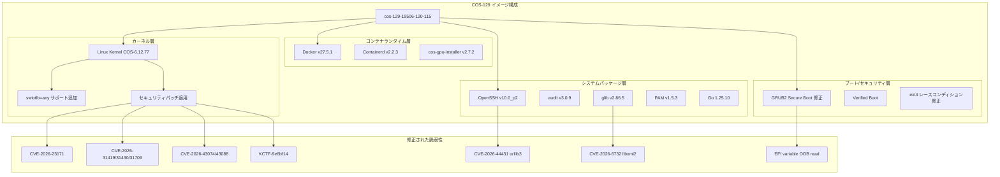

# Container Optimized OS: cos-129-19506-120-115 セキュリティおよびバグ修正アップデート

**リリース日**: 2026-05-26

**サービス**: Container Optimized OS

**機能**: cos-129-19506-120-115 security and bug fix update

**ステータス**: GA

📊 [このアップデートのインフォグラフィックを見る](https://takech9203.github.io/google-cloud-news-summary/20260526-container-optimized-os-cos-129-security.html)

## 概要

Google Cloud の Container Optimized OS (COS) Milestone 129 に対する重要なセキュリティおよびバグ修正アップデートがリリースされました。イメージバージョン cos-129-19506-120-115 では、Linux カーネルの複数の脆弱性修正、ブートプロセスの安定性向上、主要パッケージのアップグレードが含まれています。

本アップデートは、COS 129 LTS (Long Term Supported) チャネルに属するイメージであり、2028年3月までサポートが継続されます。COS は Chromium OS をベースとした最小構成のコンテナ実行環境であり、Google Kubernetes Engine (GKE) のデフォルトノード OS として広く利用されています。セキュリティを最優先に設計されており、今回のアップデートでは特に Linux カーネルの脆弱性に対する迅速な対応が行われています。

このアップデートは、GKE クラスタを運用する全てのユーザー、および Compute Engine 上で COS を直接使用してコンテナワークロードを実行しているユーザーに影響します。特に Secure Boot を有効にしている環境や、ext4 ファイルシステムのオンラインリサイズを行っている環境では、重要なバグ修正が含まれています。

**アップデート前の課題**

- Secure Boot 有効時に GRUB2 の configfile や source コマンドを使用するとクラッシュが発生していた
- ext4 オンラインリサイズ時のレースコンディションにより、ブート失敗が発生する可能性があった
- Linux カーネルに複数の未修正セキュリティ脆弱性 (CVE-2026-23171 等) が存在していた
- urllib3 および libxml2 に脆弱性が存在し、コンテナ環境のセキュリティリスクとなっていた
- OpenSSH が旧バージョンのままで、最新のセキュリティ修正が適用されていなかった

**アップデート後の改善**

- Secure Boot 環境での GRUB2 コマンド使用時のクラッシュが解消された
- ext4 オンラインリサイズに関するレースコンディションが修正され、ブートの信頼性が向上した
- Linux カーネルの 6 件の CVE および追加のセキュリティ修正が適用された
- urllib3、libxml2 の脆弱性が修正され、コンテナ実行環境の安全性が強化された
- OpenSSH v10.0_p2 へのアップグレードにより最新のセキュリティ対策が適用された
- swiotlb=any カーネルパラメータのサポートにより、I/O バウンスバッファリングの柔軟性が向上した

## アーキテクチャ図



COS-129 イメージの各層 (カーネル、コンテナランタイム、システムパッケージ、ブート/セキュリティ) に対して、今回のアップデートで適用されたセキュリティ修正とバグ修正の範囲を示しています。

## サービスアップデートの詳細

### 主要機能

1. **swiotlb=any カーネルコマンドラインパラメータのサポート追加**
   - Software I/O Translation Lookaside Buffer (SWIOTLB) の設定に `any` オプションが追加された
   - DMA バウンスバッファリングの割り当て戦略を柔軟に制御可能になった
   - 特に大容量メモリを搭載した VM や、特定のハードウェアアクセラレータを使用する環境で有用

2. **システムパッケージの更新**
   - `sys-process/audit` を v3.0.9 にアップデート: システム監査機能の改善
   - `glib` を v2.86.5 にアップデート: GNOME 基盤ライブラリの安定性向上
   - `sys-libs/pam` を v1.5.3 にアップデート: 認証モジュールのバグ修正
   - `net-misc/openssh` を v10.0_p2 にアップグレード: SSH 接続のセキュリティ強化

3. **GPU インストーラーのアップグレード**
   - cos-gpu-installer を v2.7.2 にアップグレード
   - GPU ワークロードの安定性と互換性が向上
   - GKE 上での機械学習ワークロード実行の信頼性が改善

### バグ修正

1. **GRUB2 Secure Boot クラッシュの修正**
   - Secure Boot が有効な環境で `configfile` または `source` GRUB2 コマンドを使用した際のクラッシュを修正
   - カスタムブート設定を使用する環境での起動信頼性が向上

2. **ext4 オンラインリサイズのレースコンディション修正**
   - ext4 ファイルシステムのオンラインリサイズによってトリガーされるレースコンディションを修正
   - この問題はブート失敗を引き起こす可能性があった
   - ディスクサイズ変更後の再起動の安定性が向上

### セキュリティ修正

1. **Linux カーネルの脆弱性修正**
   - CVE-2026-23171: カーネルメモリ管理の脆弱性
   - CVE-2026-31419, CVE-2026-31430, CVE-2026-31709: カーネルサブシステムの脆弱性
   - CVE-2026-43074, CVE-2026-43088: カーネルドライバの脆弱性
   - KCTF-9e6bf14: Kernel CTF で発見されたカーネルの脆弱性

2. **ユーザースペースライブラリの脆弱性修正**
   - CVE-2026-44431 (urllib3): HTTP クライアントライブラリの脆弱性
   - CVE-2026-6732 (libxml2): XML パーサーの脆弱性

3. **ブートローダーの脆弱性修正**
   - EFI variable の Out-of-Bounds Read: GRUB の設定パース時に発生する OOB 読み取りの修正

4. **Go ランタイムの更新**
   - dev-lang/go を 1.25.10 にアップデートし、複数の CVE を修正

## 技術仕様

### イメージ構成

| 項目 | バージョン |
|------|------|
| イメージ名 | cos-129-19506-120-115 |
| カーネル | COS-6.12.77 |
| Docker | v27.5.1 |
| Containerd | v2.2.3 |
| OpenSSH | v10.0_p2 |
| Go | 1.25.10 |
| cos-gpu-installer | v2.7.2 |
| audit | v3.0.9 |
| glib | v2.86.5 |
| PAM | v1.5.3 |
| マイルストーン | 129 LTS |
| サポート期限 | 2028年3月 |

### セキュリティ修正一覧

| CVE/ID | 対象コンポーネント | 深刻度 |
|--------|-------------------|--------|
| CVE-2026-23171 | Linux kernel | High |
| CVE-2026-31419 | Linux kernel | Medium-High |
| CVE-2026-31430 | Linux kernel | Medium-High |
| CVE-2026-31709 | Linux kernel | Medium-High |
| CVE-2026-43074 | Linux kernel | Medium |
| CVE-2026-43088 | Linux kernel | Medium |
| CVE-2026-44431 | urllib3 | Medium |
| CVE-2026-6732 | libxml2 | High |
| EFI variable OOB read | GRUB2 | Medium |
| KCTF-9e6bf14 | Linux kernel | High |

## 設定方法

### 前提条件

1. Google Cloud プロジェクトが作成済みであること
2. `gcloud` CLI がインストールおよび認証済みであること
3. Compute Engine API が有効化されていること

### 手順

#### ステップ 1: 新しいイメージの確認

```bash
# COS 129 LTS の最新イメージを確認
gcloud compute images list --project cos-cloud --filter="family:cos-129-lts" --format="table(name,family,creationTimestamp)"
```

最新のイメージが `cos-129-19506-120-115` であることを確認します。

#### ステップ 2: 新規 VM インスタンスでの使用

```bash
# 新しい COS イメージで VM を作成
gcloud compute instances create my-cos-instance \
  --image-family=cos-129-lts \
  --image-project=cos-cloud \
  --zone=asia-northeast1-b \
  --machine-type=e2-medium
```

新規作成する VM は自動的に最新のイメージを使用します。

#### ステップ 3: GKE ノードプールの更新

```bash
# GKE ノードプールのイメージを更新
gcloud container clusters upgrade my-cluster \
  --node-pool=default-pool \
  --image-type=COS_CONTAINERD \
  --zone=asia-northeast1-b
```

GKE のノード自動アップグレードが有効な場合、メンテナンスウィンドウ内で自動的に更新されます。

#### ステップ 4: 既存 VM のイメージ更新

```bash
# 既存のインスタンスを停止してブートディスクを更新
gcloud compute instances stop my-cos-instance --zone=asia-northeast1-b

# 新しいイメージからディスクを作成して置換
gcloud compute disks create new-boot-disk \
  --image-family=cos-129-lts \
  --image-project=cos-cloud \
  --zone=asia-northeast1-b

# インスタンスのブートディスクを変更
gcloud compute instances set-disk-auto-delete my-cos-instance \
  --disk=my-cos-instance \
  --auto-delete \
  --zone=asia-northeast1-b
```

COS は自動更新機能を備えており、再起動のみで最新パッチが適用されます。

## メリット

### ビジネス面

- **セキュリティコンプライアンスの維持**: 複数の CVE 修正により、PCI DSS や SOC 2 などのコンプライアンス要件を満たし続けることが可能
- **運用リスクの低減**: ブート失敗やクラッシュの修正により、本番環境の安定稼働率が向上
- **サポート期間の長さ**: COS 129 LTS は 2028年3月までサポートされるため、長期的な運用計画に適合

### 技術面

- **カーネルセキュリティの強化**: 6件のカーネル CVE 修正と KCTF で発見された脆弱性の対応により、コンテナエスケープのリスクを低減
- **ブートプロセスの信頼性向上**: GRUB2 と ext4 の修正により、特にセキュアブート環境での起動安定性が大幅に改善
- **I/O パフォーマンスの柔軟性**: swiotlb=any パラメータにより、DMA バウンスバッファの割り当て戦略をワークロードに応じて最適化可能
- **最新のセキュリティプロトコル対応**: OpenSSH v10.0_p2 により最新の暗号化アルゴリズムと接続セキュリティを利用可能

## デメリット・制約事項

### 制限事項

- COS はパッケージマネージャを含まないため、追加ソフトウェアの直接インストールは不可 (コンテナ経由またはToolbox を使用)
- カーネルモジュールのカスタムビルドはサポートされない
- Google Cloud Platform 環境外での使用はサポート対象外
- イメージ更新にはインスタンスの再起動が必要

### 考慮すべき点

- ノードの再起動が必要なため、ワークロードの中断を最小化するためのメンテナンスウィンドウ計画が重要
- GKE のノード自動アップグレード機能を使用している場合、アップグレードのタイミングとサージ設定を確認すること
- swiotlb=any パラメータの使用は特定のワークロードでのみ有効であり、一般的なワークロードでは設定不要
- カスタム GRUB 設定を使用している環境では、アップデート後の動作確認を推奨

## ユースケース

### ユースケース 1: GKE クラスタのセキュリティパッチ適用

**シナリオ**: 金融系 SaaS を提供する企業が、PCI DSS コンプライアンス要件を満たすために、GKE クラスタのノード OS を最新のセキュリティパッチ適用済みバージョンに更新する必要がある。

**実装例**:
```bash
# ノードプールのアップグレードポリシーを設定
gcloud container node-pools update default-pool \
  --cluster=production-cluster \
  --zone=asia-northeast1-b \
  --max-surge-upgrade=1 \
  --max-unavailable-upgrade=0

# メンテナンスウィンドウを設定
gcloud container clusters update production-cluster \
  --zone=asia-northeast1-b \
  --maintenance-window-start=2026-05-27T02:00:00Z \
  --maintenance-window-end=2026-05-27T06:00:00Z \
  --maintenance-window-recurrence="FREQ=WEEKLY;BYDAY=SU"
```

**効果**: ゼロダウンタイムでセキュリティパッチが適用され、コンプライアンス要件を継続的に満たすことが可能。

### ユースケース 2: Secure Boot 環境でのカスタムブート設定

**シナリオ**: 機密データを扱うワークロードのために Secure Boot と Shielded VM を有効にした COS インスタンスを運用しているが、以前のバージョンでは GRUB2 のカスタム設定使用時にクラッシュが発生していた。

**実装例**:
```bash
# Shielded VM + Secure Boot で COS インスタンスを作成
gcloud compute instances create secure-cos-instance \
  --image-family=cos-129-lts \
  --image-project=cos-cloud \
  --zone=asia-northeast1-b \
  --shielded-secure-boot \
  --shielded-vtpm \
  --shielded-integrity-monitoring \
  --machine-type=n2-standard-4
```

**効果**: Secure Boot 環境での GRUB2 コマンド使用時のクラッシュが解消され、カスタムブート設定を安全に使用可能になった。

### ユースケース 3: GPU ワークロードの安定化

**シナリオ**: 機械学習の推論ワークロードを COS 上で実行しており、GPU ドライバのインストーラーに関連する問題が発生していた。

**効果**: cos-gpu-installer v2.7.2 へのアップグレードにより、GPU ドライバのインストールと運用の安定性が向上し、ML 推論パイプラインの信頼性が改善された。

## 料金

Container Optimized OS 自体の使用に追加料金は発生しません。

### 料金例

| 使用量 | 月額料金 (概算) |
|--------|-----------------|
| COS イメージ使用料 | 無料 (Compute Engine インスタンス料金のみ) |
| e2-medium (asia-northeast1) | 約 $25/月 |
| n2-standard-4 (asia-northeast1) | 約 $140/月 |
| GKE Standard クラスタ管理費 | $0.10/時 (約 $73/月) |

注: 料金は Compute Engine インスタンスおよび GKE クラスタの使用料に依存します。COS イメージ自体は無料で提供されます。

## 利用可能リージョン

Container Optimized OS イメージは、全ての Google Cloud リージョンおよびゾーンで利用可能です。イメージプロジェクト `cos-cloud` からグローバルに提供されています。

- x86 イメージファミリー: `cos-129-lts`
- Arm64 イメージファミリー: `cos-arm64-129-lts`

## 関連サービス・機能

- **Google Kubernetes Engine (GKE)**: COS は GKE のデフォルトノード OS であり、ノード自動アップグレード機能と連携して最新パッチが自動適用される
- **Compute Engine Shielded VM**: Secure Boot、vTPM、整合性モニタリングと組み合わせて使用することで、ブートプロセスからの完全なセキュリティチェーンを実現
- **Container Threat Detection**: Security Command Center と連携し、COS 上のコンテナランタイムの脅威をリアルタイムで検出
- **Binary Authorization**: コンテナイメージのデプロイ時の検証ポリシーと併用することで、信頼されたワークロードのみが COS 上で実行されることを保証

## 参考リンク

- 📊 [インフォグラフィック](https://takech9203.github.io/google-cloud-news-summary/20260526-container-optimized-os-cos-129-security.html)
- [公式リリースノート](https://docs.cloud.google.com/release-notes#May_26_2026)
- [Container Optimized OS ドキュメント](https://docs.cloud.google.com/container-optimized-os/docs)
- [COS Milestone 129 リリースノート](https://docs.cloud.google.com/container-optimized-os/docs/release-notes/m129)
- [COS セキュリティ概要](https://docs.cloud.google.com/container-optimized-os/docs/concepts/security)
- [料金ページ (Compute Engine)](https://cloud.google.com/compute/pricing)

## まとめ

今回の cos-129-19506-120-115 アップデートは、Linux カーネルの複数の CVE 修正、Secure Boot 環境でのクラッシュ修正、ext4 オンラインリサイズのレースコンディション修正など、セキュリティと安定性の両面で重要な改善を含んでいます。特に本番環境で COS 129 LTS を使用している全てのユーザーは、速やかにノードの更新を計画することを推奨します。GKE のノード自動アップグレード機能を有効にしている場合は、メンテナンスウィンドウ内で自動的に適用されますが、手動管理のインスタンスについてはイメージの更新と再起動を実施してください。

---

**タグ**: #ContainerOptimizedOS #COS #Security #BugFix #GKE #Kubernetes #LinuxKernel #CVE #SecureBoot #LTS
