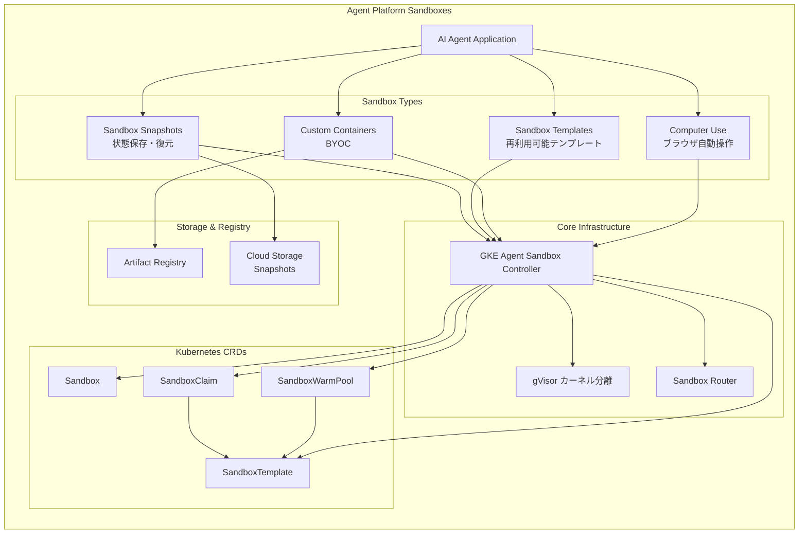

# Gemini Enterprise Agent Platform: Agent Platform Sandboxes

**リリース日**: 2026-05-26

**サービス**: Gemini Enterprise Agent Platform

**機能**: Agent Platform Sandboxes (Computer use, Custom containers, Templates, Snapshots)

**ステータス**: Preview

[このアップデートのインフォグラフィックを見る](https://takech9203.github.io/google-cloud-news-summary/20260526-gemini-agent-platform-sandboxes.html)

## 概要

Gemini Enterprise Agent Platform に、AI エージェントの実行環境を大幅に強化する 4 つの新しいサンドボックス機能が Preview として追加されました。これらの機能は、Computer use（ブラウザ自動操作）、Custom container sandboxes（独自コンテナ実行）、Sandbox templates（再利用可能なテンプレート）、Sandbox snapshots（環境スナップショット）で構成されています。

これらの機能は GKE Agent Sandbox をベースに構築されており、Kubernetes のカスタムリソース定義（CRD）を活用して、AI エージェントが安全に隔離された環境で信頼できないコードやタスクを実行できるようにします。gVisor によるカーネルレベルの分離と、サブ秒のプロビジョニングが特徴です。

対象ユーザーは、AI エージェントを構築・運用するエンジニア、ブラウザ操作の自動化を必要とする開発チーム、カスタムワークロードを安全に実行したいプラットフォームチームです。

**アップデート前の課題**

- AI エージェントがブラウザベースのタスクを自動化する際、セキュアな隔離環境が提供されていなかった
- カスタム依存関係を持つワークロードを実行するには、独自のインフラ構築が必要だった
- サンドボックス環境を毎回一から構築する必要があり、起動に時間がかかっていた
- 環境の状態を保存して後から復元する標準的な方法が存在しなかった

**アップデート後の改善**

- 隔離された Chrome ブラウザ環境内で、API または CDP 経由でブラウザを制御し、エージェントのタスク自動化が可能になった
- Artifact Registry にホストされたカスタムコンテナを持ち込み、専用の依存関係を持つワークロードを実行可能になった
- 事前ウォームされたプールに基づく再利用可能なテンプレートにより、1 秒未満での高速起動が実現した
- サンドボックスの完全な状態（依存関係とファイルシステムを含む）を保存し、新しいサンドボックスに復元可能になった

## アーキテクチャ図



この図は、Agent Platform Sandboxes の 4 つの機能がどのように GKE Agent Sandbox Controller を通じて Kubernetes CRD と連携し、Artifact Registry や Cloud Storage と統合されるかを示しています。

## サービスアップデートの詳細

### 主要機能

1. **Computer use（コンピュータ使用）**
   - AI エージェントが隔離された Web ブラウザ環境内でブラウザベースのタスクを自動化可能
   - API 経由またはChrome DevTools Protocol（CDP）を使用して直接ブラウザを制御
   - gVisor によるカーネルレベルの分離により、エージェントのブラウザ操作が安全に実行される
   - フォームの入力、Web スクレイピング、UI テストなどの自動化シナリオに対応

2. **Custom container sandboxes（カスタムコンテナサンドボックス）**
   - Bring Your Own Container（BYOC）により、独自のコンテナをサンドボックスとして実行可能
   - Artifact Registry にホストされた専用の依存関係を持つカスタムワークロードに対応
   - Google 提供のベースコンテナ（Standard / Slim）からの派生コンテナをサポート
   - 特殊な ML フレームワークやカスタムランタイムの安全な実行環境を提供

3. **Sandbox templates（サンドボックステンプレート）**
   - SandboxTemplate CRD を使用して、サンドボックスの仕様を再利用可能なテンプレートとして定義
   - SandboxWarmPool と連携し、事前ウォームされたインスタンスを常時稼働状態で維持
   - SandboxClaim によりテンプレートからサンドボックスを即座にプロビジョニング（1 秒未満）
   - ネットワークポリシー、リソース制限、セキュリティコンテキストを一元定義

4. **Sandbox snapshots（サンドボックススナップショット）**
   - サンドボックス環境の完全な状態（依存関係、ファイルシステム、実行中のプロセス状態）を保存
   - Cloud Storage に保存されたスナップショットから新しいサンドボックスを復元
   - PodSnapshotStorageConfig と PodSnapshotPolicy CRD で管理
   - ウォームプールと組み合わせることで「instant-on」能力を実現

## 技術仕様

### Kubernetes CRD 一覧

| CRD 名 | 用途 | API グループ |
|---------|------|-------------|
| Sandbox | 単一の隔離環境を表すプライマリリソース | agents.x-k8s.io/v1alpha1 |
| SandboxTemplate | 再利用可能なサンドボックス構成のブループリント | extensions.agents.x-k8s.io/v1alpha1 |
| SandboxClaim | テンプレートからのサンドボックスリクエスト | extensions.agents.x-k8s.io/v1alpha1 |
| SandboxWarmPool | 事前ウォームされたインスタンスプール | extensions.agents.x-k8s.io/v1alpha1 |
| PodSnapshotStorageConfig | スナップショットの保存先設定 | podsnapshot.gke.io/v1 |
| PodSnapshotPolicy | スナップショットのトリガーと保持ポリシー | podsnapshot.gke.io/v1 |

### クラスタ要件

| 項目 | 詳細 |
|------|------|
| GKE バージョン | 1.35.2-gke.1269000 以降 |
| ランタイム | gVisor（必須）、Kata Containers（オプション） |
| マシンタイプ | N2 推奨（スナップショットは E2 非対応） |
| モード | Autopilot / Standard 両対応 |

### SandboxTemplate の定義例

```yaml
apiVersion: extensions.agents.x-k8s.io/v1alpha1
kind: SandboxTemplate
metadata:
  name: python-runtime-template
  namespace: default
spec:
  podTemplate:
    metadata:
      labels:
        sandbox-type: python-runtime
    spec:
      runtimeClassName: gvisor
      automountServiceAccountToken: false
      securityContext:
        runAsNonRoot: true
      nodeSelector:
        sandbox.gke.io/runtime: gvisor
      tolerations:
        - key: "sandbox.gke.io/runtime"
          value: "gvisor"
          effect: "NoSchedule"
      containers:
        - name: runtime
          image: registry.k8s.io/agent-sandbox/python-runtime-sandbox:v0.1.0
          ports:
            - containerPort: 8888
          resources:
            requests:
              cpu: "250m"
              memory: "512Mi"
            limits:
              cpu: "500m"
              memory: "1Gi"
          securityContext:
            capabilities:
              drop: ["ALL"]
      restartPolicy: OnFailure
```

## 設定方法

### 前提条件

1. GKE クラスタ（バージョン 1.35.2-gke.1269000 以降）
2. Artifact Registry API および Kubernetes Engine API の有効化
3. `roles/container.admin` IAM ロール
4. gVisor 対応のノードプール

### 手順

#### ステップ 1: Agent Sandbox の有効化

```bash
# Autopilot クラスタの場合
gcloud beta container clusters create-auto ${CLUSTER_NAME} \
  --location=${LOCATION} \
  --cluster-version=${CLUSTER_VERSION} \
  --enable-agent-sandbox

# 既存クラスタの場合
gcloud beta container clusters update ${CLUSTER_NAME} \
  --location=${LOCATION} \
  --enable-agent-sandbox
```

Agent Sandbox アドオンが有効になり、コントローラーが自動的にデプロイされます。

#### ステップ 2: SandboxTemplate と WarmPool の作成

```bash
# テンプレートとウォームプールを一括適用
kubectl apply -f sandbox-template-and-pool.yaml
```

SandboxWarmPool で `replicas: 2` を指定すると、常に 2 つの事前起動済みインスタンスが待機します。

#### ステップ 3: SandboxClaim の作成

```bash
# サンドボックスをリクエスト
kubectl apply -f - <<EOF
apiVersion: extensions.agents.x-k8s.io/v1alpha1
kind: SandboxClaim
metadata:
  name: my-sandbox-claim
  namespace: default
spec:
  sandboxTemplateRef:
    name: python-runtime-template
EOF
```

ウォームプールがある場合、即座に事前起動済みの Pod が割り当てられます。

#### ステップ 4: スナップショットの設定（オプション）

```bash
# スナップショットストレージの設定
kubectl apply -f - <<EOF
apiVersion: podsnapshot.gke.io/v1
kind: PodSnapshotStorageConfig
metadata:
  name: snapshot-storage-config
spec:
  snapshotStorageConfig:
    gcs:
      bucket: "${BUCKET_NAME}"
---
apiVersion: podsnapshot.gke.io/v1
kind: PodSnapshotPolicy
metadata:
  name: snapshot-policy
  namespace: default
spec:
  storageConfigName: snapshot-storage-config
  selector:
    matchLabels:
      app: agent-sandbox-workload
  triggerConfig:
    type: manual
    postCheckpoint: resume
  snapshotGroupingRules:
    groupRetentionPolicy:
      maxSnapshotCountPerGroup: 2
EOF
```

Cloud Storage バケットにスナップショットが保存され、手動トリガーで実行されます。

## メリット

### ビジネス面

- **開発スピードの向上**: テンプレートとウォームプールにより、サンドボックスのプロビジョニングが 1 秒未満で完了し、エージェント開発のイテレーションサイクルが大幅に短縮
- **運用コストの削減**: スナップショットにより環境の再構築が不要になり、インフラの維持管理工数を削減
- **セキュリティコンプライアンス**: gVisor によるカーネルレベルの分離が標準化され、信頼できないコードの実行に関するセキュリティ要件を容易に達成

### 技術面

- **サブ秒プロビジョニング**: ウォームプールにより通常の Pod スケジューリングよりも大幅に高速（1 秒未満）な環境提供
- **宣言的 API**: Kubernetes ネイティブな CRD ベースの管理により、GitOps ワークフローとの統合が容易
- **プログラマティックアクセス**: Python SDK を通じて LangChain や Vertex AI Agentic SDK から直接サンドボックスを管理可能
- **Default Deny ネットワークポリシー**: サンドボックス内のコードが不正な内部ネットワークや GKE コントロールプレーンにアクセスすることを防止

## デメリット・制約事項

### 制限事項

- GKE バージョン 1.35.2-gke.1269000 以降が必要
- Pod スナップショットは E2 マシンタイプをサポートしていない（N2 または C3 を推奨）
- 現時点では Preview ステータスであり、本番環境での使用は SLA の対象外
- Kata Containers を使用する場合、Google のサポートと SLA は適用されない

### 考慮すべき点

- ウォームプールの常時稼働インスタンスはリソースコストが発生する
- スナップショットの保存には Cloud Storage の容量と料金が必要
- Autopilot クラスタではデフォルトで E2 ノードが使用されるため、スナップショット利用時は ComputeClass の設定が必要
- Computer use 機能ではブラウザ内のデータがエージェントに公開されるため、機密情報の取り扱いに注意が必要

## ユースケース

### ユースケース 1: AI エージェントによる Web タスクの自動化

**シナリオ**: カスタマーサポートの AI エージェントが、顧客の依頼に基づき社内ツールの Web UI を操作してチケットを作成・更新する。

**実装例**:
```python
from agentic_sandbox import SandboxClient

# サンドボックスを作成してブラウザを起動
client = SandboxClient()
sandbox = client.create(template="browser-automation-template")

# CDP 経由でブラウザを制御
cdp_session = sandbox.connect_cdp()
cdp_session.navigate("https://internal-tool.example.com")
cdp_session.click("#new-ticket-button")
cdp_session.fill("#description", ticket_description)
```

**効果**: セキュアな隔離環境内でブラウザ操作を行うため、エージェントが意図しないリソースにアクセスするリスクを排除しながら、Web ベースのタスクを自動化可能。

### ユースケース 2: ML モデルの安全な評価環境

**シナリオ**: データサイエンスチームが、カスタム依存関係を含む ML モデルの評価パイプラインをサンドボックス内で実行し、評価完了後に環境状態をスナップショットとして保存する。

**実装例**:
```yaml
apiVersion: extensions.agents.x-k8s.io/v1alpha1
kind: SandboxTemplate
metadata:
  name: ml-evaluation-template
spec:
  podTemplate:
    spec:
      runtimeClassName: gvisor
      containers:
        - name: ml-runtime
          image: us-docker.pkg.dev/my-project/ml-images/eval-runtime:latest
          resources:
            limits:
              cpu: "4"
              memory: "16Gi"
```

**効果**: カスタムコンテナにより独自の ML フレームワークを安全に実行でき、スナップショットにより評価環境を任意の時点に復元可能。実験の再現性が向上する。

### ユースケース 3: 開発環境の即時プロビジョニング

**シナリオ**: プラットフォームチームが開発者に対して、事前構成済みの開発環境をオンデマンドで 1 秒未満で提供する。

**効果**: ウォームプールとテンプレートの組み合わせにより、開発者は環境セットアップの待ち時間なく即座にコーディングを開始できる。スナップショットにより前日の作業状態から再開可能。

## 料金

Agent Sandbox 自体は GKE の追加料金なしで提供されます。

### 料金例

| リソース | 月額料金 (概算) |
|----------|-----------------|
| GKE クラスタ（Autopilot, e2-standard-4 相当） | 通常の GKE 料金に準拠 |
| N2 ノード（スナップショット対応） | Compute Engine の N2 料金に準拠 |
| Cloud Storage（スナップショット保存） | $0.020/GB/月（Standard） |
| ウォームプール常時稼働分 | Pod リソース使用量に応じた GKE 料金 |

※ Agent Sandbox のアドオン機能自体に追加課金はありません。通常の GKE リソース料金（Compute、Storage、Networking）が適用されます。

## 利用可能リージョン

GKE Agent Sandbox は GKE が利用可能な全リージョンで使用できます。ただし、Pod スナップショット機能は Preview 段階であり、特定のリージョンでの利用可能性が制限される場合があります。推奨リージョンは `us-central1` です。

## 関連サービス・機能

- **GKE Sandbox (gVisor)**: Agent Sandbox の基盤となるカーネルレベル分離技術
- **Artifact Registry**: カスタムコンテナイメージのホスティングに使用
- **Cloud Storage**: スナップショットバイナリの保存先
- **Vertex AI Agentic SDK**: Python から Agent Sandbox をプログラマティックに操作するためのインターフェース
- **Chrome DevTools Protocol (CDP)**: Computer use 機能でのブラウザ制御プロトコル
- **GKE Pod Snapshots**: サンドボックスの状態保存・復元の基盤技術

## 参考リンク

- [インフォグラフィック](https://takech9203.github.io/google-cloud-news-summary/20260526-gemini-agent-platform-sandboxes.html)
- [公式リリースノート](https://docs.cloud.google.com/release-notes#May_26_2026)
- [GKE Agent Sandbox コンセプト](https://docs.cloud.google.com/kubernetes-engine/docs/concepts/machine-learning/agent-sandbox)
- [Agent Sandbox セットアップガイド](https://docs.cloud.google.com/kubernetes-engine/docs/how-to/agent-sandbox)
- [Agent Sandbox の有効化](https://docs.cloud.google.com/kubernetes-engine/docs/how-to/how-install-agent-sandbox)
- [Pod スナップショット](https://docs.cloud.google.com/kubernetes-engine/docs/how-to/agent-sandbox-pod-snapshots)
- [Agent Sandbox GitHub リポジトリ](https://github.com/kubernetes-sigs/agent-sandbox/)
- [GKE 料金ページ](https://cloud.google.com/kubernetes-engine/pricing)

## まとめ

今回の Agent Platform Sandboxes アップデートは、AI エージェントの実行環境に関する包括的な機能強化であり、セキュリティ、パフォーマンス、柔軟性の全てを向上させます。特にウォームプールによる 1 秒未満のプロビジョニングとスナップショットによる状態保存・復元は、エージェントの実用化に向けた重要なマイルストーンです。AI エージェントの本格的な開発・運用を計画しているチームは、GKE クラスタでの Agent Sandbox 有効化を検討し、Preview 段階での評価を開始することを推奨します。

---

**タグ**: #GeminiEnterpriseAgentPlatform #AgentSandbox #GKE #ComputerUse #Containers #Snapshots #AI #Preview
