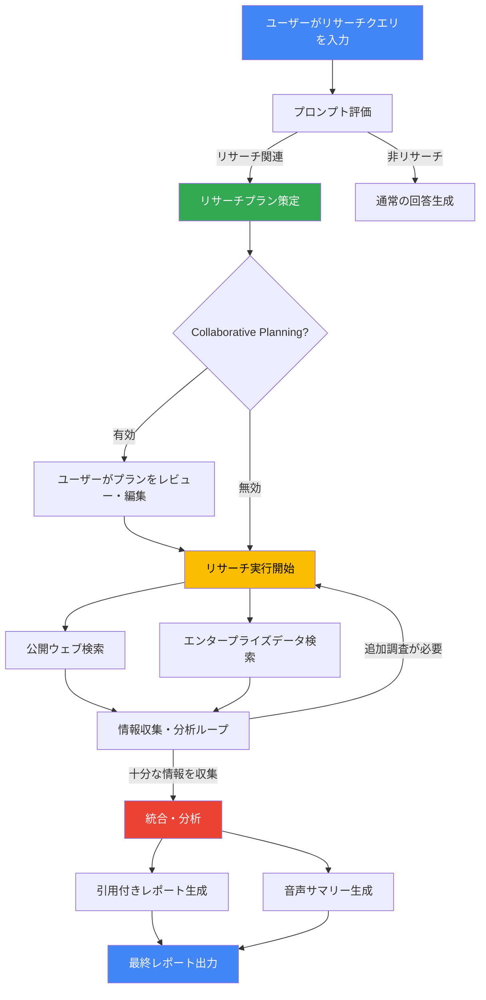

# Gemini Enterprise Agent Platform: Gemini Deep Research Agent

**リリース日**: 2026-05-26

**サービス**: Gemini Enterprise Agent Platform

**機能**: Gemini Deep Research Agent

**ステータス**: Preview

[このアップデートのインフォグラフィックを見る](https://takech9203.github.io/google-cloud-news-summary/20260526-gemini-deep-research-agent.html)

## 概要

Gemini Deep Research Agent が Preview として提供開始されました。これは Google が開発したマネージド AI エージェントであり、複雑なマルチステップのリサーチワークフローを自律的に計画、実行、統合し、包括的な引用付きレポートを生成します。公開ウェブとプライベートなエンタープライズデータの両方にアクセスして調査を行う点が大きな特徴です。

Deep Research Agent は、単なる検索エンジンや Q&A システムとは異なり、人間のリサーチアナリストのように振る舞います。ユーザーが調査テーマを入力すると、エージェントがまずリサーチプランを策定し、数百件の検索クエリを自律的に実行しながら情報を収集・分析し、最終的に引用付きの包括的レポートと音声サマリーを生成します。

本機能は Gemini Enterprise アプリ内のプリビルトエージェントとして提供されるほか、Interactions API や Discovery Engine API を通じてプログラマティックにアクセスすることも可能です。エンタープライズグレードのセキュリティとガバナンスの基盤の上に構築されており、組織のデータコネクタと連携してアクセス制御されたデータソースからも情報を取得できます。

**アップデート前の課題**

従来、企業内で複雑なリサーチを行う際には以下のような課題がありました。

- 複数の情報ソース (社内ドキュメント、外部ウェブ、データベース) を手動で横断的に調査する必要があり、数日から数週間のリサーチ期間が必要だった
- 公開情報と社内の機密データを統合的に分析するには、複数のツールやプロセスを組み合わせる必要があった
- リサーチ結果の引用元追跡やエビデンスの整理に多大な手作業が必要だった
- 情報の取りこぼしや網羅性の欠如により、意思決定の質にばらつきがあった

**アップデート後の改善**

Gemini Deep Research Agent の導入により、以下の改善が実現されます。

- 単一のプロンプトから自律的にリサーチプランを策定し、数百件の検索を実行してレポートを生成するため、リサーチ期間が数週間から数時間に短縮
- 公開ウェブとエンタープライズデータ (Google Drive、SharePoint、Confluence、Jira 等) を単一のエージェントで統合的に調査可能
- すべての情報に引用が自動付与され、エビデンスの追跡が容易になった
- Collaborative Planning 機能により、リサーチ開始前にプランをレビュー・編集でき、調査の方向性を制御可能

## アーキテクチャ図



Deep Research Agent は、ユーザーの入力を評価した後、自律的にリサーチプランを策定し、公開ウェブとエンタープライズデータの両方から情報を収集する反復的なループを実行します。十分な情報が収集されると統合・分析フェーズに移行し、引用付きレポートと音声サマリーを生成します。

## サービスアップデートの詳細

### 主要機能

1. **自律的リサーチプラン策定**
   - ユーザーのクエリを分析し、調査が必要なトピックを自動的に特定
   - マルチステップのリサーチ計画を策定し、研究の方向性を決定
   - Collaborative Planning を有効にすると、ユーザーがプランをレビュー・編集してから実行開始

2. **マルチソース情報収集**
   - Google Search を活用した公開ウェブからの情報収集
   - エンタープライズデータコネクタ経由でのアクセス制御された社内データへのアクセス
   - 対応コネクタ: Google Workspace (Drive, Calendar, Gmail)、Microsoft (OneDrive, Outlook, SharePoint)、ServiceNow、Jira、Confluence 等
   - 1 タスクあたり最大 80〜160 件の検索クエリを自律実行

3. **リアルタイムストリーミング**
   - リサーチの進行状況をリアルタイムでストリーミング表示
   - 調査中のトピックと回答が逐次的にユーザーに共有
   - Thinking Summaries 機能で中間推論ステップの可視化が可能

4. **包括的レポート生成**
   - 引用付きの構造化されたレポートを自動生成
   - 各情報にドキュメント ID、URI、タイトル、ドメインなどのメタデータを付与
   - 1〜2 分の音声サマリーを自動生成
   - ビジュアライゼーション (チャート・画像) の自動生成オプション

5. **API によるプログラマティックアクセス**
   - Interactions API (Gemini API) および Discovery Engine API でのアクセスが可能
   - バックグラウンド実行モードにより、長時間のリサーチタスクを非同期で処理
   - REST、Python SDK、JavaScript SDK に対応

## 技術仕様

### エージェント設定パラメータ

| パラメータ | 型 | デフォルト | 説明 |
|------|------|------|------|
| type | string | 必須 | `"deep-research"` を指定 |
| thinking_summaries | string | `"none"` | `"auto"` で中間推論ステップのストリーミングを有効化 |
| visualization | string | `"auto"` | `"auto"` でチャート・画像の自動生成を有効化 |
| collaborative_planning | boolean | `false` | `true` でリサーチ開始前のプランレビューを有効化 |

### モデルバリアント

| モデル | 用途 | 推定トークン使用量 |
|------|------|------|
| `deep-research-preview-04-2026` | 標準的なリサーチタスク | 入力 ~250k トークン、出力 ~60k トークン |
| `deep-research-max-preview-04-2026` | 深い競合分析やデューデリジェンス | 入力 ~900k トークン、出力 ~80k トークン |

### API リクエスト例 (Python)

```python
from google.cloud import discoveryengine_v1 as discoveryengine

# Interactions API を使用した Deep Research
agent_config = {
    "type": "deep-research",
    "thinking_summaries": "auto",
    "visualization": "auto",
    "collaborative_planning": False,
}

interaction = client.interactions.create(
    agent="deep-research-preview-04-2026",
    input="Research the competitive landscape of cloud GPUs.",
    agent_config=agent_config,
    background=True,
)
```

### Discovery Engine API を使用した例

```bash
# ステップ 1: リサーチセッションの開始
curl -X POST \
  -H "Authorization: Bearer $(gcloud auth print-access-token)" \
  -H "Content-Type: application/json" \
  -H "X-Goog-User-Project: PROJECT_ID" \
  "https://discoveryengine.googleapis.com/v1/projects/PROJECT_ID/locations/global/collections/default_collection/engines/APP_ID/assistants/default_assistant:streamAssist" \
  -d '{
    "query": { "text": "Research query here" },
    "agentsSpec": {
      "agentSpecs": { "agentId": "deep_research" }
    },
    "toolsSpec": {
      "vertexAiSearchSpec": {
        "dataStoreSpecs": {
          "dataStore": "projects/PROJECT_ID/locations/global/collections/default_collection/datastores/DATA_STORE_ID"
        }
      },
      "webGroundingSpec": {}
    }
  }'

# ステップ 2: リサーチの実行開始
curl -X POST \
  -H "Authorization: Bearer $(gcloud auth print-access-token)" \
  -H "Content-Type: application/json" \
  -H "X-Goog-User-Project: PROJECT_ID" \
  "https://discoveryengine.googleapis.com/v1/projects/PROJECT_ID/locations/global/collections/default_collection/engines/APP_ID/assistants/default_assistant:streamAssist" \
  -d '{
    "query": { "text": "Start Research" },
    "session": "SESSION_ID",
    "agentsSpec": {
      "agentSpecs": { "agentId": "deep_research" }
    },
    "toolsSpec": {
      "vertexAiSearchSpec": {
        "dataStoreSpecs": {
          "dataStore": "projects/PROJECT_ID/locations/global/collections/default_collection/datastores/DATA_STORE_ID"
        }
      },
      "webGroundingSpec": {}
    }
  }'
```

## 設定方法

### 前提条件

1. Gemini Enterprise のライセンス (Business、Standard、または Plus エディション) が有効であること。注意: Frontline エディションでは利用不可
2. Google Cloud プロジェクトが設定済みで、Gemini Enterprise Agent Platform API が有効化されていること
3. データコネクタが設定済みで、検索対象のデータストアがインデックス済みであること

### 手順

#### ステップ 1: コンソールからの利用

```text
1. Gemini Enterprise アプリのナビゲーションメニューから「Deep Research」を選択
2. 「Sources」をクリックし、リサーチに含めるデータソースを選択
   - Gemini Enterprise のデータソース (社内コネクタ)
   - Google Search (公開ウェブ) ※有効化されている場合
3. リサーチプロンプトを入力し「Submit」をクリック
4. リサーチプランを確認し「Start Research」をクリック
```

リサーチが関連性があると判断された場合、エージェントはリサーチプランを表示します。プランに問題がなければ「Start Research」をクリックして実行を開始します。

#### ステップ 2: API からの利用 (Interactions API)

```bash
# API キーの設定
export GEMINI_API_KEY="your-api-key"

# リサーチタスクの作成
curl -X POST "https://generativelanguage.googleapis.com/v1beta/interactions" \
  -H "Content-Type: application/json" \
  -H "x-goog-api-key: $GEMINI_API_KEY" \
  -d '{
    "input": "Research the competitive landscape of cloud GPUs.",
    "agent": "deep-research-preview-04-2026",
    "agent_config": {
      "type": "deep-research",
      "thinking_summaries": "auto",
      "visualization": "auto",
      "collaborative_planning": false
    },
    "background": true
  }'
```

バックグラウンド実行を有効にすることで、長時間のリサーチタスクを非同期的に処理し、完了後に結果を取得できます。

## メリット

### ビジネス面

- **リサーチ時間の大幅短縮**: 従来数日〜数週間かかっていた調査タスクを数時間に短縮。経営判断のスピードが向上
- **情報の網羅性向上**: 人間では見落としがちな情報源も含めて数百件の検索を自律実行するため、調査の網羅性が飛躍的に向上
- **コスト削減**: 専門リサーチャーやコンサルタントへの外注コストを削減。1 タスクあたり $1〜$7 で包括的なレポートを生成
- **ナレッジの民主化**: 専門知識がなくても、自然言語のプロンプトで高品質なリサーチレポートを取得可能

### 技術面

- **マネージドサービス**: インフラストラクチャの管理が不要。Google がエージェントのスケーリングと可用性を管理
- **エンタープライズデータ統合**: 既存のデータコネクタと連携し、アクセス制御を維持したまま社内データを活用
- **API ファースト設計**: REST API、Python SDK、JavaScript SDK に対応し、既存のワークフローへの組み込みが容易
- **ストリーミングレスポンス**: リサーチの進行状況をリアルタイムで確認でき、長時間タスクでもユーザー体験が良好

## デメリット・制約事項

### 制限事項

- Preview ステータスのため、本番環境での利用には注意が必要。SLA は適用されない可能性がある
- Gemini Enterprise Frontline エディションでは利用不可。Business、Standard、または Plus エディションが必要
- API アクセスは一般提供ではあるが許可リスト (allowlist) 制であり、事前申請が必要
- コストが可変であり、リサーチの深さに応じて 1 タスクあたり $1〜$7 の範囲で変動

### 考慮すべき点

- エージェントが自律的に判断するため、リサーチの方向性が期待と異なる場合がある。Collaborative Planning の活用を推奨
- 大規模なリサーチタスクではトークン使用量が 900k 以上になる場合があり、コスト管理に注意が必要
- Preview 期間中の料金体系は変更される可能性がある
- エンタープライズデータへのアクセスにはデータコネクタのセットアップとインデックス作成が事前に必要

## ユースケース

### ユースケース 1: 競合分析レポートの自動生成

**シナリオ**: 新規市場参入を検討している事業部門が、競合他社の製品戦略、価格設定、市場シェアについて包括的な分析を必要としている。

**実装例**:
```python
interaction = client.interactions.create(
    agent="deep-research-max-preview-04-2026",
    input="クラウドデータウェアハウス市場における主要プレイヤー "
          "(BigQuery, Snowflake, Databricks, Redshift) の機能比較、"
          "価格戦略、最新の製品アップデートを調査し、"
          "当社の戦略的ポジショニングへの示唆をまとめてください。",
    agent_config={
        "type": "deep-research",
        "thinking_summaries": "auto",
        "visualization": "auto",
        "collaborative_planning": True,
    },
    background=True,
)
```

**効果**: 従来 2〜3 週間かかっていた競合分析を数時間で完了。外部・内部の両方のデータソースから網羅的に情報を収集し、表形式の比較や視覚化を含む包括的レポートを自動生成。

### ユースケース 2: 社内ナレッジベースを活用した技術調査

**シナリオ**: エンジニアリングチームが新しいアーキテクチャ設計を検討する際に、社内の過去のポストモーテムレポート、設計ドキュメント、外部のベストプラクティスを統合的に調査したい。

**効果**: Google Drive や Confluence に蓄積された社内ドキュメントと公開ウェブの技術記事を横断的に検索し、過去の障害事例や成功事例を踏まえた上で最適なアーキテクチャパターンを提案するレポートを生成。

### ユースケース 3: 規制・コンプライアンス調査

**シナリオ**: 法務部門が新しい市場での事業展開に際して、各国の規制要件、データ保護法、業界固有のコンプライアンス要件を調査する必要がある。

**効果**: 複数の法域にまたがる規制情報を公開ソースから収集し、社内の既存ポリシードキュメントとの整合性を分析。引用付きの包括的な規制マッピングレポートを生成し、法務チームの意思決定を支援。

## 料金

Deep Research Agent の料金は従量課金制 (Pay-as-you-go) で、基盤となる Gemini モデルとエージェントが利用するツールに基づいて計算されます。通常のチャットリクエストとは異なり、1 つのリクエストが計画、検索、読み取り、推論の自律ループをトリガーするため、トークン使用量は大きくなります。

### 料金例

| モデル | 典型的な使用量 | 推定コスト (1 タスクあたり) |
|--------|-----------------|-----------------|
| deep-research-preview-04-2026 (標準) | ~80 検索クエリ、~250k 入力トークン (50-70% キャッシュ)、~60k 出力トークン | $1.00 〜 $3.00 |
| deep-research-max-preview-04-2026 (Max) | ~160 検索クエリ、~900k 入力トークン (50-70% キャッシュ)、~80k 出力トークン | $3.00 〜 $7.00 |

注意: これらは Preview 期間中の推定料金であり、変更される可能性があります。

## 利用可能リージョン

Deep Research Agent は Gemini Enterprise アプリ内のプリビルトエージェントとして提供され、以下のリージョンで利用可能です。

- **US/EU マルチリージョン**: DRZ (Data Residency Zone) および MLP (Multi-Layer Perimeter) サポート
- **グローバルリージョン**: Discovery Engine API 経由でのアクセスは global リージョンで利用可能
- **インカントリーリージョン (CA, IN)**: GA with allowlist として利用可能

注意: API (Interactions API) 経由でのアクセスは Google AI Studio および Gemini API を通じてグローバルに利用可能です。

## 関連サービス・機能

- **Gemini Enterprise Agent Platform**: Deep Research Agent をホストする基盤プラットフォーム。カスタムエージェントの作成・デプロイ・ガバナンスを提供
- **Agent Designer**: ノーコードでカスタムエージェントを作成するツール。Deep Research と組み合わせてワークフローを構築可能
- **Agent Development Kit (ADK)**: コードベースでカスタムエージェントを開発するフレームワーク。Deep Research の結果を入力として活用するエージェントの構築が可能
- **NotebookLM Enterprise**: 同じく Gemini Enterprise のプリビルトエージェント。リサーチ結果のさらなる深掘りやノートブック形式での整理に活用
- **Data Insights Agent**: BigQuery データに対する自然言語分析エージェント。Deep Research と組み合わせて定量・定性の両面からの分析が可能
- **Agent2Agent (A2A) Protocol**: 外部プラットフォームで構築されたエージェントとの相互運用を実現するオープンプロトコル

## 参考リンク

- [インフォグラフィック](https://takech9203.github.io/google-cloud-news-summary/20260526-gemini-deep-research-agent.html)
- [公式リリースノート](https://docs.cloud.google.com/release-notes#May_26_2026)
- [ドキュメント: Deep Research の使用方法](https://docs.cloud.google.com/gemini-enterprise-agent-platform/agents/use-deep-research)
- [Gemini Enterprise Agent Platform](https://cloud.google.com/gemini-enterprise/agents)
- [Gemini Enterprise FAQ](https://cloud.google.com/gemini-enterprise/faq)
- [料金ページ](https://cloud.google.com/products/gemini-enterprise-agent-platform/pricing)

## まとめ

Gemini Deep Research Agent は、エンタープライズにおけるリサーチワークフローを根本的に変革する可能性を持つマネージド AI エージェントです。公開ウェブと社内データの両方を活用した自律的なマルチステップリサーチにより、従来数週間かかっていた調査業務を数時間に短縮できます。Preview 段階ではありますが、競合分析、技術調査、規制コンプライアンス調査など幅広いユースケースに対応しており、早期検証を開始することを推奨します。

---

**タグ**: #GeminiEnterprise #AgentPlatform #DeepResearch #AI #ManagedAgent #Preview #EnterpriseAI #ResearchAutomation
