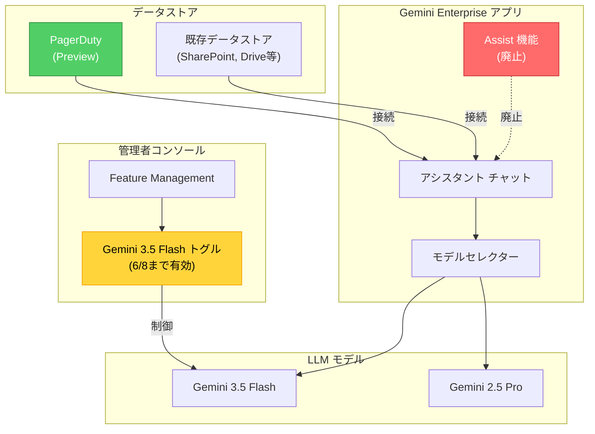

# Gemini Enterprise: Assist 廃止、PagerDuty データストア (Preview)、Gemini 3.5 Flash 管理者制御

**リリース日**: 2026-05-26

**サービス**: Gemini Enterprise

**機能**: Assist 廃止、PagerDuty データストア (Preview)、Gemini 3.5 Flash 管理者制御

**ステータス**: Mixed (Deprecated/Preview/Announcement)

📊 [このアップデートのインフォグラフィックを見る](https://takech9203.github.io/google-cloud-news-summary/20260526-gemini-enterprise-pagerduty-flash.html)

## 概要

今回のリリースでは Gemini Enterprise に関する 3 つの重要なアップデートが発表されました。第一に、Gemini Enterprise の assist 機能が廃止され、シャットダウンされました。第二に、PagerDuty データストアが Public Preview として利用可能になり、インシデント管理データを Gemini Enterprise に接続できるようになりました。第三に、Gemini 3.5 Flash に対する管理者トグル制御が導入されましたが、2026 年 6 月 8 日以降はデフォルトで有効化され無効化できなくなります。

これらのアップデートは、Gemini Enterprise を利用する組織の管理者およびエンドユーザーに直接影響します。特に assist 機能を利用していたユーザーは代替手段への移行が必要であり、また Gemini 3.5 Flash のトグル制御は期限付きのため、早急な対応計画が求められます。

**アップデート前の課題**

- Gemini Enterprise の assist 機能が独立した機能として提供されていたが、ドキュメント機能との重複があり、ユーザー体験が分散していた
- PagerDuty のインシデント管理データを Gemini Enterprise で直接検索・活用することができなかった
- 管理者が Gemini 3.5 Flash の利用を組織内で段階的に展開する制御手段がなかった

**アップデート後の改善**

- assist 機能が廃止され、Gemini Enterprise ドキュメント機能に一本化されることでユーザー体験が統一された
- PagerDuty データストアを接続することで、インシデント情報を Gemini Enterprise のアシスタントから直接検索・参照可能になった
- 管理者が Gemini 3.5 Flash の有効/無効を一時的に制御でき、段階的な展開が可能になった（6 月 8 日まで）

## アーキテクチャ図



この図は、今回のアップデートにおける 3 つの変更点を示しています。Assist 機能の廃止（赤）、PagerDuty データストアの追加（緑）、および管理者トグルによる Gemini 3.5 Flash の制御（黄）が Gemini Enterprise 全体のアーキテクチャにどのように関連しているかを表現しています。

## サービスアップデートの詳細

### 主要機能

1. **Gemini Enterprise assist 機能の廃止**
   - assist 機能が廃止（Deprecated）され、シャットダウンされました
   - 今後は Gemini Enterprise のドキュメント機能を直接利用する必要があります
   - assist 機能に依存していたワークフローは見直しが必要です

2. **PagerDuty データストア (Public Preview)**
   - PagerDuty のデータストアを Gemini Enterprise に接続可能になりました
   - インシデント情報、アラート履歴、オンコール情報などを Gemini Enterprise のアシスタントから検索・参照できます
   - Public Preview 段階のため、本番環境での利用には制限事項に注意が必要です

3. **Gemini 3.5 Flash 管理者トグル制御**
   - 管理者は Feature Management のトグルで Gemini 3.5 Flash の有効/無効を切り替え可能です
   - このトグルは Gemini Enterprise アプリのチャットボックスでの Gemini 3.5 Flash の表示/非表示を制御します
   - **重要: 2026 年 6 月 8 日以降、トグルは利用できなくなります**
   - 6 月 8 日以降、Gemini 3.5 Flash はデフォルトで有効となり、無効化できなくなります

## 技術仕様

### Feature Management 設定

| 項目 | 詳細 |
|------|------|
| 対象サービス | Gemini Enterprise |
| assist 機能 | 廃止・シャットダウン済み |
| PagerDuty データストア | Public Preview |
| Gemini 3.5 Flash トグル | 2026-06-08 まで有効 |
| 影響リージョン | Global、US、EU |

### Gemini 3.5 Flash トグルのタイムライン

| 日付 | 状態 |
|------|------|
| 2026-05-26 | トグル有効（管理者が制御可能） |
| 2026-06-08 | トグル廃止、Flash がデフォルト有効（無効化不可） |

### 管理者設定アクセス

```
Google Cloud コンソール
  → Gemini Enterprise ページ
    → アプリ名をクリック
      → Configurations
        → Feature Management タブ
```

## 設定方法

### 前提条件

1. Gemini Enterprise Admin ロール (`roles/discoveryengine.agentspaceAdmin`) が付与されていること
2. 既存の Gemini Enterprise Web アプリが作成済みであること
3. PagerDuty 接続の場合: Discovery Engine Editor ロール (`roles/discoveryengine.editor`) が必要

### 手順

#### ステップ 1: PagerDuty データストアの作成

```
1. Google Cloud コンソールで Gemini Enterprise ページに移動
2. ナビゲーションメニューから「Data stores」をクリック
3. 「Create data store」をクリック
4. Source セクションで「PagerDuty」を検索して選択
5. Data セクションで検索対象のエンティティを選択
6. Configuration セクションでリージョンとコネクタ名を設定
7. 「Create」をクリック
```

データストアの状態が「Creating」から「Active」に変わるまで待機します。

#### ステップ 2: データストアをアプリに接続

```
1. Google Cloud コンソールで Gemini Enterprise ページに移動
2. ナビゲーションメニューから「Apps」をクリック
3. 接続先のアプリを選択
4. ナビゲーションメニューから「Connected data sources」をクリック
5. 「Add existing data stores」をクリックして PagerDuty データストアを選択
6. 「Connect」をクリック
```

#### ステップ 3: Gemini 3.5 Flash トグルの確認・設定

```
1. Google Cloud コンソールで Gemini Enterprise ページに移動
2. アプリ名をクリック
3. 「Configurations」→「Feature Management」タブに移動
4. Model availability セクションで Gemini 3.5 Flash のトグルを確認
5. 必要に応じてオン/オフを切り替え
```

## メリット

### ビジネス面

- **インシデント対応の効率化**: PagerDuty データストア連携により、インシデント情報を自然言語で検索・要約でき、対応時間の短縮が期待できる
- **ユーザー体験の統一**: assist 機能の廃止によりインターフェースが簡素化され、エンドユーザーの混乱が軽減される
- **段階的な AI モデル展開**: 管理者トグルにより、組織の準備状況に応じて Gemini 3.5 Flash を段階的に展開可能

### 技術面

- **統合検索の強化**: PagerDuty のインシデントデータが Gemini Enterprise の統合検索パイプラインに組み込まれ、横断的な情報アクセスが可能
- **最新モデルの自動適用**: 6 月 8 日以降 Gemini 3.5 Flash がデフォルト化され、最新の推論性能が全ユーザーに提供される
- **管理負荷の軽減**: assist 機能の廃止により管理対象が減少し、運用がシンプルになる

## デメリット・制約事項

### 制限事項

- PagerDuty データストアは Public Preview のため、SLA は適用されない（Pre-GA Offerings Terms が適用）
- Gemini 3.5 Flash トグルは 2026 年 6 月 8 日以降利用不可となり、管理者による無効化ができなくなる
- assist 機能の廃止に伴い、既存のワークフローが破壊される可能性がある

### 考慮すべき点

- assist 機能を利用していた場合、ドキュメント機能への移行計画が必要
- PagerDuty 連携にはデータの同期頻度や対象エンティティの設計が重要
- 6 月 8 日までに Gemini 3.5 Flash の評価・検証を完了する必要がある
- PagerDuty のデータがセンシティブな情報を含む場合、アクセス制御の設計が必要

## ユースケース

### ユースケース 1: インシデント対応におけるコンテキスト検索

**シナリオ**: SRE チームがインシデント対応中に、過去の類似インシデントの対応履歴や関連するランブックを迅速に検索したい場合

**実装例**:
```
Gemini Enterprise チャットで:
「過去30日間のデータベース接続タイムアウトに関連するPagerDutyインシデントを要約してください」
```

**効果**: PagerDuty データストアを通じて過去のインシデント情報が即座に要約され、対応時間が短縮される

### ユースケース 2: 組織への Gemini 3.5 Flash の段階的ロールアウト

**シナリオ**: 大規模な組織で、まず特定の部門に Gemini 3.5 Flash を試験的に利用させ、問題がないことを確認してから全社展開したい場合

**効果**: 6 月 8 日までの期間を活用して、段階的な評価と展開が可能。ただし期限があるため迅速な意思決定が必要

## 料金

Gemini Enterprise の料金は既存のライセンス体系に基づきます。

### 料金例

| 項目 | 料金 |
|------|------|
| Gemini Enterprise ライセンス | Google Cloud の契約に基づく |
| PagerDuty データストア (Preview) | Preview 期間中は追加料金なし（正式リリース後に変更の可能性あり） |
| Gemini 3.5 Flash 利用 | Gemini Enterprise ライセンスに含まれる |

## 利用可能リージョン

- **Gemini 3.5 Flash**: Global、US、EU リージョンで利用可能（2026 年 5 月 19 日に GA）
- **PagerDuty データストア**: マルチリージョン（US、EU）で利用可能
- **Feature Management**: 全リージョンで利用可能

## アクションアイテム

> **重要: 2026 年 6 月 8 日の期限に注意**
>
> Gemini 3.5 Flash の管理者トグルは 2026 年 6 月 8 日に廃止されます。この日以降、Gemini 3.5 Flash はデフォルトで有効化され、管理者が無効化することはできなくなります。
>
> **推奨アクション:**
> 1. 6 月 8 日までに Gemini 3.5 Flash の組織内評価を完了する
> 2. 既存のポリシーやコンプライアンス要件との整合性を確認する
> 3. エンドユーザーへの周知を行う
> 4. assist 機能からの移行を完了する

## 関連サービス・機能

- **Gemini Enterprise Feature Management**: 管理者がアプリ機能の有効/無効を制御する機能
- **Gemini Enterprise データストア**: サードパーティデータソースを接続して統合検索を実現する機能
- **Gemini 3.5 Flash**: Google の最新軽量 LLM モデル、高速な推論が特徴
- **PagerDuty**: インシデント管理・オンコール管理プラットフォーム

## 参考リンク

- 📊 [インフォグラフィック](https://takech9203.github.io/google-cloud-news-summary/20260526-gemini-enterprise-pagerduty-flash.html)
- [公式リリースノート](https://docs.cloud.google.com/release-notes#May_26_2026)
- [Gemini Enterprise リリースノート](https://docs.cloud.google.com/gemini/enterprise/docs/release-notes)
- [データストア接続ドキュメント](https://docs.cloud.google.com/gemini/enterprise/docs/connectors/connect-existing-data-store)
- [Feature Management ドキュメント](https://docs.cloud.google.com/gemini/enterprise/docs/manage-web-app-features)

## まとめ

今回の Gemini Enterprise アップデートは、機能の整理統合（assist 廃止）、データソースの拡充（PagerDuty）、そしてモデル管理の進化（Gemini 3.5 Flash トグル）という 3 つの方向性を示しています。特に Gemini 3.5 Flash のトグル制御は 2026 年 6 月 8 日までの期限付きであるため、管理者はこの期間中に評価・検証を完了し、組織への影響を事前に把握することが強く推奨されます。assist 機能を利用していた組織は、速やかにドキュメント機能への移行を完了してください。

---

**タグ**: #GeminiEnterprise #PagerDuty #Gemini35Flash #Deprecated #Preview #FeatureManagement #DataStore #インシデント管理
