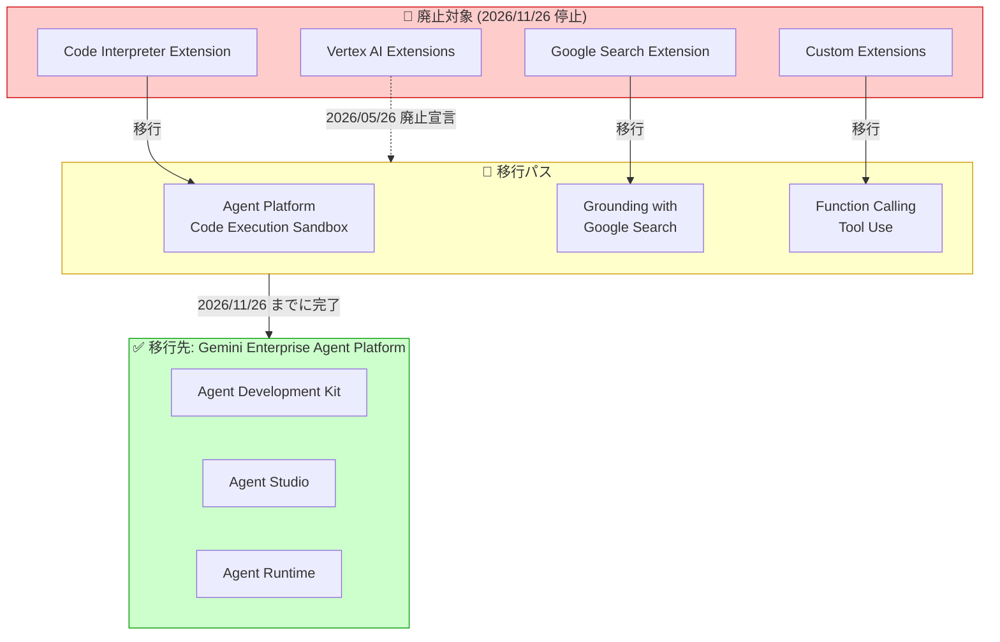

# Generative AI on Vertex AI: Vertex AI Extensions の廃止と Agent Platform への移行

**リリース日**: 2026-05-26

**サービス**: Generative AI on Vertex AI

**機能**: Vertex AI Extensions 廃止 (Deprecated)

**ステータス**: Deprecated

📊 [このアップデートのインフォグラフィックを見る](https://takech9203.github.io/google-cloud-news-summary/20260526-vertex-ai-extensions-deprecation.html)

## 概要

Vertex AI Extensions が 2026 年 5 月 26 日をもって正式に廃止 (Deprecated) となり、2026 年 11 月 26 日以降にサービスが完全停止することが発表された。Vertex AI Extensions は、大規模言語モデル (LLM) が外部データへのアクセスやリアルタイム処理を行うための構造化された API ラッパーとして提供されていた Preview 機能であり、Code Interpreter や Google Search、カスタム拡張機能などを通じて LLM にツール実行能力を付与していた。

Google は後継として Gemini Enterprise Agent Platform (Agent Platform) への移行を推奨している。Agent Platform は、AI エージェントの構築・デプロイ・ガバナンス・最適化を統合的に提供するプラットフォームであり、Vertex AI Extensions が提供していた機能をより高度かつスケーラブルな形で実現する。移行猶予期間は 6 か月間であり、既存ユーザーは早急に移行計画を策定する必要がある。

本件は Preview 機能の廃止であるが、Vertex AI Extensions を本番ワークフローに組み込んでいる場合はサービス停止による影響が大きいため、対応の緊急度は高い。

**アップデート前の課題**

- Vertex AI Extensions は Preview 段階のまま GA に昇格せず、SLA やサポート範囲が限定的であった
- Extensions API は us-central1 リージョンのみに限定されていた
- 自動実行される Extension と手動実行が必要な Function Calling の間で、開発者の混乱が生じていた

**アップデート後の改善**

- Agent Platform への移行により、GA 品質のエンタープライズ向けエージェント機能が利用可能になる
- Agent Development Kit (ADK) による多言語対応 (Python, TypeScript, Go, Java, Kotlin) のエージェント開発が可能
- Agent Runtime、Code Execution Sandbox、Memory Bank など、より高度な機能セットへのアクセスが提供される
- Agent Gateway や Agent Identity によるエンタープライズグレードのガバナンスが実現される

## アーキテクチャ図



Vertex AI Extensions の 3 つの拡張カテゴリ (Code Interpreter、Google Search、Custom Extensions) それぞれに対応する移行先が Agent Platform 上に用意されている。

## サービスアップデートの詳細

### 廃止タイムライン

| マイルストーン | 日付 | 内容 |
|---------------|------|------|
| 廃止宣言 (Deprecated) | 2026 年 5 月 26 日 | 新規作成は非推奨。既存の Extension は引き続き動作 |
| サービス停止 (Shutdown) | 2026 年 11 月 26 日以降 | Vertex AI Extensions API が完全停止。全 Extension が機能しなくなる |

### 移行パス

1. **Code Interpreter Extension → Agent Platform Code Execution Sandbox**
   - マネージドな安全なサンドボックス環境でAI生成コードを実行
   - プログラム実行、金融計算、データサイエンスワークフローに最適
   - 代替として Gemini API の CodeExecution ツールも利用可能
   - Agent Development Kit (ADK) からの利用、GenAI Client SDK からの利用、動的 Tool 定義の 3 パターンが用意されている

2. **Google Search Extension → Grounding with Google Search**
   - モデルの応答を信頼できる検索インデックスと最新の公開情報に基づかせる
   - より高い事実精度を実現
   - GenAI SDK の `GoogleSearch` ツールとして簡潔に実装可能

3. **Custom Extensions → Function Calling (Tool Use)**
   - OpenAPI 仕様で構成したカスタム拡張機能を Function Calling に移行
   - 外部プラットフォーム API をソースファイル内で定義し、モデルにインターフェース抽象を転送
   - GenAI SDK の関数定義として直接実装可能

## 技術仕様

### 移行前後の API 比較

| 項目 | Vertex AI Extensions (旧) | Agent Platform (新) |
|------|--------------------------|---------------------|
| SDK | `vertexai.preview.extensions` | `google.adk` / `google.genai` |
| 実行方式 | Extension が自動実行 | Function Calling (手動) または ADK (自動) |
| リージョン | us-central1 のみ | マルチリージョン対応 |
| ステータス | Preview (Pre-GA) | GA |
| ガバナンス | IAM のみ | Agent Identity + Agent Gateway + Governance Policies |

### 移行コード例: Code Interpreter

**移行前 (Vertex AI Extensions):**

```python
from vertexai.preview import extensions

extension = extensions.Extension.from_hub("code_interpreter")
response = extension.execute(
    operation_id="generate_and_execute_code",
    operation_params={"code": "import math\nprint(math.sqrt(15376))"}
)
```

**移行後 (Agent Platform - ADK 使用):**

```python
from google.adk.code_executors.agent_engine_sandbox_code_executor import (
    AgentEngineSandboxCodeExecutor,
)
from vertexai.preview.reasoning_engines import Agent

root_agent = Agent(
    model="gemini-2.0-flash-001",
    name="code_execution_agent",
    instruction="コードを実行してユーザーのクエリに回答します。",
    code_executor=AgentEngineSandboxCodeExecutor(
        sandbox_resource_name=None,
        agent_engine_resource_name=None,
    ),
)
```

### 移行コード例: Google Search

**移行前 (Vertex AI Extensions):**

```python
from vertexai.preview import extensions

extension = extensions.Extension.from_hub("google_search")
response = extension.execute(
    operation_id="search",
    operation_params={"query": "次の日本の祝日はいつですか？"}
)
```

**移行後 (Grounding with Google Search):**

```python
from google import genai
from google.genai.types import GenerateContentConfig, GoogleSearch, Tool

client = genai.Client()
response = client.models.generate_content(
    model="gemini-3.1-flash",
    contents="次の日本の祝日はいつですか？",
    config=GenerateContentConfig(
        tools=[Tool(google_search=GoogleSearch())],
        temperature=0.0,
    ),
)
print(response.text)
```

### 移行コード例: Custom Extensions

**移行前 (Vertex AI Extensions):**

```python
from vertexai.preview import extensions

extension = extensions.Extension.create(
    manifest={
        "name": "my_custom_api",
        "apiSpec": {"openApiYaml": "..."}
    }
)
```

**移行後 (Function Calling / Tool Use):**

```python
from google import genai
from google.genai.types import GenerateContentConfig

def get_order_status(order_id: str) -> str:
    """注文のステータスを返します。
    Args:
        order_id: 注文の一意識別子。
    """
    statuses = {"123": "発送済み", "456": "処理中"}
    return statuses.get(order_id, "注文が見つかりません")

client = genai.Client()
response = client.models.generate_content(
    model="gemini-3.0-pro",
    contents="注文 123 のステータスを確認してください",
    config=GenerateContentConfig(
        tools=[get_order_status],
    ),
)
print(response.text)
```

## 設定方法

### 前提条件

1. Google Cloud プロジェクトで Vertex AI API が有効であること
2. Agent Platform へのアクセス権限が付与されていること
3. `google-genai` SDK または `google-adk` がインストールされていること

### 手順

#### ステップ 1: 現在の Extensions 利用状況の棚卸し

```bash
# プロジェクト内で使用中の Extensions を一覧表示
gcloud ai extensions list --project=PROJECT_ID --region=us-central1
```

使用中の Extension の種類 (Code Interpreter、Google Search、Custom) を特定し、それぞれの移行先を決定する。

#### ステップ 2: 新しい SDK のインストール

```bash
# Agent Development Kit (ADK) のインストール
pip install google-adk

# または GenAI SDK のインストール
pip install google-genai
```

#### ステップ 3: コードの移行

各 Extension タイプに応じて、上記の移行コード例を参照しながらコードを書き換える。

#### ステップ 4: テストと検証

```bash
# ADK の開発 UI でエージェントをローカルテスト
adk web
```

移行後のコードが期待通り動作することを確認し、本番環境にデプロイする。

## メリット

### ビジネス面

- **SLA の保証**: Preview から GA 品質のサービスに移行することで、エンタープライズ向けの SLA が適用される
- **長期的な安定性**: Agent Platform は Google Cloud のコアプラットフォームとして長期サポートが見込まれる
- **コンプライアンス対応**: Agent Gateway や Governance Policies による包括的なガバナンス機能

### 技術面

- **多言語 SDK 対応**: ADK は Python, TypeScript, Go, Java, Kotlin に対応し、チームのスキルセットに合わせた開発が可能
- **マルチエージェント対応**: 複数のエージェントを階層的に構成し、複雑なタスクを分割・委譲できる
- **リッチなツールエコシステム**: FunctionTool、AgentTool、組み込みコード実行、外部データソース連携など多様なツールを統合可能
- **Agent Runtime**: サブ秒のコールドスタート、長時間実行エージェントのサポート

## デメリット・制約事項

### 制限事項

- 移行猶予期間は 6 か月間のみ (2026 年 11 月 26 日まで)
- 移行にはコード変更が必須であり、ドロップインリプレースメントではない
- Extensions で自動実行されていたロジックを Function Calling に切り替える場合、実行制御のアーキテクチャ変更が必要

### 考慮すべき点

- Extensions を利用する CI/CD パイプラインやバッチ処理がある場合、すべてのコードパスを洗い出す必要がある
- カスタム Extensions で OpenAPI 仕様を使用していた場合、Function Calling への変換にはインターフェース設計の見直しが伴う可能性がある
- Preview 利用規約で開発していた部分を、GA の利用規約に合わせて契約面の確認が必要

## ユースケース

### ユースケース 1: データ分析パイプラインの移行

**シナリオ**: Code Interpreter Extension を使って定期的なデータ分析レポートを自動生成していたチームが Agent Platform に移行する。

**実装例**:
```python
from google.adk.code_executors.agent_engine_sandbox_code_executor import (
    AgentEngineSandboxCodeExecutor,
)
from vertexai.preview.reasoning_engines import Agent

analysis_agent = Agent(
    model="gemini-2.0-flash-001",
    name="data_analysis_agent",
    instruction="""
    ユーザーのクエリに基づいてデータ分析を行います。
    コードを実行して結果を可視化し、レポートを生成します。
    """,
    code_executor=AgentEngineSandboxCodeExecutor(
        sandbox_resource_name=None,
        agent_engine_resource_name=None,
    ),
)
```

**効果**: マネージドなサンドボックス環境により、セキュリティを維持しながらデータ分析の自動化を継続できる。

### ユースケース 2: カスタム API 連携の移行

**シナリオ**: 社内システムの REST API をカスタム Extension として登録し、チャットボットから利用していた場合。

**実装例**:
```python
from google import genai
from google.genai.types import GenerateContentConfig

def search_internal_kb(query: str) -> str:
    """社内ナレッジベースを検索します。"""
    # 社内 API を呼び出す実装
    import requests
    response = requests.get(f"https://internal-api.example.com/search?q={query}")
    return response.json()

client = genai.Client()
response = client.models.generate_content(
    model="gemini-3.0-pro",
    contents="最新のセキュリティポリシーについて教えてください",
    config=GenerateContentConfig(tools=[search_internal_kb]),
)
```

**効果**: Function Calling への移行により、API 呼び出しの制御をアプリケーション側で管理でき、エラーハンドリングやリトライロジックを柔軟に実装できる。

## 料金

Agent Platform の料金体系は、利用するコンポーネントによって異なる。

- **Gemini モデル利用料**: 入力/出力トークンに基づく従量課金
- **Code Execution Sandbox**: サンドボックスの実行時間に基づく課金
- **Agent Runtime**: デプロイされたエージェントの実行時間に基づく課金

詳細は [Agent Platform の料金ページ](https://cloud.google.com/vertex-ai/pricing) を参照。

## 関連サービス・機能

- **Gemini Enterprise Agent Platform**: Vertex AI Extensions の全機能を包含する後継プラットフォーム
- **Agent Development Kit (ADK)**: エージェント構築のためのオープンソースフレームワーク (Python, TypeScript, Go, Java, Kotlin 対応)
- **Agent Studio**: ローコードでエージェントを設計・プロトタイピングするビジュアルキャンバス
- **Agent Garden**: プリビルトエージェントとテンプレートのライブラリ
- **Agent Runtime**: エージェントのスケーラブルなデプロイ・管理環境
- **Agent Gateway**: エージェントのツール呼び出しに対するポリシー適用ポイント
- **RAG Engine**: プライベートデータと LLM を接続して回答精度を向上させる機能

## 参考リンク

- 📊 [インフォグラフィック](https://takech9203.github.io/google-cloud-news-summary/20260526-vertex-ai-extensions-deprecation.html)
- [公式リリースノート](https://docs.cloud.google.com/release-notes#May_26_2026)
- [Extensions 移行ガイド](https://docs.cloud.google.com/vertex-ai/generative-ai/docs/extensions/migrate)
- [Vertex AI Extensions 概要 (廃止)](https://docs.cloud.google.com/vertex-ai/generative-ai/docs/extensions/overview)
- [Gemini Enterprise Agent Platform 概要](https://docs.cloud.google.com/gemini-enterprise-agent-platform/overview)
- [Agent Development Kit (ADK)](https://adk.dev/)
- [Agent Platform 廃止ポリシー](https://docs.cloud.google.com/gemini-enterprise-agent-platform/models/deprecations)

## まとめ

Vertex AI Extensions は 2026 年 11 月 26 日に完全停止するため、利用中のユーザーは早急に Agent Platform への移行を開始すべきである。移行先は Extension タイプごとに明確に定義されており (Code Interpreter → Code Execution Sandbox、Google Search → Grounding with Google Search、Custom → Function Calling)、公式移行ガイドとコード例が提供されている。6 か月の猶予期間内に、利用状況の棚卸し、コード移行、テスト検証を完了し、サービス停止によるビジネス影響を回避することが推奨される。

---

**タグ**: #VertexAI #GenerativeAI #Extensions #Deprecated #AgentPlatform #ADK #移行 #FunctionCalling #CodeExecution
