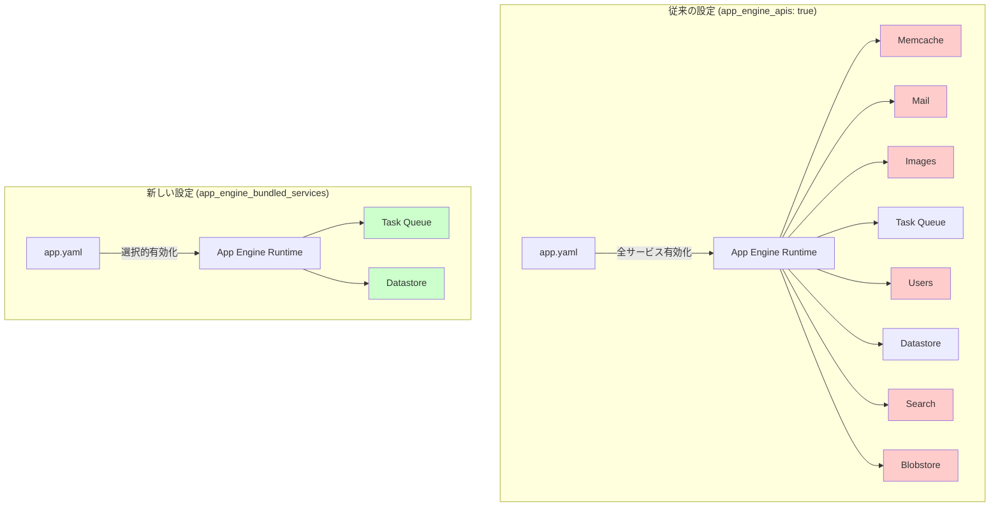

# App Engine standard environment: レガシーバンドルサービスの選択的有効化

**リリース日**: 2026-05-27

**サービス**: App Engine standard environment (Go, Java, PHP, Python)

**機能**: `app_engine_bundled_services` フィールドによる必要なレガシーバンドルサービスのみの選択的有効化 (Preview)

**ステータス**: Preview

[このアップデートのインフォグラフィックを見る](https://takech9203.github.io/google-cloud-news-summary/20260527-app-engine-bundled-services-selective-enable.html)

## 概要

Google Cloud は App Engine standard environment において、レガシーバンドルサービスを選択的に有効化できる新機能を Preview としてリリースしました。従来の `app_engine_apis: true` 設定ではすべてのバンドルサービスが一括で有効化されていましたが、新しい `app_engine_bundled_services` フィールドを使用することで、アプリケーションが実際に必要とするサービスのみを個別に指定して有効化できるようになりました。

この機能は Go、Java、PHP、Python の第2世代ランタイムで利用可能です。セキュリティの向上（不要なサービスを公開しないことによる攻撃対象領域の削減）と保守性の向上（依存関係の明示化）を目的としています。特に、レガシーランタイムから第2世代ランタイムへの移行を進めている組織にとって、段階的な移行をより安全に実施するための重要なツールとなります。

**アップデート前の課題**

従来、App Engine のレガシーバンドルサービスを第2世代ランタイムで使用する場合、以下の課題がありました。

- `app_engine_apis: true` を設定すると、Memcache、Mail、Images、Task Queue、Users など全てのバンドルサービスが一括で有効化され、使用しないサービスも公開されていた
- 不要なサービスが有効化されることで攻撃対象領域が拡大し、セキュリティリスクが増大していた
- アプリケーションがどのバンドルサービスに依存しているかが設定ファイルから読み取れず、保守性が低下していた

**アップデート後の改善**

今回のアップデートにより、以下の改善が実現しました。

- `app_engine_bundled_services` フィールドで必要なサービスのみをリスト形式で指定可能になった
- 不要なサービスを無効化することで攻撃対象領域を最小化し、セキュリティが向上した
- app.yaml（または appengine-web.xml）を見るだけでアプリケーションの依存サービスが明確に把握でき、保守性が向上した

## アーキテクチャ図



従来はすべてのバンドルサービスが有効化されていた（赤色：未使用だが有効）のに対し、新設定では必要なサービスのみを選択的に有効化（緑色：使用中かつ有効）できるようになりました。

## サービスアップデートの詳細

### 主要機能

1. **選択的サービス有効化**
   - `app_engine_bundled_services` フィールドに必要なサービスをリストとして記述
   - アプリケーションが実際に使用するサービスのみを有効化
   - 未指定のサービスへの API 呼び出しはブロックされる

2. **複数ランタイム対応**
   - Go (1.12+)、Java (11+)、PHP (7+)、Python (3+) の第2世代ランタイムで利用可能
   - Go/PHP/Python は app.yaml、Java は appengine-web.xml で設定

3. **既存設定との互換性**
   - 従来の `app_engine_apis: true` 設定も引き続きサポート（全サービス有効化）
   - 新規フィールドは段階的な移行を支援するオプション機能として提供

## 技術仕様

### 対応サービス一覧

| サービス名 | 識別子 | 説明 |
|------------|--------|------|
| App Identity | `app_identity` | OIDC ID トークンによる認証 |
| Blobstore | `blobstore` | バイナリデータストレージ |
| Capabilities | `capabilities` | API 可用性チェック |
| Datastore | `datastore` | NoSQL データベース |
| Images | `images` | 画像処理 |
| Mail | `mail` | メール送信 |
| Memcache | `memcache` | インメモリキャッシュ |
| Modules | `modules` | サービス情報管理 |
| Search | `search` | 全文検索 |
| Task Queue | `taskqueue` | 非同期タスク実行 |
| URL Fetch | `urlfetch` | 外部 HTTP リクエスト |
| Users | `users` | ユーザー認証 |

### 設定例 (app.yaml - Python/Go/PHP)

```yaml
runtime: python314

# 新しい選択的有効化設定
app_engine_bundled_services:
  - memcache
  - taskqueue
  - datastore

entrypoint: gunicorn -b :$PORT main:app
```

### 設定例 (appengine-web.xml - Java)

```xml
<?xml version="1.0" encoding="utf-8"?>
<appengine-web-app xmlns="http://appengine.google.com/ns/1.0">
  <runtime>java21</runtime>
  <app-engine-bundled-services>
    <service>memcache</service>
    <service>taskqueue</service>
    <service>datastore</service>
  </app-engine-bundled-services>
</appengine-web-app>
```

## 設定方法

### 前提条件

1. Google Cloud プロジェクトが作成済みであること
2. App Engine アプリケーションが第2世代ランタイム (Go 1.12+, Java 11+, PHP 7+, Python 3+) を使用していること
3. gcloud CLI が最新版にアップデートされていること

### 手順

#### ステップ 1: 現在使用しているバンドルサービスの特定

```bash
# アプリケーションコード内でインポートされているバンドルサービスを確認
# Python の場合
grep -r "from google.appengine.api import" ./src/
grep -r "from google.appengine.ext import" ./src/
```

アプリケーションが実際に使用しているバンドルサービスを特定し、必要なサービスのリストを作成します。

#### ステップ 2: app.yaml の更新

```yaml
# app.yaml を編集
# 従来の設定:
# app_engine_apis: true
#
# 新しい設定に変更:
app_engine_bundled_services:
  - memcache
  - taskqueue
```

`app_engine_apis: true` を削除し、代わりに `app_engine_bundled_services` フィールドに必要なサービスのみを列挙します。

#### ステップ 3: デプロイとテスト

```bash
# アプリケーションをデプロイ
gcloud app deploy app.yaml

# ログを確認して正常動作を検証
gcloud app logs tail -s default
```

デプロイ後、アプリケーションが正常に動作することを確認します。未指定のサービスを呼び出した場合はエラーが発生するため、ログを注意深く確認してください。

## メリット

### ビジネス面

- **セキュリティポスチャーの強化**: 不要なサービスを無効化することで、攻撃対象領域を最小化し、コンプライアンス要件への対応が容易になる
- **運用の明確化**: 依存関係が設定ファイルに明示されるため、チーム間でのアプリケーション理解が促進され、引き継ぎや監査が効率化される

### 技術面

- **最小権限の原則の適用**: アプリケーションが必要最小限のサービスのみにアクセスできるようにすることで、意図しないサービス利用を防止
- **段階的な移行の支援**: バンドルサービスから Google Cloud ネイティブサービスへの移行を、サービス単位で追跡・管理可能
- **デバッグの効率化**: サービスの依存関係が明確になることで、問題発生時の原因特定が容易になる

## デメリット・制約事項

### 制限事項

- 現在 Preview ステータスであり、本番環境での使用には注意が必要
- サービス間の暗黙的な依存関係（例: Deferred は Task Queue に依存）を正しく理解して設定する必要がある
- 既存の `app_engine_apis: true` から移行する際、全てのサービス依存を洗い出す作業が必要

### 考慮すべき点

- Preview 期間中は機能の仕様が変更される可能性がある
- 設定ミスにより、本来必要なサービスを無効化してしまうとランタイムエラーが発生する
- Java の場合は appengine-web.xml での設定が必要であり、app.yaml とは異なるフォーマットで管理する必要がある

## ユースケース

### ユースケース 1: Memcache と Task Queue のみを使用するバックエンドサービス

**シナリオ**: Web アプリケーションのバックエンドで、キャッシュ（Memcache）と非同期処理（Task Queue）のみを使用しているが、Mail や Images などの他のバンドルサービスは不要な場合。

**実装例**:
```yaml
runtime: python314

app_engine_bundled_services:
  - memcache
  - taskqueue

automatic_scaling:
  max_instances: 10

entrypoint: gunicorn -b :$PORT main:app
```

**効果**: Mail、Images、Search など未使用のサービスが無効化され、万が一コードに脆弱性があってもそれらのサービスへのアクセスが防止される。

### ユースケース 2: レガシーランタイムからの段階的移行

**シナリオ**: Python 2.7 から Python 3 への移行を進めている大規模アプリケーションで、移行対象のバンドルサービスを明確化し、段階的に Google Cloud ネイティブサービスへ置き換えたい場合。

**実装例**:
```yaml
runtime: python314

# Phase 1: 現在使用中のサービスを明示
app_engine_bundled_services:
  - datastore
  - memcache
  - taskqueue
  - mail

# Phase 2: memcache を Memorystore に移行後
# app_engine_bundled_services:
#   - datastore
#   - taskqueue
#   - mail
```

**効果**: 移行の進捗が設定ファイルに反映され、残りの移行作業量が可視化される。チーム全体で移行状況を把握しやすくなる。

## 料金

この機能自体に追加料金は発生しません。App Engine standard environment の通常の料金体系が適用されます。

### 料金参考

| リソース | 料金 |
|----------|------|
| App Engine インスタンス (F1) | $0.05/時間 |
| App Engine インスタンス (F2) | $0.10/時間 |
| Memcache (共有) | 無料 |
| Memcache (専用) | $0.06/GB/時間 |

バンドルサービスの選択的有効化により、使用するサービス自体の料金に変更はありません。

## 利用可能リージョン

App Engine standard environment がサポートする全てのリージョンで利用可能です。App Engine アプリケーションの作成時に選択したリージョンで機能します。

## 関連サービス・機能

- **Cloud Tasks**: App Engine Task Queue の代替となるフルマネージドサービス。バンドルサービスからの移行先として推奨
- **Memorystore**: Memcache の代替となるフルマネージドインメモリデータストア (Redis/Memcached 互換)
- **Cloud Run**: App Engine からの移行先として推奨されるサーバーレスコンテナプラットフォーム
- **Firestore**: Datastore バンドルサービスの代替となるサーバーレスドキュメントデータベース

## 参考リンク

- [インフォグラフィック](https://takech9203.github.io/google-cloud-news-summary/20260527-app-engine-bundled-services-selective-enable.html)
- [公式リリースノート](https://docs.cloud.google.com/release-notes#May_27_2026)
- [App Engine app.yaml リファレンス (Go)](https://docs.cloud.google.com/appengine/docs/standard/reference/app-yaml?tab=go#app_engine_bundled_services)
- [App Engine appengine-web.xml リファレンス (Java)](https://docs.cloud.google.com/appengine/docs/standard/java-gen2/config/appref-xml#app_engine_apis)
- [App Engine レガシーバンドルサービス概要](https://docs.cloud.google.com/appengine/docs/standard/bundled-services-overview)
- [利用可能なバンドルサービス一覧](https://docs.cloud.google.com/appengine/docs/standard/services/overview)
- [Python 3 でのバンドルサービス利用方法](https://docs.cloud.google.com/appengine/docs/standard/python3/services/access)
- [Java でのバンドルサービス利用方法](https://docs.cloud.google.com/appengine/docs/standard/java-gen2/services/access)

## まとめ

App Engine の `app_engine_bundled_services` フィールドによる選択的有効化は、レガシーバンドルサービスを利用する組織にとって、セキュリティと保守性の両面で大きな改善をもたらします。特に、第1世代ランタイムからの移行を段階的に進めている組織は、この機能を活用して依存関係を明示化し、移行計画をより効果的に管理することを推奨します。Preview 段階ですが、開発・ステージング環境で早期に導入し、本番環境での GA を見据えた準備を開始することをお勧めします。

---

**タグ**: #AppEngine #BundledServices #Security #Migration #Preview #Go #Java #PHP #Python
