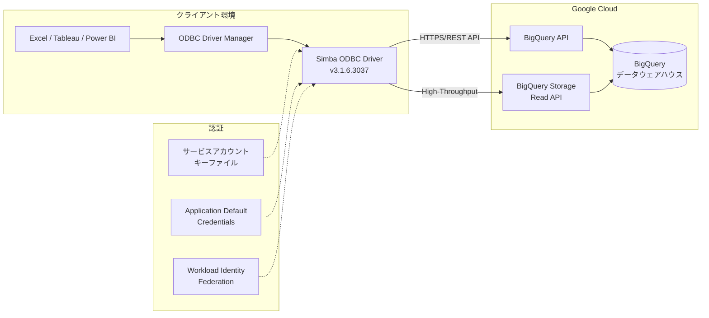

# BigQuery: Simba ODBC ドライバーの更新版リリース

**リリース日**: 2026-05-27

**サービス**: BigQuery

**機能**: Updated Simba ODBC driver for BigQuery

**ステータス**: GA (一般提供)

[このアップデートのインフォグラフィックを見る](https://takech9203.github.io/google-cloud-news-summary/20260527-bigquery-simba-odbc-driver.html)

## 概要

Google Cloud は、BigQuery 向け Simba ODBC ドライバーの更新版をリリースしました。Simba ODBC ドライバーは、ODBC (Open Database Connectivity) インターフェースを通じて、レガシーアプリケーションやエンタープライズツール (Microsoft Excel、Tableau、Power BI など) から BigQuery へのシームレスな接続を実現するコネクタです。

今回のアップデートにより、最新バージョン 3.1.6.3037 が利用可能となり、パフォーマンスの改善、セキュリティの強化、および互換性の向上が図られています。このドライバーは insightsoftware 社によって開発されており、Google Cloud Ready - BigQuery パートナーとして認定されています。

対象ユーザーは、既存の BI ツールやレポーティングツールから BigQuery のデータにアクセスする必要があるデータアナリスト、データエンジニア、および IT 管理者です。特に ODBC 対応アプリケーションを多数運用しているエンタープライズ環境において、BigQuery への移行やハイブリッド分析環境の構築を容易にします。

**アップデート前の課題**

- 以前のバージョンのドライバーでは、一部のエンタープライズアプリケーションとの互換性に制限があった
- BigQuery Storage Read API (High-Throughput API) の活用において最適化の余地があった
- セキュリティパッチの適用やバグ修正が最新の状態ではなかった

**アップデート後の改善**

- 最新版ドライバー (3.1.6.3037) により、アプリケーション互換性が向上した
- Windows (32-bit/64-bit)、Linux (32-bit/64-bit)、macOS の全プラットフォームに対応した最新ビルドが提供される
- BigQuery の最新機能との互換性が確保され、より安定した接続が実現された

## アーキテクチャ図



Simba ODBC ドライバーは、クライアントアプリケーションと BigQuery の間に位置し、ODBC 標準インターフェースを BigQuery REST API 呼び出しに変換します。大規模なデータ読み取りには BigQuery Storage Read API (High-Throughput API) を利用することで、高速なデータ転送を実現します。

## サービスアップデートの詳細

### 主要機能

1. **マルチプラットフォームサポート**
   - Windows 32-bit および 64-bit (.msi インストーラー)
   - Linux 32-bit および 64-bit (.tar.gz パッケージ)
   - macOS (.dmg パッケージ)

2. **High-Throughput API (BigQuery Storage Read API) 対応**
   - 大規模結果セットの高速読み取りを実現
   - 標準 BigQuery API と比較して大幅にスループットが向上
   - `BigQuery Read Session User` ロールの付与で利用可能

3. **複数の認証方式サポート**
   - サービスアカウント認証 (キーファイル)
   - Google ユーザーアカウント認証
   - 事前生成のリフレッシュ/アクセストークン認証
   - Application Default Credentials (ADC)
   - Workload Identity Federation

4. **エンタープライズ機能**
   - プロキシサーバー経由の接続対応
   - カスタムエンドポイントの設定 (Private Service Connect 対応)
   - セッション管理機能
   - クエリキャッシュ機能

## 技術仕様

### ドライバーバージョン情報

| 項目 | 詳細 |
|------|------|
| 現行バージョン | 3.1.6.3037 |
| 開発元 | insightsoftware (Google Cloud Ready - BigQuery パートナー) |
| 対応 OS | Windows, Linux, macOS |
| 接続プロトコル | HTTPS (REST API) |
| 対応 SQL 方言 | GoogleSQL (推奨)、Legacy SQL |
| ライセンス | 無償提供 (追加ライセンス不要) |

### 制限事項

| 項目 | 説明 |
|------|------|
| データロード | BigQuery Load 機能は非サポート |
| データエクスポート | BigQuery Export 機能は非サポート |
| クエリプレフィックス | 非サポート |
| DML | BigQuery DML の制限事項がすべて適用 |
| パラメータ化クエリ | クエリ検証のみ (パフォーマンスへの影響なし) |
| 利用範囲 | BigQuery 専用 (他の GCP サービスには使用不可) |

### DSN 設定 (Windows)

```ini
[ODBC Data Sources]
BigQuery_DSN=Simba ODBC Driver for Google BigQuery

[BigQuery_DSN]
Driver=Simba ODBC Driver for Google BigQuery
OAuthMechanism=0
ProjectId=your-project-id
KeyFilePath=C:\path\to\service-account-key.json
DefaultDataset=your_dataset
```

### DSN 設定 (Linux/macOS)

```ini
# odbc.ini
[BigQuery_DSN]
Driver=Simba ODBC Driver for Google BigQuery
OAuthMechanism=0
ProjectId=your-project-id
KeyFilePath=/path/to/service-account-key.json
DefaultDataset=your_dataset

# odbcinst.ini
[Simba ODBC Driver for Google BigQuery]
Driver=/opt/simba/googlebigqueryodbc/lib/64/libgooglebigqueryodbc_sb64.so
```

## 設定方法

### 前提条件

1. Google Cloud プロジェクトが作成済みであること
2. BigQuery API が有効化されていること
3. 適切な IAM ロール (BigQuery User 以上) が付与されていること
4. High-Throughput API を使用する場合は `roles/bigquery.readSessionUser` ロールが必要

### 手順

#### ステップ 1: ドライバーのダウンロード

```bash
# Linux 環境の場合
wget https://storage.googleapis.com/simba-bq-release/odbc/SimbaODBCDriverforGoogleBigQuery_3.1.6.3037-Linux.tar.gz

# 展開
tar -xzf SimbaODBCDriverforGoogleBigQuery_3.1.6.3037-Linux.tar.gz
```

Windows の場合は .msi ファイルをダウンロードしてインストーラーを実行します。macOS の場合は .dmg ファイルを使用します。

#### ステップ 2: ドライバーのインストールと設定

```bash
# Linux: 環境変数の設定
export ODBCINI=/etc/odbc.ini
export ODBCINSTINI=/etc/odbcinst.ini
export LD_LIBRARY_PATH=/opt/simba/googlebigqueryodbc/lib/64:$LD_LIBRARY_PATH
```

insightsoftware のインストールおよび設定ガイドに従い、DSN (Data Source Name) を構成します。

#### ステップ 3: 接続テスト

```bash
# isql コマンドで接続テスト (unixODBC)
isql -v BigQuery_DSN
```

正常に接続できれば、SQL クエリを実行して BigQuery のデータにアクセスできます。

#### ステップ 4: High-Throughput API の有効化 (オプション)

```bash
# 必要な IAM ロールの付与
gcloud projects add-iam-policy-binding PROJECT_ID \
  --member="serviceAccount:SA_EMAIL" \
  --role="roles/bigquery.readSessionUser"
```

DSN 設定で High-Throughput API を有効化することで、大規模データ読み取りのパフォーマンスが向上します。

## メリット

### ビジネス面

- **既存ツール資産の活用**: Excel、Tableau、Power BI など ODBC 対応の BI ツールをそのまま BigQuery に接続でき、ツール移行コストが不要
- **迅速なデータ活用**: エンドユーザーが使い慣れたツールから直接 BigQuery のデータにアクセスでき、データ活用の民主化を促進
- **エンタープライズ対応**: プロキシ、VPC Service Controls、Private Service Connect など企業ネットワーク要件に対応

### 技術面

- **High-Throughput API**: BigQuery Storage Read API を活用した高速データ読み取りにより、大規模データセットの取得パフォーマンスが大幅に向上
- **マルチプラットフォーム**: Windows、Linux、macOS のすべてに対応し、異種環境でも統一的に利用可能
- **柔軟な認証**: サービスアカウント、ADC、Workload Identity Federation など多様な認証方式をサポートし、ゼロトラストセキュリティに対応

## デメリット・制約事項

### 制限事項

- BigQuery のデータロード機能およびエクスポート機能はドライバー経由では利用不可
- DML (INSERT/UPDATE/DELETE) には BigQuery 固有の制限が適用される
- ドライバーは BigQuery 専用であり、他の Google Cloud サービスには使用できない
- パラメータ化クエリはクエリ検証のみで、実行パフォーマンスの最適化には寄与しない

### 考慮すべき点

- ドライバーのアップデートに伴い、既存の DSN 設定やアプリケーション連携の動作確認テストが推奨される
- High-Throughput API の使用は追加の IAM ロール付与と BigQuery Storage Read API の料金が発生する
- 32-bit アプリケーションを使用する場合は、32-bit 版ドライバーの明示的なインストールが必要

## ユースケース

### ユースケース 1: Excel から BigQuery への直接接続

**シナリオ**: 財務部門のアナリストが、BigQuery に格納された売上データを Excel のピボットテーブルで分析したい。プログラミングスキルがなくても、使い慣れた Excel から直接データにアクセスする必要がある。

**実装例**:
```
1. Simba ODBC ドライバー (Windows 64-bit) をインストール
2. ODBC Data Source Administrator で DSN を作成
   - Driver: Simba ODBC Driver for Google BigQuery
   - ProjectId: finance-analytics-prod
   - OAuthMechanism: 0 (サービスアカウント)
   - KeyFilePath: C:\keys\finance-sa.json
3. Excel > データ > ODBC から接続
4. SQL クエリまたはテーブル選択でデータ取得
```

**効果**: データエンジニアに依頼せずとも、アナリスト自身がリアルタイムに BigQuery のデータを分析可能。レポート作成の所要時間を大幅に短縮。

### ユースケース 2: Tableau ダッシュボードでの大規模データ可視化

**シナリオ**: データ可視化チームが、数十億行のログデータを Tableau で可視化する必要がある。High-Throughput API を活用して高速にデータを取得したい。

**効果**: BigQuery Storage Read API を利用することで、従来の REST API 経由と比較して大規模データセットの読み取り速度が大幅に向上。ダッシュボードの初期表示時間を短縮し、ユーザー体験を改善。

### ユースケース 3: レガシーシステムからの段階的移行

**シナリオ**: オンプレミスの SQL Server を使用していたレガシーアプリケーションを、BigQuery に段階的に移行したい。アプリケーションコードを変更せずに、ODBC 接続先のみを切り替えることで移行を実現する。

**効果**: アプリケーションのリファクタリングなしに BigQuery へのデータソース切り替えが可能。段階的な移行により、リスクを最小化しつつクラウド移行を推進。

## 料金

Simba ODBC ドライバー自体は無償でダウンロード・利用可能です。追加ライセンスも不要です。ただし、ドライバーを通じた BigQuery の利用には通常の BigQuery 料金が適用されます。

### 料金例

| 使用量 | 月額料金 (概算) |
|--------|-----------------|
| オンデマンドクエリ 1 TB/月 | 約 $6.25 |
| オンデマンドクエリ 10 TB/月 | 約 $62.50 |
| Storage Read API 1 TB 読み取り | 約 $1.10 |
| BigQuery ストレージ (アクティブ) 1 TB/月 | 約 $0.02/GB |

※ 料金は利用するリージョンやエディションにより異なります。最新の料金は公式料金ページを参照してください。

## 利用可能リージョン

Simba ODBC ドライバーはクライアントサイドにインストールするソフトウェアであるため、リージョン制限はありません。BigQuery のデータセットが存在する任意のリージョンおよびマルチリージョン (US、EU) に対して接続可能です。

Private Service Connect を使用する場合は、対応リージョンのカスタムエンドポイントを指定する必要があります。

## 関連サービス・機能

- **BigQuery JDBC ドライバー (Google 開発版)**: Java アプリケーション向けの代替 JDBC ドライバー (現在プレビュー)
- **Simba JDBC ドライバー**: Java アプリケーション向けの Simba 製 JDBC ドライバー (バージョン 1.7.0.1001)
- **BigQuery Storage Read API**: 大規模データの高速読み取り API (High-Throughput API として ODBC ドライバーから利用可能)
- **BigQuery BI Engine**: メモリ内分析サービスで、BI ツールからのクエリを高速化
- **Connected Sheets**: Google スプレッドシートから BigQuery に直接接続する機能

## 参考リンク

- [インフォグラフィック](https://takech9203.github.io/google-cloud-news-summary/20260527-bigquery-simba-odbc-driver.html)
- [公式リリースノート](https://docs.cloud.google.com/release-notes#May_27_2026)
- [ODBC/JDBC ドライバー ドキュメント](https://docs.cloud.google.com/bigquery/docs/reference/odbc-jdbc-drivers)
- [現行 ODBC ドライバー](https://docs.cloud.google.com/bigquery/docs/reference/odbc-jdbc-drivers#current_odbc_driver)
- [BigQuery 料金ページ](https://cloud.google.com/bigquery/pricing)
- [BigQuery Storage Read API](https://cloud.google.com/bigquery/docs/reference/storage)

## まとめ

今回の Simba ODBC ドライバー更新は、BigQuery をエンタープライズ BI ツールと連携させる際の安定性とパフォーマンスを向上させる重要なメンテナンスリリースです。既に ODBC ドライバーを使用している環境では、互換性確認の上で最新版への更新を推奨します。新規導入を検討している場合は、High-Throughput API と組み合わせることで、大規模データの分析基盤を効率的に構築できます。

---

**タグ**: #BigQuery #ODBC #Simba #ドライバー更新 #エンタープライズ連携 #BI #データ分析 #GA
