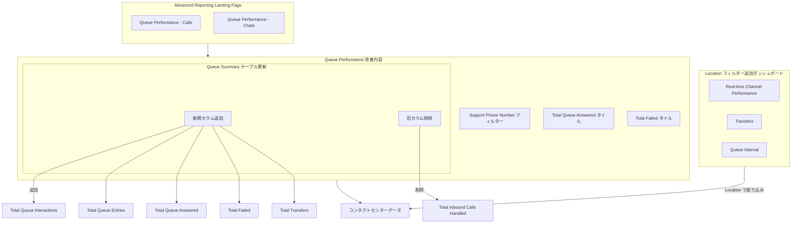

# Google Cloud Contact Center as a Service (CCaaS): Advanced Reporting Dashboards 4.22

**リリース日**: 2026-05-27

**サービス**: Google Cloud Contact Center as a Service (CCaaS) / CCAI Platform

**機能**: Advanced Reporting Dashboards 4.22

**ステータス**: Released

[このアップデートのインフォグラフィックを見る](https://takech9203.github.io/google-cloud-news-summary/20260527-ccaas-advanced-reporting-dashboards-4-22.html)

## 概要

Google Cloud Contact Center AI Platform (CCAI Platform) の Advanced Reporting Dashboards がバージョン 4.22 にアップデートされました。本リリースでは、複数のダッシュボードへの Location フィルターの追加、Queue Performance ダッシュボードの大幅な改善、および一般的なダッシュボード更新が含まれています。

このアップデートは、コンタクトセンターの運用管理者やスーパーバイザーを主な対象としており、ロケーション別のパフォーマンス分析や、キューのパフォーマンスメトリクスの可視性向上を実現します。特に複数拠点でコンタクトセンターを運用する組織にとって、拠点ごとのパフォーマンス比較やリソース配分の最適化に大きく貢献する機能強化です。

**アップデート前の課題**

- Real-time Channel Performance、Transfers、Queue Interval ダッシュボードでは Location による絞り込みができず、複数拠点の個別パフォーマンスを把握するために手動での分析が必要だった
- Queue Performance ダッシュボードが Advanced Reporting Landing Page に統合されておらず、アクセスが分散していた
- キューのインタラクション状況を把握するためのメトリクスが限定的で、失敗したインタラクションやキューに入った総数の追跡が困難だった
- Support Phone Number によるフィルタリングができず、特定の電話番号に関連するキューパフォーマンスの分析が不便だった

**アップデート後の改善**

- 3 つのダッシュボード (Real-time Channel Performance、Transfers、Queue Interval) に Location フィルターが追加され、拠点別の分析が可能になった
- Queue Performance ダッシュボードが Advanced Reporting Landing Page から直接アクセス可能になり、ワークフローが効率化された
- "Total Failed"、"Total Queue Interactions"、"Total Queue Entries"、"Total Queue Answered"、"Total Transfers" など新しいメトリクスが追加され、キューの包括的な分析が可能になった
- Support Phone Number フィルターの追加により、特定のサポート電話番号に基づくパフォーマンス分析が容易になった

## アーキテクチャ図

上図は、Advanced Reporting Dashboards 4.22 で変更されたダッシュボードの構成と、Queue Performance ダッシュボードにおける具体的な改善内容の関係を示しています。

## サービスアップデートの詳細

### 主要機能

1. **Location フィルターの追加**
   - Real-time Channel Performance ダッシュボードに Location フィルターを追加し、拠点別のリアルタイムKPI (通話・チャットパフォーマンス) を確認可能に
   - Transfers ダッシュボードに Location フィルターを追加し、拠点別の転送状況 (ウォーム転送・コールド転送) を分析可能に
   - Queue Interval ダッシュボードに Location フィルターを追加し、拠点別の SLA 達成状況を 30 分間隔で追跡可能に

2. **Queue Performance ダッシュボードの改善**
   - Advanced Reporting Landing Page への統合: Queue Performance - Calls および Queue Performance - Chats ダッシュボードが Landing Page から直接アクセス可能に
   - Support Phone Number フィルターの追加: インバウンドインタラクションに対して、キューに割り当てられた公開サポート電話番号でフィルタリング可能に
   - "Total Inbound Handled" タイル (通話のみ) を "Total Queue Answered" に名称変更し、メトリクスの意味をより明確化
   - "Total Failed" タイルを新規追加し、失敗したインタラクションの総数を可視化

3. **Queue Summary テーブルの更新**
   - "Total Inbound Calls Handled" カラムを削除
   - 以下の新規カラムを追加:
     - Total Queue Interactions: キューで待機したインタラクションの総数
     - Total Queue Entries: キューに入ったエントリの総数
     - Total Queue Answered: キューで応答されたインタラクションの総数
     - Total Failed: 失敗したインタラクションの総数
     - Total Transfers: 転送されたインタラクションの総数

## 技術仕様

### ダッシュボード別の Location フィルター対応状況

| ダッシュボード | Location フィルター | 備考 |
|------|------|------|
| Real-time Channel Performance | v4.22 で追加 | リアルタイム KPI の拠点別表示 |
| Transfers | v4.22 で追加 | 転送状況の拠点別分析 |
| Queue Interval | v4.22 で追加 | SLA の拠点別 30 分間隔追跡 |
| Queue Performance | 既存対応済み | Queue Name、Queue Group でもフィルタ可能 |
| Channel Interval | 既存対応済み | チーム別フィルターも利用可能 |
| All Interactions | 既存対応済み | 複数 Location の選択が可能 |

### Queue Performance タイル一覧 (v4.22 更新後)

| タイル名 | 説明 | 対象 |
|------|------|------|
| SLA % | SLA 閾値内に応答されたインタラクションの割合 | 通話・チャット |
| Total Queue Interactions | キューで待機したインタラクションの数 | 通話・チャット |
| Total Queue Abandons | キューで放棄されたインタラクションの数 | 通話・チャット |
| Total Queue Answered | キューで応答された通話の総数 (旧: Total Inbound Handled) | 通話のみ |
| Total Failed | 失敗したインタラクションの総数 | 通話・チャット |
| Average Handle Time | エージェント割り当てからラップアップ完了までの平均時間 | 通話・チャット |
| Total Callbacks Completed | 完了したコールバックの数 | 通話のみ |
| Sentiment Score | 顧客インタラクションの感情スコア | 通話・チャット |
| CSAT | 顧客満足度スコアの平均 | 通話・チャット |

## 設定方法

### 前提条件

1. CCAI Platform インスタンスが Advanced Reporting 対応リージョン (us-east1、us-central1、us-west1、europe-west2、asia-northeast1、northamerica-northeast1、australia-southeast1) にデプロイされていること
2. Advanced Reporting 拡張機能が有効化されていること
3. ダッシュボード閲覧に必要な IAM 権限が付与されていること

### 手順

#### ステップ 1: Advanced Reporting 拡張機能の有効化確認

Google Cloud コンソールでプロジェクトを選択し、ナビゲーションメニューから CCAI Platform をクリックします。対象インスタンスの Detail ページで Edit > Configure extensions を選択し、Advanced reporting チェックボックスが有効であることを確認します。

#### ステップ 2: Queue Performance ダッシュボードへのアクセス

CCAI Platform ポータルで Dashboard > Advanced Reporting をクリックし、Advanced Reporting Landing Page にアクセスします。新たに追加された Queue Performance / Calls または Queue Performance / Chats をクリックしてダッシュボードを開きます。

#### ステップ 3: Location フィルターの使用

対象ダッシュボード (Real-time Channel Performance、Transfers、Queue Interval) を開き、フィルター欄の Location ドロップダウンから 1 つまたは複数のロケーションを選択して Update または Reload をクリックします。

## メリット

### ビジネス面

- **拠点別パフォーマンス可視化**: 複数のコンタクトセンター拠点を運用する組織が、各拠点のリアルタイムパフォーマンスや転送状況、SLA 達成状況を個別に分析でき、リソース配分の最適化に活用可能
- **運用効率の向上**: Queue Performance ダッシュボードが Advanced Reporting Landing Page に統合されたことで、管理者のダッシュボード間のナビゲーションが効率化され、日常の運用モニタリングが迅速化
- **障害の早期検知**: Total Failed メトリクスにより、失敗したインタラクションを即座に把握し、サービス品質の低下を早期に検知・対応可能

### 技術面

- **メトリクスの粒度向上**: Queue Summary テーブルに 5 つの新カラムが追加され、キューのライフサイクル全体 (入場、待機、応答、失敗、転送) を包括的に追跡可能
- **フィルタリング精度の改善**: Support Phone Number フィルターにより、特定のサポート番号に関連するインタラクションのパフォーマンスを正確に分析可能
- **命名の明確化**: "Total Inbound Handled" から "Total Queue Answered" への名称変更により、メトリクスの定義が直感的になり、レポーティングの正確性が向上

## デメリット・制約事項

### 制限事項

- Advanced Reporting ダッシュボードは対応リージョン (7 リージョン) でのみ利用可能であり、対応リージョン外のインスタンスでは使用不可
- ダッシュボードの最大日付範囲は 45 日間に制限されており、それを超える期間を指定するとエラーが発生する
- Advanced Reporting を有効化すると、レガシーの CCAI Platform ダッシュボードは利用不可になる

### 考慮すべき点

- "Total Inbound Handled" から "Total Queue Answered" への名称変更により、既存のレポーティングワークフローやドキュメントの更新が必要になる可能性がある
- Queue Summary テーブルから "Total Inbound Calls Handled" カラムが削除されているため、このカラムに依存するカスタムレポートやエクスポートプロセスの見直しが必要
- カスタムロールの権限設定が Advanced Reporting の有効化・無効化の影響を受ける可能性があるため、切り替え後に権限を確認する必要がある

## ユースケース

### ユースケース 1: 複数拠点のリアルタイムパフォーマンス比較

**シナリオ**: 日本国内に東京・大阪・福岡の 3 拠点にコンタクトセンターを展開する企業が、各拠点のリアルタイムパフォーマンスを比較してリソースの最適配分を判断する。

**効果**: Real-time Channel Performance ダッシュボードの Location フィルターを使用することで、拠点ごとの通話・チャットのリアルタイム KPI を即座に比較し、トラフィックの偏りがある場合にルーティング調整やスタッフィング変更を迅速に実施できる。

### ユースケース 2: キューのインタラクションライフサイクル分析

**シナリオ**: カスタマーサポート部門のマネージャーが、特定のキューにおけるインタラクションの成功率と失敗率を分析し、問題のあるキューを特定する。

**効果**: Queue Performance ダッシュボードの新しい "Total Failed" タイルと Queue Summary テーブルの "Total Queue Interactions"、"Total Queue Answered"、"Total Failed" カラムを活用することで、キューごとの成功率を定量的に把握し、失敗が多いキューの原因調査と改善策の立案が可能になる。

### ユースケース 3: サポート電話番号別のパフォーマンス追跡

**シナリオ**: 製品別に異なるサポート電話番号を公開している企業が、各電話番号のパフォーマンスを追跡して製品別のサポート品質を評価する。

**効果**: Queue Performance ダッシュボードの Support Phone Number フィルターにより、各サポート電話番号に関連するキューのパフォーマンス (応答率、失敗率、平均対応時間) を個別に分析でき、製品別のサポート体制の強弱を把握して適切なリソース配分が行える。

## 利用可能リージョン

Advanced Reporting ダッシュボードは以下のリージョンで利用可能です:

| リージョン | ロケーション |
|------|------|
| us-east1 | サウスカロライナ (米国) |
| us-central1 | アイオワ (米国) |
| us-west1 | オレゴン (米国) |
| europe-west2 | ロンドン (英国) |
| asia-northeast1 | 東京 (日本) |
| northamerica-northeast1 | モントリオール (カナダ) |
| australia-southeast1 | シドニー (オーストラリア) |

## 関連サービス・機能

- **CCAI Platform Agent Adapter**: エージェントがリアルタイムで通話・チャットを処理するためのインターフェース。ダッシュボードのメトリクスはエージェントのパフォーマンスと直結
- **Queue Monitoring ダッシュボード**: キューのリアルタイム監視に特化したダッシュボード。Queue Performance と併用することで包括的なキュー管理が可能
- **Channel Interval ダッシュボード**: 30 分間隔でチャネル KPI を表示し、トレンド分析やリソース計画に活用。Queue Interval と組み合わせて多角的な時系列分析が可能
- **Virtual Agent (Dialogflow)**: バーチャルエージェントのパフォーマンスも Advanced Reporting で追跡可能であり、人的エージェントとの連携状況を分析可能

## 参考リンク

- [インフォグラフィック](https://takech9203.github.io/google-cloud-news-summary/20260527-ccaas-advanced-reporting-dashboards-4-22.html)
- [公式リリースノート](https://docs.cloud.google.com/release-notes#May_27_2026)
- [Queue Performance ダッシュボード ドキュメント](https://docs.cloud.google.com/contact-center/ccai-platform/docs/dashboards-queue-performance)
- [Real-time Channel Performance ダッシュボード ドキュメント](https://docs.cloud.google.com/contact-center/ccai-platform/docs/dashboards-real-time-channel-perf)
- [Transfers ダッシュボード ドキュメント](https://docs.cloud.google.com/contact-center/ccai-platform/docs/dashboards-transfers)
- [Queue Interval ダッシュボード ドキュメント](https://docs.cloud.google.com/contact-center/ccai-platform/docs/dashboards-queue-interval)
- [Advanced Reporting 概要](https://docs.cloud.google.com/contact-center/ccai-platform/docs/dashboards-overview)

## まとめ

Advanced Reporting Dashboards 4.22 は、コンタクトセンターの運用可視性を大幅に向上させるアップデートです。特に Location フィルターの 3 ダッシュボードへの追加は、複数拠点を運用する組織にとって待望の機能であり、拠点別のパフォーマンス分析とリソース最適化を促進します。また、Queue Performance ダッシュボードの改善により、キューのライフサイクル全体を追跡するメトリクスが充実し、問題の早期検知と対応が容易になりました。CCAI Platform をご利用の組織は、ダッシュボードの名称変更やカラム変更に伴う既存レポーティングプロセスの確認と更新を推奨します。

---

**タグ**: #CCaaS #CCAI-Platform #ContactCenter #Reporting #Dashboard #Analytics #QueuePerformance #LocationFilter
