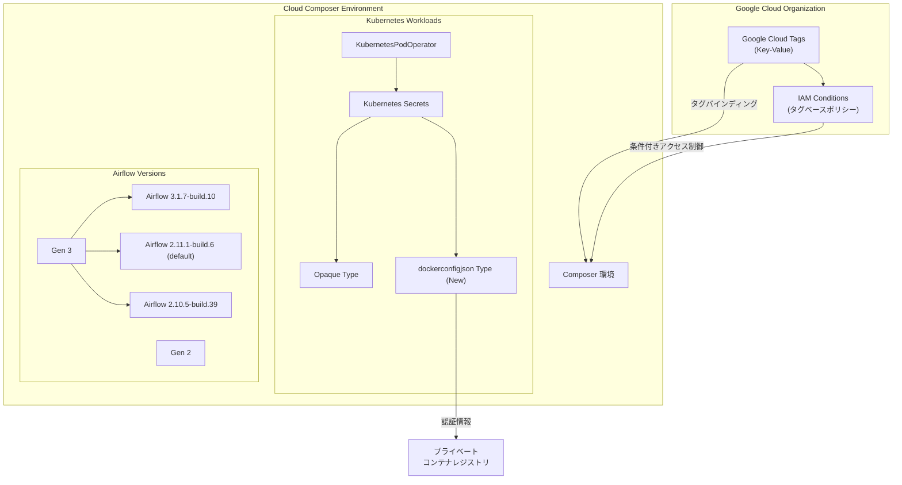

# Cloud Composer: Managed Airflow 2026年5月リリース - タグサポート、Kubernetes Secrets 拡張、新ビルド提供

**リリース日**: 2026-05-27

**サービス**: Cloud Composer (Managed Service for Apache Airflow)

**機能**: Google Cloud タグサポート、dockerconfigjson シークレットタイプ、新 Airflow ビルド

**ステータス**: ロールアウト中 (全リージョンへ順次展開)

📊 [このアップデートのインフォグラフィックを見る](https://takech9203.github.io/google-cloud-news-summary/20260527-cloud-composer-airflow-release-may-27.html)

## 概要

2026年5月27日、Cloud Composer (Managed Service for Apache Airflow) の新しいリリースが開始されました。本リリースでは、環境に対する Google Cloud タグのサポート、Kubernetes Secrets における `dockerconfigjson` シークレットタイプの追加、Airflow UI のログレベルフィルタ修正、および複数の新しい Airflow ビルドが提供されています。

本リリースの最大のハイライトは、Cloud Composer 環境への Google Cloud タグサポートです。タグを使用することで、リソースにアノテーションを付与し、特定のタグの有無に基づいて IAM ポリシーを条件付きで許可または拒否できるようになります。これにより、大規模な組織における Cloud Composer 環境のガバナンスとアクセス制御が大幅に強化されます。

また、Managed Airflow (Gen 3) では、Kubernetes Secrets で `kubernetes.io/dockerconfigjson` タイプのシークレットを beta Cloud Composer API 経由で作成できるようになりました。これにより、プライベートコンテナレジストリからのイメージプルに必要な認証情報の管理がより簡単になります。

**アップデート前の課題**

- Cloud Composer 環境にタグを付与できず、タグベースの IAM 条件付きアクセス制御が利用できなかった
- Gen 3 環境では Kubernetes Secrets の作成時に Opaque タイプのみサポートされており、Docker レジストリ認証情報の管理に追加のワークアラウンドが必要だった
- Airflow 3 の UI でログレベルフィルタの INFO を選択しても正しくフィルタリングされない問題があった
- 旧バージョンの Airflow ビルドが引き続きサポート対象とされており、セキュリティパッチの適用負担が増加していた

**アップデート後の改善**

- Google Cloud タグを Cloud Composer 環境に付与し、タグベースの IAM 条件付きポリシーで細かなアクセス制御が可能になった
- `dockerconfigjson` シークレットタイプが Gen 3 でサポートされ、プライベートレジストリへの認証設定が簡素化された
- Airflow 3 UI の INFO ログレベルフィルタが正常に動作するようになった
- 最新の Airflow 3.1.7 ビルドを含む新しいビルドが利用可能になり、最新機能とセキュリティパッチが適用された

## アーキテクチャ図



Cloud Composer 環境に対する Google Cloud タグの適用フローと、Kubernetes Secrets の新しいシークレットタイプの関係を示しています。タグベースの IAM 条件付きポリシーにより、環境へのアクセスをきめ細かく制御できます。

## サービスアップデートの詳細

### 主要機能

1. **Google Cloud タグサポート**
   - Cloud Composer 環境に Google Cloud タグを付与可能になった
   - タグはキーと値のペアで構成され、リソースにアノテーションとして付与される
   - IAM 条件と組み合わせて、タグの有無に基づいたアクセス制御ポリシーの設定が可能
   - `gcloud resource-manager tags bindings create` コマンドでタグバインディングを作成
   - Gen 2、Gen 3 の両方で利用可能

2. **Kubernetes Secrets の dockerconfigjson タイプサポート (Gen 3)**
   - Managed Airflow (Gen 3) で `kubernetes.io/dockerconfigjson` シークレットタイプが利用可能
   - beta Cloud Composer API 経由でのシークレット作成に対応
   - 従来の Opaque シークレットタイプに加えて利用可能
   - プライベートコンテナレジストリの認証情報を Kubernetes 標準形式で管理

3. **Airflow 3 UI ログフィルタ修正**
   - Airflow 3 の UI で INFO ログレベルフィルタが正しく動作しない問題が修正
   - INFO レベルのログメッセージが正確に表示されるようになった

### バージョンアップデート

4. **Managed Airflow (Gen 3) 新ビルド**
   - `composer-3-airflow-3.1.7-build.10`: 最新の Airflow 3.x 系ビルド
   - `composer-3-airflow-2.11.1-build.6`: デフォルトビルド
   - `composer-3-airflow-2.10.5-build.39`: Airflow 2.10.x 系の最新ビルド

5. **Managed Airflow (Gen 2) 新イメージ**
   - `composer-2.17.3-airflow-2.11.1`: デフォルトイメージ
   - `composer-2.17.3-airflow-2.10.5`: Airflow 2.10.x 系の最新イメージ

### 非推奨化 (Deprecated)

6. **サポート終了バージョン**
   - `composer-3-airflow-2.9.3-build.24` (Gen 3)
   - `composer-2.13.2-airflow-2.9.3` (Gen 2)
   - `composer-2.13.2-airflow-2.10.5` (Gen 2)
   - これらのバージョンはサポート終了期間に到達しており、アップグレードが必要

## 技術仕様

### Airflow ビルドバージョン一覧

| 世代 | バージョン | ステータス |
|------|-----------|-----------|
| Gen 3 | composer-3-airflow-3.1.7-build.10 | 利用可能 |
| Gen 3 | composer-3-airflow-2.11.1-build.6 | デフォルト |
| Gen 3 | composer-3-airflow-2.10.5-build.39 | 利用可能 |
| Gen 2 | composer-2.17.3-airflow-2.11.1 | デフォルト |
| Gen 2 | composer-2.17.3-airflow-2.10.5 | 利用可能 |

### サポート終了バージョン

| 世代 | バージョン | ステータス |
|------|-----------|-----------|
| Gen 3 | composer-3-airflow-2.9.3-build.24 | サポート終了 |
| Gen 2 | composer-2.13.2-airflow-2.9.3 | サポート終了 |
| Gen 2 | composer-2.13.2-airflow-2.10.5 | サポート終了 |

### 必要な IAM ロール (タグ管理)

| ロール | 説明 |
|--------|------|
| `roles/resourcemanager.tagViewer` | タグの表示 |
| `roles/resourcemanager.tagAdmin` | タグ定義の作成・更新・削除 |
| `roles/resourcemanager.tagUser` | リソースへのタグの付与・削除 |
| `roles/composer.admin` | Composer 環境へのタグ付与に必要 |

## 設定方法

### 前提条件

1. Google Cloud プロジェクトが作成済みであること
2. Cloud Composer API が有効化されていること
3. 適切な IAM ロール (`roles/composer.admin`, `roles/resourcemanager.tagUser`) が付与されていること
4. タグキーとタグ値が組織レベルで事前に作成されていること

### 手順

#### ステップ 1: タグキーとタグ値の作成

```bash
# タグキーの作成
gcloud resource-manager tags keys create environment-type \
  --parent=organizations/ORGANIZATION_ID \
  --description="Cloud Composer 環境の種別"

# タグ値の作成
gcloud resource-manager tags values create production \
  --parent=tagKeys/TAG_KEY_ID \
  --description="本番環境"
```

組織レベルでタグのキーと値を定義します。

#### ステップ 2: Cloud Composer 環境にタグを付与

```bash
# タグバインディングの作成
gcloud resource-manager tags bindings create \
  --tag-value=tagValues/TAG_VALUE_ID \
  --parent="//composer.googleapis.com/projects/PROJECT_ID/locations/LOCATION/environments/ENVIRONMENT_NAME" \
  --location=LOCATION
```

既存の Cloud Composer 環境にタグを付与します。

#### ステップ 3: dockerconfigjson シークレットの作成 (Gen 3)

```bash
# Docker レジストリ認証情報用の YAML ファイル作成
cat <<EOF > docker-secret.yaml
apiVersion: v1
kind: Secret
metadata:
  name: my-registry-credentials
type: kubernetes.io/dockerconfigjson
data:
  .dockerconfigjson: BASE64_ENCODED_DOCKER_CONFIG
EOF

# beta Cloud Composer API を使用してシークレットを作成
gcloud beta composer environments user-workloads-secrets create \
  --environment=ENVIRONMENT_NAME \
  --location=LOCATION \
  --source=docker-secret.yaml
```

プライベートレジストリの認証情報を `dockerconfigjson` タイプの Kubernetes Secret として作成します。

#### ステップ 4: DAG での Kubernetes Secret の使用

```python
from airflow.providers.cncf.kubernetes.operators.kubernetes_pod import KubernetesPodOperator
from kubernetes.client import models as k8s

# dockerconfigjson シークレットを imagePullSecrets として使用
pod_operator = KubernetesPodOperator(
    task_id="pull-from-private-registry",
    name="private-registry-task",
    namespace="composer-user-workloads",
    image="my-private-registry.example.com/my-image:latest",
    image_pull_secrets=[k8s.V1LocalObjectReference(name="my-registry-credentials")],
    startup_timeout_seconds=300,
)
```

作成したシークレットを KubernetesPodOperator で参照し、プライベートレジストリからイメージをプルします。

## メリット

### ビジネス面

- **ガバナンス強化**: Google Cloud タグにより、組織全体で Cloud Composer 環境の分類と管理ポリシーの適用が容易になる
- **コンプライアンス対応**: タグベースの IAM 条件により、環境ごとのアクセス制御が厳密化され、監査要件への対応が向上
- **運用効率向上**: `dockerconfigjson` シークレットタイプのサポートにより、プライベートレジストリとの連携設定が簡素化され、運用負荷が軽減
- **最新機能の活用**: Airflow 3.1.7 ビルドの提供により、最新のワークフローオーケストレーション機能が利用可能

### 技術面

- **Kubernetes ネイティブ対応**: `dockerconfigjson` タイプにより、Kubernetes 標準のイメージプルシークレットとして直接利用でき、追加のワークアラウンドが不要
- **API 経由の管理**: beta Cloud Composer API でシークレットを管理でき、Infrastructure as Code との統合が容易
- **デバッグ効率向上**: Airflow 3 UI のログフィルタ修正により、問題調査時の効率が改善
- **セキュリティ強化**: 新ビルドに最新のセキュリティパッチが含まれ、既知の脆弱性への対応が完了

## デメリット・制約事項

### 制限事項

- 本リリースは全リージョンに順次展開中であり、一部のリージョンでは機能がまだ利用できない可能性がある
- `dockerconfigjson` シークレットタイプは Gen 3 のみで利用可能 (beta API 経由)
- タグの利用には組織レベルでのタグ定義の事前設定が必要
- サポート終了バージョン (`composer-3-airflow-2.9.3-build.24`, `composer-2.13.2-airflow-2.9.3`, `composer-2.13.2-airflow-2.10.5`) を使用中の環境はアップグレードが必須

### 考慮すべき点

- サポート終了バージョンからのアップグレード時に、DAG の互換性テストが必要
- Airflow 2.9.x から 2.10.x/2.11.x へのアップグレードでは、非推奨 API の変更に注意が必要
- タグベースの IAM ポリシーを導入する際は、既存のアクセスパターンへの影響を事前に評価すること
- beta API で作成されたシークレットは、GA 時に仕様変更の可能性がある

## ユースケース

### ユースケース 1: マルチチーム環境のアクセス制御

**シナリオ**: 大規模組織で複数チームが Cloud Composer を利用しており、各チームが自分の環境のみにアクセスできるよう制限したい。

**実装例**:
```bash
# チーム A の環境にタグを付与
gcloud resource-manager tags bindings create \
  --tag-value=tagValues/TEAM_A_VALUE_ID \
  --parent="//composer.googleapis.com/projects/my-project/locations/us-central1/environments/team-a-composer" \
  --location=us-central1

# IAM 条件付きロールバインディングの設定
gcloud projects add-iam-policy-binding my-project \
  --member="group:team-a@example.com" \
  --role="roles/composer.user" \
  --condition='expression=resource.matchTag("ORGANIZATION_ID/team", "team-a"),title=team-a-access'
```

**効果**: チームごとに独立したアクセス制御が実現され、誤操作による他チーム環境への影響を防止できる。

### ユースケース 2: プライベートレジストリからの ML モデルイメージ取得

**シナリオ**: ML パイプラインで、社内プライベートレジストリに格納されたカスタム ML モデルコンテナを KubernetesPodOperator で実行したい。

**実装例**:
```python
from airflow.providers.cncf.kubernetes.operators.kubernetes_pod import KubernetesPodOperator
from kubernetes.client import models as k8s

ml_training = KubernetesPodOperator(
    task_id="ml-model-training",
    name="ml-training-pod",
    namespace="composer-user-workloads",
    image="private-registry.example.com/ml-models/training:v2.1",
    image_pull_secrets=[k8s.V1LocalObjectReference(name="my-registry-credentials")],
    resources=k8s.V1ResourceRequirements(
        requests={"memory": "4Gi", "cpu": "2"},
        limits={"memory": "8Gi", "cpu": "4"},
    ),
    startup_timeout_seconds=600,
)
```

**効果**: プライベートレジストリへの認証が Kubernetes 標準の仕組みで管理され、セキュアかつ運用しやすい ML パイプラインが構築できる。

### ユースケース 3: 環境分類による本番/開発環境のポリシー分離

**シナリオ**: 本番環境と開発環境で異なるセキュリティポリシーを適用し、本番環境への変更を限定したメンバーのみに許可したい。

**効果**: タグベースの条件付きポリシーにより、本番環境への書き込みアクセスを SRE チームのみに制限し、開発者は開発環境のみで作業できるようになる。

## 料金

Cloud Composer の料金は環境の世代、SKU、使用するリソースによって決まります。今回のアップデートに伴う追加料金はありません。

### 料金例

| 項目 | 月額料金 (概算) |
|------|----------------|
| Composer 3 (Small) | 約 $450/月〜 |
| Composer 3 (Medium) | 約 $900/月〜 |
| Composer 2 (Small) | 約 $400/月〜 |
| Composer 2 (Medium) | 約 $800/月〜 |

※ Google Cloud タグの使用自体に追加料金はかかりません。Kubernetes Secrets の追加にも追加料金は発生しません。

## 利用可能リージョン

本リリースは全リージョンに順次展開中です。現時点で一部のリージョンではまだ利用できない可能性があります。Cloud Composer がサポートする全リージョンで順次利用可能になります。最新の対応状況は Cloud Composer のドキュメントを参照してください。

## 関連サービス・機能

- **Google Cloud Resource Manager**: タグの作成・管理を行うサービス。タグキーとタグ値の定義に使用
- **IAM (Identity and Access Management)**: タグベースの条件付きロールバインディングでアクセス制御を実現
- **Artifact Registry / Container Registry**: `dockerconfigjson` シークレットで認証するプライベートコンテナレジストリ
- **Google Kubernetes Engine (GKE)**: Cloud Composer のワーカーノードが稼働する基盤
- **KubernetesPodOperator**: Kubernetes Secrets を利用してカスタムコンテナを実行する Airflow オペレータ

## 参考リンク

- 📊 [インフォグラフィック](https://takech9203.github.io/google-cloud-news-summary/20260527-cloud-composer-airflow-release-may-27.html)
- [公式リリースノート](https://docs.cloud.google.com/release-notes#May_27_2026)
- [Cloud Composer タグの管理](https://docs.cloud.google.com/composer/docs/composer-3/create-and-manage-tags)
- [Kubernetes Secrets の管理 (Gen 3)](https://docs.cloud.google.com/composer/docs/composer-3/use-kubernetes-pod-operator#api)
- [Cloud Composer バージョン一覧](https://docs.cloud.google.com/composer/docs/composer-versions)
- [Cloud Composer 料金](https://cloud.google.com/composer/pricing)
- [タグの概要](https://docs.cloud.google.com/resource-manager/docs/tags/tags-overview)

## まとめ

本リリースは、Cloud Composer の運用管理とセキュリティを強化する重要なアップデートです。Google Cloud タグのサポートにより、大規模組織でのガバナンスとアクセス制御が大幅に向上し、`dockerconfigjson` シークレットタイプの追加によりプライベートレジストリとの連携が Kubernetes ネイティブな方法で簡素化されます。サポート終了バージョンを利用中の場合は、早急に新しいバージョンへのアップグレード計画を策定することを推奨します。

---

**タグ**: #CloudComposer #ApacheAirflow #GoogleCloudTags #KubernetesSecrets #IAM #ワークフローオーケストレーション #ManagedAirflow #Gen3 #Airflow3
