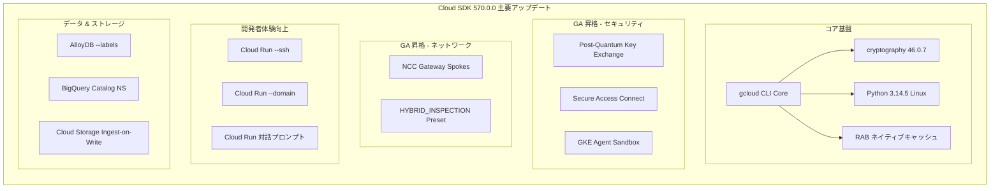

# Cloud SDK: Cloud SDK 570.0.0 リリース

**リリース日**: 2026-05-27

**サービス**: Cloud SDK

**機能**: Cloud SDK 570.0.0 release

**ステータス**: GA

[このアップデートのインフォグラフィックを見る](https://takech9203.github.io/google-cloud-news-summary/20260527-cloud-sdk-570.html)

## 概要

Google Cloud SDK 570.0.0 がリリースされました。本リリースは、gcloud CLI コアのセキュリティ強化、Linux バンドル Python の 3.14.5 へのアップデート、Regional Access Boundary (RAB) データのネイティブキャッシュ対応など、プラットフォーム基盤の大幅な改善を含んでいます。

さらに、Compute Engine における Post-Quantum Key Exchange の GA 昇格、GKE Agent Sandbox の GA 昇格、Network Connectivity の spokes gateways GA 昇格、Network Security の Secure Access Connect GA 昇格など、多数のサービスが一般提供に移行しました。Cloud Run では SSH 接続やカスタムドメイン設定の新フラグが追加され、開発者エクスペリエンスが大幅に改善されています。

本リリースは、セキュリティ強化、運用効率化、開発者体験の向上の 3 つの柱で構成されており、Solutions Architect にとって特に注目すべきアップデートが多数含まれています。

**アップデート前の課題**

- Windows 環境の暗号ライブラリが古いバージョンのままで、最新のセキュリティ要件に対応できていなかった
- Regional Access Boundary (RAB) データの管理が認証キャッシュとは別のメカニズムで行われ、運用が複雑だった
- Cloud Run サービスへの SSH 接続やカスタムドメイン設定には追加の手順やツールが必要だった
- GKE での AI エージェントのサンドボックス実行がベータ段階で、本番環境での採用に慎重さが求められた
- ポスト量子暗号鍵交換が GA 前のため、将来の量子コンピュータ脅威への対策が限定的だった

**アップデート後の改善**

- Windows バンドル Python が cryptography 46.0.7 と pyOpenSSL 26.0.0 に更新され、最新の暗号化標準に対応
- RAB データが gcloud CLI 認証キャッシュにネイティブ統合され、トークン更新と一体化した管理が可能に
- Cloud Run の `--ssh` フラグと `--domain` フラグにより、デプロイ時のセットアップが大幅に簡素化
- GKE Agent Sandbox が GA に昇格し、本番環境での信頼性の低いコード実行が安全に利用可能に
- Post-Quantum Key Exchange が GA となり、量子耐性のある通信が本番利用可能に

## アーキテクチャ図



本図は Cloud SDK 570.0.0 の主要アップデートを 5 つのカテゴリに分類して示しています。コア基盤の改善が全体のセキュリティと安定性を底上げし、各サービスの GA 昇格と新機能が重層的に展開されています。

## サービスアップデートの詳細

### GA 昇格 (本番利用推奨)

1. **Compute Engine: Post-Quantum Key Exchange**
   - 量子コンピュータによる将来の脅威に対応するポスト量子暗号鍵交換が一般提供に移行
   - NIST 標準に準拠した鍵交換プロトコルにより、長期的なデータ保護を実現
   - 既存のワークロードに影響なく有効化可能

2. **GKE: Agent Sandbox (`--enable-agent-sandbox`)**
   - gVisor ベースのサンドボックス環境で AI エージェントが生成するコードを安全に実行
   - SandboxTemplate、SandboxWarmPool による事前ウォーミングでコールドスタートを最小化
   - Autopilot クラスタおよび Standard クラスタの両方で利用可能

3. **Network Connectivity: Spokes Gateways**
   - NCC Gateway spokes が GA に昇格し、ハイブリッド接続のセキュリティ機能が本番利用可能に
   - HYBRID_INSPECTION プリセットトポロジによる統合的なトラフィック検査が利用可能

4. **Network Security: Secure Access Connect**
   - サードパーティ SSE (Security Service Edge) 製品との統合が GA に
   - Symantec Cloud SWG、Palo Alto Networks Prisma Access との接続をサポート
   - NCC Gateway と連携した統合セキュリティアーキテクチャの本番運用が可能

### 新機能・改善

5. **Cloud Run: デプロイ体験の刷新**
   - `--ssh` フラグ: Cloud Run サービスへの直接 SSH 接続が可能に
   - `--domain` フラグ: デプロイ時にカスタムドメインを直接指定可能
   - 対話型プロンプト: デプロイ時に不足情報を対話的に補完

6. **BigQuery: カタログ名前空間とアクセス制御**
   - カタログ名前空間テーブル識別子のサポート
   - 行アクセスポリシーの改善
   - 予約割り当ての改善

7. **Cloud Storage: Anywhere Caches のインジェスト書き込み**
   - `--enable-ingest-on-write` フラグにより、書き込み時に自動的にキャッシュへデータ配置
   - エッジロケーションでの読み取りレイテンシを大幅に削減

### ベータ昇格・新規ベータ

8. **BigLake: Hive カタログ/データベース (Beta)**
   - Hive メタストア互換のカタログとデータベースがベータに昇格
   - Iceberg カタログの改善

9. **Compute Engine: Capacity Advice (Beta)**
   - VM インスタンスのリソース可用性を事前に確認するアドバイス機能
   - Spot VM および Flex Start VM の最適な配置戦略を提案

10. **Compute Engine: Org Rollouts (Beta)**
    - 組織レベルでのロールアウト管理機能がベータに昇格

## 技術仕様

### コア基盤の変更

| 項目 | 変更前 | 変更後 |
|------|--------|--------|
| Windows バンドル Python (cryptography) | 旧バージョン | 46.0.7 |
| Windows バンドル Python (pyOpenSSL) | 旧バージョン | 26.0.0 |
| Linux バンドル Python | 旧バージョン | 3.14.5 |
| Windows PuTTY | v0.82+ | v0.81 (リバート) |
| RAB データキャッシュ | 外部管理 | gcloud 認証キャッシュ統合 |

### サービス別フラグ追加

| サービス | フラグ | 用途 |
|----------|--------|------|
| AlloyDB | `--labels` | インスタンスへのラベル付与 |
| Cloud Run | `--ssh` | SSH 接続の有効化 |
| Cloud Run | `--domain` | カスタムドメイン指定 |
| Cloud Spanner | `--labels` | インスタンスへのラベル付与 |
| Cloud Storage | `--enable-ingest-on-write` | Anywhere Caches の書き込み時インジェスト |
| Cloud Workstations | `--disk-archive-timeout` | ディスクアーカイブタイムアウト設定 |

### GKE Agent Sandbox 設定例

```yaml
apiVersion: agents.x-k8s.io/v1alpha1
kind: Sandbox
metadata:
  name: my-agent-sandbox
spec:
  replicas: 1
  podTemplate:
    spec:
      runtimeClassName: gvisor
      automountServiceAccountToken: false
      securityContext:
        runAsNonRoot: true
      nodeSelector:
        sandbox.gke.io/runtime: gvisor
      tolerations:
        - key: "sandbox.gke.io/runtime"
          value: "gvisor"
          effect: "NoSchedule"
      containers:
        - name: agent-runtime
          image: your-agent-image:latest
          securityContext:
            capabilities:
              drop: ["ALL"]
          resources:
            limits:
              cpu: "500m"
              memory: "1Gi"
```

## 設定方法

### 前提条件

1. 既存の Cloud SDK がインストールされていること
2. 適切な IAM 権限が付与されていること

### 手順

#### ステップ 1: Cloud SDK のアップデート

```bash
# Cloud SDK を 570.0.0 にアップデート
gcloud components update --version=570.0.0

# バージョン確認
gcloud version
```

アップデート後、すべてのコンポーネントが 570.0.0 に更新されます。

#### ステップ 2: Post-Quantum Key Exchange の確認

```bash
# Compute Engine インスタンスへの SSH 接続時に自動的に適用
gcloud compute ssh my-instance --zone=us-central1-a
```

Post-Quantum Key Exchange は自動的に有効化されるため、特別な設定は不要です。

#### ステップ 3: GKE Agent Sandbox の有効化

```bash
# 新規 Autopilot クラスタで有効化
gcloud container clusters create-auto my-cluster \
  --location=us-central1 \
  --enable-agent-sandbox

# 既存クラスタで有効化
gcloud container clusters update my-cluster \
  --location=us-central1 \
  --enable-agent-sandbox
```

Agent Sandbox が有効化されると、gVisor ベースの隔離環境で AI エージェントのコード実行が可能になります。

#### ステップ 4: Cloud Run SSH 接続

```bash
# SSH フラグ付きでデプロイ
gcloud run deploy my-service \
  --image=us-docker.pkg.dev/project/repo/image \
  --ssh

# カスタムドメイン付きでデプロイ
gcloud run deploy my-service \
  --image=us-docker.pkg.dev/project/repo/image \
  --domain=api.example.com
```

## メリット

### ビジネス面

- **将来の量子脅威への先行対策**: Post-Quantum Key Exchange の GA 化により、量子コンピュータが実用化された場合のリスクを事前に軽減し、コンプライアンス要件への対応が容易に
- **AI エージェント運用の本番化**: GKE Agent Sandbox の GA により、AI エージェントが生成する不確実なコードを安全に実行でき、AI ワークロードの本番展開が加速
- **ハイブリッドセキュリティの統合**: Secure Access Connect GA により、既存のセキュリティスタック (Palo Alto、Symantec) と Google Cloud のネイティブ統合が本番レベルで実現

### 技術面

- **認証キャッシュの効率化**: RAB データのネイティブ統合により、Regional Access Boundary のトークン管理が自動化され、マルチリージョン環境での認証オーバーヘッドが削減
- **暗号ライブラリの最新化**: cryptography 46.0.7 への更新により、最新の TLS/SSL 標準に対応し、脆弱性リスクを低減
- **開発者ループの短縮**: Cloud Run の SSH/domain フラグと対話型プロンプトにより、デプロイ設定の試行錯誤が大幅に削減

## デメリット・制約事項

### 制限事項

- Windows PuTTY は v0.81 にリバートされているため、v0.82 以降の機能は利用不可
- GKE Agent Sandbox は GKE バージョン 1.35.2-gke.1269000 以降が必要
- Secure Access Connect は現時点で Symantec Cloud SWG と Palo Alto Networks Prisma Access のみをサポート

### 考慮すべき点

- Linux バンドル Python 3.14.5 へのアップデートにより、古い Python スクリプトとの互換性に注意が必要
- Post-Quantum Key Exchange は自動適用されるため、ネットワーク監視ツールの暗号スイート検出に影響する可能性がある
- Cloud SDK のメジャーアップデート前に、既存の CI/CD パイプラインでの動作検証を推奨

## ユースケース

### ユースケース 1: AI エージェントの安全な本番運用

**シナリオ**: LLM ベースの AI エージェントがユーザーリクエストに応じてコードを動的に生成・実行するシステムを GKE 上で運用する場合

**実装例**:
```bash
# Agent Sandbox を有効化したクラスタ作成
gcloud container clusters create-auto ai-agent-cluster \
  --location=us-central1 \
  --enable-agent-sandbox

# SandboxTemplate をデプロイして事前ウォーミング
kubectl apply -f sandbox-template.yaml
kubectl apply -f sandbox-warmpool.yaml
```

**効果**: gVisor による強力な隔離により、悪意のあるコードや予期しない動作からホストシステムを保護しつつ、SandboxWarmPool による事前ウォーミングでレイテンシを最小化

### ユースケース 2: ハイブリッド環境の統合セキュリティ

**シナリオ**: オンプレミスのデータセンターと Google Cloud を Cloud Interconnect で接続し、既存の Palo Alto Prisma Access を活用してトラフィック検査を行う

**実装例**:
```bash
# NCC Hub の作成 (HYBRID_INSPECTION プリセット)
gcloud network-connectivity hubs create my-hub \
  --preset-topology=HYBRID_INSPECTION

# NCC Gateway スポーク作成
gcloud network-connectivity spokes gateways create my-gateway-spoke \
  --hub=my-hub \
  --location=us-central1

# Secure Access Connect アタッチメント接続
gcloud network-security secure-access-connect attachments create my-sac \
  --location=us-central1 \
  --gateway-spoke=my-gateway-spoke
```

**効果**: Google Cloud ネイティブの NCC Gateway と既存のセキュリティスタックが統合され、ハイブリッド環境全体で一貫したセキュリティポリシーを適用可能

### ユースケース 3: Cloud Run サービスのデバッグ効率化

**シナリオ**: 本番環境の Cloud Run サービスで発生した問題を SSH で直接接続して調査する

**実装例**:
```bash
# SSH を有効化してデプロイ
gcloud run deploy my-api \
  --image=us-docker.pkg.dev/my-project/repo/api:v2 \
  --ssh \
  --domain=api.mycompany.com
```

**効果**: コンテナ内部への直接アクセスにより、ログだけでは判別困難な問題の迅速な特定と解決が可能に

## 料金

Cloud SDK 自体は無料で提供されます。各サービスの利用料金は個別に発生します。

### 関連サービスの料金参考

| サービス | 料金モデル |
|----------|-----------|
| GKE Agent Sandbox | 追加料金なし (GKE ノードリソースの消費のみ) |
| Compute Engine Post-Quantum | 追加料金なし (標準の通信料金に含まれる) |
| NCC Gateway / Secure Access Connect | NCC およびパートナー SSE の料金体系に準拠 |
| Cloud Run SSH | Cloud Run の標準料金 (インスタンス稼働時間) |

## 利用可能リージョン

Cloud SDK 570.0.0 はグローバルに利用可能です。各サービスのリージョン対応は以下の通りです:

- **GKE Agent Sandbox**: GKE がサポートする全リージョン
- **NCC Gateway / Secure Access Connect**: 対応ロケーション一覧は公式ドキュメント参照
- **Post-Quantum Key Exchange**: Compute Engine がサポートする全リージョン
- **Cloud Run SSH/Domain**: Cloud Run がサポートする全リージョン

## 関連サービス・機能

- **Google Kubernetes Engine (GKE)**: Agent Sandbox の GA 昇格による AI ワークロードのセキュア実行基盤
- **Network Connectivity Center (NCC)**: Gateway spokes と HYBRID_INSPECTION トポロジによるハイブリッド接続管理
- **Secure Access Connect**: サードパーティ SSE との統合によるゼロトラストネットワークアーキテクチャ
- **Cloud Run**: SSH 接続とカスタムドメインフラグによるサーバーレスワークロードの運用改善
- **Compute Engine**: Post-Quantum Key Exchange、Capacity Advice、Org Rollouts による IaaS レイヤーの進化
- **AlloyDB / Cloud Spanner**: ラベル管理によるリソースガバナンスの統一

## 参考リンク

- [インフォグラフィック](https://takech9203.github.io/google-cloud-news-summary/20260527-cloud-sdk-570.html)
- [公式リリースノート](https://docs.cloud.google.com/release-notes#May_27_2026)
- [Cloud SDK ドキュメント](https://cloud.google.com/sdk/docs)
- [Cloud SDK コンポーネント管理](https://cloud.google.com/sdk/docs/components)
- [GKE Agent Sandbox ガイド](https://cloud.google.com/kubernetes-engine/docs/how-to/how-install-agent-sandbox)
- [NCC Gateway 概要](https://cloud.google.com/network-connectivity/docs/network-connectivity-center/concepts/ncc-gateway-overview)
- [Secure Access Connect 概要](https://cloud.google.com/secure-access-connect/docs/overview)

## まとめ

Cloud SDK 570.0.0 は、セキュリティの未来への備え (Post-Quantum Key Exchange GA)、AI ワークロードの安全な本番運用 (GKE Agent Sandbox GA)、ハイブリッド環境の統合セキュリティ (Secure Access Connect / NCC Gateway GA) という 3 つの重要なマイルストーンを達成したリリースです。Solutions Architect は、特に Post-Quantum Key Exchange の自動適用と GKE Agent Sandbox の GA 化を活用した設計の見直しを推奨します。まずは `gcloud components update --version=570.0.0` でアップデートし、新機能の検証を開始してください。

---

**タグ**: #CloudSDK #gcloud #PostQuantum #GKE #AgentSandbox #SecureAccessConnect #NCC #CloudRun #ComputeEngine #セキュリティ #GA昇格
