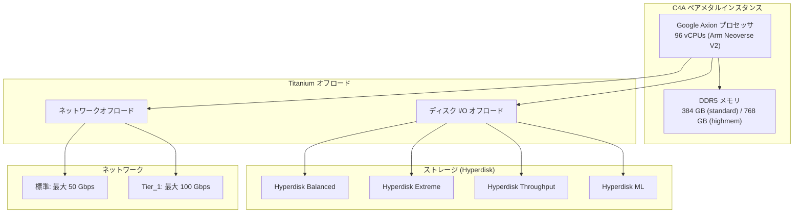

# Compute Engine: C4A ベアメタルマシンタイプが一般提供(GA)開始

**リリース日**: 2026-05-27

**サービス**: Compute Engine

**機能**: C4A bare metal machine types GA

**ステータス**: Generally Available (GA)

📊 [このアップデートのインフォグラフィックを見る](https://takech9203.github.io/google-cloud-news-summary/20260527-compute-engine-c4a-bare-metal-ga.html)

## 概要

Google Cloud は、Google Axion プロセッサを搭載した C4A ベアメタルマシンタイプ 2 種を一般提供(GA)として正式リリースしました。これにより、Arm ベースのベアメタルインスタンスが本番環境で利用可能となり、SLA の適用対象となります。

C4A ベアメタルインスタンスは、ハイパーバイザーを介さずにホストサーバーの CPU とメモリに直接アクセスできるため、サードパーティハイパーバイザーの実行、CPU パフォーマンスに敏感なワークロード、リアルタイム処理などに最適です。Google の独自設計 Arm プロセッサ「Axion」の性能を最大限に活用でき、x86 インスタンスと比較して最大 65% の価格性能比向上を実現します。

今回 GA となった 2 つのマシンタイプは、96 vCPU を備え、DDR5 メモリを搭載しています。standard タイプは 384 GB、highmem タイプは 768 GB のメモリを提供し、最大 100 Gbps のネットワーク帯域幅と複数の Hyperdisk ストレージオプションをサポートします。

**アップデート前の課題**

- C4A ベアメタルはプレビュー段階であり、SLA の適用外で本番利用には不向きだった
- Arm ベースのベアメタルインスタンスを本番環境で利用するには、アクセスリクエストが必要だった
- highmem タイプ(768 GB)のみが利用可能で、standard タイプ(384 GB)は提供されていなかった

**アップデート後の改善**

- 2 つのマシンタイプ(standard と highmem)が GA として利用可能になり、SLA の適用対象となった
- アクセスリクエストなしで誰でも利用開始できるようになった
- Hyperdisk Throughput のサポートが追加され、ストレージオプションが拡充された
- standard タイプ(384 GB)の追加により、メモリ要件に応じた選択肢が広がった

## アーキテクチャ図



C4A ベアメタルインスタンスは、Google Titanium によるネットワークおよびディスク I/O のオフロードにより、ホスト CPU の処理能力をワークロードに集中させる構成となっています。

## サービスアップデートの詳細

### 主要機能

1. **2 種類のベアメタルマシンタイプ**
   - `c4a-standard-96-metal`: 96 vCPUs、384 GB DDR5 メモリ
   - `c4a-highmem-96-metal`: 96 vCPUs、768 GB DDR5 メモリ
   - 専用ホストサーバー上で動作し、他のインスタンスとリソースを共有しない

2. **Google Axion プロセッサ (Arm Neoverse V2)**
   - Google 独自設計の Arm ベース CPU
   - x86 インスタンスと比較して最大 65% の価格性能比向上
   - SMT 非対応(各 vCPU が 1 コア全体に相当)
   - Uniform Memory Access (UMA) による一貫したパフォーマンス

3. **Titanium プラットフォーム**
   - ネットワーク処理と Titanium SSD ディスク I/O をホスト CPU からオフロード
   - ワークロードに対してより多くの CPU リソースを割り当て可能

4. **高性能ネットワーキング**
   - 標準ネットワーク: 最大 50 Gbps
   - Tier_1 per-VM ネットワーキング: 最大 100 Gbps

## 技術仕様

### マシンタイプ比較

| 項目 | c4a-standard-96-metal | c4a-highmem-96-metal |
|------|----------------------|---------------------|
| vCPUs | 96 | 96 |
| メモリ | 384 GB DDR5 | 768 GB DDR5 |
| メモリ/vCPU 比率 | 4 GB/vCPU | 8 GB/vCPU |
| 標準ネットワーク帯域幅 | 最大 50 Gbps | 最大 50 Gbps |
| Tier_1 ネットワーク帯域幅 | 最大 100 Gbps | 最大 100 Gbps |
| プロセッサ | Google Axion (Arm Neoverse V2) | Google Axion (Arm Neoverse V2) |

### サポートされるストレージタイプ

| ストレージタイプ | サポート状況 |
|----------------|-------------|
| Hyperdisk Balanced | 対応 |
| Hyperdisk Extreme | 対応 |
| Hyperdisk Throughput | 対応 |
| Hyperdisk ML | 対応 |
| Persistent Disk | 非対応 |
| Local SSD / Titanium SSD | 非対応 (VM タイプの -lssd のみ) |

### ディスク容量制限

ベアメタルインスタンス(96 vCPUs)では、全 Hyperdisk タイプの合計で最大 512 TiB までアタッチ可能です。

## 設定方法

### 前提条件

1. Google Cloud プロジェクトが有効であること
2. Compute Engine API が有効化されていること
3. C4A ベアメタルが利用可能なリージョン/ゾーンを選択すること
4. IDPF ネットワークドライバーに対応した OS イメージを使用すること

### 手順

#### ステップ 1: gcloud CLI でインスタンスを作成

```bash
gcloud compute instances create my-c4a-bare-metal \
    --zone=us-central1-a \
    --machine-type=c4a-standard-96-metal \
    --image-family=ubuntu-2404-lts-arm64 \
    --image-project=ubuntu-os-cloud \
    --network-interface=nic-type=GVNIC
```

#### ステップ 2: Hyperdisk をアタッチ

```bash
gcloud compute disks create my-hyperdisk \
    --zone=us-central1-a \
    --type=hyperdisk-balanced \
    --size=500GB

gcloud compute instances attach-disk my-c4a-bare-metal \
    --zone=us-central1-a \
    --disk=my-hyperdisk
```

#### ステップ 3: Tier_1 ネットワーキングを有効化(オプション)

```bash
gcloud compute instances create my-c4a-bare-metal-tier1 \
    --zone=us-central1-a \
    --machine-type=c4a-highmem-96-metal \
    --image-family=ubuntu-2404-lts-arm64 \
    --image-project=ubuntu-os-cloud \
    --network-interface=nic-type=GVNIC \
    --network-performance-configs=total-egress-bandwidth-tier=TIER_1
```

## メリット

### ビジネス面

- **コスト効率**: Axion プロセッサは x86 インスタンスと比較して最大 65% の価格性能比向上を実現し、同等のワークロードをより低コストで実行可能
- **エネルギー効率**: Google Cloud データセンターの 1.5 倍の業界平均効率に加え、Axion は他の CPU と比較して最大 60% 少ないエネルギー消費を実現
- **柔軟な割引オプション**: リソースベースの確約利用割引(CUD)で最大 55% 節約、Spot VM で最大 91% 節約が可能

### 技術面

- **ハイパーバイザーレス**: ホスト CPU とメモリへの直接アクセスにより、仮想化オーバーヘッドを排除
- **CPU パフォーマンスカウンター**: 全 CPU パフォーマンスカウンターへのアクセスが可能で、詳細なパフォーマンス分析が可能
- **Titanium オフロード**: ネットワークとストレージ I/O の処理を専用ハードウェアにオフロードし、ワークロードに CPU リソースを集中

## デメリット・制約事項

### 制限事項

- Persistent Disk は非対応(Hyperdisk のみサポート)
- Local SSD / Titanium SSD はベアメタルタイプでは利用不可
- コンパクト配置ポリシー(Compact placement policies)は非対応
- カスタムマシンタイプは非対応(定義済みマシンタイプのみ)
- SMT 非対応のため、vCPU 数はコア数と同一(ハイパースレッディングなし)

### 考慮すべき点

- ベアメタルインスタンスは専用ホストを占有するため、小規模ワークロードにはコスト効率が低い場合がある
- Arm アーキテクチャのため、x86 向けにコンパイルされたバイナリはそのまま実行できない
- IDPF ネットワークドライバー対応の OS イメージが必要

## ユースケース

### ユースケース 1: サードパーティハイパーバイザーの実行

**シナリオ**: 企業がオンプレミスの仮想化環境を Google Cloud に移行する際、既存のハイパーバイザー(KVM、Xen など)を利用してカスタム仮想化レイヤーを構築したい場合。

**実装例**:
```bash
gcloud compute instances create hypervisor-host \
    --zone=us-central1-a \
    --machine-type=c4a-highmem-96-metal \
    --image-family=ubuntu-2404-lts-arm64 \
    --image-project=ubuntu-os-cloud \
    --network-interface=nic-type=GVNIC \
    --network-performance-configs=total-egress-bandwidth-tier=TIER_1
```

**効果**: ハイパーバイザーレスの環境で独自の仮想化スタックを構築でき、ネスト仮想化のオーバーヘッドなしに高性能な VM を提供可能。

### ユースケース 2: リアルタイム処理・低レイテンシワークロード

**シナリオ**: 金融取引システムやゲームサーバーなど、CPU パフォーマンスに敏感で一貫した低レイテンシが求められるワークロード。

**効果**: ハイパーバイザーの介在がないため、CPU スケジューリングの不確実性が排除され、予測可能なパフォーマンスを実現。プロセスからスレッドへのピニングも直接制御可能。

### ユースケース 3: CPU ベースの AI/ML 推論

**シナリオ**: GPU を使用せずに Arm 向けに最適化された ML モデルの推論を大規模に実行する場合。768 GB の大容量メモリを活用して大規模モデルをメモリ上に展開。

**効果**: Axion プロセッサの高い価格性能比により、推論コストを削減しつつ、ベアメタルの直接アクセスによる安定したスループットを実現。

## 料金

C4A ベアメタルインスタンスの料金は、構成、リージョン、使用量に基づいて課金されます。C4A シリーズの一般的な料金は以下の通りです。

- C4A highcpu の最低料金: $0.03787/vCPU/時間
- 確約利用割引(CUD): 最大 55% 割引
- Spot VM: 最大 91% 割引

ベアメタルインスタンスの正確な料金は [Compute Engine の料金ページ](https://cloud.google.com/compute/all-pricing#general_purpose)を参照してください。

## 利用可能リージョン

C4A ベアメタルインスタンスが利用可能なリージョンとゾーンの最新情報は、[Bare metal instances ドキュメント](https://docs.google.com/compute/docs/instances/bare-metal-instances)で確認できます。

## 関連サービス・機能

- **Google Titanium**: ネットワークおよびストレージ I/O オフロードを提供するカスタムハードウェアプラットフォーム
- **Hyperdisk**: C4A ベアメタルで利用可能な高性能ブロックストレージ(Balanced、Extreme、Throughput、ML)
- **Tier_1 ネットワーキング**: per-VM ベースで最大 100 Gbps の帯域幅を提供する高性能ネットワーク構成
- **C4A VM インスタンス**: ベアメタルではない通常の C4A VM(最大 72 vCPUs、576 GB メモリ)
- **C4D ベアメタル**: AMD EPYC Turin ベースのベアメタルオプション(最大 384 vCPUs、3,072 GB メモリ)

## 参考リンク

- 📊 [インフォグラフィック](https://takech9203.github.io/google-cloud-news-summary/20260527-compute-engine-c4a-bare-metal-ga.html)
- [公式リリースノート](https://docs.google.com/release-notes#May_27_2026)
- [General-purpose machines ドキュメント](https://docs.google.com/compute/docs/general-purpose-machines)
- [Bare metal instances ドキュメント](https://docs.google.com/compute/docs/instances/bare-metal-instances)
- [Axion プロセッサ製品ページ](https://cloud.google.com/products/axion)
- [料金ページ](https://cloud.google.com/compute/all-pricing#general_purpose)

## まとめ

C4A ベアメタルマシンタイプの GA リリースにより、Google Cloud 上で Arm ベースのベアメタルインスタンスを本番環境で信頼性高く利用できるようになりました。Axion プロセッサの優れた価格性能比と Titanium によるオフロード機能を活かし、サードパーティハイパーバイザー、リアルタイム処理、CPU ベースの AI/ML 推論などのワークロードに対して、コスト効率の高い高性能コンピューティング環境を提供します。既に Arm 対応のアプリケーションを運用している場合は、ベアメタルインスタンスへの移行を検討することで、さらなるパフォーマンス向上とコスト削減が期待できます。

---

**タグ**: #ComputeEngine #C4A #BareMetal #GoogleAxion #Arm #Titanium #GA #HighPerformance
