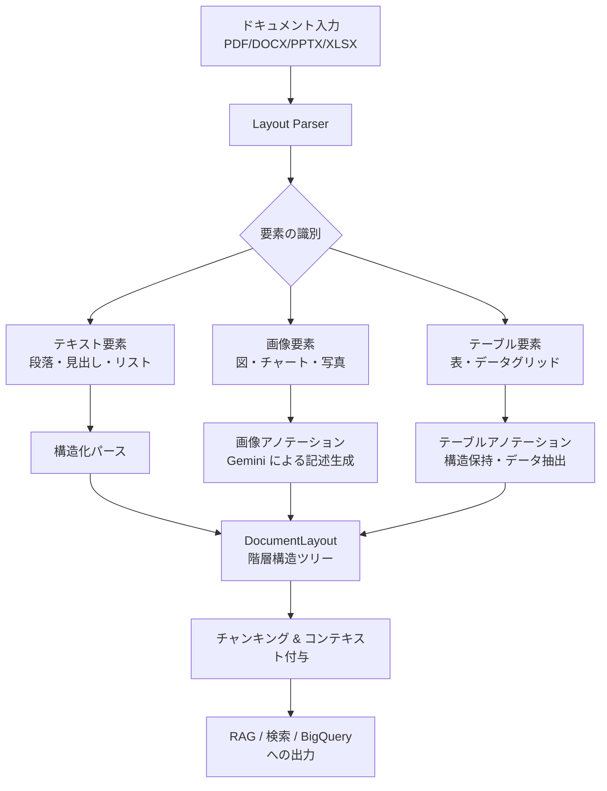

# Document AI: Layout Parser の画像・テーブルアノテーションが GA

**リリース日**: 2026-05-27

**サービス**: Document AI

**機能**: Layout Parser image and table annotations GA

**ステータス**: Generally Available (GA)

📊 [このアップデートのインフォグラフィックを見る](https://takech9203.github.io/google-cloud-news-summary/20260527-document-ai-layout-parser-annotations-ga.html)

## 概要

Google Cloud Document AI の Layout Parser において、画像およびテーブルのアノテーション機能が General Availability (GA) としてリリースされました。この機能により、Layout Parser がドキュメント内の画像やテーブルを識別し、それらに含まれる情報を記述的なテキストブロックとしてアノテーション（注釈付け）できるようになりました。

Layout Parser は Google の専用 OCR モデルと Gemini の生成 AI 機能を組み合わせた高度なドキュメント解析サービスです。今回の GA リリースにより、従来はプレビュー段階だった画像・テーブルのアノテーション機能が本番環境で安心して利用できるようになり、SLA の適用対象となりました。

この機能は特に RAG (Retrieval Augmented Generation) パイプラインや構造化データの取り込みにおいて重要な役割を果たします。ドキュメント内の視覚的要素（チャート、図表、データテーブルなど）をテキスト化することで、検索や生成 AI アプリケーションからアクセス可能な情報として活用できます。

**アップデート前の課題**

- 画像やテーブルのアノテーション機能はプレビュー段階であり、本番ワークロードでの利用には SLA が保証されていなかった
- ドキュメント内の画像（チャート、図表など）は OCR で認識されず、情報が欠落していた
- テーブル内のデータはフラット化されて構造が失われ、RAG パイプラインでの検索精度が低下していた
- 視覚的な情報を含むドキュメントの処理には、別途画像認識やテーブル抽出の仕組みを構築する必要があった

**アップデート後の改善**

- 画像・テーブルアノテーション機能が GA となり、SLA 付きの本番環境で安心して利用可能に
- ドキュメント内の画像が自動的に識別され、描かれている内容が記述的テキストとして生成される
- テーブルが自動的に検出・構造化され、データの整合性が保持される
- 単一の API 呼び出しで画像・テーブルを含むドキュメント全体の構造化が可能に

## アーキテクチャ図



Layout Parser の処理パイプラインを示しています。ドキュメントが入力されると、テキスト・画像・テーブルの各要素が識別され、それぞれ適切な処理（パース、アノテーション）が施された後、階層構造として統合され、最終的に RAG パイプラインや検索エンジンで利用可能な形式で出力されます。

## サービスアップデートの詳細

### 主要機能

1. **画像アノテーション (Image Annotation)**
   - ドキュメント内の画像（図、チャート、写真など）を自動的に検出
   - Gemini の生成 AI 機能を活用して、画像の内容を詳細な記述テキストとして生成
   - 例: 銀行レポート内の円グラフから、各データポイントを抽出してテキスト化

2. **テーブルアノテーション (Table Annotation)**
   - 複雑なテーブル構造（結合セル、複雑なヘッダーを含む）を正確に解析
   - テーブル内のデータを構造化されたテキスト情報として出力
   - セルと列の正確なアライメントを維持し、データの整合性を保証

3. **レイアウト認識チャンキング (Layout-aware Chunking)**
   - アノテーション結果を含むセマンティックに一貫したチャンクを生成
   - 祖先の見出しやテーブルヘッダーなどのコンテキスト情報を付与
   - 単独で取得されてもチャンクの意味が保持される設計

## 技術仕様

### 処理制限

| 項目 | オンライン処理 | バッチ処理 |
|------|---------------|-----------|
| 最大ファイルサイズ | 20 MB (全ファイル形式) | 1 GB (PDF) |
| 最大ページ数 | 15 ページ (PDF) | 500 ページ (PDF) |

### 対応ファイル形式

| ファイル形式 | MIME Type | 検出可能な要素 |
|-------------|----------|---------------|
| PDF | application/pdf | figure, paragraph, table, title, heading, page header, page footer |
| HTML | text/html | paragraph, table, list, title, heading, page header, page footer |
| DOCX | application/vnd.openxmlformats-officedocument.wordprocessingml.document | paragraph, tables, list, title, heading |
| PPTX | application/vnd.openxmlformats-officedocument.presentationml.presentation | paragraph, table, list, title, heading |
| XLSX | application/vnd.openxmlformats-officedocument.spreadsheetml.sheet | tables (INT, FLOAT, STRING) |

### プロセッサバージョン

| バージョン | 説明 | リリースチャネル |
|-----------|------|----------------|
| pretrained-layout-parser-v1.0-2024-06-03 | デフォルトの GA バージョン | Stable |
| pretrained-layout-parser-v1.5-2025-08-25 | Gemini 2.5 Flash 搭載版 | Release Candidate |
| pretrained-layout-parser-v1.5-pro-2025-08-25 | Gemini 2.5 Pro 搭載版 | Release Candidate |
| pretrained-layout-parser-v1.6-2026-01-13 | Gemini 3.0 Flash 搭載版 | Release Candidate |
| pretrained-layout-parser-v1.6-pro-2025-12-01 | Gemini 3.0 Pro 搭載版 | Release Candidate |

## 設定方法

### 前提条件

1. Google Cloud プロジェクトが作成済みであること
2. Document AI API が有効化されていること
3. 適切な IAM 権限（Document AI Editor 以上）が付与されていること

### 手順

#### ステップ 1: Layout Parser プロセッサの作成

Google Cloud Console で Document AI セクションを開き、Processor Gallery から Layout Parser を選択して作成します。

```bash
# gcloud CLI でプロセッサを作成する例
gcloud alpha document-ai processors create \
  --display-name="layout-parser-with-annotations" \
  --type="LAYOUT_PARSER_PROCESSOR" \
  --location=us
```

#### ステップ 2: アノテーション機能の有効化

プロセッサ作成後、コンソールの「Edit Layout Config」から画像・テーブルアノテーションを有効にします。

```json
{
  "processOptions": {
    "layoutConfig": {
      "chunkingConfig": {
        "chunkSize": 500,
        "includeAncestorHeadings": true
      },
      "returnImages": true,
      "returnTables": true
    }
  }
}
```

#### ステップ 3: ドキュメントの処理

```bash
# オンライン処理のリクエスト例
curl -X POST \
  -H "Authorization: Bearer $(gcloud auth print-access-token)" \
  -H "Content-Type: application/json" \
  "https://us-documentai.googleapis.com/v1/projects/PROJECT_ID/locations/us/processors/PROCESSOR_ID:process" \
  -d '{
    "rawDocument": {
      "mimeType": "application/pdf",
      "content": "BASE64_ENCODED_CONTENT"
    }
  }'
```

## メリット

### ビジネス面

- **RAG パイプラインの精度向上**: ドキュメント内の視覚的情報（チャート、図表）がテキスト化されることで、検索・回答生成の精度が大幅に向上
- **ドキュメント処理の自動化促進**: 画像やテーブルを含む複雑なドキュメントも単一 API で処理可能となり、ワークフロー構築コストを削減
- **SLA 保証による本番利用**: GA リリースにより、ミッションクリティカルなワークロードでの安定利用が保証される

### 技術面

- **ハルシネーションの低減**: OCR ベースのアプローチにより、純粋な LLM ベースのパーサーと比較して正確な情報抽出を実現
- **構造保持**: テーブルのセル・列のアライメントが正確に維持され、データの整合性が保証される
- **コンテキスト認識チャンキング**: 祖先見出しの情報が付与されることで、チャンク単体でも意味が通じる設計

## デメリット・制約事項

### 制限事項

- オンライン処理は 20 MB / 15 ページ (PDF) に制限される
- バッチ処理でも PDF は最大 1 GB / 500 ページまで
- 複数ページにまたがるテーブルは 2 つのテーブルに分割される場合がある
- ネストされたテーブル (DOCX, PPTX) はサポートされない
- v1.6 系のプロセッサバージョンは Data Residency (DMZ) に非準拠（グローバルルーティングの可能性あり）

### 考慮すべき点

- Gemini ベースのバージョン（v1.5 以降）は PDF ファイルのみで拡張機能が有効。非 PDF ファイルでは v1.0 と同等の動作
- アノテーション機能を有効にすると処理時間が増加する可能性がある
- 画像アノテーションの品質は、元画像の解像度や複雑さに依存する

## ユースケース

### ユースケース 1: 金融レポートの自動解析と RAG

**シナリオ**: 銀行や金融機関が四半期レポートや年次報告書（10-K ファイリングなど）を RAG パイプラインに取り込む際、チャートや財務テーブルの情報も検索可能にしたい。

**実装例**:
```python
from google.cloud import documentai_v1 as documentai

client = documentai.DocumentProcessorServiceClient()

# Layout Parser でドキュメントを処理
request = documentai.ProcessRequest(
    name="projects/PROJECT/locations/us/processors/PROCESSOR_ID",
    raw_document=documentai.RawDocument(
        content=pdf_content,
        mime_type="application/pdf"
    ),
    process_options=documentai.ProcessOptions(
        layout_config=documentai.ProcessOptions.LayoutConfig(
            chunking_config=documentai.ProcessOptions.LayoutConfig.ChunkingConfig(
                chunk_size=500,
                include_ancestor_headings=True
            )
        )
    )
)

result = client.process_document(request=request)

# アノテーション付きチャンクを取得
for chunk in result.document.chunked_document.chunks:
    print(f"Chunk: {chunk.content}")
    # BigQuery や Vector DB に格納
```

**効果**: 円グラフやデータテーブルの内容がテキスト化され、「第3四半期の収益内訳は?」といった質問に対して、チャート内のデータに基づいた正確な回答が生成可能に。

### ユースケース 2: 技術文書のナレッジベース構築

**シナリオ**: 社内のアーキテクチャ図やフローチャートを含む技術文書をナレッジベースに取り込み、エンジニアが自然言語で検索できるようにしたい。

**効果**: アーキテクチャ図の各コンポーネントやデータフローが記述テキストとして抽出され、「このシステムのデータフローを教えて」といった質問に対して、図の内容に基づいた回答が可能になる。

## 料金

Document AI Layout Parser の料金は Document AI feature pricing に基づきます。GA 対象のファイル形式（PDF, HTML, DOCX, PPTX, XLSX, XLSM）は課金対象です。

詳細な料金は [Document AI feature pricing](https://cloud.google.com/generative-ai-app-builder/pricing#document_ai_feature_pricing) を参照してください。

## 関連サービス・機能

- **Vertex AI Search**: Layout Parser で生成されたチャンクを Vertex AI Search に取り込むことで、高精度なドキュメント検索を実現
- **BigQuery**: 構造化されたテーブルデータを BigQuery に格納し、分析ワークロードに活用
- **Enterprise Document OCR**: テキスト認識の基盤として Layout Parser と組み合わせて使用
- **Custom Classifier / Custom Splitter**: ドキュメントの分類・分割と組み合わせた自動処理パイプラインの構築

## 参考リンク

- 📊 [インフォグラフィック](https://takech9203.github.io/google-cloud-news-summary/20260527-document-ai-layout-parser-annotations-ga.html)
- [公式リリースノート](https://docs.cloud.google.com/release-notes#May_27_2026)
- [Layout Parser ドキュメント](https://docs.cloud.google.com/document-ai/docs/layout-parse-chunk)
- [Layout Parser クイックスタート](https://docs.cloud.google.com/document-ai/docs/layout-parse-quickstart)
- [料金ページ](https://cloud.google.com/generative-ai-app-builder/pricing#document_ai_feature_pricing)

## まとめ

Document AI Layout Parser の画像・テーブルアノテーション機能の GA リリースは、ドキュメント内の視覚的情報を活用した RAG パイプラインや検索システムを構築するユーザーにとって重要なマイルストーンです。2025年10月のプレビュー開始から約7か月を経て GA に到達したことで、本番ワークロードでの安定利用が保証されました。ドキュメント処理パイプラインを構築・運用しているチームは、この機能の有効化を検討し、視覚的情報の活用による検索精度の向上を図ることを推奨します。

---

**タグ**: #DocumentAI #LayoutParser #GA #RAG #OCR #Gemini #テーブル解析 #画像認識 #ドキュメント処理
