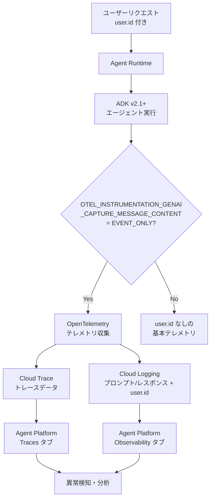

# Gemini Enterprise Agent Platform: エージェントログにユーザー ID ロギング機能を追加

**リリース日**: 2026-05-27

**サービス**: Gemini Enterprise Agent Platform

**機能**: User ID logging with agent logs

**ステータス**: Feature update (2026年5月22日より有効)

[このアップデートのインフォグラフィックを見る](https://takech9203.github.io/google-cloud-news-summary/20260527-gemini-agent-platform-user-id-logging.html)

## 概要

Gemini Enterprise Agent Platform において、プロンプト入力およびレスポンス出力のロギングにオプトインした場合、エージェントログに `user.id` フィールドが自動的に含まれるようになりました。この機能は 2026年5月22日以降に有効となり、Agent Development Kit (ADK) バージョン 2.1 以降で利用可能です。

この追加により、異常なツールインタラクションの追跡が容易になり、エージェントのオブザーバビリティとセキュリティモニタリングが大幅に強化されます。特に、複数ユーザーが同一エージェントを利用するエンタープライズ環境において、ユーザー単位での行動分析や異常検知が可能になります。

**重要な注意事項**: 2026年5月22日より前にロギングにオプトインしていた場合、既存のログには `user.id` は含まれません。この設定を有効にするには、エージェントを再デプロイし、再度オプトインする必要があります。

**アップデート前の課題**

- エージェントログにユーザー識別情報が含まれず、どのユーザーがどのツールインタラクションを行ったか追跡できなかった
- 異常なツール呼び出しパターンが検出されても、特定のユーザーに紐付けることが困難だった
- セキュリティインシデント発生時に、影響を受けたユーザーの特定に時間がかかっていた

**アップデート後の改善**

- `user.id` フィールドがログに含まれることで、ユーザー単位のインタラクション追跡が可能になった
- 異常なツールインタラクションの検知とユーザーへの関連付けが容易になった
- OpenTelemetry GenAI セマンティック規約に準拠した標準的な方法でユーザー情報を記録できるようになった

## アーキテクチャ図



このフローは、ユーザーリクエストがエージェントで処理され、OpenTelemetry を通じてトレースとログに `user.id` が記録される流れを示しています。Cloud Trace と Cloud Logging に格納されたデータは、Agent Platform のコンソールで統合的に確認できます。

## サービスアップデートの詳細

### 主要機能

1. **user.id フィールドのログ記録**
   - プロンプト入力とレスポンス出力のロギングに `user.id` が自動的に含まれる
   - ユーザー単位でのエージェントインタラクション履歴の追跡が可能
   - OpenTelemetry GenAI セマンティック規約に準拠

2. **異常ツールインタラクションの追跡強化**
   - 特定ユーザーによる異常なツール呼び出しパターンの検出が容易に
   - セキュリティ監査やコンプライアンス対応の効率化
   - 時系列でのユーザー行動分析が可能

3. **既存環境との互換性管理**
   - 2026年5月22日以前のオプトイン環境では既存動作を維持
   - 新機能の有効化には再デプロイと再オプトインが必要
   - ADK バージョン 2.1 以降が必須要件

## 技術仕様

### 環境変数の設定

| 環境変数 | 値 | 説明 |
|---------|-----|------|
| `GOOGLE_CLOUD_AGENT_ENGINE_ENABLE_TELEMETRY` | `true` | エージェントのトレースとログを有効化(プロンプト/レスポンスデータは含まない) |
| `OTEL_SEMCONV_STABILITY_OPT_IN` | `gen_ai_latest_experimental` | 最新の GenAI セマンティック規約を有効化 |
| `OTEL_INSTRUMENTATION_GENAI_CAPTURE_MESSAGE_CONTENT` | `EVENT_ONLY` | プロンプト入力、レスポンス出力、user.id のロギングを有効化 |

### 必要な API

| API | 用途 |
|-----|------|
| Cloud Trace API | トレースデータの取り込み |
| Cloud Logging API | ログデータの取り込み |
| Telemetry API | OTLP によるテレメトリ取り込み |

### 必要な IAM ロール

| ロール | 用途 |
|--------|------|
| `roles/cloudtrace.user` | トレースの閲覧 |
| `roles/logging.viewer` | ログの閲覧 |

## 設定方法

### 前提条件

1. Agent Development Kit (ADK) バージョン 2.1 以降を使用していること
2. Google Cloud プロジェクトで Cloud Trace API、Cloud Logging API、Telemetry API が有効化されていること
3. 適切な IAM 権限が付与されていること

### 手順

#### ステップ 1: 環境変数を設定してエージェントをデプロイ

```python
from google.cloud import aiplatform

env_vars = {
    "GOOGLE_CLOUD_AGENT_ENGINE_ENABLE_TELEMETRY": "true",
    "OTEL_SEMCONV_STABILITY_OPT_IN": "gen_ai_latest_experimental",
    "OTEL_INSTRUMENTATION_GENAI_CAPTURE_MESSAGE_CONTENT": "EVENT_ONLY",
}

# エージェントのデプロイ時に環境変数を指定
remote_agent = client.agent_engines.create(
    agent=local_agent,
    env_vars=env_vars,
)
```

ADK を使用したエージェントの場合、上記の環境変数をデプロイ時に設定することで、`user.id` を含むプロンプト/レスポンスのロギングが有効になります。

#### ステップ 2: 既存エージェントの場合は再デプロイ

2026年5月22日以前にオプトインしていた場合、以下の手順が必要です:

1. エージェントを ADK バージョン 2.1 以降にアップデート
2. エージェントを再デプロイ
3. ロギングのオプトインを再度有効化

#### ステップ 3: トレースとログの確認

Google Cloud コンソールで以下の手順で確認できます:

1. Agent Platform > Agent Registry に移動
2. 対象のエージェントを選択
3. **Traces** タブでトレースデータを確認
4. **Observability** タブでログデータを確認

## メリット

### ビジネス面

- **コンプライアンス対応の強化**: ユーザー単位のアクティビティ追跡により、監査要件への対応が容易になる
- **セキュリティインシデント対応の迅速化**: 異常なインタラクションの発生源を即座に特定でき、対応時間を短縮できる
- **ユーザー行動分析**: エージェントの利用パターンをユーザー単位で分析し、サービス改善に活用できる

### 技術面

- **異常検知の精度向上**: `user.id` をキーとした異常パターン検出により、false positive を削減できる
- **OpenTelemetry 標準準拠**: ベンダーに依存しない標準的なテレメトリ形式を採用しており、既存のオブザーバビリティツールと連携可能
- **デバッグ効率の向上**: 特定ユーザーのセッションをトレースレベルで追跡でき、問題の再現と原因特定が容易になる

## デメリット・制約事項

### 制限事項

- ADK バージョン 2.1 以降が必須であり、旧バージョンでは利用不可
- 2026年5月22日以前にオプトインしていた既存環境では、再デプロイと再オプトインが必要
- `user.id` のロギングはプロンプト/レスポンスロギングのオプトインに連動しており、`user.id` のみを個別に無効化することはできない

### 考慮すべき点

- **プライバシーとデータガバナンス**: `user.id` を含むログの取り扱いについて、エンドユーザーへの適切な通知・同意取得・データハンドリングポリシーの整備が必要
- **データ保持期間**: Cloud Logging に記録されるユーザー ID 付きログの保持期間とアクセス制御を適切に設計する必要がある
- **既存ワークフローへの影響**: 再デプロイが必要なため、既存の本番環境では計画的なメンテナンスウィンドウを確保する必要がある

## ユースケース

### ユースケース 1: エンタープライズにおける不正利用検知

**シナリオ**: 社内向けエージェントで、特定のユーザーが通常と異なるパターンでツールを大量に呼び出している状況を検知したい。

**実装例**:
```python
# Cloud Logging でユーザー別のツール呼び出し頻度を分析するクエリ例
# Logs Explorer で以下のフィルタを使用
resource.type="aiplatform.googleapis.com/AgentEngine"
jsonPayload.user_id="suspicious-user@example.com"
severity>=WARNING
```

**効果**: ユーザー ID に基づいた異常検知ルールを設定することで、不正利用やアカウント乗っ取りの早期発見が可能になる。

### ユースケース 2: マルチテナント環境でのトラブルシューティング

**シナリオ**: 複数の顧客が共有エージェントを利用する SaaS 環境で、特定顧客からの「エージェントの応答が遅い」という報告に対して原因を調査したい。

**効果**: `user.id` でフィルタリングすることで、該当顧ザーのセッションとトレースを即座に特定し、レイテンシのボトルネックやエラーの原因を迅速に診断できる。

## 関連サービス・機能

- **Cloud Trace**: エージェントの分散トレーシング基盤として、実行パスの可視化とパフォーマンス分析を提供
- **Cloud Logging**: プロンプト/レスポンスデータと `user.id` の安全な保管先として機能し、IAM による細かいアクセス制御が可能
- **Agent Development Kit (ADK)**: エージェント開発フレームワークとして、OpenTelemetry ベースのテレメトリ出力を自動化
- **OpenTelemetry**: テレメトリデータの収集・送信に使用される業界標準のオブザーバビリティフレームワーク

## 参考リンク

- [インフォグラフィック](https://takech9203.github.io/google-cloud-news-summary/20260527-gemini-agent-platform-user-id-logging.html)
- [公式リリースノート](https://docs.cloud.google.com/release-notes#May_27_2026)
- [トレーシング設定ドキュメント](https://docs.cloud.google.com/gemini-enterprise-agent-platform/scale/runtime/tracing#write-traces)
- [Agent Platform オブザーバビリティ概要](https://docs.cloud.google.com/gemini-enterprise-agent-platform/optimize/observability/overview)
- [Agent Development Kit (ADK)](https://adk.dev/get-started/about/)

## まとめ

今回のアップデートにより、Gemini Enterprise Agent Platform のエージェントログに `user.id` が記録されるようになり、エンタープライズ環境におけるセキュリティ監視とオブザーバビリティが大幅に強化されました。既存環境で本機能を有効化するには ADK 2.1 へのアップグレードと再デプロイが必要なため、計画的な移行を推奨します。また、ユーザー ID のログ記録に伴い、プライバシーポリシーの更新やエンドユーザーへの通知など、データガバナンス面の対応も併せて検討してください。

---

**タグ**: #GeminiEnterprise #AgentPlatform #Observability #Logging #Tracing #ADK #OpenTelemetry #Security #UserTracking
