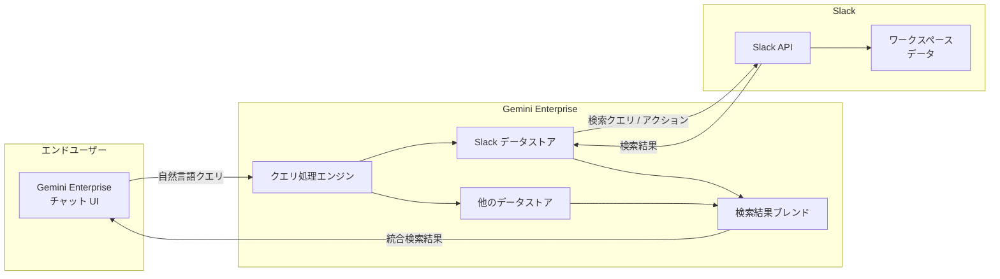

# Gemini Enterprise: Slack データストアが GA (一般提供) に

**リリース日**: 2026-05-27

**サービス**: Gemini Enterprise

**機能**: Slack データストア

**ステータス**: Generally Available (GA)

📊 [このアップデートのインフォグラフィックを見る](https://takech9203.github.io/google-cloud-news-summary/20260527-gemini-enterprise-slack-data-store-ga.html)

## 概要

Gemini Enterprise の Slack データストアが一般提供 (GA) となりました。この機能により、Slack ワークスペースを Gemini Enterprise に接続し、自然言語を使って会話、ファイル、メッセージの検索・閲覧が可能になります。さらに、Gemini Enterprise のチャットボックスから直接 Slack メッセージの送信やスケジュール設定などのアクションも実行できます。

この機能は、企業内に分散する Slack 上の情報資産を Gemini Enterprise の AI 検索基盤に統合することで、組織のナレッジマネジメントを大幅に強化します。従来、Slack 内の情報検索は Slack 固有のインターフェースに限定されていましたが、Gemini Enterprise を通じて他のデータソースと横断的に検索できるようになり、情報の発見性と業務効率が向上します。

対象ユーザーは Gemini Enterprise のライセンスを持つ組織のエンドユーザーであり、特にナレッジワーカーやプロジェクトマネージャーなど、日常的に Slack を活用しながら情報検索・共有を行うチームにとって大きな価値をもたらします。

**アップデート前の課題**

- Slack 内の情報を検索するには Slack 固有の検索機能を使う必要があり、他のデータソースとの横断検索ができなかった
- Slack のメッセージ送信やスケジュール設定を行うにはコンテキストスイッチが必要だった
- 自然言語による柔軟な Slack 情報検索が困難で、適切なキーワードを考える必要があった

**アップデート後の改善**

- Gemini Enterprise のチャットインターフェースから自然言語で Slack の会話、ファイル、メッセージを横断検索可能に
- 他のデータソース (Google Drive、Confluence など) と Slack の情報をブレンドした統合検索結果を取得可能に
- Gemini Enterprise から直接 Slack メッセージの送信・スケジュール設定・キャンバス作成が可能に

## アーキテクチャ図

ユーザーが Gemini Enterprise に自然言語でクエリを送信すると、クエリ処理エンジンが Slack データストアを含む各データストアに対して検索を実行し、結果をブレンドして統合的な回答を返します。アクション (メッセージ送信など) も同じフローで Slack API を通じて実行されます。

## サービスアップデートの詳細

### 主要機能

1. **自然言語による Slack 検索**
   - 会話 (Conversation)、ファイル (File)、メッセージ (Message) の各エンティティを検索対象に設定可能
   - LLM によるクエリリライトにより、セッションのクエリ履歴を考慮した精度の高い検索を実現
   - ファイルの内容に基づいた検索にも対応

2. **Slack アクションの実行**
   - Slack メッセージの送信
   - Slack メッセージのスケジュール設定
   - Slack キャンバスの作成
   - Slack メッセージドラフトの送信

3. **フェデレーテッド検索**
   - Slack の検索結果を他のデータソースの結果とブレンドして表示
   - 権限を考慮した検索 (Permission-aware search) により、ユーザーがアクセス権を持つ情報のみを表示

4. **エンタープライズセキュリティ**
   - Cloud KMS による顧客管理暗号鍵 (CMEK) のサポート
   - VPC Service Controls によるセキュリティ境界の設定が可能
   - ユーザー認可フローによるアクセス制御

## 技術仕様

### サポートされるアクション

| アクション | 説明 |
|------|------|
| Send Slack message | Slack メッセージを送信する |
| Schedule Slack message | Slack メッセージのスケジュール送信を設定する |
| Create Slack canvas | Slack キャンバスを作成する |
| Send Slack message draft | Slack メッセージドラフトを送信する |

### レート制限とサポート条件

| 項目 | 詳細 |
|------|------|
| レート制限 | 約 10 リクエスト/分 (クエリの複雑さに依存) |
| サポートバージョン | Slack の最新クラウドバージョン |
| 利用可能リージョン | global、us、eu |
| Slack の前提条件 | Slack AI search を含むプランが必要 |

### 暗号化設定

us または eu リージョンを選択した場合、暗号化設定を構成できます。

| 暗号化オプション | 説明 |
|------|------|
| Google-managed encryption key | Google が管理する暗号鍵 (デフォルト) |
| Cloud KMS key | 顧客管理の暗号鍵 (CMEK) |

## 設定方法

### 前提条件

1. Discovery Engine Editor ロール (`roles/discoveryengine.editor`) がユーザーに付与されていること
2. 接続する Slack ワークスペースへのアクセス権があり、Slack アカウントにサインインしていること
3. Slack AI search を含む Slack プランを利用していること
4. Slack 管理者が Gemini Enterprise アプリのインストールを許可していること

### 手順

#### ステップ 1: Slack データストアの作成

1. Google Cloud コンソールで Gemini Enterprise ページに移動
2. Google Cloud プロジェクトを選択または作成
3. ナビゲーションメニューで「Data stores」をクリック
4. 「Create data store」をクリック
5. Source セクションで「Slack」を検索し、「Select」をクリック

#### ステップ 2: データ設定

Data セクションで検索対象のエンティティを選択:
- Conversation (会話)
- File (ファイル)
- Message (メッセージ)

#### ステップ 3: コネクタ設定

1. Multi-region リストからデータコネクタのロケーションを選択
2. コネクタ名を入力
3. 必要に応じて暗号化設定を構成 (us/eu リージョンの場合)
4. 課金モデルを選択 (General pricing を推奨)
5. 「Create」をクリック

#### ステップ 4: アプリとの接続

データストアのステータスが「Creating」から「Active」に変わった後:
1. Gemini Enterprise アプリを作成
2. アプリを Slack データストアに接続
3. ユーザーに Slack へのアクセスを認可

### Slack 管理者側の設定オプション

| デプロイ方式 | 説明 | 推奨 |
|------|------|------|
| App Pre-Approval | 管理者が事前に Gemini Enterprise アプリを承認 | 推奨 |
| Request-on-Demand | メンバーがアプリのインストールをリクエスト | - |
| Direct Installation | アプリ承認設定が無効の場合、直接インストール | - |

## メリット

### ビジネス面

- **情報発見の高速化**: Slack に蓄積されたナレッジを自然言語で即座に検索でき、情報を探す時間を大幅に短縮
- **コンテキストスイッチの削減**: Gemini Enterprise の統合インターフェースから Slack のメッセージ送信やスケジュール設定が可能になり、ツール間の切り替えが不要に
- **組織ナレッジの統合**: Slack のデータを Google Drive や他のデータソースと横断的に検索でき、組織全体のナレッジ活用が向上

### 技術面

- **フェデレーテッド検索アーキテクチャ**: データを Google Cloud に移動させることなく、Slack API を直接呼び出すことでリアルタイムな検索を実現
- **Permission-aware 検索**: ユーザーの権限に基づいたアクセス制御により、セキュリティを維持しながら検索精度を向上
- **CMEK サポート**: 顧客管理暗号鍵により、データセキュリティ要件の厳しい企業にも対応

## デメリット・制約事項

### 制限事項

- VPC Service Controls の適用は新規作成のデータストアのみ対応。既存のデータストアへの適用には削除・再作成が必要
- 1 つのアプリに対して、1 つのコネクタタイプのアクションに属するデータストアのみの関連付けが推奨
- ファイルコンテンツに基づく検索結果は必ずしもファイル全体を網羅しない場合がある
- 利用可能リージョンは global、us、eu に限定

### 考慮すべき点

- Slack AI search を含むプランが別途必要であり、追加コストが発生する可能性がある
- クエリ文字列が Slack API に送信されるため、クエリ内容がサードパーティに共有される点に注意
- LLM によるクエリリライト時にセッション履歴の一部が Slack API に送信される可能性がある
- レート制限 (約 10 リクエスト/分) があるため、大量の検索リクエストには向かない

## ユースケース

### ユースケース 1: プロジェクト情報の横断検索

**シナリオ**: プロジェクトマネージャーが過去の設計議論や決定事項を確認したい場合。Slack の会話、Google Drive のドキュメント、その他のデータソースに分散している情報を一括で検索する。

**効果**: 複数ツールを個別に検索する必要がなくなり、プロジェクト情報の把握にかかる時間を大幅に短縮。過去の意思決定の背景を素早く理解できる。

### ユースケース 2: 日常コミュニケーションの効率化

**シナリオ**: エンジニアが Gemini Enterprise でコードに関する調査を行い、その結果を同僚に共有したい場合。調査結果の確認と Slack メッセージの送信を同一画面で完結させる。

**効果**: コンテキストスイッチなしで調査からコミュニケーションまでシームレスに行えるため、フロー状態を維持しながら作業を進められる。

### ユースケース 3: 新入社員のオンボーディング支援

**シナリオ**: 新入社員が組織のプロセスやベストプラクティスについて自然言語で質問し、Slack の過去の会話やファイルから関連情報を得る。

**効果**: メンターに質問する前に自己解決できる範囲が広がり、オンボーディング期間の短縮と既存メンバーの負荷軽減を実現。

## 料金

Gemini Enterprise の Slack データストアを利用するには、Gemini Enterprise のサブスクリプションとライセンスが必要です。データストア作成時には「General pricing」(従量課金モデル) を選択することが推奨されます。

### エディション別ストレージ容量

| エディション | ユーザーあたりの月間ストレージ |
|--------|-----------------|
| Gemini Enterprise Business | 25 GiB (プール) |
| Gemini Enterprise Standard | 30 GiB (プール) |
| Gemini Enterprise Plus | 75 GiB (プール) |
| Gemini Enterprise Frontline | 2 GiB (プール) |

※ サブスクリプションは月次または年次で選択可能。詳細な料金は Google Cloud の料金ページを参照してください。

## 利用可能リージョン

Slack データストアは以下のリージョンで利用可能です:

| リージョン | 説明 |
|------|------|
| global | グローバル (推奨: 最大の可用性と低レイテンシ) |
| us | 米国マルチリージョン |
| eu | 欧州マルチリージョン |

※ コンプライアンスや規制上の理由がない限り、global リージョンの選択が推奨されます。

## 関連サービス・機能

- **Gemini Enterprise データストア**: Slack 以外にも Google Drive、Confluence、Jira など複数のデータソースに対応するコネクタエコシステム
- **Discovery Engine API**: Gemini Enterprise のバックエンドとして機能する検索エンジン API
- **Cloud KMS**: データストアの暗号化に使用する顧客管理暗号鍵サービス
- **VPC Service Controls**: Gemini Enterprise アプリのセキュリティ境界を設定するためのサービス
- **NotebookLM Enterprise**: Gemini Enterprise ライセンスに含まれるノートブック機能

## 参考リンク

- 📊 [インフォグラフィック](https://takech9203.github.io/google-cloud-news-summary/20260527-gemini-enterprise-slack-data-store-ga.html)
- [公式リリースノート](https://docs.cloud.google.com/release-notes#May_27_2026)
- [Connect Slack ドキュメント](https://docs.cloud.google.com/gemini/enterprise/docs/connectors/slack)
- [Slack データストアのセットアップ](https://docs.cloud.google.com/gemini/enterprise/docs/connectors/slack/set-up-data-store)
- [Gemini Enterprise ライセンス](https://docs.cloud.google.com/gemini/enterprise/docs/licenses)
- [Gemini Enterprise エディション比較](https://docs.cloud.google.com/gemini/enterprise/docs/editions)

## まとめ

Gemini Enterprise の Slack データストアが GA となったことで、組織は Slack に蓄積された膨大なナレッジを AI 検索基盤を通じて効率的に活用できるようになりました。自然言語での検索に加え、メッセージ送信やスケジュール設定といったアクション機能も備えており、日常業務の生産性向上に直結します。Gemini Enterprise をすでに導入している組織は、Slack コネクタの設定を検討し、組織のナレッジ活用をさらに強化することを推奨します。

---

**タグ**: #GeminiEnterprise #Slack #DataStore #GA #EnterpriseSearch #FederatedSearch #NaturalLanguageProcessing #Collaboration
