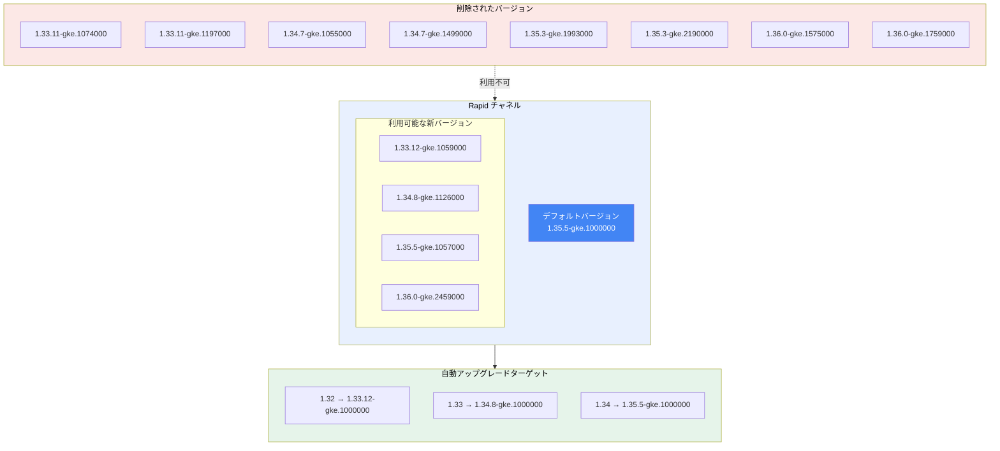

# Google Kubernetes Engine: 2026-R21 バージョンアップデート

**リリース日**: 2026-05-27

**サービス**: Google Kubernetes Engine (GKE)

**機能**: Rapid チャネル バージョンアップデート (2026-R21)

**ステータス**: 利用可能

📊 [このアップデートのインフォグラフィックを見る](https://takech9203.github.io/google-cloud-news-summary/20260527-gke-2026-r21-version-updates.html)

## 概要

Google Kubernetes Engine (GKE) の Rapid リリースチャネルにおいて、2026-R21 バージョンアップデートが実施されました。このアップデートでは、新しいクラスタ作成時のデフォルトバージョンが 1.35.5-gke.1000000 に更新され、複数の新バージョンが利用可能になるとともに、古いバージョンが削除されています。

今回のアップデートでは、Kubernetes 1.33 から 1.36 までの幅広いマイナーバージョンに対する新しいパッチバージョンが提供されています。特に注目すべきは、Kubernetes 1.36.0 の新しいパッチバージョン (gke.2459000) が追加された点で、最新の Kubernetes 機能をいち早く検証したいユーザーにとって重要なアップデートです。

また、自動アップグレードターゲットが更新され、1.32 から 1.33 へ、1.33 から 1.34 へ、1.34 から 1.35 への自動アップグレードパスが明確に定義されました。これにより、Rapid チャネルに登録されたクラスタは段階的に新しいバージョンへ自動アップグレードされます。

**アップデート前の課題**

- 以前のデフォルトバージョンではクラスタ作成時に最新のセキュリティ修正やバグ修正が含まれていなかった
- 1.36.0 の以前のパッチバージョン (gke.1575000, gke.1759000) に既知の問題が含まれている可能性があった
- 古いパッチバージョンが引き続き利用可能であったため、意図せず古いバージョンでクラスタを作成するリスクがあった

**アップデート後の改善**

- デフォルトバージョンが 1.35.5-gke.1000000 に更新され、最新の修正が適用された状態でクラスタを作成可能になった
- 1.36.0-gke.2459000 により最新の Kubernetes 1.36 機能をより安定した環境で検証可能になった
- 古いパッチバージョンの削除により、既知の問題があるバージョンでのクラスタ作成が防止された
- 自動アップグレードターゲットの更新により、計画的なバージョン移行が実行される

## アーキテクチャ図



GKE Rapid チャネルにおけるバージョンの更新状況を示しています。新しいバージョンが利用可能になり、古いバージョンが削除され、自動アップグレードのパスが定義されています。

## サービスアップデートの詳細

### 主要機能

1. **デフォルトバージョンの更新**
   - Rapid チャネルの新規クラスタ作成時のデフォルトバージョンが 1.35.5-gke.1000000 に更新
   - 新規クラスタは自動的にこのバージョンで作成される
   - 最新のセキュリティパッチと安定性改善が含まれる

2. **新バージョンの追加**
   - Kubernetes 1.33 系: 1.33.12-gke.1059000 (マイナーバージョン延長サポート向け)
   - Kubernetes 1.34 系: 1.34.8-gke.1126000 (安定版パッチ)
   - Kubernetes 1.35 系: 1.35.5-gke.1057000 (現行推奨バージョン)
   - Kubernetes 1.36 系: 1.36.0-gke.2459000 (最新マイナーバージョン)

3. **自動アップグレードターゲットの設定**
   - 1.32 系クラスタ: 1.33.12-gke.1000000 へアップグレード
   - 1.33 系クラスタ: 1.34.8-gke.1000000 へアップグレード
   - 1.34 系クラスタ: 1.35.5-gke.1000000 へアップグレード
   - メンテナンスウィンドウとロールアウトシーケンスに従って段階的に実行

4. **古いバージョンの削除**
   - 8 つのパッチバージョンがコントロールプレーンでの利用から削除
   - 削除されたバージョンでの新規クラスタ作成・アップグレードは不可

## 技術仕様

### バージョン一覧 (Rapid チャネル)

| カテゴリ | バージョン | 備考 |
|----------|-----------|------|
| デフォルト | 1.35.5-gke.1000000 | 新規クラスタ作成時のデフォルト |
| 新規追加 | 1.33.12-gke.1059000 | 1.33 系最新パッチ |
| 新規追加 | 1.34.8-gke.1126000 | 1.34 系最新パッチ |
| 新規追加 | 1.35.5-gke.1057000 | 1.35 系追加パッチ |
| 新規追加 | 1.36.0-gke.2459000 | 1.36 系最新パッチ |

### 削除されたバージョン

| マイナーバージョン | 削除されたパッチ |
|-------------------|-----------------|
| 1.33 | 1.33.11-gke.1074000, 1.33.11-gke.1197000 |
| 1.34 | 1.34.7-gke.1055000, 1.34.7-gke.1499000 |
| 1.35 | 1.35.3-gke.1993000, 1.35.3-gke.2190000 |
| 1.36 | 1.36.0-gke.1575000, 1.36.0-gke.1759000 |

### 自動アップグレードターゲット

| 現在のマイナーバージョン | アップグレード先 |
|------------------------|-----------------|
| 1.32.x | 1.33.12-gke.1000000 |
| 1.33.x | 1.34.8-gke.1000000 |
| 1.34.x | 1.35.5-gke.1000000 |

## 設定方法

### 前提条件

1. Google Cloud プロジェクトで GKE API が有効であること
2. `gcloud` CLI がインストール済みで認証されていること
3. 適切な IAM 権限 (container.clusters.update) を有していること

### 手順

#### ステップ 1: 現在のクラスタバージョンを確認

```bash
# クラスタの現在のバージョンを確認
gcloud container clusters describe CLUSTER_NAME \
  --location=LOCATION \
  --format="value(currentMasterVersion)"
```

現在のクラスタバージョンを確認し、アップグレードが必要かどうかを判断します。

#### ステップ 2: Rapid チャネルの利用可能バージョンを確認

```bash
# Rapid チャネルの利用可能バージョンを一覧表示
gcloud container get-server-config \
  --flatten="channels" \
  --filter="channels.channel=RAPID" \
  --format="yaml(channels.channel,channels.validVersions)" \
  --location=LOCATION
```

Rapid チャネルで利用可能な全バージョンを確認できます。

#### ステップ 3: クラスタを手動でアップグレード (任意)

```bash
# コントロールプレーンを特定のバージョンにアップグレード
gcloud container clusters upgrade CLUSTER_NAME \
  --location=LOCATION \
  --master \
  --cluster-version=1.35.5-gke.1057000
```

自動アップグレードを待たずに手動でアップグレードする場合に使用します。Rapid チャネルに登録されたクラスタは自動的にアップグレードされますが、メンテナンスウィンドウの設定によってはタイミングが遅れる場合があります。

#### ステップ 4: ノードプールのアップグレード

```bash
# ノードプールをアップグレード
gcloud container clusters upgrade CLUSTER_NAME \
  --location=LOCATION \
  --node-pool=NODE_POOL_NAME
```

コントロールプレーンのアップグレード後、ノードプールも同様にアップグレードします。

## メリット

### ビジネス面

- **セキュリティリスクの低減**: 最新のセキュリティパッチが適用されたバージョンが利用可能になり、脆弱性への対応が迅速化
- **運用コストの削減**: 自動アップグレードターゲットの設定により、手動でのバージョン管理の負担が軽減
- **コンプライアンス対応**: サポートされたバージョンを維持することで、GKE SLA の対象範囲を確保

### 技術面

- **最新 Kubernetes 機能へのアクセス**: Kubernetes 1.36 の最新パッチにより、新機能の早期検証が可能
- **安定性の向上**: 古いパッチバージョンの削除により、既知の問題があるバージョンの使用を防止
- **段階的アップグレード**: 自動アップグレードパスの明確化により、予測可能なバージョン移行が実現
- **バージョンスキューの防止**: 適切なアップグレードターゲットにより、コントロールプレーンとノード間のバージョン互換性を維持

## デメリット・制約事項

### 制限事項

- Rapid チャネルのバージョンは GKE SLA の対象外であり、既知の回避策がない問題が含まれる可能性がある
- 削除されたバージョンへのダウングレードやそのバージョンでの新規クラスタ作成は不可
- 自動アップグレードはメンテナンスウィンドウの設定に従うため、即座に適用されない場合がある
- Rapid チャネルは本番環境ではなく、プリプロダクション環境での使用が推奨される

### 考慮すべき点

- 自動アップグレードにより、テストが不十分なバージョンに移行される可能性があるため、メンテナンス除外の設定を検討すべき
- アップグレード前に、非推奨 API の使用状況を確認し、互換性の問題がないか事前検証が必要
- ノードプールのアップグレードではワークロードの再スケジューリングが発生するため、PodDisruptionBudget の設定を確認すべき
- バージョン 1.36 はまだ Rapid チャネルのみで利用可能であり、Regular/Stable チャネルへの昇格にはさらに数か月かかる

## ユースケース

### ユースケース 1: プリプロダクション環境での Kubernetes 1.36 検証

**シナリオ**: 開発チームが Kubernetes 1.36 の新機能 (新しい API やスケジューリング改善など) を本番導入前に検証したい場合

**実装例**:
```bash
# Rapid チャネルで 1.36 を使用するクラスタを作成
gcloud container clusters create test-cluster-136 \
  --location=us-central1 \
  --release-channel=rapid \
  --cluster-version=1.36.0-gke.2459000 \
  --num-nodes=3
```

**効果**: 本番環境に影響を与えることなく、最新の Kubernetes 機能と GKE パッチの動作を事前検証できる

### ユースケース 2: セキュリティパッチの迅速な適用

**シナリオ**: セキュリティ要件の厳しい組織が、最新のセキュリティ修正を含むパッチバージョンへ迅速にアップグレードしたい場合

**実装例**:
```bash
# 既存クラスタを最新パッチへ手動アップグレード
gcloud container clusters upgrade my-cluster \
  --location=asia-northeast1 \
  --master \
  --cluster-version=1.35.5-gke.1057000

# accelerated patch auto-upgrades を有効化
gcloud container clusters update my-cluster \
  --location=asia-northeast1 \
  --accelerated-patch-auto-upgrades
```

**効果**: 自動アップグレードターゲットに設定される前に最新パッチを適用でき、セキュリティ脆弱性の露出期間を最小化

### ユースケース 3: マイナーバージョン移行の計画

**シナリオ**: 1.32 系クラスタを運用しているチームが、自動アップグレードに備えて 1.33 への移行テストを実施する場合

**実装例**:
```bash
# アップグレードターゲットの確認
gcloud container clusters describe my-cluster \
  --location=asia-northeast1 \
  --format="value(releaseChannel.channel)"

# メンテナンスウィンドウを設定して計画的にアップグレード
gcloud container clusters update my-cluster \
  --location=asia-northeast1 \
  --maintenance-window-start=2026-06-01T02:00:00Z \
  --maintenance-window-end=2026-06-01T06:00:00Z \
  --maintenance-window-recurrence="FREQ=WEEKLY;BYDAY=SA"
```

**効果**: 計画されたメンテナンスウィンドウ内で自動アップグレードを実行させ、本番ワークロードへの影響を最小限に抑える

## 関連サービス・機能

- **GKE Release Channels**: クラスタのバージョン管理とアップグレード戦略を提供する仕組み。Rapid、Regular、Stable、Extended の各チャネルが利用可能
- **GKE Maintenance Windows/Exclusions**: アップグレードの実行タイミングを制御するための設定
- **GKE Cluster Notifications**: バージョンアップグレードや重要なイベントの通知機能
- **Container-Optimized OS**: GKE ノードで使用される OS。GKE バージョンと連動して更新される
- **GKE Security Posture**: クラスタのセキュリティ状態を可視化し、バージョン関連の脆弱性を特定

## 参考リンク

- 📊 [インフォグラフィック](https://takech9203.github.io/google-cloud-news-summary/20260527-gke-2026-r21-version-updates.html)
- [公式リリースノート](https://docs.cloud.google.com/release-notes#May_27_2026)
- [GKE バージョニングとサポート](https://docs.cloud.google.com/kubernetes-engine/versioning)
- [GKE クラスタアップグレードについて](https://docs.cloud.google.com/kubernetes-engine/docs/concepts/cluster-upgrades)
- [リリースチャネル](https://docs.cloud.google.com/kubernetes-engine/docs/concepts/release-channels)
- [GKE リリーススケジュール](https://docs.cloud.google.com/kubernetes-engine/docs/release-schedule)
- [GKE 料金](https://cloud.google.com/kubernetes-engine/pricing)

## まとめ

GKE 2026-R21 バージョンアップデートにより、Rapid チャネルのデフォルトバージョンが 1.35.5-gke.1000000 に更新され、Kubernetes 1.33 から 1.36 までの最新パッチバージョンが利用可能になりました。自動アップグレードターゲットが 1.32 から 1.35 へのパスで設定されているため、Rapid チャネルに登録されたクラスタは段階的に新しいバージョンへ移行されます。Rapid チャネルを使用してプリプロダクション環境での検証を行い、Regular/Stable チャネルへの昇格前に互換性を確認することを推奨します。

---

**タグ**: #GoogleKubernetesEngine #GKE #Kubernetes #ReleaseChannel #Rapid #VersionUpdate #AutoUpgrade #ClusterManagement #ContainerOrchestration
