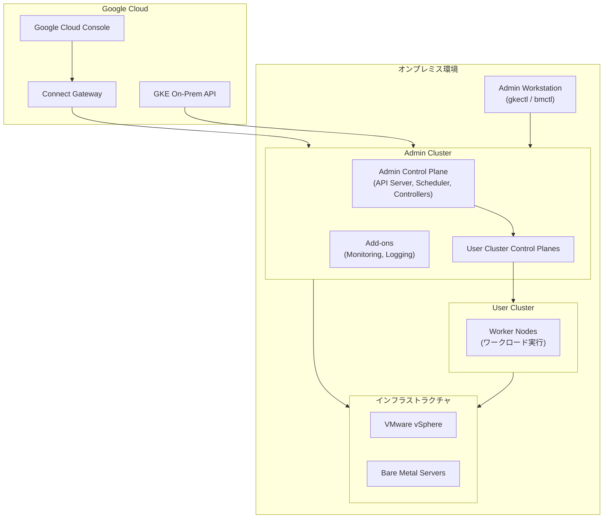

# Google Distributed Cloud (software only): バージョン 1.34.500-gke.108 リリース

**リリース日**: 2026-05-27

**サービス**: Google Distributed Cloud (software only)

**機能**: Version 1.34.500-gke.108 release (VMware / bare metal)

**ステータス**: Released / Available for download

[このアップデートのインフォグラフィックを見る](https://takech9203.github.io/google-cloud-news-summary/20260527-google-distributed-cloud-1-34-500.html)

## 概要

Google Distributed Cloud (software only) バージョン 1.34.500-gke.108 が VMware 環境およびベアメタル環境の両方でリリースされました。本バージョンは Kubernetes v1.34.7-gke.200 上で動作し、複数の重要なバグ修正とセキュリティ脆弱性の修正が含まれています。

今回のリリースは主にパッチリリースであり、クラスタの安定性とライフサイクル管理に関する複数の問題を解決します。特に、クラスタの再作成時のプロビジョニング停止問題、コントロールプレーンのノード参加失敗時の孤立した etcd メンバーシップの問題、証明書ローテーション時の一時的なサービス停止の問題などが修正されています。

本リリースは GKE Enterprise を利用するオンプレミス環境の運用者、インフラストラクチャ管理者を対象としており、既存のクラスタの安定性向上とアップグレード体験の改善を提供します。

**アップデート前の課題**

- 以前に使用したクラスタ名でユーザークラスタを再作成すると、`k8s-health-check` サービスアカウントの欠落によりプロビジョニングが無期限に停止していた
- 新しいコントロールプレーンノードがブートストラップ中にクラスタへの参加に失敗した場合、孤立した etcd メンバーシップがクリーンアップされず、既存コントロールプレーンの API サーバーが繰り返し再起動していた
- コントロールプレーン証明書のローテーションや etcd 暗号化の更新時に、ノードごとに 3 分間のストールが発生し、ワークロードに 503 エラーや ImagePullBackOff が発生していた
- etcd 暗号化の有効化時に API サーバーが突然終了し、最大 5 分間の接続タイムアウトが発生していた
- (VMware のみ) `stackdriver.disableVsphereResourceMetrics` を true に設定すると、vsphere-ca-certificate ConfigMap が誤って削除され、インストールやアップグレードが無期限に停止していた

**アップデート後の改善**

- クラスタ再作成時にインストーラーが自動的にサービスアカウントを作成するため、手動での回避策が不要になった
- 孤立した etcd メンバーシップが自動的にクリーンアップされ、コントロールプレーンの安定性が向上した
- 証明書ローテーション時のストールとルーティング障害が解消された
- etcd 暗号化更新時の API サーバーの突然の終了が回避され、ワークロードへの影響が最小化された
- (VMware のみ) vSphere メトリクスの無効化設定がインストール/アップグレードプロセスに影響しなくなった

## アーキテクチャ図



Google Distributed Cloud のデプロイメントトポロジ。Admin Cluster がユーザークラスタのライフサイクルを管理し、Google Cloud Console からの接続と GKE On-Prem API を通じたリモート管理が可能です。

## サービスアップデートの詳細

### VMware 環境での修正

1. **セキュリティ脆弱性の修正**
   - 脆弱性修正リストに記載された複数のセキュリティ問題を修正
   - CVE 対応を含む包括的なセキュリティパッチ

2. **vSphere メトリクス無効化時のインストール/アップグレード停止問題の修正**
   - `stackdriver.disableVsphereResourceMetrics` を `true` に設定した際、インストーラーが `vsphere-ca-certificate` ConfigMap を誤って削除する問題を修正
   - `vsphere-csi-controller` Pod のマウントエラーによるストールが解消
   - 手動での ConfigMap 再作成や `vsphere-metrics-exporter` Deployment のスケールダウンが不要に

3. **クラスタ再作成時のプロビジョニング停止問題の修正**
   - 以前使用したクラスタ名での再作成 (Terraform デプロイや手動再インストール時に多発) で発生していた問題を修正
   - `k8s-health-check` サービスアカウントの自動作成を保証

4. **gkectl diagnose コマンドの修正**
   - Advanced Admin Cluster が管理する Standard User Cluster で `gkectl diagnose` コマンドが失敗する問題を修正

### Bare Metal 環境での修正

1. **セキュリティ脆弱性の修正**
   - 脆弱性修正リストに記載された複数のセキュリティ問題を修正

2. **孤立した etcd メンバーシップの自動クリーンアップ**
   - 新しいコントロールプレーンノードのブートストラップまたはスケーリング中にクラスタ参加が失敗した際、孤立した etcd メンバーシップが残存する問題を修正
   - 既存コントロールプレーンの API サーバーの繰り返し再起動 (flap) と後続リトライのブロックを解消

3. **証明書ローテーション時のストール問題の修正**
   - コントロールプレーン証明書ローテーションまたは etcd 暗号化更新時、ローカル API サーバーの再起動待ちでノードごとに 3 分間ストールする問題を修正
   - ノードの一時的な Unknown ステータスと、503 Service Unavailable や ImagePullBackOff の一時的なルーティング障害を解消

4. **etcd 暗号化有効化時の API サーバー突然終了の修正**
   - etcd 暗号化の有効化/更新時に API サーバーが突然終了し、最大 5 分間の接続タイムアウトを引き起こす問題を修正

5. **クラスタ再作成時のプロビジョニング停止問題の修正**
   - VMware 版と同様、`k8s-health-check` サービスアカウントの自動作成を保証

## 技術仕様

### バージョン情報

| 項目 | 詳細 |
|------|------|
| GDC バージョン | 1.34.500-gke.108 |
| Kubernetes バージョン | v1.34.7-gke.200 |
| 対応プラットフォーム | VMware vSphere / Bare Metal |
| GKE On-Prem API 利用可能時期 | リリース後約 7-14 日 |

### 管理ツール対応

| ツール | 対応状況 |
|------|------|
| gkectl (VMware) | 即時利用可能 |
| bmctl (Bare Metal) | 即時利用可能 |
| Google Cloud Console | リリース後 7-14 日で利用可能 |
| gcloud CLI | リリース後 7-14 日で利用可能 |
| Terraform | リリース後 7-14 日で利用可能 |

## 設定方法

### 前提条件

1. 既存の Google Distributed Cloud 1.34.x クラスタが稼働していること
2. Admin Workstation がアップグレード対象バージョンにアクセス可能であること
3. サードパーティストレージベンダーを使用している場合、Google Distributed Cloud-ready ストレージパートナーページで互換性を確認済みであること

### 手順

#### ステップ 1: バージョンの確認とダウンロード (VMware)

```bash
# Admin Workstation でバージョンを確認
gkectl version

# アップグレードの準備状況を確認
gkectl upgrade cluster --kubeconfig ADMIN_CLUSTER_KUBECONFIG \
  --config USER_CLUSTER_CONFIG --dry-run
```

Admin Workstation からアップグレードコマンドを実行する前に、dry-run オプションで事前チェックを行います。

#### ステップ 2: クラスタのアップグレード実行 (VMware)

```bash
# Admin Cluster のアップグレード
gkectl upgrade admin --kubeconfig ADMIN_CLUSTER_KUBECONFIG \
  --config ADMIN_CLUSTER_CONFIG

# User Cluster のアップグレード
gkectl upgrade cluster --kubeconfig ADMIN_CLUSTER_KUBECONFIG \
  --config USER_CLUSTER_CONFIG
```

アップグレードは Admin Cluster を先に実行し、その後 User Cluster をアップグレードします。

#### ステップ 3: クラスタのアップグレード実行 (Bare Metal)

```bash
# クラスタのアップグレード
bmctl upgrade cluster --kubeconfig ADMIN_CLUSTER_KUBECONFIG \
  -c CLUSTER_NAME
```

Bare Metal 環境では bmctl コマンドを使用してアップグレードを実行します。

## メリット

### ビジネス面

- **運用コストの削減**: 手動での回避策 (ConfigMap 再作成、サービスアカウント手動作成) が不要になり、運用負荷が軽減される
- **ダウンタイムの最小化**: 証明書ローテーションや etcd 暗号化更新時の一時的なサービス停止が解消され、SLA の維持が容易になる

### 技術面

- **コントロールプレーンの安定性向上**: 孤立した etcd メンバーシップの自動クリーンアップにより、API サーバーの安定性が大幅に向上
- **Terraform / IaC ワークフローの信頼性向上**: クラスタ再作成時のプロビジョニング停止問題が解消され、自動化パイプラインの信頼性が向上
- **セキュリティ態勢の強化**: 複数のセキュリティ脆弱性が修正され、オンプレミス環境のセキュリティリスクが低減

## デメリット・制約事項

### 制限事項

- GKE On-Prem API (Console, gcloud CLI, Terraform) でのアップグレード利用はリリース後 7-14 日を要する
- サードパーティストレージベンダーを使用する場合、ベンダー側の対応確認が必要
- アップグレードは Admin Cluster から順次実行する必要があり、ローリングアップデートには計画的なメンテナンスウィンドウが必要

### 考慮すべき点

- 本リリースはパッチリリースであり、新機能の追加は含まれない
- アップグレード前にクラスタのバックアップを取得することを推奨
- HA 構成でないクラスタではアップグレード中にダウンタイムが発生する可能性がある

## ユースケース

### ユースケース 1: Terraform による自動クラスタ管理

**シナリオ**: Terraform を使用してクラスタのライフサイクル管理を行っている環境で、テスト目的でクラスタの destroy/apply を繰り返す場合

**効果**: 以前は同名クラスタの再作成時にプロビジョニングが停止し手動介入が必要だったが、本バージョンでは自動的にサービスアカウントが作成され、パイプラインが中断なく完了する

### ユースケース 2: セキュリティコンプライアンス要件への対応

**シナリオ**: 定期的な証明書ローテーションと etcd 暗号化の有効化がセキュリティポリシーで義務付けられている環境

**効果**: 以前はこれらの操作で一時的なサービス停止 (最大 5 分) が発生していたが、本バージョンでは安全に実行でき、ワークロードへの影響が最小化される

## 関連サービス・機能

- **GKE Enterprise**: Google Distributed Cloud はGKE Enterprise のコアコンポーネントとして、オンプレミスでの Kubernetes クラスタ管理を提供
- **Connect Gateway**: Google Cloud Console からオンプレミスクラスタへのリモート管理接続を実現
- **Cloud Service Mesh**: マイクロサービスのネットワーキング、セキュリティ、可観測性を提供
- **Config Management**: Git リポジトリからのポリシーおよび構成の同期を実現

## 参考リンク

- [インフォグラフィック](https://takech9203.github.io/google-cloud-news-summary/20260527-google-distributed-cloud-1-34-500.html)
- [公式リリースノート](https://docs.cloud.google.com/release-notes#May_27_2026)
- [Upgrade clusters (VMware)](https://docs.cloud.google.com/kubernetes-engine/distributed-cloud/vmware/docs/how-to/upgrading)
- [Upgrade clusters (Bare Metal)](https://docs.cloud.google.com/kubernetes-engine/distributed-cloud/bare-metal/docs/how-to/upgrade)
- [Vulnerability fixes (VMware)](https://docs.cloud.google.com/kubernetes-engine/distributed-cloud/vmware/docs/vulnerabilities)
- [Vulnerability fixes (Bare Metal)](https://docs.cloud.google.com/kubernetes-engine/distributed-cloud/bare-metal/docs/vulnerabilities)
- [Google Distributed Cloud-ready storage partners](https://docs.cloud.google.com/kubernetes-engine/enterprise/docs/resources/partner-storage)

## まとめ

Google Distributed Cloud 1.34.500-gke.108 は、VMware およびベアメタル環境の両方でクラスタの安定性と運用性を大幅に向上させるパッチリリースです。特に Terraform を利用した自動化環境での信頼性向上、コントロールプレーンの耐障害性強化、セキュリティ脆弱性の修正が含まれており、本番環境を運用するすべてのユーザーにアップグレードを推奨します。GKE On-Prem API 経由でのアップグレードは 7-14 日後に利用可能になりますが、gkectl / bmctl を使用した直接アップグレードは即時実行可能です。

---

**タグ**: #GoogleDistributedCloud #GKEEnterprise #OnPremise #VMware #BareMetal #Kubernetes #PatchRelease #SecurityFix #etcd #ClusterUpgrade
