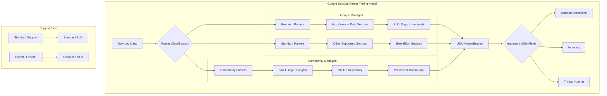

# Google SecOps (SIEM): Standard Parser Support Policy

**リリース日**: 2026-05-27

**サービス**: Google SecOps (SIEM)

**機能**: Standard parser support policy

**ステータス**: Policy announcement

📊 [このアップデートのインフォグラフィックを見る](https://takech9203.github.io/google-cloud-news-summary/20260527-google-secops-standard-parser-support-policy.html)

## 概要

Google SecOps は、Standard パーサーに対する集中的なサポートポリシーを導入しました。このポリシーは、プラットフォームの安定性、予測可能なパフォーマンス、および高品質なデータ正規化をスケールさせることを目的としています。

新しいポリシーでは、サービスレベル目標 (SLO) とリクエストのトリアージを、顧客サポートティア (Standard と Expert/Expert+) によって構造化しています。さらに、Important UDM Fields を通じてコアセキュリティデータを優先的に処理する仕組みを確立しました。

加えて、このポリシーでは、使用率の低いロングテールのプリビルトパーサーを、パートナーや Google SecOps コミュニティによって管理される専用の GitHub リポジトリに移行するコミュニティ主導モデルが概説されています。これにより、Google が高優先度のパーサーに集中してリソースを投下できる一方で、コミュニティの力でロングテールのパーサーも継続的に維持される体制が整います。

**アップデート前の課題**

- すべてのプリビルトパーサーに対して一律のサポートレベルが適用されており、高優先度のデータソースへのリソース集中が困難だった
- 顧客のサポートティアに関わらず、パーサー関連リクエストの優先度付けが明確でなかった
- 使用率の低いロングテールパーサーがプラットフォーム内に滞留し、メンテナンスコストが増大していた
- どの UDM フィールドが特に重要かの基準が不明確で、パーサーの品質管理が統一されていなかった

**アップデート後の改善**

- パーサーが Premium / Standard / Community の明確な階層に分類され、サポートレベルが予測可能になった
- 顧客サポートティア (Standard vs Expert/Expert+) に応じたリクエストトリアージが体系化された
- Important UDM Fields の定義によりコアセキュリティデータが優先的に処理されるようになった
- ロングテールパーサーが GitHub リポジトリに移行し、コミュニティによる継続的メンテナンスが可能になった

## アーキテクチャ図

この図は、Google SecOps のパーサーティアリングモデルの全体構造を示しています。パーサーは Premium、Standard、Community の 3 階層に分類され、それぞれ異なるサポートレベルと管理主体を持ちます。すべてのパーサーは最終的に UDM 正規化を経て、Important UDM Fields を通じてセキュリティ機能に接続されます。

## サービスアップデートの詳細

### 主要機能

1. **パーサーサポートティアの構造化**
   - Premium パーサー: 最も広く使用されている高ボリュームデータソース向け。リクエストは通常数日以内に処理される
   - Standard パーサー: その他のサポート対象データソース向け。ベストエフォートでのサポートを提供
   - Community パーサー: 使用率の低いロングテールパーサーで、GitHub リポジトリで管理

2. **顧客サポートティア別のトリアージ**
   - Standard サポート: 基本的な SLO に基づくリクエスト処理
   - Expert / Expert+ サポート: 強化された SLO と優先的なリクエスト処理
   - サポートティアに応じた明確な優先度付け

3. **Important UDM Fields による品質基準**
   - コアセキュリティデータの正規化を優先する基準を設定
   - Curated Detections、Indexing、Threat Hunting など機能領域ごとに重要フィールドを定義
   - パーサー作成時に Important UDM Fields への正確なマッピングを推奨

4. **コミュニティ主導のメンテナンスモデル**
   - 低使用率のロングテールパーサーを専用 GitHub リポジトリに移行
   - パートナーおよび Google SecOps コミュニティによる管理
   - Google のリソースを高優先度パーサーに集中

## 技術仕様

### パーサーサポートレベル

| パーサータイプ | サポートレベル | 管理主体 | リクエスト処理 |
|------|------|------|------|
| Premium | フルサポート | Google SecOps | 通常数日以内 |
| Standard | ベストエフォート | Google SecOps | Feature Request として処理 |
| Community (Longtail) | コミュニティサポート | パートナー / コミュニティ | GitHub リポジトリ経由 |
| Custom / Extensions | サポートなし | 顧客自身 | 独自管理またはパートナー支援 |

### Important UDM Fields の主要カテゴリ

| 機能領域 | 用途 | 主要フィールド例 |
|------|------|------|
| Curated Detections | プリビルトルールによる脅威検知 | security_result.action, metadata.event_type, principal.ip |
| Indexing | リソース検索と情報エンリッチメント | metadata.event_timestamp, principal.hostname, target.ip |
| Artifact Aliasing | ジオロケーションなどの付加データ | principal.file.sha256, source.file.md5 |
| Asset Aliasing | 物理アセット間の関連性識別 | principal.mac, source.hostname, target.asset_id |
| Threat Hunting | 脅威ハンティング活動の支援 | network.dns_domain, network.email.subject |

### セルフサービスオプション

Standard パーサーの即時ニーズに対応するために、以下のセルフサービス機能が利用可能です。

| 機能 | 説明 |
|------|------|
| Parser Extensions | 既存のプリビルトパーサーに追加マッピングを作成 |
| Auto-extract | 追加フィールドの自動抽出 |
| Custom Parsers | 完全にカスタムなパーサーロジックの作成 |

## メリット

### ビジネス面

- **予測可能なサポートレベル**: パーサータイプと顧客ティアに基づいた明確な SLO により、リクエストの処理時間を事前に把握できる
- **コスト効率の向上**: Google のリソースが高優先度パーサーに集中され、Premium パーサーの品質と応答速度が向上
- **コミュニティエコシステムの活性化**: パートナーやコミュニティがロングテールパーサーの開発・保守に参加でき、エコシステムが拡大

### 技術面

- **プラットフォーム安定性の向上**: パーサーの分類と管理が体系化され、全体的な安定性が改善
- **データ正規化品質の向上**: Important UDM Fields の明確な定義により、パーサーの品質基準が統一される
- **セルフサービスの促進**: Parser Extensions や Auto-extract により、Standard パーサーのカスタマイズ待ちを解消

## デメリット・制約事項

### 制限事項

- Community パーサー (GitHub 移行後) は Google による直接サポートが終了するため、問題発生時のレスポンスが不確実になる可能性がある
- Standard パーサーへのフィールドマッピング追加リクエストは Feature Request として処理されるため、対応時期が不確定
- Custom パーサーおよび Extensions には Google からのサポートが提供されない

### 考慮すべき点

- 現在使用中のパーサーが Community 移行対象かどうかの確認が必要
- Community パーサーへの移行後は、パートナー契約またはコミュニティへの参加がパーサーメンテナンスに必要
- Important UDM Fields の変更に伴い、既存の Detection Rules への影響確認が推奨される

## ユースケース

### ユースケース 1: 高ボリュームデータソースの運用

**シナリオ**: 大規模 SOC チームが、ファイアウォール、EDR、クラウドサービスなど主要セキュリティツールからのログを大量に取り込んでいる場合

**効果**: Premium パーサーとして分類されるこれらのデータソースは、最優先でサポートされ、パーサーの問題やフィールドマッピング追加のリクエストが数日以内に処理される。Enhanced SLO (Expert/Expert+ サポートティア) を活用することで、さらに迅速な対応が期待できる。

### ユースケース 2: ニッチなデータソースへの対応

**シナリオ**: 特定業界固有のアプリケーションや、使用率の低いセキュリティツールのログを取り込む必要がある場合

**効果**: Parser Extensions や Auto-extract を活用したセルフサービスで即時対応が可能。また、GitHub リポジトリでコミュニティが管理するパーサーを利用・カスタマイズすることで、Google の直接サポートがなくても運用を継続できる。

### ユースケース 3: パートナーによるパーサー提供

**シナリオ**: MSSP やセキュリティパートナーが、顧客向けにカスタムパーサーを開発・管理している場合

**効果**: GitHub リポジトリを通じてコミュニティにパーサーを公開・共有でき、パートナーエコシステムでの付加価値提供が可能。Important UDM Fields の基準に沿ったパーサー開発により、Curated Detections や Indexing との統合品質を確保できる。

## 関連サービス・機能

- **Google SecOps SIEM**: パーサーが動作する基盤プラットフォーム。ログ取り込みから UDM 正規化、脅威検知までの一連の処理を担う
- **Curated Detections**: Important UDM Fields に正確にマッピングされたデータを利用する、Google マネージドの脅威検知ルールセット
- **Parser Extensions**: プリビルトパーサーに追加マッピングを定義し、データ取り込みをカスタマイズするセルフサービス機能
- **Auto-extract**: 追加フィールドの自動抽出機能で、Standard パーサーの即時ニーズに対応

## 参考リンク

- 📊 [インフォグラフィック](https://takech9203.github.io/google-cloud-news-summary/20260527-google-secops-standard-parser-support-policy.html)
- [公式リリースノート](https://docs.cloud.google.com/release-notes#May_27_2026)
- [Standard parser support policy ドキュメント](https://docs.cloud.google.com/chronicle/docs/ingestion/standard-parser-support-policy)
- [Important UDM Fields](https://docs.cloud.google.com/chronicle/docs/reference/important-udm-fields)
- [Manage prebuilt and custom parsers](https://docs.cloud.google.com/chronicle/docs/event-processing/manage-parser-updates)
- [Default Parser Configuration](https://docs.cloud.google.com/chronicle/docs/ingestion/default-parsers/default-parser-configuration)

## まとめ

Google SecOps の Standard Parser Support Policy は、パーサーエコシステムの持続可能な成長に向けた重要な構造改革です。Premium / Standard / Community の明確な階層化により、高ボリュームデータソースへの優先対応と、ロングテールパーサーのコミュニティ主導での維持管理が両立されます。セキュリティ運用チームは、利用中のパーサーの分類を確認し、必要に応じて Parser Extensions やカスタムパーサーによるセルフサービス対応を検討することを推奨します。

---

**タグ**: #GoogleSecOps #SIEM #Parser #UDM #SecurityOperations #SupportPolicy #Chronicle #DataNormalization
