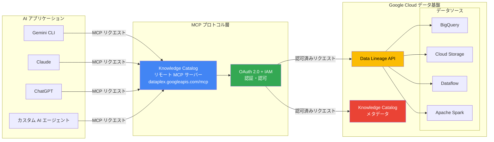

# Knowledge Catalog: データリネージリモート MCP サーバー (Preview)

**リリース日**: 2026-05-27

**サービス**: Knowledge Catalog (旧 Dataplex Universal Catalog)

**機能**: データリネージリモート MCP サーバー

**ステータス**: Preview

📊 [このアップデートのインフォグラフィックを見る](https://takech9203.github.io/google-cloud-news-summary/20260527-knowledge-catalog-data-lineage-mcp-server.html)

## 概要

Google Cloud は Knowledge Catalog (旧 Dataplex Universal Catalog) において、データリネージリモート MCP (Model Context Protocol) サーバーを Preview として提供開始しました。この機能により、AI エージェントや開発ツールからプログラム的にデータリネージグラフを照会し、上流のデータ来歴（プロヴェナンス）の探索や下流への影響分析を行うことが可能になります。

MCP は AI アプリケーションと外部システムを標準化されたプロトコルで接続するためのオープン規格であり、Gemini CLI、Claude、ChatGPT などの主要な AI アプリケーションから Knowledge Catalog のデータリネージ情報にアクセスできるようになります。これにより、データエンジニアやデータガバナンスチームは、自然言語による対話的なデータ系統の調査が可能になり、データパイプラインの可観測性と影響分析のワークフローが大幅に効率化されます。

エンドポイント URL `https://dataplex.googleapis.com/mcp` に接続することで、AI エージェントがデータリネージの探索、メタデータの検索、エントリ詳細の取得を自動的に行えるようになり、従来は手動での API 呼び出しやコンソール操作が必要だったタスクを AI 駆動で実行できるようになります。

**アップデート前の課題**

データリネージの調査は従来、以下のような制約がありました。

- データリネージグラフの探索には Google Cloud コンソールへのアクセスや Data Lineage API の直接呼び出しが必要で、AI エージェントからのシームレスな利用ができなかった
- 上流データの来歴調査や下流への影響分析は手動のグラフ探索に依存しており、複雑なパイプラインでは時間がかかっていた
- AI を活用したデータガバナンスワークフローの自動化において、データリネージ情報への標準化されたアクセス手段が存在しなかった

**アップデート後の改善**

今回のアップデートにより、以下のことが可能になりました。

- AI エージェント (Gemini CLI、Claude、ChatGPT 等) から MCP プロトコルを通じてデータリネージグラフを直接照会できるようになった
- 自然言語による対話でデータの上流来歴や下流影響を分析でき、手動のグラフ探索が不要になった
- OAuth 2.0 と IAM による細粒度のアクセス制御を維持しながら、AI 駆動のデータガバナンスワークフローを構築できるようになった

## アーキテクチャ図




AI アプリケーションが MCP プロトコルを介して Knowledge Catalog リモート MCP サーバーに接続し、OAuth 2.0/IAM による認証を経て Data Lineage API やカタログメタデータにアクセスする構成を示しています。データリネージ情報は BigQuery、Cloud Storage、Dataflow、Apache Spark などのデータソースから自動的に収集されます。

## サービスアップデートの詳細

### 主要機能

1. **データリネージグラフの照会**
   - AI エージェントから自然言語でデータリネージグラフを探索可能
   - テーブルレベルおよびカラムレベルのリネージ情報を取得
   - マルチリージョンにまたがるリネージの追跡に対応

2. **上流データ来歴の探索 (Upstream Provenance)**
   - 特定のデータアセットの元となるデータソースを遡及的に追跡
   - データの変換プロセスと変換元を可視化
   - 「このテーブルのデータはどこから来ているか」という問いに AI が回答

3. **下流影響分析 (Downstream Impact Analysis)**
   - データソースの変更が影響を与える下流のテーブルやダッシュボードを特定
   - 「このカラムを削除した場合、どのレポートが壊れるか」という分析を AI が実行
   - 変更管理のリスク評価を自動化

4. **マルチクライアント対応**
   - Gemini CLI、Claude、ChatGPT、Cursor、VS Code、Windsurf など主要な AI ツールに対応
   - HTTP トランスポートによるリモート接続
   - 標準的な MCP クライアント実装で接続可能

## 技術仕様

### MCP サーバー接続情報

| 項目 | 詳細 |
|------|------|
| サーバー名 | Knowledge Catalog MCP Server |
| エンドポイント URL | `https://dataplex.googleapis.com/mcp` |
| トランスポート | HTTP (Streamable HTTP) |
| 認証方式 | OAuth 2.0 + IAM |
| ステータス | Preview |

### 必要な IAM ロール

| ロール | 説明 |
|--------|------|
| `roles/mcp.toolUser` | MCP ツール呼び出しの実行権限 |
| `roles/dataplex.catalogAdmin` | Knowledge Catalog リソースへのフルアクセス |
| `roles/datalineage.viewer` | データリネージの読み取り権限 |

### OAuth スコープ

| スコープ URI | 説明 |
|-------------|------|
| `https://www.googleapis.com/auth/dataplex.readonly` | データの読み取りのみ許可 |
| `https://www.googleapis.com/auth/dataplex.read-write` | データの読み取りと変更を許可 |

## 設定方法

### 前提条件

1. Google Cloud プロジェクトで Dataplex API が有効化されていること
2. 必要な IAM ロール (`roles/mcp.toolUser`, `roles/dataplex.catalogAdmin`) が付与されていること
3. MCP 対応の AI アプリケーション (Gemini CLI、Claude、ChatGPT 等) が利用可能であること

### 手順

#### ステップ 1: Dataplex API の有効化

```bash
gcloud services enable dataplex.googleapis.com --project=PROJECT_ID
```

Dataplex API を有効化すると、MCP サーバーも自動的に利用可能になります。

#### ステップ 2: IAM ロールの付与

```bash
# MCP ツールユーザーロールの付与
gcloud projects add-iam-policy-binding PROJECT_ID \
  --member="user:USER_EMAIL" \
  --role="roles/mcp.toolUser"

# Dataplex Catalog Admin ロールの付与
gcloud projects add-iam-policy-binding PROJECT_ID \
  --member="user:USER_EMAIL" \
  --role="roles/dataplex.catalogAdmin"

# Data Lineage Viewer ロールの付与 (読み取り専用の場合)
gcloud projects add-iam-policy-binding PROJECT_ID \
  --member="user:USER_EMAIL" \
  --role="roles/datalineage.viewer"
```

#### ステップ 3: MCP クライアントの設定 (Claude Code の例)

```json
{
  "mcpServers": {
    "knowledge-catalog": {
      "type": "url",
      "url": "https://dataplex.googleapis.com/mcp",
      "headers": {
        "Authorization": "Bearer $(gcloud auth print-access-token)"
      }
    }
  }
}
```

#### ステップ 4: Gemini CLI での設定例

```bash
# Gemini CLI の MCP サーバー設定
gemini mcp add knowledge-catalog https://dataplex.googleapis.com/mcp \
  --scope="https://www.googleapis.com/auth/dataplex.readonly"
```

#### ステップ 5: 利用可能なツールの確認

```bash
# MCP サーバーのツール一覧を取得
curl -X POST https://dataplex.googleapis.com/mcp \
  -H "Content-Type: application/json" \
  -d '{"method": "tools/list", "jsonrpc": "2.0", "id": 1}'
```

`tools/list` メソッドは認証不要で実行できます。

## メリット

### ビジネス面

- **データガバナンスの自動化**: AI エージェントがデータリネージを自動分析することで、コンプライアンス報告やデータ品質レビューの工数を削減
- **変更管理の迅速化**: スキーマ変更前の影響分析を AI が即座に実行し、意思決定のスピードを向上
- **データリテラシーの向上**: 自然言語でデータの来歴を問い合わせできるため、非技術者でもデータ系統を理解可能

### 技術面

- **標準プロトコルによる統合**: MCP というオープン規格により、特定ベンダーに依存しない AI ツール統合が可能
- **マルチリージョン対応**: `searchLineageStreaming` API との連携により、リージョンを跨いだリネージ探索を単一リクエストで実行
- **セキュアなアクセス制御**: OAuth 2.0 + IAM による細粒度の認可、Model Armor によるプロンプト/レスポンスセキュリティ、監査ログの集中管理

## デメリット・制約事項

### 制限事項

- Preview 段階であり、本番環境での SLA は提供されない (Pre-GA Offerings Terms が適用)
- リネージ情報は 30 日間のみ保持され、それ以降は自動削除される
- カラムレベルリネージは BigQuery ロードジョブおよびルーティンでは収集されない
- 1 ジョブあたり 1,500 以上のカラムレベルリンクが生成される場合、テーブルレベルのみのリネージに制限される
- リネージグラフの探索は深さ 20 レベル、各方向 10,000 リンクまでに制限

### 考慮すべき点

- AI エージェント用に専用のサービスアカウントを作成し、最小権限の原則に従ったアクセス制御を推奨
- リアルタイムのリネージデータではなく、同期プロセスに数時間のレイテンシが発生する場合がある
- 複雑な SQL (Liquid テンプレート、複雑な JOIN を持つ派生テーブルなど) は完全にパースされない可能性がある
- Preview 機能のためサポートが限定的であり、GA までに仕様変更の可能性がある

## ユースケース

### ユースケース 1: スキーマ変更前の影響分析

**シナリオ**: データエンジニアが BigQuery テーブルのカラムを削除する前に、下流への影響を確認したい

**実装例**:
```
AI エージェントへのプロンプト:
「sales_data テーブルの customer_id カラムを削除した場合、
影響を受ける下流のテーブルやダッシュボードを一覧表示してください」
```

**効果**: 手動でのリネージグラフ探索が不要になり、影響範囲を数秒で特定。変更管理のリスク評価を自動化し、本番障害の予防に貢献。

### ユースケース 2: データ品質問題の根本原因分析

**シナリオ**: レポートに表示されるデータに異常値が検出され、データの元となるソースを追跡したい

**実装例**:
```
AI エージェントへのプロンプト:
「monthly_revenue_report テーブルの revenue カラムの
上流データソースを全て特定し、各変換プロセスを説明してください」
```

**効果**: 複雑なパイプラインにおけるデータの変換経路を即座に可視化。根本原因の特定時間を大幅に短縮。

### ユースケース 3: コンプライアンス監査の自動化

**シナリオ**: GDPR 対応のため、個人情報 (PII) データがどのシステムに流れているかを定期的に監査したい

**実装例**:
```
AI エージェントへのプロンプト:
「customer_pii テーブルのデータが下流で
どのシステムやテーブルに流れているかを追跡し、
各宛先のアクセス権限と合わせてレポートしてください」
```

**効果**: PII データの流通経路を自動追跡し、コンプライアンス監査レポートの作成工数を削減。

## 料金

Knowledge Catalog のデータリネージは Premium processing SKU で課金されます。MCP サーバー経由のアクセスも同様の料金体系が適用されます。

### 料金例

| 項目 | 料金 (USD) |
|------|------------|
| Premium Knowledge Catalog processing (データリネージ含む) | $0.089/DCU-hour~ |
| API 呼び出し (最初の 100 万回/月) | 無料 |
| API 呼び出し (100 万回超/月) | $10/100,000 API コール |
| メタデータストレージ (最初の 1 MiB) | 無料 |
| メタデータストレージ (1 MiB 超) | $2/GiB/月~ |

**注意**: MCP ツール呼び出しは内部的に Data Lineage API を使用するため、API コール数としてカウントされます。AI エージェントによる大量のリネージクエリ実行時にはコストを監視することを推奨します。

## 利用可能リージョン

Knowledge Catalog のデータリネージは全世界 40 以上のリージョンで利用可能です。主要なリージョンは以下の通りです。

| リージョン | 場所 |
|-----------|------|
| asia-northeast1 | 東京 |
| asia-northeast2 | 大阪 |
| us-central1 | アイオワ |
| us-east1 | サウスカロライナ |
| europe-west1 | ベルギー |
| europe-west3 | フランクフルト |

MCP サーバーのグローバルエンドポイント (`https://dataplex.googleapis.com/mcp`) から全リージョンのリネージデータにアクセス可能です。マルチリージョンリネージ検索により、リージョンを跨いだデータフローの追跡も行えます。

## 関連サービス・機能

- **Knowledge Catalog (Dataplex Universal Catalog)**: データアセットの検索、メタデータ管理、データ品質チェックを提供する統合データガバナンスプラットフォーム
- **Data Lineage API**: データの変換経路を記録・追跡する API。BigQuery、Dataflow、Apache Spark、Cloud Data Fusion からのリネージを自動収集
- **Google Cloud MCP サーバー**: Knowledge Catalog 以外にも BigQuery、Cloud SQL、Spanner など複数の Google Cloud サービスで MCP サーバーが提供されている
- **Model Armor**: MCP サーバーへのプロンプト/レスポンスに対するセキュリティ保護を提供
- **Gemini CLI**: Knowledge Catalog 拡張機能を通じた AI 駆動のデータ探索が可能

## 参考リンク

- 📊 [インフォグラフィック](https://takech9203.github.io/google-cloud-news-summary/20260527-knowledge-catalog-data-lineage-mcp-server.html)
- [公式リリースノート](https://docs.cloud.google.com/release-notes#May_27_2026)
- [Knowledge Catalog MCP サーバーの使用方法](https://docs.cloud.google.com/dataplex/docs/use-remote-mcp)
- [Knowledge Catalog MCP リファレンス](https://docs.cloud.google.com/dataplex/docs/reference/mcp)
- [データリネージについて](https://docs.cloud.google.com/dataplex/docs/about-data-lineage)
- [マルチリージョンリネージ検索](https://docs.cloud.google.com/dataplex/docs/multi-region-lineage-overview)
- [Google Cloud MCP サーバー概要](https://docs.cloud.google.com/mcp/overview)
- [料金ページ](https://cloud.google.com/dataplex/pricing)

## まとめ

Knowledge Catalog のデータリネージリモート MCP サーバーは、AI エージェントによるデータガバナンスの自動化を実現する重要なアップデートです。データリネージの照会、上流来歴の探索、下流影響分析を自然言語で行えるようになることで、データエンジニアリングチームの生産性向上とデータガバナンスの強化に大きく貢献します。Preview 段階ではありますが、MCP というオープン規格に基づいているため、早期に評価を開始し、AI 駆動のデータ管理ワークフローの構築に向けた準備を進めることを推奨します。

---

**タグ**: #KnowledgeCatalog #Dataplex #DataLineage #MCP #ModelContextProtocol #AIエージェント #データガバナンス #Preview
