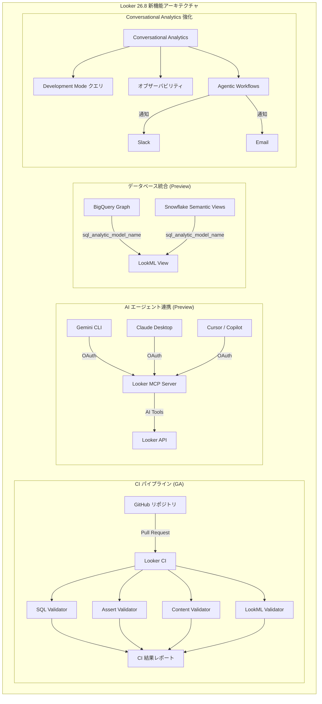

# Looker: Looker 26.8 リリース

**リリース日**: 2026-05-27

**サービス**: Looker

**機能**: Looker 26.8 release

**ステータス**: Rolling out

[このアップデートのインフォグラフィックを見る](https://takech9203.github.io/google-cloud-news-summary/20260527-looker-26-8-release.html)

## 概要

Looker 26.8 は、CI（継続的インテグレーション）機能の GA（一般提供）化を中心に、AI エージェント連携、データベース統合、ダッシュボード UX 改善など多岐にわたる機能強化を含む大型リリースです。特に注目すべきは、Looker マネージド MCP サーバーの Preview 提供開始により、Gemini CLI や Claude Desktop などの AI エージェントから Looker インスタンスへのセキュアな接続が可能になった点です。

本リリースでは 7 つの主要機能が含まれており、1 つが GA、1 つが既存機能の強化、5 つが Preview として提供されます。Conversational Analytics の強化（Development Mode 対応、オブザーバビリティメトリクス、Agentic Workflows）により、Looker の AI 活用がさらに進化しています。

対象ユーザーは Looker 管理者、LookML 開発者、データアナリスト、および AI エージェントを活用したデータ分析ワークフローを構築する開発者です。

**アップデート前の課題**

- LookML プロジェクトの変更がプロダクション環境にデプロイされる前に、SQL エラーやコンテンツの不整合を自動的に検出する標準的な方法が限定的だった（CI は Preview 段階）
- AI エージェントが Looker のデータに接続するには独自のミドルウェアの構築・運用が必要だった
- BigQuery Graph や Snowflake Semantic Views などのデータベース固有のセマンティックモデルと Looker のセマンティックレイヤーを統合する方法がなかった
- Conversational Analytics は本番データのみで動作し、開発モードでのテストができなかった
- ダッシュボードタイルのサイズ調整が粗い単位でしか行えなかった

**アップデート後の改善**

- Looker CI が GA となり、プルリクエストのたびに SQL、LookML、コンテンツ、データテストの自動バリデーションが本番品質で利用可能に
- Looker マネージド MCP サーバーにより、ミドルウェア不要で AI エージェントが Looker に接続可能に
- sql_analytic_model_name パラメータにより、BigQuery Graph や Snowflake Semantic Views をそのまま LookML で参照可能に
- Conversational Analytics が Development Mode でクエリ実行をサポートし、開発中のモデルで AI 機能をテスト可能に
- Granular Dashboard Sizing により、タイルのサイズ・レイアウトをより細かい単位で調整可能に

## アーキテクチャ図



Looker 26.8 の主要機能群を示す図。CI パイプライン、AI エージェント連携（MCP サーバー）、データベース統合（Analytic Models）、Conversational Analytics 強化の 4 つの柱で構成されています。

## サービスアップデートの詳細

### 主要機能

1. **Looker Continuous Integration (GA)**
   - LookML プロジェクトに対する自動テスト機能が一般提供に昇格
   - 4 種類のバリデーター: SQL Validator、Assert Validator、Content Validator、LookML Validator
   - GitHub アプリとの連携により、プルリクエスト送信時に CI バリデーションを自動トリガー可能
   - CI スイートを作成し、プロジェクトごとにバリデーターの組み合わせとオプションを定義
   - 有効化すると自動的に 10 個の Looker CI ユーザーが作成される

2. **Conversational Analytics: Development Mode サポート**
   - Development Mode でクエリを実行する機能を新たにサポート
   - LookML 開発者が開発中のモデル変更を AI アシスタント経由でテスト可能に
   - プロダクションデプロイ前の検証ワークフローを強化

3. **Analytic Models 統合 (Preview)**
   - BigQuery Graph および Snowflake Semantic Views との連携機能
   - `sql_analytic_model_name` パラメータにより、データベース上の既存の分析モデルを LookML ビューの基盤として参照
   - Looker と他の BI ツール間でセマンティック定義の一貫性を維持
   - BigQuery 接続では `<project>.<dataset>.<analytic_model_name>` 形式でスコープ指定可能

4. **Granular Dashboard Sizing (Preview)**
   - ダッシュボードタイルのサイズとレイアウトをより細かい粒度で変更可能
   - ダッシュボードエディターが Labs 設定から有効化
   - ピクセル単位でのレイアウト調整を実現

5. **Conversational Analytics オブザーバビリティ (Preview)**
   - エンゲージメントおよびトークン使用量データを含む拡張オブザーバビリティメトリクス
   - Conversational Analytics System Activity ダッシュボードで利用可能
   - AI 機能の利用状況と費用の可視化

6. **Agentic Workflows (Preview)**
   - 自然言語で Conversational Analytics データエージェントに指示し、条件ベースの通知ワークフローを作成
   - 通知先: Email、Slack、Looker モバイルアプリ
   - 監視頻度: 月次、週次、日次、時間単位、15 分単位から選択可能
   - Gemini powered key driver analysis による原因分析機能（オプション）

7. **Looker マネージド MCP サーバー (Preview)**
   - Model Context Protocol (MCP) サーバーを Looker プラットフォーム内にビルトインで提供
   - Gemini CLI、Claude Desktop、Cursor、Copilot などの AI エージェントが直接接続可能
   - OAuth 認証によるセキュアな接続（接続ユーザーの Looker ロールとアクセス権を継承）
   - 管理者が個別ツールの有効/無効をきめ細かく制御可能
   - 別途ミドルウェアのデプロイ・運用が不要

## 技術仕様

### Looker CI の構成要素

| 項目 | 詳細 |
|------|------|
| SQL Validator | Explore のディメンションがデータベースに対して正しく実行されるか検証 |
| Assert Validator | LookML データテストを実行し、全ての失敗とエラーを報告 |
| Content Validator | Looks とダッシュボードのコンテンツバリデーションを実行 |
| LookML Validator | LookML 構文エラーをチェック |
| 自動作成ユーザー数 | 10 (CI 有効化時に自動作成) |
| GitHub 連携 | CI GitHub App のインストールが必要（PR トリガー利用時は必須） |

### MCP サーバー仕様

| 項目 | 詳細 |
|------|------|
| 認証方式 | OAuth 2.0 |
| 対応インスタンス | Looker (Google Cloud core)、Looker (original) ホスト型 |
| 非対応 | カスタマーホスト型（オンプレミス）インスタンス |
| ツール制御 | 管理者による個別ツールの有効/無効切替 |
| アクセス権限 | 認証ユーザーの Looker ロールを継承 |

### Analytic Models 対応

| 項目 | 詳細 |
|------|------|
| 対応データベース | BigQuery、Snowflake |
| BigQuery モデル | BigQuery Graph (Property Graph) |
| Snowflake モデル | Semantic Views |
| LookML パラメータ | `sql_analytic_model_name` |
| スコープ形式 | `<database>.<schema>.<analytic_model_name>` |

### LookML 設定例（Analytic Models）

```lookml
view: store_graph_view {
  sql_analytic_model_name: StoreGraph ;;

  dimension: location_id {
    type: number
    sql: Stores_location_id ;;
  }

  measure: total_population {
    type: number
    sql: Locations_total_population ;;
  }
}
```

## 設定方法

### Looker CI の有効化

#### 前提条件

1. Looker ホスト型インスタンス（Google Cloud core または original）
2. Public IP ネットワーク構成であること（Private/Hybrid 接続は非対応）
3. CMEK が有効でないこと
4. 管理者権限（`manage_ci` または `see_ci` パーミッション）

#### ステップ 1: CI の有効化

管理パネルの Platform セクション > Continuous Integration ページで「Enable Continuous Integration」トグルを有効にします。

#### ステップ 2: GitHub App のインストール

管理パネルの Continuous Integration ページから、GitHub 組織に CI GitHub App をインストールします。これにより、プルリクエストをトリガーとした CI バリデーション実行が可能になります。

#### ステップ 3: CI スイートの作成

LookML プロジェクトに対して CI スイートを作成し、使用するバリデーターとそのオプションを定義します。

### MCP サーバーの有効化

#### 前提条件

1. Looker ホスト型インスタンス
2. 管理者ロール（Admin）

#### ステップ 1: ツールの有効化

管理パネルの Platform セクション > MCP ページで、AI エージェントに許可するツールを個別に有効化します。

#### ステップ 2: OAuth クライアントの登録

API Explorer を使用して、AI エージェントを OAuth クライアントとして登録します。

#### ステップ 3: AI エージェントからの接続

各 AI エージェント（Gemini CLI、Claude Desktop など）の MCP 設定から Looker インスタンスへ接続し、OAuth 認証を完了します。

## メリット

### ビジネス面

- **データ品質の向上**: CI の GA 化により、本番環境にデプロイされる LookML の品質が保証され、エンドユーザーのクエリエラーが減少
- **AI 活用の加速**: MCP サーバーにより、組織内の AI ツールから直接 Looker のビジネスデータにアクセス可能になり、データドリブンな意思決定を促進
- **プロアクティブな監視**: Agentic Workflows により、データの異常を自然言語で設定するだけで自動通知を受け取れる
- **セマンティックレイヤーの統一**: Analytic Models 統合により、Looker と他の BI ツール間でデータ定義の一貫性を確保

### 技術面

- **開発効率の向上**: CI による自動テスト + Development Mode での Conversational Analytics テストにより、開発サイクルが高速化
- **運用負荷の削減**: マネージド MCP サーバーにより、独自ミドルウェアの構築・運用が不要
- **粒度の細かいセキュリティ**: MCP ツールの個別制御と OAuth 認証により、最小権限の原則を適用可能
- **コスト可視化**: Conversational Analytics のトークン使用量メトリクスにより、AI 機能の費用を把握可能

## デメリット・制約事項

### 制限事項

- Looker CI は Public IP 構成のインスタンスでのみ利用可能（Private/Hybrid 接続は非対応）
- Looker CI は CMEK 有効インスタンスでは利用不可
- CI データの一部は米国に保存されるため、データレジデンシー要件がある場合は注意が必要
- MCP サーバーはカスタマーホスト型（オンプレミス）インスタンスでは利用不可
- Agentic Workflows は Advanced Analytics で生成された複雑なカスタムメトリクスの監視には非対応
- Agentic Workflows はディメンションやテーブル計算の監視には非対応

### 考慮すべき点

- CI 有効化時に作成される 10 個の CI ユーザーは、access_grant を使用している場合に適切なユーザー属性値の設定が必要
- MCP サーバーのツール有効/無効を変更した場合、AI クライアント側の再接続が必要
- Looker CI は FedRAMP High/Moderate、DoD IL5 の認可境界には含まれない
- Preview 機能はサポートが限定的であり、本番ワークロードでの使用は慎重に検討すべき

## ユースケース

### ユースケース 1: LookML 開発のCI/CD パイプライン

**シナリオ**: 大規模な LookML プロジェクトを複数の開発者が共同で開発しており、プルリクエストごとに手動レビューだけでは品質を担保しきれない状況。

**実装例**:
1. Looker CI を有効化し、GitHub App をインストール
2. SQL Validator + LookML Validator + Content Validator を含む CI スイートを作成
3. プルリクエスト送信時に自動トリガーを設定
4. CI 結果を PR のステータスチェックとして表示

**効果**: プロダクション環境へのデプロイ前に SQL エラーやコンテンツの破損を自動検出し、エンドユーザーへの影響を未然に防止。

### ユースケース 2: AI エージェントによるセルフサービス分析

**シナリオ**: 営業チームが日常的にデータ分析を必要としているが、Looker の操作に不慣れなメンバーが多い。AI アシスタントを通じて自然言語でデータにアクセスしたい。

**実装例**:
1. Looker MCP サーバーを有効化し、必要なツール（looker_query など）を有効に
2. 営業チームが使用する AI エージェント（Gemini CLI など）を OAuth クライアントとして登録
3. 各メンバーが自身の Looker 認証情報で AI エージェントに接続

**効果**: 営業メンバーが「先月の地域別売上を教えて」と AI に尋ねるだけで、Looker のセマンティックレイヤーに基づいた正確なデータを取得可能。

### ユースケース 3: データ異常の自動検知と通知

**シナリオ**: EC サイトの売上データを監視し、異常な落ち込みがあった場合にすぐに担当者に通知したい。

**実装例**:
1. Conversational Analytics で売上データの Explore エージェントを開く
2. 「日次売上が前日比20%以上減少したら Slack の #sales-alerts チャンネルに通知して」と自然言語で指示
3. Agentic Workflow が自動的に条件、閾値、通知先、頻度を設定

**効果**: 従来のアラート設定に比べ、自然言語での設定により非技術者でも高度な監視ルールを構築可能。Gemini key driver analysis により原因の示唆も自動で提供。

## 関連サービス・機能

- **BigQuery**: Analytic Models 統合における BigQuery Graph のサポート
- **Vertex AI**: Conversational Analytics の基盤となる Gemini モデルの提供
- **Cloud IAM**: MCP サーバーの OAuth 認証とアクセス制御
- **GitHub**: Looker CI の PR トリガーとステータスチェック連携
- **Slack**: Agentic Workflows の通知先として連携

## 参考リンク

- [インフォグラフィック](https://takech9203.github.io/google-cloud-news-summary/20260527-looker-26-8-release.html)
- [公式リリースノート](https://docs.cloud.google.com/release-notes#May_27_2026)
- [Looker CI ドキュメント](https://docs.cloud.google.com/looker/docs/continuous-integration)
- [Looker Analytic Models ドキュメント](https://docs.cloud.google.com/looker/docs/analytic-models)
- [Looker MCP サーバー ドキュメント](https://docs.cloud.google.com/looker/docs/mcp)
- [Agentic Workflows ドキュメント](https://docs.cloud.google.com/looker/docs/conversational-analytics-looker-agentic-workflows)
- [Granular Dashboard Sizing](https://docs.cloud.google.com/looker/docs/admin-panel-general-labs#granular-dashboard-sizing)
- [Conversational Analytics System Activity](https://docs.cloud.google.com/looker/docs/system-activity-dashboards#conversational-analytics)

## まとめ

Looker 26.8 は、CI の GA 化による開発品質の向上と、MCP サーバーや Agentic Workflows などの AI エージェント連携機能により、Looker のデータプラットフォームとしての役割を大幅に拡張するリリースです。特に MCP サーバーの登場は、Looker のセマンティックレイヤーを AI エコシステム全体に開放する重要な一歩であり、Looker を利用している組織は早期に Preview 機能の評価を開始することを推奨します。

---

**タグ**: #Looker #CI #MCP #ConversationalAnalytics #BigQuery #Snowflake #AI #AgenticWorkflows #AnalyticModels #Dashboard
