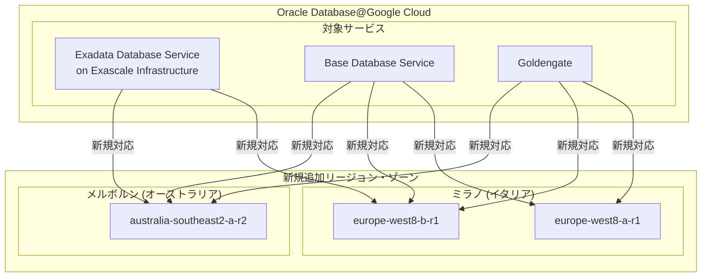

# Oracle Database@Google Cloud: メルボルンおよびミラノリージョンの新規追加

**リリース日**: 2026-05-27

**サービス**: Oracle Database@Google Cloud

**機能**: 新リージョン・ゾーンの追加 (メルボルン、ミラノ)

**ステータス**: GA

📊 [このアップデートのインフォグラフィックを見る](https://takech9203.github.io/google-cloud-news-summary/20260527-oracle-database-google-cloud-melbourne-milan.html)

## 概要

Oracle Database@Google Cloud において、Exadata Database Service on Exascale Infrastructure、Base Database Service、および Goldengate の3つのサービスに新しいリージョンとゾーンが追加されました。具体的には、オーストラリアのメルボルン (australia-southeast2-a-r2) とイタリアのミラノ (europe-west8-b-r1 および europe-west8-a-r1) が新たに利用可能になりました。

この拡張により、オーストラリアおよびヨーロッパのユーザーは、Oracle Database ワークロードをより近い場所で実行できるようになり、レイテンシの削減とデータレジデンシー要件への対応が容易になります。特に Exascale Infrastructure と Base Database Service にとっては、これらのリージョンへの初めての展開となり、サービスのグローバルカバレッジが大幅に強化されました。

今回のアップデートは、Oracle と Google Cloud のパートナーシップによるマルチクラウド戦略の一環として、エンタープライズ顧客がグローバルに Oracle データベースワークロードを展開するための選択肢を拡大するものです。

**アップデート前の課題**

- Exascale Infrastructure および Base Database Service は、メルボルンとミラノでは利用できず、最寄りのリージョン (シドニーやフランクフルト) を使用する必要があった
- オーストラリア南東部およびイタリアのユーザーは、地理的に遠いリージョンを使用することによるレイテンシの増加が課題だった
- Goldengate もメルボルンおよびミラノでは利用できず、データレプリケーションの構成に地理的な制約があった

**アップデート後の改善**

- Exascale Infrastructure がメルボルン (australia-southeast2-a-r2) で利用可能になり、オーストラリア南東部での低レイテンシなデータベース運用が実現
- Base Database Service がメルボルンおよびミラノの両方で利用可能になり、シングルノード構成のデータベースを地理的に最適な場所に配置可能に
- Goldengate がメルボルンおよびミラノで利用可能になり、これらのリージョンでのリアルタイムデータレプリケーションが可能に

## アーキテクチャ図




今回のリージョン拡張により、Exascale Infrastructure、Base Database Service、Goldengate の3つのサービスがメルボルンおよびミラノで利用可能になったことを示しています。

## サービスアップデートの詳細

### 主要機能

1. **Exadata Database Service on Exascale Infrastructure のリージョン追加**
   - メルボルン (australia-southeast2-a-r2) ゾーンで Exascale VM Clusters と Exascale Storage Vaults の作成が可能に
   - ミラノ (europe-west8-b-r1) ゾーンで同様のリソース作成が可能に
   - Exascale は従来の Exadata に比べてより柔軟なスケーリングが可能な次世代インフラストラクチャ

2. **Base Database Service のリージョン追加**
   - メルボルン (australia-southeast2-a-r2) で DB System リソースの作成が可能に
   - ミラノ (europe-west8-b-r1 および europe-west8-a-r1) の2つのゾーンで DB System リソースの作成が可能に
   - Base Database Service はシングルノードまたは2ノードの RAC 構成のデータベースシステムを提供

3. **Goldengate のリージョン追加**
   - メルボルン (australia-southeast2-a-r2) で Goldengate デプロイメントの作成が可能に
   - ミラノ (europe-west8-b-r1 および europe-west8-a-r1) の2つのゾーンで Goldengate デプロイメントの作成が可能に
   - リアルタイムデータレプリケーションとデータ統合をこれらの新リージョンで実行可能

## 技術仕様

### 新規追加ゾーン一覧

| サービス | リージョン | ゾーン | 場所 |
|---------|-----------|--------|------|
| Exascale Infrastructure | australia-southeast2 | australia-southeast2-a-r2 | メルボルン、オーストラリア |
| Exascale Infrastructure | europe-west8 | europe-west8-b-r1 | ミラノ、イタリア |
| Base Database Service | australia-southeast2 | australia-southeast2-a-r2 | メルボルン、オーストラリア |
| Base Database Service | europe-west8 | europe-west8-b-r1 | ミラノ、イタリア |
| Base Database Service | europe-west8 | europe-west8-a-r1 | ミラノ、イタリア |
| Goldengate | australia-southeast2 | australia-southeast2-a-r2 | メルボルン、オーストラリア |
| Goldengate | europe-west8 | europe-west8-b-r1 | ミラノ、イタリア |
| Goldengate | europe-west8 | europe-west8-a-r1 | ミラノ、イタリア |

### 既存のメルボルン・ミラノ対応状況

| サービス | メルボルン (australia-southeast2) | ミラノ (europe-west8) |
|---------|----------------------------------|---------------------|
| Exadata Database Service | 対応済み (australia-southeast2-a-r2, australia-southeast2-b-r1) | 対応済み (europe-west8-b-r1, europe-west8-a-r1) |
| Exascale Infrastructure | **今回新規追加** | **今回新規追加** |
| Autonomous AI Database Service | 対応済み | 対応済み |
| Base Database Service | **今回新規追加** | **今回新規追加** |
| Goldengate | 対応済み (australia-southeast2-b-r1) | **今回新規追加** |

## 設定方法

### 前提条件

1. Oracle Database@Google Cloud のオーダーが完了していること
2. OCI アカウントとの連携 (オンボーディング) が完了していること
3. ODB Network が対象リージョンに設定されていること

### 手順

#### ステップ 1: ODB Network の作成

```bash
# Google Cloud CLI を使用して ODB Network を作成
gcloud oracle-database odb-networks create my-odb-network \
  --location=australia-southeast2 \
  --project=my-project \
  --cidr=192.168.1.0/24
```

ODB Network は Oracle Database@Google Cloud リソースへの接続を管理するために必要です。新しいリージョンでリソースを作成する前に、対象リージョンで ODB Network を作成してください。

#### ステップ 2: Exascale VM Cluster の作成 (Exascale Infrastructure の場合)

```bash
# メルボルンリージョンで Exascale VM Cluster を作成
gcloud oracle-database exascale-vm-clusters create my-exascale-cluster \
  --location=australia-southeast2 \
  --zone=australia-southeast2-a-r2 \
  --project=my-project \
  --odb-network=my-odb-network
```

Exascale Infrastructure では、VM Cluster と Storage Vault を作成してデータベース環境を構築します。

#### ステップ 3: DB System の作成 (Base Database Service の場合)

```bash
# ミラノリージョンで DB System を作成
gcloud oracle-database db-systems create my-db-system \
  --location=europe-west8 \
  --zone=europe-west8-b-r1 \
  --project=my-project \
  --odb-network=my-odb-network
```

Base Database Service では、DB System リソースを作成してシングルノードまたは RAC 構成のデータベースを展開します。

## メリット

### ビジネス面

- **データレジデンシーの確保**: オーストラリアおよびイタリアのデータ主権要件に対応可能。特にヨーロッパの GDPR やオーストラリアの Privacy Act への準拠が容易に
- **グローバル展開の加速**: メルボルンとミラノに拠点を持つ企業が、Oracle データベースワークロードを現地で運用可能になり、ビジネス展開が迅速化
- **コスト最適化**: 最寄りのリージョンを利用することで、クロスリージョンのデータ転送コストを削減

### 技術面

- **低レイテンシ**: メルボルンおよびミラノのユーザーが地理的に最も近いリージョンを利用でき、ネットワークレイテンシが大幅に改善
- **高可用性構成の強化**: 複数ゾーン (特にミラノの europe-west8-b-r1 と europe-west8-a-r1) を活用したディザスタリカバリ構成が可能
- **Goldengate によるリアルタイムレプリケーション**: 新リージョンでの Goldengate 対応により、グローバルなデータレプリケーションのトポロジー設計が柔軟に

## デメリット・制約事項

### 制限事項

- Exascale Infrastructure はミラノで europe-west8-b-r1 のみ対応 (europe-west8-a-r1 は Base Database Service と Goldengate のみ)
- Oracle Database@Google Cloud の料金は Oracle が設定しており、リージョンによって異なる可能性がある
- リソースの作成には事前に ODB Network の設定が必要で、同一リージョン・ゾーン内でのみ通信可能

### 考慮すべき点

- 新しいリージョンでの初期利用においては、一部のリソースの provisioning に時間がかかる場合がある
- Autonomous AI Database Service は今回のアップデートには含まれておらず、別途対応状況を確認する必要がある
- Private Offer (カスタム価格) を利用している場合、新リージョンでの利用条件について Oracle セールスチームへの確認が推奨される

## ユースケース

### ユースケース 1: オーストラリア金融機関のデータベース移行

**シナリオ**: メルボルンに本社を置く金融機関が、オンプレミスの Oracle データベースを Google Cloud に移行したいが、オーストラリア国内にデータを保持する必要がある。

**実装例**:
```bash
# メルボルンリージョンで Base Database Service を使用
gcloud oracle-database db-systems create finance-db \
  --location=australia-southeast2 \
  --zone=australia-southeast2-a-r2 \
  --project=finance-prod \
  --odb-network=finance-network \
  --shape=VM.Standard.E4.Flex \
  --node-count=2
```

**効果**: オーストラリアのデータレジデンシー要件を満たしつつ、Google Cloud のインフラストラクチャ上で Oracle データベースを運用可能。レイテンシも最小限に抑えられる。

### ユースケース 2: ヨーロッパ圏でのデータレプリケーション

**シナリオ**: イタリアに拠点を持つ製造業企業が、ロンドンの本社データベースからミラノへのリアルタイムデータレプリケーションを必要としている。

**実装例**:
```bash
# Goldengate をミラノで展開してレプリケーション設定
gcloud oracle-database goldengate-deployments create eu-replication \
  --location=europe-west8 \
  --zone=europe-west8-b-r1 \
  --project=manufacturing-prod \
  --odb-network=eu-network
```

**効果**: Goldengate のミラノ対応により、ロンドン - ミラノ間のリアルタイムデータレプリケーションが実現。GDPR に準拠したデータ配置とヨーロッパ圏内での低レイテンシなデータ同期が可能。

## 料金

Oracle Database@Google Cloud の料金は Oracle が設定しており、利用形態に応じて2つのオファータイプがあります。

| オファータイプ | 概要 | 課金方式 |
|--------------|------|---------|
| Public (Pay-As-You-Go) | 標準のオンデマンド料金モデル | OCPU 時間、ストレージ GB 単位で従量課金 |
| Private | 長期契約やカスタム価格のモデル | Oracle セールスとの個別交渉による固定料金またはコミット割引 |

### 料金例

| リソース | 課金単位 | 備考 |
|---------|---------|------|
| OCPU | 時間あたり | サービスタイプにより単価が異なる |
| ストレージ | GB あたり | Exascale Storage Vault の容量に基づく |
| データ転送 | GB あたり | リージョン間転送に適用 |

詳細な料金については [Oracle Database@Google Cloud pricing](https://www.oracle.com/cloud/google/oracle-database-at-google-cloud/pricing/) を参照してください。

## 利用可能リージョン

Oracle Database@Google Cloud は以下の主要リージョンで利用可能です (今回追加分を含む):

**アジア太平洋**:
- asia-northeast1 (東京)、asia-northeast2 (大阪)
- australia-southeast1 (シドニー)、australia-southeast2 (メルボルン)
- asia-south1 (ムンバイ)、asia-south2 (デリー)

**北米**:
- us-central1 (アイオワ)、us-east4 (バージニア北部)、us-west3 (ソルトレイクシティ)
- northamerica-northeast1 (モントリオール)、northamerica-northeast2 (トロント)

**南米**:
- southamerica-east1 (サンパウロ)

**ヨーロッパ**:
- europe-west2 (ロンドン)、europe-west3 (フランクフルト)、europe-west8 (ミラノ)

## 関連サービス・機能

- **Exadata Database Service**: 既にメルボルンとミラノの両リージョンで利用可能な、フル機能の Exadata サービス
- **Autonomous AI Database Service**: メルボルンとミラノのリージョンで利用可能な自律型データベースサービス
- **Google Cloud Interconnect**: Oracle Database@Google Cloud と他の Google Cloud サービスとの低レイテンシ接続を提供
- **Cloud Monitoring / Cloud Logging**: Oracle Database@Google Cloud リソースのメトリクスとログの監視・可視化

## 参考リンク

- 📊 [インフォグラフィック](https://takech9203.github.io/google-cloud-news-summary/20260527-oracle-database-google-cloud-melbourne-milan.html)
- [公式リリースノート](https://docs.cloud.google.com/release-notes#May_27_2026)
- [サポートされるリージョンとゾーン](https://docs.cloud.google.com/oracle/database/docs/regions-and-zones)
- [Oracle Database@Google Cloud 概要](https://docs.cloud.google.com/oracle/database/docs/overview)
- [料金ページ](https://www.oracle.com/cloud/google/oracle-database-at-google-cloud/pricing/)
- [購入とオンボーディング](https://docs.cloud.google.com/oracle/database/docs/purchase-and-billing)

## まとめ

今回のアップデートにより、Oracle Database@Google Cloud の Exascale Infrastructure、Base Database Service、Goldengate がメルボルンとミラノで新たに利用可能になり、グローバルカバレッジが大幅に強化されました。オーストラリアおよびヨーロッパのユーザーは、データレジデンシー要件に対応しながら低レイテンシなデータベース運用を実現できます。これらのリージョンで Oracle Database ワークロードを運用する予定のある組織は、ODB Network の設定から着手し、新しいリージョンでのリソース作成を開始することを推奨します。

---

**タグ**: #OracleDatabase #GoogleCloud #リージョン拡張 #メルボルン #ミラノ #ExascaleInfrastructure #BaseDatabaseService #Goldengate #GA #マルチクラウド
