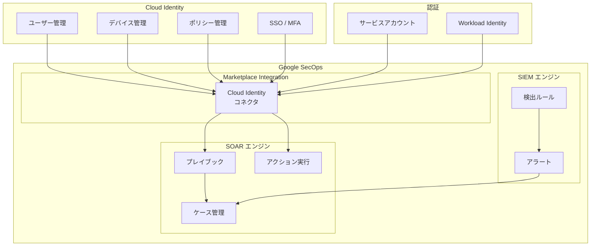

# Google SecOps Marketplace: Cloud Identity 連携の追加

**リリース日**: 2026-05-27

**サービス**: Google SecOps Marketplace

**機能**: New Cloud Identity integration

**ステータス**: GA (Feature)

📊 [このアップデートのインフォグラフィックを見る](https://takech9203.github.io/google-cloud-news-summary/20260527-secops-marketplace-cloud-identity.html)

## 概要

Google SecOps Marketplace に Cloud Identity との新しい連携機能が一般提供 (GA) として追加されました。この統合により、セキュリティチームは Cloud Identity が提供するアイデンティティ管理、デバイス管理、およびセキュリティ機能のデータを Google SecOps のワークフローに直接取り込み、調査や対応に活用できるようになります。

Cloud Identity は、ユーザーアカウントのセキュリティ、デバイスセキュリティ、SSO (シングルサインオン)、MFA (多要素認証) などの統合的な ID 管理機能を提供するサービスです。今回の連携により、これらの ID 関連データを SecOps のプレイブックやインシデント対応に組み込むことで、アイデンティティベースの脅威に対する検出と対応を強化できます。

本連携は、Google SecOps SOAR の自動化機能と組み合わせることで、アクセス制御の管理、ポリシー定義の監査、検出器リスト属性の維持といったユースケースを自動化し、セキュリティ運用の効率化を実現します。

**アップデート前の課題**

- Cloud Identity のユーザー・デバイス情報をセキュリティ調査に利用するには、手動で複数のコンソールを切り替える必要があった
- アイデンティティ関連のセキュリティインシデント対応を自動化するためのネイティブ連携が不足していた
- 組織単位 (OU) やグループの情報を SecOps プレイブックから直接参照・操作する手段がなかった

**アップデート後の改善**

- Cloud Identity のデータを SecOps プレイブック内で直接取得・活用できるようになった
- IAM 設定の変更やアクセス制御をインシデント調査中のプレイブックから自動実行可能になった
- ポリシー定義の監査や検出器リストの更新をワークフロー内で一元管理できるようになった

## アーキテクチャ図



Cloud Identity のユーザー、デバイス、ポリシー情報が Marketplace コネクタ経由で Google SecOps に取り込まれ、SOAR プレイブックでの自動対応や SIEM での検出に活用されるアーキテクチャを示しています。

## サービスアップデートの詳細

### 主要機能

1. **アクセス制御管理**
   - 調査用プレイブックから直接 IAM 設定を作成・更新可能
   - インシデント対応中にリアルタイムでアクセス権限を変更できる
   - サービスアカウントの有効化・無効化・削除をワークフロー内で実行

2. **ポリシー定義の監査**
   - 利用可能なポリシーの情報を一覧表示し、アクセス変更を追跡
   - 組織単位 (OU) の構造やグループメンバーシップの確認
   - ポリシー変更の検出とアラート連携

3. **検出器リスト属性の管理**
   - エンティティやインジケーターを特定の検出器 URL リストに追加
   - 監視対象の動的な更新をプレイブックから自動実行
   - 脅威インテリジェンスとの連携による監視対象の自動拡充

## 技術仕様

### 連携パラメータ

| パラメータ | 説明 | 必須 |
|------|------|------|
| Service Account JSON File Content | サービスアカウントキー JSON ファイルの内容 | いずれか一方 |
| Workload Identity Email | サービスアカウントのクライアントメールアドレス | いずれか一方 |
| Delegated Email | 操作実行に使用する委任メールアドレス | 必須 |
| Verify SSL | SSL 証明書の検証 (デフォルト有効) | 任意 |

### 必要な OAuth スコープ

```
https://www.googleapis.com/auth/cloud-platform
https://www.googleapis.com/auth/cloud-identity.policies
https://www.googleapis.com/auth/admin.directory.orgunit
```

### 必要な API

| API | エンドポイント |
|------|------|
| Admin SDK API | admin.googleapis.com |
| Cloud Identity API | cloudidentity.googleapis.com |

## 設定方法

### 前提条件

1. Google Cloud プロジェクトでサービスアカウントが作成済みであること
2. Admin SDK API と Cloud Identity API が有効化されていること
3. ドメイン全体の委任 (Domain-wide Delegation) が設定されていること
4. Google Admin コンソールで適切なカスタムロールが割り当て済みであること

### 手順

#### ステップ 1: サービスアカウントの作成

```bash
# Google Cloud コンソールで IAM & Admin > Service Accounts に移動
# または gcloud CLI で作成
gcloud iam service-accounts create secops-cloud-identity \
  --display-name="SecOps Cloud Identity Integration" \
  --project=YOUR_PROJECT_ID
```

サービスアカウントを作成し、Cloud Identity へのアクセスに必要な権限を付与します。

#### ステップ 2: ドメイン全体の委任設定

```bash
# Google Admin コンソールで以下を設定:
# Security > Access and data control > API controls > Domain wide delegation
# 以下の OAuth スコープを追加:
# - https://www.googleapis.com/auth/cloud-platform
# - https://www.googleapis.com/auth/cloud-identity.policies
# - https://www.googleapis.com/auth/admin.directory.orgunit
```

Admin コンソールからサービスアカウントのクライアント ID に対してドメイン全体の委任を設定します。

#### ステップ 3: Google SecOps での連携設定

```bash
# Google SecOps コンソールで:
# Content Hub > Response Integrations > Cloud Identity を選択
# 認証方法を選択:
#   - Option 1: JSON キー (サービスアカウントキーを貼り付け)
#   - Option 2: Workload Identity (推奨、短命トークンを使用)
# Delegated Email を入力
# Save > Test で接続確認
```

Google SecOps の Marketplace から Cloud Identity 連携を有効化し、認証情報を設定します。

#### ステップ 4: Admin コンソールでのカスタムロール作成

```bash
# Google Admin コンソール > Account > Admin Roles で:
# 1. Create new role をクリック
# 2. Admin API privileges で以下を選択:
#    - Organization Units
#    - Users
#    - Groups
# 3. ロールを作成し、連携用ユーザーに割り当て
```

連携に必要な管理者権限を定義したカスタムロールを作成し、委任ユーザーに付与します。

## メリット

### ビジネス面

- **インシデント対応時間の短縮**: アイデンティティ関連のインシデントに対し、プレイブック内で直接対応アクションを実行できるため、MTTR (平均復旧時間) を大幅に削減
- **セキュリティ体制の強化**: ID 管理とセキュリティ運用の統合により、アイデンティティベースの攻撃 (アカウント乗っ取り、権限昇格等) への対応力が向上
- **コンプライアンス対応**: ポリシー監査の自動化により、規制要件への適合状態を継続的に監視可能

### 技術面

- **Workload Identity 対応**: 短命トークンによるセキュアな認証により、静的なキーファイルの管理負荷を軽減
- **プレイブック統合**: SOAR プレイブックとの完全な統合により、検出から対応までの自動化パイプラインを構築可能
- **エンティティエンリッチメント**: SecOps のケースにおいてユーザーエンティティを Cloud Identity の情報で自動的にエンリッチ

## デメリット・制約事項

### 制限事項

- ドメイン全体の委任 (Domain-wide Delegation) の設定が必要であり、セキュリティポリシー上の制約がある組織では追加の承認プロセスが必要な場合がある
- Admin SDK API と Cloud Identity API の両方を有効化する必要があり、API クォータの管理が必要
- Workload Identity 使用時は、Service Account Token Creator ロールの付与が必要

### 考慮すべき点

- 委任メールアカウントには広範な管理者権限が付与されるため、最小権限の原則に基づいた慎重なロール設計が求められる
- 本連携で実行するアクション (サービスアカウントの無効化・削除等) は影響範囲が大きいため、プレイブックの設計時に十分なテストと承認フローの組み込みが推奨される
- 大規模組織では API レート制限に注意が必要

## ユースケース

### ユースケース 1: 不審なログインへの自動対応

**シナリオ**: Cloud Identity でアカウント乗っ取りの疑いがあるログイン異常が検出された場合、SecOps プレイブックが自動的にユーザー情報をエンリッチし、リスク判定に基づいてアクセスを制限する。

**実装例**:
```
[アラート: 異常なログイン検出]
    |
    v
[プレイブック起動]
    |
    v
[Cloud Identity: ユーザー情報取得]
    |
    v
[リスクスコア判定]
    |
    +--> [高リスク] --> [サービスアカウント無効化] --> [SOC 通知]
    |
    +--> [中リスク] --> [MFA 強制] --> [監視強化]
    |
    +--> [低リスク] --> [ログ記録]
```

**効果**: 不審なアクティビティの検出から対応までを数分以内に自動化し、アカウント侵害の被害拡大を防止。

### ユースケース 2: 権限昇格の監視と自動修復

**シナリオ**: IAM ポリシーの変更により、通常とは異なる権限昇格が発生した場合、自動的にポリシーを監査し、不正な変更を検出・修復する。

**効果**: 内部脅威や設定ミスによる過剰な権限付与を早期に検出し、組織のセキュリティポリシーへの適合状態を維持。

### ユースケース 3: デバイスコンプライアンスの継続的監視

**シナリオ**: Cloud Identity のデバイス管理情報を SecOps に取り込み、コンプライアンス違反のデバイスからのアクセスを検出・ブロックする。

**効果**: ゼロトラストモデルに基づき、デバイスの状態に応じたアクセス制御を自動化し、セキュリティポスチャーを強化。

## 料金

Cloud Identity 連携自体は Google SecOps Marketplace の統合機能として追加料金なしで利用可能です。ただし、以下の点に留意してください。

### 料金に影響する要素

| 要素 | 説明 |
|--------|-----------------|
| Google SecOps | SecOps プラットフォームのライセンス費用が別途必要 |
| Cloud Identity | Free Edition または Premium Edition のサブスクリプション |
| API 使用量 | Admin SDK API および Cloud Identity API の呼び出しに対するクォータ (通常は無料枠内) |

※ Cloud Identity Premium は 1 ユーザーあたり月額 $7.20 (年間契約) で提供されています。詳細な料金情報は公式ページをご確認ください。

## 利用可能リージョン

Google SecOps Marketplace の Cloud Identity 連携は、Google SecOps が利用可能なすべてのリージョンで使用できます。Cloud Identity 自体はグローバルサービスとして提供されているため、リージョン制約はありません。

## 関連サービス・機能

- **Google Cloud IAM**: SecOps Marketplace には別途 Google Cloud IAM 連携も提供されており、サービスアカウントの管理やロール操作が可能
- **Security Command Center**: 組織全体のセキュリティポスチャーの可視化と Cloud Identity のセキュリティ情報を統合的に管理
- **BeyondCorp Enterprise**: Cloud Identity のコンテキストアウェアアクセスと連携し、ゼロトラストセキュリティモデルを実現
- **Google SecOps SIEM**: Cloud Identity のログを取り込み、検出ルールによるリアルタイムモニタリングを実施
- **Chronicle SOAR**: プレイブックによる自動対応の基盤として、Cloud Identity アクションを組み込み

## 参考リンク

- 📊 [インフォグラフィック](https://takech9203.github.io/google-cloud-news-summary/20260527-secops-marketplace-cloud-identity.html)
- [公式リリースノート](https://docs.cloud.google.com/release-notes#May_27_2026)
- [Cloud Identity と Google SecOps の連携ドキュメント](https://docs.cloud.google.com/chronicle/docs/soar/marketplace-integrations/cloud-identity)
- [Cloud Identity 製品ページ](https://cloud.google.com/identity)
- [Google SecOps Marketplace 連携設定ガイド](https://docs.cloud.google.com/chronicle/docs/soar/respond/integrations-setup/configure-integrations)

## まとめ

Google SecOps Marketplace への Cloud Identity 連携の追加は、アイデンティティセキュリティと SecOps ワークフローの統合を大きく前進させるアップデートです。セキュリティチームは、ID 関連の脅威 (アカウント乗っ取り、不正な権限昇格、デバイスコンプライアンス違反等) に対して、検出から対応までを一貫したプレイブックで自動化できるようになります。特に Workload Identity による安全な認証方式への対応は、運用面でのセキュリティも考慮された設計です。Google SecOps を利用中の組織は、Cloud Identity 連携の有効化を検討し、既存のインシデント対応プレイブックへの統合を進めることを推奨します。

---

**タグ**: #GoogleSecOps #CloudIdentity #SecurityOperations #SOAR #Marketplace #IdentityManagement #Automation #GA
