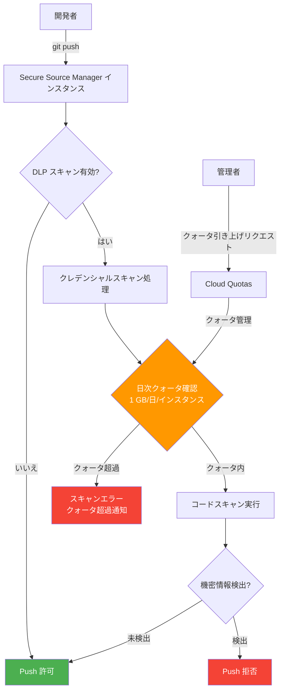

# Secure Source Manager: コードスキャンに対する日次レートクォータの適用

**リリース日**: 2026-05-27

**サービス**: Secure Source Manager

**機能**: クレデンシャルスキャンサイズに対する日次レートクォータの適用

**ステータス**: GA (一般提供)

📊 [このアップデートのインフォグラフィックを見る](https://takech9203.github.io/google-cloud-news-summary/20260527-secure-source-manager-code-scan-quota.html)

## 概要

Google Cloud の Secure Source Manager において、インスタンスごとにクレデンシャルスキャン対象コードのサイズに日次レートクォータが適用されるようになりました。デフォルトのクォータ制限は、1インスタンスあたり1日1 GB です。これにより、クレデンシャルスキャン機能のリソース使用が制御され、サービスの安定性が確保されます。

Secure Source Manager の DLP (Data Loss Prevention) 機能は、リポジトリへの push 時にコミット内容をスキャンし、SSH 秘密鍵、AWS クレデンシャル、GCP クレデンシャル、OAuth クライアントシークレット、その他のシークレットキーなどの機密情報を検出します。今回のアップデートでは、このスキャン処理に対してクォータが明示的に設定され、大規模なコードベースを持つ組織やスキャン頻度の高い環境において、リソースの公平な配分が保証されるようになりました。

このクォータは Rate クォータであるため、同日内にインスタンスを削除して同一 ID で再作成した場合でも、クォータ使用量はリセットされません。翌日まで待つか、異なるインスタンス ID で再作成する必要があります。

**アップデート前の課題**

- クレデンシャルスキャンのリソース使用量に明確な上限がなく、大量の push が集中した場合にサービスパフォーマンスに影響を与える可能性があった
- スキャン処理のリソース配分が不透明で、計画的なキャパシティ管理が困難だった
- 大規模なモノレポや頻繁なコミットにより、スキャンリソースが予期せず枯渇するリスクがあった

**アップデート後の改善**

- 1インスタンスあたり1日1 GB という明確なクォータが設定され、リソース使用の予測可能性が向上した
- クォータ制限により、サービス全体の安定性とパフォーマンスが確保された
- Cloud Quotas システムを通じてクォータの引き上げをリクエストでき、柔軟な運用が可能になった

## アーキテクチャ図



Secure Source Manager のクレデンシャルスキャンフローにおけるクォータ確認の位置付けを示しています。push されたコードのサイズが日次クォータ (1 GB/日/インスタンス) 内であればスキャンが実行され、超過した場合はエラーが返されます。

## サービスアップデートの詳細

### 主要機能

1. **日次レートクォータの適用**
   - インスタンスごとに1日あたりのスキャン対象コードサイズを制限
   - デフォルト制限は 1 GB/日/インスタンス
   - Cloud Quotas システムにより管理・モニタリング可能

2. **クォータリセットの動作**
   - クォータは日次でリセットされる Rate クォータ
   - インスタンスを削除・再作成しても同日中はクォータ使用量がリセットされない
   - インスタンス ID に紐づいてクォータが追跡される

3. **クォータ引き上げの仕組み**
   - Google Cloud Console の「クォータとシステム制限」ページからリクエスト可能
   - Google Cloud カスタマーケアへの連絡による引き上げも対応
   - プロジェクトの要件に応じた柔軟な調整が可能

## 技術仕様

### Secure Source Manager クォータ一覧

| 項目 | デフォルト値 | 種類 |
|------|-------------|------|
| プロジェクトあたりのインスタンス数 (リージョンごと) | 5 | クォータ |
| プロジェクトあたりの API リクエスト数/分 | 1,200 | クォータ |
| クレデンシャルスキャンサイズ/日/インスタンス | 1 GB | クォータ (Rate) |

### 使用制限 (システムリミット)

| 項目 | 値 |
|------|------|
| インスタンスあたりのユーザー数 | 500 |
| インスタンスあたりのストレージ | 100 GB |
| インスタンスあたりの Git 操作数/分 | 1,000 |

### DLP スキャン対象の機密情報カテゴリ

| カテゴリ | 検出対象例 |
|----------|-----------|
| 暗号化キー | SSH 秘密鍵 |
| AWS クレデンシャル | アクセスキー、シークレットキー |
| GCP クレデンシャル | サービスアカウントキー |
| OAuth クライアントシークレット | OAuth 認証用シークレット |
| シークレットキー | 認証・認可用の秘密鍵 |

## 設定方法

### 前提条件

1. Secure Source Manager インスタンスが作成済みであること
2. リポジトリに対して DLP (Data Loss Prevention) が有効化されていること
3. `roles/securesourcemanager.repoAdmin` ロールが付与されていること

### 手順

#### ステップ 1: 現在のクォータ使用量の確認

```bash
# gcloud CLI でクォータ情報を確認
gcloud services list --enabled --filter="securesourcemanager"

# Cloud Console でクォータページを確認
# https://console.cloud.google.com/iam-admin/quotas?service=securesourcemanager.googleapis.com
```

Cloud Console の「IAM と管理」>「クォータとシステム制限」ページで、Secure Source Manager のクレデンシャルスキャンクォータの使用状況を確認できます。

#### ステップ 2: DLP 機能の有効化 (未設定の場合)

```text
1. Secure Source Manager ウェブインターフェースにアクセス
   URL: INSTANCE_ID-PROJECT_NUMBER.LOCATION.sourcemanager.dev

2. 対象リポジトリの「Settings」アイコンをクリック

3. 「Data Loss Prevention」トグルスイッチを「On」に設定
```

DLP を有効にすることで、push 時にクレデンシャルスキャンが自動的に実行されます。

#### ステップ 3: クォータ引き上げのリクエスト (必要に応じて)

```bash
# Cloud Console からクォータ引き上げをリクエスト
# https://console.cloud.google.com/iam-admin/quotas

# または Google Cloud サポートに連絡
# https://cloud.google.com/support
```

1 GB/日のデフォルト制限が不十分な場合は、クォータ引き上げをリクエストしてください。

## メリット

### ビジネス面

- **サービス安定性の向上**: クォータによりリソースの公平な配分が保証され、マルチテナント環境での安定した運用が実現
- **コスト予測可能性**: 明確なクォータ制限により、リソース使用量とコストの予測が容易に
- **コンプライアンス対応**: クレデンシャルスキャンの実行状況をクォータとして可視化でき、セキュリティ監査に活用可能

### 技術面

- **リソース管理の明確化**: Cloud Quotas システムとの統合により、使用量のモニタリングとアラート設定が可能
- **キャパシティプランニング**: クォータ使用率に基づいた計画的なインスタンス追加やクォータ引き上げが可能
- **自動化対応**: Cloud Quotas API を通じたプログラマティックな管理が可能

## デメリット・制約事項

### 制限事項

- デフォルト 1 GB/日/インスタンスの制限は、大規模なモノレポや多数のリポジトリを持つインスタンスでは不足する可能性がある
- 同日中にインスタンスを削除・再作成してもクォータはリセットされない (翌日までリセットを待つか、別の ID で作成する必要あり)
- クォータを超過した場合、クレデンシャルスキャンが実行できず、DLP によるセキュリティ保護が一時的に無効になる可能性がある

### 考慮すべき点

- CI/CD パイプラインで大量の push が発生する環境では、クォータ消費を事前に見積もる必要がある
- クォータ引き上げリクエストには審査期間が必要なため、余裕を持った計画が重要
- 1コミットあたり 100 MB を超えないことが推奨されており、大きなバイナリファイルを含むリポジトリでは注意が必要
- 複数のリポジトリが同一インスタンス上にある場合、クォータは全リポジトリで共有される

## ユースケース

### ユースケース 1: エンタープライズ開発チームのセキュリティ管理

**シナリオ**: 100名以上の開発者が複数のリポジトリで日常的にコードを push する大規模組織。クレデンシャルの漏洩を防止しつつ、開発速度を維持する必要がある。

**実装例**:
```text
# クォータ監視アラートの設定
- クォータ使用率 80% でアラート通知
- クォータ使用率 100% で管理者にエスカレーション
- 必要に応じてクォータ引き上げリクエストを自動化
```

**効果**: クォータの事前監視により、スキャン制限に達する前に対応が可能。セキュリティと開発効率のバランスを維持。

### ユースケース 2: マイクロサービスアーキテクチャでの運用

**シナリオ**: 多数の小規模リポジトリ (各数 MB) を持つマイクロサービス環境。各サービスが独立してデプロイされるため、push 頻度が高い。

**効果**: 個々のリポジトリが小さいため、1 GB/日のクォータで十分にカバー可能。クォータ内でセキュリティスキャンを安定的に実行。

### ユースケース 3: モノレポ運用での大規模コード管理

**シナリオ**: 単一の大規模リポジトリ (数十 GB) にすべてのコードを集約するモノレポ方式を採用。一度の push で大量の変更が含まれる場合がある。

**効果**: クォータ引き上げリクエストにより、モノレポの規模に応じた適切なクォータを確保。差分スキャンにより、実際にスキャンされるのは変更されたコードのみ。

## 料金

Secure Source Manager のクレデンシャルスキャン機能自体に追加料金は発生しません。インスタンスの基本料金に含まれます。

### 料金例

| 項目 | 月額料金 |
|------|----------|
| Secure Source Manager インスタンス (1台) | $1,000/月 |
| クレデンシャルスキャン機能 | インスタンス料金に含む |
| クォータ引き上げ | 追加料金なし |

※ クォータの引き上げ自体に追加料金は発生しませんが、審査が必要です。

## 利用可能リージョン

Secure Source Manager は、アメリカ、EMEA、APAC の複数のリージョンでデプロイ可能です。クレデンシャルスキャンのクォータはリージョンごとではなく、インスタンスごとに適用されます。利用可能なリージョンの詳細は[ロケーションページ](https://docs.cloud.google.com/secure-source-manager/docs/locations)を参照してください。

## 関連サービス・機能

- **Cloud Build**: Secure Source Manager と統合してセキュアな CI/CD パイプラインを構築。クレデンシャルスキャンにより漏洩した機密情報がビルドに含まれるリスクを低減
- **VPC Service Controls**: Secure Source Manager インスタンスをプライベートネットワーク内に配置し、データ流出を防止
- **Cloud Quotas**: クォータの管理、モニタリング、引き上げリクエストを統一的に管理
- **Secret Manager**: 検出されたクレデンシャルの安全な管理先として推奨。コード内に直接記述する代わりに Secret Manager を使用
- **Developer Connect**: Secure Source Manager と連携してプライベート Google アクセスを使用したセキュアなコードアクセスを提供

## 参考リンク

- 📊 [インフォグラフィック](https://takech9203.github.io/google-cloud-news-summary/20260527-secure-source-manager-code-scan-quota.html)
- [公式リリースノート](https://docs.cloud.google.com/release-notes#May_27_2026)
- [Secure Source Manager クォータとリミット](https://docs.cloud.google.com/secure-source-manager/docs/quotas)
- [DLP 機能の有効化ガイド](https://docs.cloud.google.com/secure-source-manager/docs/enable-data-loss-prevention)
- [トラブルシューティング (クォータ関連)](https://docs.cloud.google.com/secure-source-manager/docs/troubleshoot#credential-scanning-recreate)
- [料金ページ](https://cloud.google.com/products/secure-source-manager#pricing)

## まとめ

Secure Source Manager のクレデンシャルスキャンに対する1 GB/日/インスタンスの日次レートクォータの適用は、サービスの安定性と公平なリソース配分を確保するための重要なアップデートです。大規模な開発組織では、現在のコード push 量を確認し、必要に応じてクォータ引き上げをリクエストすることを推奨します。また、クォータ使用率のモニタリングとアラート設定を行い、セキュリティスキャンが中断されることなく継続的に実行される環境を維持することが重要です。

---

**タグ**: #SecureSourceManager #CredentialScanning #DLP #Quota #セキュリティ #ソースコード管理 #GoogleCloud #DevSecOps
