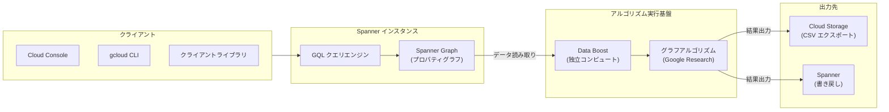

# Spanner: Graph Algorithms (Preview)

**リリース日**: 2026-05-27

**サービス**: Spanner

**機能**: Spanner Graph algorithms

**ステータス**: Preview

[このアップデートのインフォグラフィックを見る](https://takech9203.github.io/google-cloud-news-summary/20260527-spanner-graph-algorithms.html)

## 概要

Google Cloud は Spanner Graph にグラフアルゴリズムスイートをプレビューとして追加しました。Google Research Graph Mining チームとの協業により開発されたこの機能は、不正検出、エンティティ解決、レコメンデーションなどの主要なグラフ分析ユースケースをカバーする高性能アルゴリズム群を提供します。

Spanner Graph アルゴリズムは、数百億エッジ規模のグラフに対して数分から数十分のランタイムでスケールできる完全マネージドサービスです。Spanner Data Boost とオンデマンドの独立コンピュートリソースを使用するため、既存のプロビジョニング済み Spanner インスタンスのワークロードにほぼゼロの影響で実行できます。

アルゴリズムは Spanner Graph クエリ内の組み込み関数呼び出しとして呼び出され、出力を Cloud Storage にエクスポートしたり、Spanner に書き戻してグラフを拡張したりできます。GQL との統合により、既存のクエリインターフェース（Google Cloud コンソール、gcloud CLI、クライアントライブラリ、REST API、RPC API）からそのまま利用可能です。

**アップデート前の課題**

- Spanner Graph でグラフ分析を行う場合、PageRank やコミュニティ検出などの高度なアルゴリズムは別途外部ツール（Apache Spark、NetworkX など）にデータをエクスポートして実行する必要があった
- 大規模グラフの分析処理がトランザクションワークロードに影響を与える可能性があった
- グラフアルゴリズムの結果を Spanner に書き戻すには独自の ETL パイプラインの構築が必要だった

**アップデート後の改善**

- GQL クエリ内で直接アルゴリズムを呼び出せるため、外部ツールへのデータ移動が不要になった
- Data Boost による独立コンピュートリソースで、既存ワークロードへの影響なくアルゴリズムを実行可能になった
- 結果を Cloud Storage へのエクスポートまたは Spanner への書き戻しでシームレスに活用可能になった
- 数百億エッジ規模まで完全マネージドでスケールできるようになった

## アーキテクチャ図



クライアントから発行された GQL クエリは Spanner Graph のデータを Data Boost 経由で読み取り、独立コンピュートリソース上でアルゴリズムを実行します。結果は Cloud Storage へのエクスポートまたは Spanner への書き戻しとして出力されます。

## サービスアップデートの詳細

### 主要機能

1. **中心性アルゴリズム (Centrality)**
   - **PageRank**: ノードの重要度をスコアリング。ランダムウォークに基づき、重要なノードからリンクされるノードほど高スコアを獲得
   - **BetweennessCentrality**: ノードが他のノード間の最短パス上に位置する頻度を測定。ネットワークのブリッジ役を特定
   - **ClosenessCentrality**: ノードが他の全ノードにどれだけ近いかを測定。EXACT モードと HYBRID モードをサポート

2. **クラスタリングアルゴリズム (Clustering)**
   - **WeaklyConnectedComponents**: 互いに到達可能なノードの集合（連結成分）を検出
   - **ModularityClustering**: モジュラリティを最適化してグラフをクラスタに分割
   - **CorrelationClustering**: ペアワイズの類似度/非類似度に基づきノードを分割
   - **LabelPropagation**: ラベル伝播手法でノードをクラスタに割り当て
   - **CliqueFinding**: 最小密度閾値を満たす重複可能な密なコミュニティを特定

3. **類似度アルゴリズム (Similarity)**
   - **JaccardSimilarity**: 共通近傍と全近傍の比率に基づく類似度
   - **CosineSimilarity**: 共通近傍のエッジ重みに基づく類似度
   - **CommonNeighborsSimilarity**: 共有近傍の数に基づく類似度
   - **TotalNeighborsSimilarity**: 少なくとも一方のノードの近傍数に基づく類似度

4. **経路探索アルゴリズム (Path Finding)**
   - **ShortestPath**: 指定したソースノードとターゲットノード間の最短経路を計算。多対多の最短経路に対応

## 技術仕様

### 対応エディション

| 項目 | 詳細 |
|------|------|
| 対応エディション | Spanner Enterprise / Enterprise Plus |
| クエリ言語 | GoogleSQL (GQL) |
| PostgreSQL インターフェース | 非対応 |
| スケール | 数百億エッジまで対応 |
| 実行基盤 | Spanner Data Boost (独立コンピュート) |
| 出力形式 | Cloud Storage (CSV) / Spanner テーブルへの書き戻し |

### IAM 権限

| 項目 | 詳細 |
|------|------|
| 必要な IAM 権限 | `spanner.databases.runGraphAlgorithms` |
| 事前定義ロール | `roles/spanner.graphIntelligenceUser` |
| 含まれるロール | `roles/spanner.databaseReaderWithDataBoost` |

## 設定方法

### 前提条件

1. Spanner Enterprise または Enterprise Plus エディションのインスタンス
2. Spanner Graph スキーマが設定済みのデータベース
3. `roles/spanner.graphIntelligenceUser` ロールが付与されたプリンシパル
4. 出力先として Cloud Storage バケット（エクスポートする場合）

### 手順

#### ステップ 1: IAM 権限の付与

```bash
gcloud projects add-iam-policy-binding PROJECT_ID \
  --member="user:USER_EMAIL" \
  --role="roles/spanner.graphIntelligenceUser"
```

グラフアルゴリズムを実行するユーザーに `roles/spanner.graphIntelligenceUser` ロールを付与します。

#### ステップ 2: グラフアルゴリズムの実行（WeaklyConnectedComponents の例）

```sql
EXPORT DATA OPTIONS (
  uri = "gs://my-bucket-name/wcc-output.csv",
  format = "csv"
)
AS GRAPH FinGraph
CALL WeaklyConnectedComponents(
  node_labels => ['Account'],
  edge_labels => ['Transfers']
)
YIELD node, cluster
RETURN node.id, cluster;
```

GQL クエリ内で `CALL` 文を使用してアルゴリズム関数を呼び出し、`YIELD` で結果を取得します。

#### ステップ 3: PageRank の実行例

```sql
EXPORT DATA OPTIONS (
  uri = "gs://my-bucket-name/pagerank-output.csv",
  format = "csv"
)
AS GRAPH FinGraph
CALL PageRank(
  node_labels => ['Account'],
  edge_labels => ['Transfers'],
  damping_factor => 0.85,
  max_iterations => 10
)
YIELD node, score
RETURN node.id, score;
```

PageRank ではダンピングファクターや最大反復回数などのパラメータを指定できます。

## メリット

### ビジネス面

- **外部ツール不要の高度分析**: Spanner 内で直接グラフアルゴリズムを実行できるため、データパイプラインの構築・運用コストを削減
- **リアルタイムに近い分析**: トランザクションデータに対して追加の ETL なしでアルゴリズムを適用可能。不正検出やレコメンデーションの鮮度が向上
- **スケーラビリティ**: 数百億エッジ規模まで対応し、ビジネスの成長に合わせて自動スケール

### 技術面

- **既存ワークロードへのゼロインパクト**: Data Boost による独立コンピュートリソースで分析処理を分離
- **GQL 統合**: 新しい API やツールの習得不要。既存の Spanner Graph クエリインターフェースから直接利用可能
- **Google Research 品質**: Google Research Graph Mining チームが開発した高性能アルゴリズムをそのまま利用可能

## デメリット・制約事項

### 制限事項

- Preview 段階のため、本番環境での SLA は保証されない（Pre-GA Offerings Terms が適用）
- PostgreSQL インターフェースでは利用不可（GoogleSQL のみ対応）
- Spanner Enterprise または Enterprise Plus エディションが必要（Standard エディションでは利用不可）

### 考慮すべき点

- Data Boost の SPU 消費に対する従量課金が発生するため、大規模グラフでのコスト見積もりが重要
- Preview 段階では機能やアルゴリズムのパラメータが変更される可能性がある
- アルゴリズムの実行結果は非同期的に出力されるため、リアルタイムクエリとは異なるワークフロー設計が必要

## ユースケース

### ユースケース 1: 金融不正検出

**シナリオ**: 銀行の口座間送金ネットワークから、不正な資金移動パターン（マネーロンダリングリング）を検出したい。

**実装例**:
```sql
EXPORT DATA OPTIONS (
  uri = "gs://fraud-detection/cliques.csv",
  format = "csv"
)
AS GRAPH TransactionGraph
CALL CliqueFinding(
  node_labels => ['Account'],
  edge_labels => ['Transfer'],
  min_density => 0.8
)
YIELD node, clique
RETURN node.id, node.owner_name, clique;
```

**効果**: 密に接続された口座グループを自動検出し、不審な資金循環パターンを特定。従来の SQL ベースのルールエンジンでは検出困難な複雑な不正パターンを発見可能。

### ユースケース 2: エンティティ解決（顧客統合）

**シナリオ**: 複数システムに分散する顧客データを統合するために、類似した属性を持つ顧客ノード間の関係性を分析したい。

**実装例**:
```sql
EXPORT DATA OPTIONS (
  uri = "gs://entity-resolution/similarity.csv",
  format = "csv"
)
AS GRAPH CustomerGraph
CALL JaccardSimilarity(
  source_nodes => ARRAY { MATCH (n:Customer) WHERE n.status = 'unresolved' RETURN n },
  target_nodes => ARRAY { MATCH (n:Customer) WHERE n.status = 'master' RETURN n }
)
YIELD source_node, target_node, similarity
RETURN source_node.id, target_node.id, similarity;
```

**効果**: 共通の属性や接続パターンに基づいて重複顧客を特定し、顧客データの統合精度を向上。

### ユースケース 3: レコメンデーションエンジン

**シナリオ**: EC サイトで購買履歴グラフから類似ユーザーを特定し、商品推薦を行いたい。

**効果**: ユーザー間の購買パターンの類似度を計算し、類似ユーザーが購入した商品をレコメンド。コールドスタート問題にも対応可能。

## 料金

Spanner Graph アルゴリズムは Spanner Data Boost の課金モデルに従い、アルゴリズム実行時に消費された Serverless Processing Units (SPU) に対して従量課金されます。

| 項目 | 詳細 |
|------|------|
| 課金単位 | Serverless Processing Units (SPU) |
| 課金タイミング | アルゴリズム実行中のみ |
| 確認方法 | Google Cloud コンソールで Spanner Data Boost SKU をフィルタ |

詳細な料金については [Spanner pricing](https://cloud.google.com/spanner/pricing) を参照してください。

## 関連サービス・機能

- **Spanner Graph**: グラフアルゴリズムの基盤となるプロパティグラフデータベース。GQL によるクエリ、リレーショナルとグラフの統合モデルを提供
- **Spanner Data Boost**: アルゴリズム実行に使用される独立コンピュートリソース。既存ワークロードへの影響を排除
- **Cloud Storage**: アルゴリズム出力のエクスポート先。CSV 形式でのデータ連携に対応
- **Spanner Graph + LangChain (GraphRAG)**: グラフアルゴリズムの結果を活用した RAG ワークフローの構築が可能

## 参考リンク

- [インフォグラフィック](https://takech9203.github.io/google-cloud-news-summary/20260527-spanner-graph-algorithms.html)
- [公式リリースノート](https://docs.cloud.google.com/release-notes#May_27_2026)
- [Graph Algorithms Overview](https://docs.cloud.google.com/spanner/docs/graph/graph-algorithms-overview)
- [Graph Algorithms Catalog](https://docs.cloud.google.com/spanner/docs/graph/algorithms)
- [Run Algorithms](https://docs.cloud.google.com/spanner/docs/graph/run-algorithms)
- [Algorithm Best Practices](https://docs.cloud.google.com/spanner/docs/graph/algorithm-best-practices)
- [Spanner Pricing](https://cloud.google.com/spanner/pricing)

## まとめ

Spanner Graph アルゴリズムのプレビュー提供は、Google Cloud のマルチモデルデータベース戦略における重要なマイルストーンです。Google Research Graph Mining の高性能アルゴリズムが Spanner Graph に直接統合されたことで、不正検出やレコメンデーションなどの高度なグラフ分析を外部ツールなしで実行可能になりました。Enterprise / Enterprise Plus エディションを利用中の組織は、既存の Spanner Graph 環境でグラフアルゴリズムの評価を開始し、分析パイプラインの簡素化を検討することを推奨します。

---

**タグ**: #Spanner #SpannerGraph #GraphAlgorithms #GraphAnalytics #Preview #Database #FraudDetection #EntityResolution #Recommendation #DataBoost #GQL
