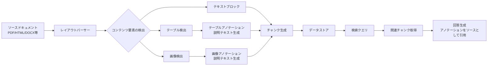

# Vertex AI Search: レイアウトパーサーのテーブル・画像アノテーション機能が GA

**リリース日**: 2026-05-27

**サービス**: Vertex AI Search (Agent Search)

**機能**: レイアウトパーサーにおけるテーブルアノテーションおよび画像アノテーション

**ステータス**: Generally Available (GA)

[このアップデートのインフォグラフィックを見る](https://takech9203.github.io/google-cloud-news-summary/20260527-vertex-ai-search-layout-parser-annotations-ga.html)

## 概要

Vertex AI Search (Agent Search) のレイアウトパーサーにおけるテーブルアノテーションおよび画像アノテーション機能が一般提供 (GA) となりました。これにより、ドキュメント内の表や画像を自動的に検出し、その内容を説明するテキスト (アノテーション) を生成してチャンクに割り当てることが、本番環境で安定して利用できるようになります。

この機能は、RAG (Retrieval-Augmented Generation) パイプラインにおいて、従来テキストとしてしか扱えなかったドキュメント内の視覚的要素 (表やグラフ、図表、写真など) を検索可能かつ回答生成のソースとして活用することを可能にします。企業が保有する技術文書、レポート、プレゼンテーション資料などに含まれるリッチなコンテンツを、より効果的に検索・活用したいユーザーに特に有益です。

**アップデート前の課題**

- レイアウトパーサーはテキストベースのコンテンツを主に処理しており、表や画像の内容は検索で見つけにくかった
- ドキュメント内の画像に含まれる情報 (グラフ、図表、インフォグラフィックなど) が RAG の回答生成に活用されなかった
- 表形式のデータは構造情報が失われやすく、正確なコンテキストとして利用することが困難だった

**アップデート後の改善**

- 表や画像が検出されると、自動的に説明テキスト (アノテーション) が生成され、チャンクに割り当てられる
- アノテーションにより、表や画像の内容が検索結果として返されるかどうかが判定される
- 生成された回答において、アノテーションがソースとして引用される
- GA となったことで SLA の対象となり、本番ワークロードでの利用が正式にサポートされる

## アーキテクチャ図

レイアウトパーサーがドキュメントを解析し、テーブルや画像を検出してアノテーションを生成します。アノテーション付きのチャンクがデータストアに格納され、検索時に関連チャンクとして取得され、最終的に生成回答のソースとして活用されます。

## サービスアップデートの詳細

### 主要機能

1. **画像アノテーション**
   - ドキュメント内の画像 (BMP, GIF, JPEG, PNG, TIFF) を自動検出
   - 画像の内容を説明するテキストを生成し、画像自体とともにチャンクに割り当て
   - アノテーションが検索のマッチング対象となり、回答生成のソースとしても利用可能

2. **テーブルアノテーション**
   - ドキュメント内の表を自動検出
   - 表の内容を説明するテキストを生成し、表自体とともにチャンクに割り当て
   - 構造化データの意味的理解に基づいた検索と回答生成が可能

3. **コンテンツ認識型チャンキングとの統合**
   - アノテーションはレイアウトパーサーのドキュメントチャンキング機能と組み合わせて動作
   - 見出し階層やセクション構造を考慮した意味的に一貫性のあるチャンクにアノテーションが含まれる
   - 祖先の見出し情報がチャンクに付加され、コンテキストが保持される

## 技術仕様

### 対応ファイル形式

| 項目 | 詳細 |
|------|------|
| レイアウトパーサー対応形式 | PDF, HTML, DOCX, PPTX, XLSX, XLSM |
| 画像アノテーション対応画像形式 | BMP, GIF, JPEG, PNG, TIFF |
| テーブルアノテーション | ドキュメント内で検出された全てのテーブル |

### アノテーションの動作仕様

| 項目 | 詳細 |
|------|------|
| アノテーション生成 | 検出された画像/テーブルごとに説明テキストを自動生成 |
| チャンク割り当て | アノテーション + 元の画像/テーブルがチャンクに格納 |
| 検索への影響 | アノテーションテキストにより検索結果として返されるか判定 |
| 回答生成への影響 | アノテーションが生成回答のソースとして引用可能 |

## 設定方法

### 前提条件

1. Google Cloud プロジェクトが作成済みであること
2. Vertex AI Search (Agent Search) が有効化されていること
3. データストアをドキュメントチャンキング (RAG 用) モードで作成すること

### 手順

#### ステップ 1: データストア作成時にレイアウトパーサーを有効化

Google Cloud コンソールでデータストアを作成する際に、以下の設定を行います。

1. データストア作成画面で「Document processing options」を選択
2. 「Layout parser settings」セクションを展開

#### ステップ 2: アノテーション機能を有効化

レイアウトパーサー設定内で以下のオプションを有効にします。

- **画像アノテーション**: 「Enable image annotation」にチェック
- **テーブルアノテーション**: 「Enable table annotation」にチェック

これらの設定はデータストア作成時に行う必要があります。

## メリット

### ビジネス面

- **ナレッジ活用の最大化**: 技術レポートや提案書に含まれるグラフ・表の情報が検索・回答に活用され、社内ナレッジの利用率が向上
- **回答品質の向上**: テキストだけでなく視覚的データも根拠として引用されるため、より包括的で正確な回答が生成される
- **本番利用の安心感**: GA となったことで SLA の対象となり、ミッションクリティカルなアプリケーションでの利用が可能

### 技術面

- **マルチモーダル RAG の実現**: テキスト・表・画像を統合的に扱う RAG パイプラインが追加開発なしで構築可能
- **自動化された前処理**: 画像や表のテキスト化を手動で行う必要がなく、インジェスト時に自動的にアノテーションが生成される
- **コンテンツ認識チャンキング**: 意味的に一貫したチャンク分割により、検索精度と回答の関連性が向上

## デメリット・制約事項

### 制限事項

- レイアウトパーサーはドキュメントチャンキング (RAG 用) を使用する場合にのみ利用可能
- アノテーション設定はデータストア作成時に行う必要がある (既存データストアへの後からの追加については公式ドキュメントを確認)
- フェデレーテッド検索接続モードのコネクタ (SharePoint, OneDrive 等) ではリアルタイムクエリの性質上、レイアウトパーサーの全機能を活用しきれない場合がある

### 考慮すべき点

- 複雑な PDF の詳細解析にはデータインジェストモードでの利用が推奨される
- アノテーション処理により、ドキュメントのインジェスト時間が増加する可能性がある
- Document AI の料金体系に基づく追加コストが発生する

## ユースケース

### ユースケース 1: 技術文書からの表データ検索

**シナリオ**: エンジニアリングチームが大量の技術仕様書や設計書を Agent Search に取り込み、スペック比較表やパフォーマンスデータを含む表から回答を得たい場合。

**効果**: テーブルアノテーションにより、「製品 A と製品 B の最大スループットの違いは?」のような質問に対して、仕様書内の比較表を直接ソースとして引用した回答が生成される。

### ユースケース 2: レポート内のグラフ・図からの情報抽出

**シナリオ**: 経営企画部門が年次レポートやマーケット分析レポートを取り込み、グラフや図に含まれるトレンドデータや分析結果に基づいた回答を得たい場合。

**効果**: 画像アノテーションにより、レポート内のグラフが説明テキストとして検索対象になり、「昨年度の売上トレンドは?」のような質問に対して、グラフの内容を根拠とした回答が生成される。

### ユースケース 3: 社内プレゼンテーション資料の活用

**シナリオ**: 営業チームが過去のプレゼンテーション資料 (PPTX) を検索可能にし、顧客向けの提案に必要な図表やデータを素早く見つけたい場合。

**効果**: PPTX 内のスライドに含まれる表や図が自動的にアノテーションされ、「顧客向け価格表」「競合比較チャート」などが検索で発見可能になる。

## 料金

レイアウトパーサーのアノテーション機能の料金は Document AI の機能料金体系に基づきます。詳細は [Document AI feature pricing](https://cloud.google.com/generative-ai-app-builder/pricing#document_ai_feature_pricing) を参照してください。

## 関連サービス・機能

- **Document AI Layout Parser**: Vertex AI Search のレイアウトパーサーの基盤となるドキュメント解析エンジン。OCR と Gemini の生成 AI 機能を組み合わせた高精度な文書理解を提供
- **Agent Search Grounded Generation**: アノテーションをソースとして活用し、根拠のある回答を生成する機能
- **Gemini レイアウトパーシング (Public Preview)**: Gemini モデルを活用したさらに高度なレイアウト解析機能
- **ドキュメントチャンキング (RAG 用)**: レイアウトパーサーと連携し、意味的に一貫したチャンクを生成する機能

## 参考リンク

- [インフォグラフィック](https://takech9203.github.io/google-cloud-news-summary/20260527-vertex-ai-search-layout-parser-annotations-ga.html)
- [公式リリースノート](https://docs.cloud.google.com/release-notes#May_27_2026)
- [Layout parser ドキュメント](https://docs.cloud.google.com/generative-ai-app-builder/docs/parse-chunk-documents#layout-parsing)
- [Document AI Layout Parser](https://docs.cloud.google.com/document-ai/docs/layout-parse-chunk)
- [料金ページ](https://cloud.google.com/generative-ai-app-builder/pricing#document_ai_feature_pricing)

## まとめ

Vertex AI Search のレイアウトパーサーにおけるテーブル・画像アノテーション機能の GA は、エンタープライズ RAG ソリューションにとって重要なマイルストーンです。ドキュメント内の視覚的要素を自動的にテキスト化し、検索・回答生成に活用できるようになることで、組織のナレッジ活用の幅が大きく広がります。既にレイアウトパーサーを利用している場合は、新規データストア作成時にアノテーション機能を有効化することを推奨します。

---

**タグ**: #VertexAISearch #AgentSearch #LayoutParser #GA #RAG #DocumentAI #TableAnnotation #ImageAnnotation
