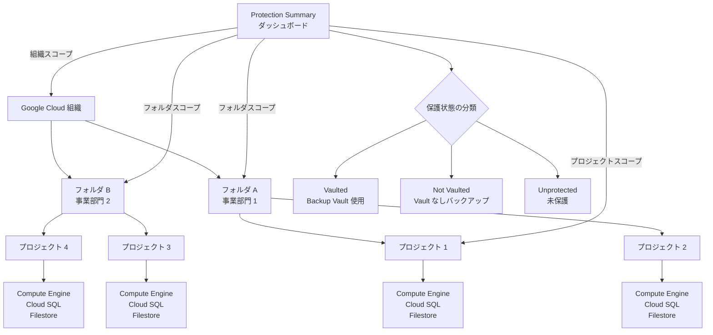

# Backup and DR Service: Protection Summary の組織・フォルダレベル表示機能

**リリース日**: 2026-05-28

**サービス**: Google Cloud Backup and DR Service

**機能**: Protection Summary の組織(Organization)およびフォルダ(Folder)レベルでの表示

**ステータス**: GA (一般提供)

📊 [このアップデートのインフォグラフィックを見る](https://takech9203.github.io/google-cloud-news-summary/20260528-backup-dr-protection-summary-org-folder.html)

## 概要

Google Cloud Backup and DR Service の Protection Summary(保護概要)ダッシュボードが、組織(Organization)およびフォルダ(Folder)レベルで表示できるようになりました。これまでプロジェクト単位でのみ利用可能だったこの機能が、より広範なスコープで利用可能になったことで、大規模な Google Cloud 環境における包括的なデータ保護状況の把握が容易になります。

Protection Summary は、Google Cloud リソースのバックアップ構成状態を一元的に可視化するダッシュボードです。保護されていないリソースの特定、バックアップ構成の確認、Vault バックアップの有無の確認が可能です。組織レベルでの表示により、企業全体のデータ保護戦略の実施状況をトップダウンで監査できるようになりました。

対象ユーザーは、複数プロジェクトを管理するクラウド管理者、セキュリティチーム、コンプライアンス担当者です。特に大規模環境において、プロジェクトごとに確認する必要なく、組織全体のバックアップ保護ギャップを迅速に把握できます。

**アップデート前の課題**

- Protection Summary はプロジェクトレベルでのみ表示可能であり、複数プロジェクトの保護状況を確認するには各プロジェクトに個別にアクセスする必要があった
- 組織全体の未保護リソースを一括で特定する手段がなく、保護ギャップの発見が困難だった
- 大規模環境でのコンプライアンス監査において、全プロジェクトを横断的に確認する作業が非効率であった

**アップデート後の改善**

- 組織レベルで全プロジェクトの保護状況を一画面で確認可能になった
- フォルダレベルでの階層的な保護状況確認により、部門単位での管理が容易になった
- 未保護リソースの発見と対策がより迅速に行えるようになった

## アーキテクチャ図



Protection Summary は組織、フォルダ、プロジェクトの各レベルで保護状況を集約し、リソースを「Vaulted」「Not Vaulted」「Unprotected」の3つの状態に分類して表示します。

## サービスアップデートの詳細

### 主要機能

1. **組織レベルの保護概要表示**
   - 組織配下の全プロジェクトに渡る保護状況を一元的に表示
   - 未保護リソースの総数とリソースタイプ別の内訳を確認可能
   - 組織全体のデータ保護ポリシーの遵守状況を監査可能

2. **フォルダレベルの保護概要表示**
   - フォルダ単位での保護状況確認により、部門・チーム別の管理が可能
   - 階層構造に応じた保護状況のドリルダウンに対応
   - フォルダ配下のプロジェクトを横断した集約ビューを提供

3. **リソース保護状態の3段階分類**
   - **Vaulted**: Backup Vault を使用してバックアップされているリソース（不変性・削除保護あり）
   - **Not Vaulted**: バックアップは構成されているが Backup Vault を使用していないリソース
   - **Unprotected**: バックアップが構成されていないリソース

## 技術仕様

### サポート対象リソースタイプ

| リソースタイプ | バックアップ構成の判定基準 |
|------|------|
| Compute Engine インスタンス | Backup Plan またはアタッチされたディスクのスナップショットスケジュール |
| Compute Engine ディスク | スナップショットスケジュール、Backup Plan、または VM の Backup Plan による保護 |
| Cloud SQL インスタンス | Backup Plan または Cloud SQL 組み込み自動バックアップ |
| Filestore インスタンス | Backup Plan または Filestore 組み込み自動バックアップ |

### 表示フィールド

| フィールド | 説明 |
|------|------|
| Resource name | リソースの表示名 |
| Project | リソースが属するプロジェクト |
| Resource type | リソースタイプ |
| Backup schedule type | バックアップスケジュールの種類 |
| Backup plan name | 適用されているバックアッププラン名 |
| Configuration state | 構成状態 (Not configured / Not vaulted / Vaulted) |
| Backup schedule state | スケジュール状態 (Active / Inactive) |
| Latest successful backup | 最新の成功バックアップ日時 |
| Backup vault | 使用中の Backup Vault 名 |

### 必要な IAM 権限

```json
{
  "role": "roles/backupdr.backupConfigViewer",
  "title": "Backup and DR Backup Config Viewer",
  "permissions": [
    "backupdr.resourceBackupConfigs.list",
    "backupdr.resourceBackupConfigs.get",
    "backupdr.locations.list"
  ]
}
```

## 設定方法

### 前提条件

1. Backup and DR API が対象プロジェクトで有効化されていること
2. 閲覧者に `roles/backupdr.backupConfigViewer` ロールが付与されていること
3. 組織/フォルダレベルで表示する場合、該当スコープに対して IAM 権限が付与されていること

### 手順

#### ステップ 1: Backup and DR API の有効化

```bash
# 対象プロジェクトで Backup and DR API を有効化
gcloud services enable backupdr.googleapis.com --project=PROJECT_ID
```

組織配下の各プロジェクトで Backup and DR API が有効化されている必要があります。

#### ステップ 2: IAM ロールの付与

```bash
# 組織レベルで Backup Config Viewer ロールを付与
gcloud organizations add-iam-policy-binding ORG_ID \
  --member="user:admin@example.com" \
  --role="roles/backupdr.backupConfigViewer"

# フォルダレベルで付与する場合
gcloud resource-manager folders add-iam-policy-binding FOLDER_ID \
  --member="user:admin@example.com" \
  --role="roles/backupdr.backupConfigViewer"
```

組織またはフォルダレベルで権限を付与することで、配下のプロジェクトの保護状況を表示できます。

#### ステップ 3: Protection Summary の表示

```
Google Cloud コンソール > Backup and DR > Protection Summary
> スコープ選択: Organization / Folder / Project
> リソースタイプ選択 > [View] をクリック
```

スコープドロップダウンで「Organization」「Folder」「Project」を切り替え、対象リソースタイプを選択して表示します。

## メリット

### ビジネス面

- **コンプライアンス監査の効率化**: 組織全体のバックアップ保護状況を一画面で把握でき、監査レポート作成時間を大幅に短縮
- **リスク管理の強化**: 未保護リソースを迅速に特定し、データ損失リスクを事前に低減
- **ガバナンスの向上**: 組織階層に沿った保護ポリシーの遵守状況をトップダウンで確認可能

### 技術面

- **一元的可視性**: 複数プロジェクトの保護状況を個別にアクセスする必要がなく、単一のダッシュボードで確認
- **階層的ドリルダウン**: 組織 > フォルダ > プロジェクトと段階的に保護状況を掘り下げて確認可能
- **Vault/非 Vault の区別**: Backup Vault による不変バックアップの採用状況を明確に可視化

## デメリット・制約事項

### 制限事項

- サードパーティのバックアップツールによるバックアップは Protection Summary に反映されない（Google Cloud 組み込みのデータ保護ツールのみ対象）
- データの更新頻度は最短1時間以内だが、最大24時間のタイムラグが生じる可能性がある
- 対象リソースタイプは Compute Engine インスタンス/ディスク、Cloud SQL インスタンス、Filestore インスタンスに限定

### 考慮すべき点

- 組織/フォルダレベルでの表示には、該当スコープに対する適切な IAM 権限の設定が必要
- 各プロジェクトで Backup and DR API が有効化されていないと、そのプロジェクトのリソースは集計に含まれない
- AlloyDB や BigQuery などのリソースは現時点では Protection Summary の対象外

## ユースケース

### ユースケース 1: 企業全体のデータ保護監査

**シナリオ**: 100以上のプロジェクトを持つ大企業のセキュリティチームが、四半期ごとのデータ保護監査を実施する必要がある。

**実装例**:
```
1. Google Cloud コンソールで Protection Summary を開く
2. スコープを「Organization」に設定
3. 各リソースタイプを選択して未保護リソースを一覧表示
4. 「Unprotected」タブで保護ギャップを特定
5. 該当プロジェクトチームにバックアップ構成を指示
```

**効果**: 個別プロジェクトへのアクセスが不要になり、監査作業時間を従来の数分の1に短縮。全社的な保護ギャップを即座に可視化。

### ユースケース 2: 部門別バックアップポリシー遵守確認

**シナリオ**: フォルダで管理されている各事業部門が、社内のバックアップポリシー（全 Compute Engine インスタンスは Vault バックアップ必須）を遵守しているか確認したい。

**実装例**:
```
1. Protection Summary でフォルダスコープを選択
2. リソースタイプ「Compute Engine instance」を選択
3. 「Not Vaulted」タブで Vault 未使用のリソースを特定
4. 「Schedule backup」オプションで Vault バックアップを追加設定
```

**効果**: フォルダ配下のプロジェクトを横断して、Vault バックアップポリシーの遵守状況を効率的に確認し、ギャップを即座に解消。

## 料金

Protection Summary 機能自体は、Backup and DR Service の利用における追加料金なしで提供されます。

ただし、以下の関連コストが発生します:

| 項目 | 料金 |
|--------|-----------------|
| Protection Summary の閲覧 | 無料 |
| Backup and DR Service (バックアップ管理) | 使用量ベースの月額課金 |
| Backup Vault ストレージ | リージョンごとのストレージ料金 |

詳細な料金体系については [Backup and DR Service 料金ページ](https://cloud.google.com/backup-disaster-recovery/pricing) を参照してください。

## 利用可能リージョン

Protection Summary は Backup and DR Service がサポートする全リージョンで利用可能です。組織・フォルダレベルの表示はグローバルスコープで動作し、全リージョンのリソースを横断して保護状況を集約します。

## 関連サービス・機能

- **Backup Vault**: 不変性・削除保護を提供するバックアップストレージ。Protection Summary で Vaulted/Not Vaulted の区別を表示
- **Backup Plans**: リソースのバックアップスケジュールと保持ポリシーを定義。Protection Summary での「構成済み」判定の基準
- **Cost Reports**: Backup and DR のリソース別課金コストを表示。Protection Summary と組み合わせて保護状況とコストを両面から管理
- **Resource Manager (組織/フォルダ)**: Google Cloud の階層構造を提供。Protection Summary のスコープ選択に使用
- **IAM**: Protection Summary の閲覧権限を制御。`backupdr.backupConfigViewer` ロールで管理

## 参考リンク

- 📊 [インフォグラフィック](https://takech9203.github.io/google-cloud-news-summary/20260528-backup-dr-protection-summary-org-folder.html)
- [公式リリースノート](https://docs.cloud.google.com/release-notes#May_28_2026)
- [Protection Summary ドキュメント](https://docs.cloud.google.com/backup-disaster-recovery/docs/backup-admin/protection-summary)
- [Backup and DR Service IAM ロール](https://docs.cloud.google.com/backup-disaster-recovery/docs/access-control)
- [料金ページ](https://cloud.google.com/backup-disaster-recovery/pricing)

## まとめ

今回のアップデートにより、Backup and DR Service の Protection Summary が組織およびフォルダレベルで利用可能になり、大規模環境における包括的なデータ保護状況の可視化が実現しました。複数プロジェクトを管理する組織にとって、未保護リソースの迅速な特定とコンプライアンス監査の効率化に大きく貢献します。既に Protection Summary をプロジェクトレベルで活用している場合は、組織/フォルダスコープでの表示を試し、全社的なバックアップ保護ギャップの確認を行うことを推奨します。

---

**タグ**: #BackupAndDR #ProtectionSummary #DataProtection #Organization #Folder #Compliance #BackupVault #GoogleCloud #GA
