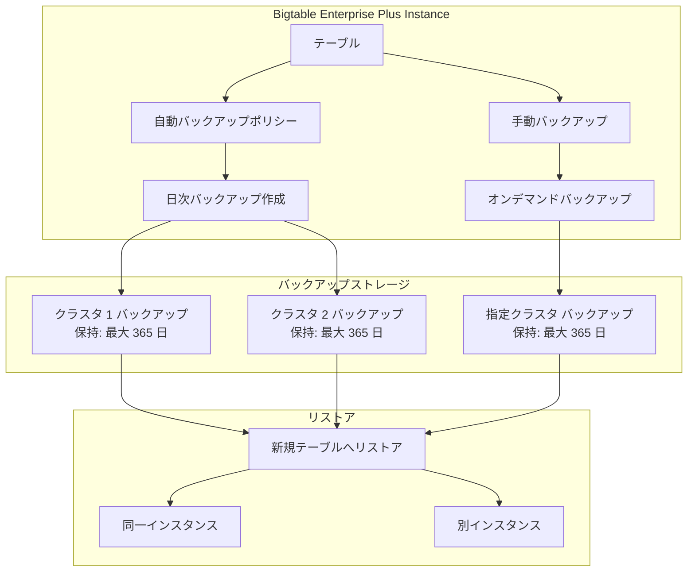

# Bigtable: Enterprise Plus エディションで 365 日間バックアップ保持が GA

**リリース日**: 2026-05-28

**サービス**: Cloud Bigtable

**機能**: Enterprise Plus 365-day backup retention

**ステータス**: Generally Available (GA)

[このアップデートのインフォグラフィックを見る](https://takech9203.github.io/google-cloud-news-summary/20260528-bigtable-enterprise-plus-365-day-backup-ga.html)

## 概要

Google Cloud は、Bigtable Enterprise Plus エディションにおけるバックアップ保持期間を最大 365 日に設定できる機能の一般提供 (GA) を発表しました。これにより、手動バックアップおよび自動バックアップの両方で、最大 1 年間のデータ保持が可能になります。

この機能は、長期的なデータ保護やコンプライアンス要件を持つ企業にとって重要なアップデートです。従来の Enterprise エディションでは最大 90 日間のバックアップ保持に制限されていましたが、Enterprise Plus エディションを利用することで、規制要件やビジネス継続性計画 (BCP) に対応した長期保持が実現します。

対象ユーザーは、金融サービス、ヘルスケア、公共機関など、データ保持に関する厳格な規制要件を持つ組織や、大規模な NoSQL ワークロードを運用しているチームです。

**アップデート前の課題**

- Enterprise エディションではバックアップ保持期間が最大 90 日間に制限されており、長期保持には別途エクスポート処理が必要だった
- 規制要件で 90 日以上のデータ保持が求められる場合、Cloud Storage へのエクスポートなど追加のパイプライン構築が必要だった
- バックアップコピーの最大保持期間が 30 日であるため、長期保存のためのワークアラウンドが複雑だった

**アップデート後の改善**

- Enterprise Plus エディションでバックアップ保持期間を最大 365 日に設定可能になった
- 自動バックアップポリシーにも 365 日の保持期間を適用でき、運用負荷が軽減された
- Bigtable のネイティブ機能として長期保持が実現し、外部サービスへのエクスポートが不要になった

## アーキテクチャ図



Enterprise Plus エディションでは、自動バックアップの対象クラスタを選択でき、各バックアップは最大 365 日間保持されます。リストアは同一インスタンスまたは別インスタンスの新規テーブルに対して実行できます。

## サービスアップデートの詳細

### 主要機能

1. **365 日間バックアップ保持**
   - Enterprise Plus エディションで利用可能な最大保持期間
   - 手動バックアップ、自動バックアップの両方に適用可能
   - 保持期間は日数 (d)、時間 (h)、分 (m) で指定可能

2. **自動バックアップクラスタ設定**
   - Enterprise Plus エディションでは、レプリケーションされたインスタンス内で自動バックアップを有効にするクラスタを選択可能
   - 不要なクラスタでのバックアップを無効にすることでストレージコストを最適化
   - デフォルトではすべてのクラスタで自動バックアップが有効

3. **インクリメンタルバックアップ**
   - バックアップは物理ストレージを元テーブルや他のバックアップと共有
   - 実際のストレージ消費量はデータの変更量に依存
   - テーブルあたりクラスタごとに最大 150 バックアップを保存可能

## 技術仕様

### エディション別バックアップ機能比較

| 項目 | Enterprise | Enterprise Plus |
|------|-----------|-----------------|
| 最大保持期間 | 90 日 | 365 日 |
| 自動バックアップ | 対応 | 対応 |
| 自動バックアップのクラスタ選択 | 不可 | 可能 |
| ホットバックアップ | 対応 | 対応 |
| バックアップコピー最大保持期間 | 30 日 | 30 日 |
| テーブルあたりの最大バックアップ数 | 150/クラスタ | 150/クラスタ |

### バックアップタイプ比較

| バックアップタイプ | 特徴 | 料金 |
|-------------------|------|------|
| Standard バックアップ | 長期保持に最適化、インクリメンタル | $0.026/GB/月 |
| Hot バックアップ | 高速リストアに最適化、フルコピー | $0.12/GB/月 |

## 設定方法

### 前提条件

1. Bigtable Enterprise Plus エディションのインスタンスが作成済みであること
2. 適切な IAM 権限 (bigtable.backups.create) を持っていること

### 手順

#### ステップ 1: Enterprise Plus インスタンスの確認

```bash
# インスタンス一覧の確認
gcloud bigtable instances list

# インスタンスの詳細確認 (エディション情報を含む)
gcloud bigtable instances describe INSTANCE_ID
```

Enterprise Plus エディションでない場合は、コンソールまたは gcloud CLI でエディションをアップグレードしてください。

#### ステップ 2: 365 日保持期間でバックアップを作成

```bash
# 手動バックアップの作成 (365 日保持)
gcloud bigtable backups create BACKUP_ID \
  --instance=INSTANCE_ID \
  --cluster=CLUSTER_ID \
  --table=TABLE_ID \
  --retention-period=365d \
  --async
```

#### ステップ 3: 自動バックアップポリシーの設定 (365 日保持)

```bash
# テーブルの自動バックアップポリシーを更新
gcloud bigtable instances tables update TABLE_ID \
  --instance=INSTANCE_ID \
  --enable-automated-backup \
  --automated-backup-retention-period=365d
```

#### ステップ 4: 自動バックアップの対象クラスタを指定 (Enterprise Plus のみ)

```bash
# 特定のクラスタのみで自動バックアップを有効化
gcloud bigtable instances tables update TABLE_ID \
  --instance=INSTANCE_ID \
  --enable-automated-backup \
  --automated-backup-retention-period=365d \
  --automated-backup-locations=us-central1-a,us-east1-b
```

## メリット

### ビジネス面

- **コンプライアンス対応の簡素化**: 金融規制 (SOX、PCI DSS) やヘルスケア規制 (HIPAA) で求められる長期データ保持要件をネイティブ機能で満たせる
- **運用コストの削減**: 外部ストレージへのエクスポートパイプラインが不要になり、データ管理の複雑さとコストが低減
- **災害復旧の強化**: 最大 1 年前の状態にデータを復元可能で、ビジネス継続性計画がより堅牢になる

### 技術面

- **シンプルなアーキテクチャ**: バックアップと復元が Bigtable サービス内で完結し、追加コンポーネントが不要
- **インクリメンタル保存による効率性**: 物理ストレージの共有により、365 日分のバックアップでも効率的なストレージ利用が可能
- **柔軟なリストアオプション**: 別インスタンスへのリストアにも対応し、テスト環境の構築やデータ移行に活用可能

## デメリット・制約事項

### 制限事項

- Enterprise Plus エディションでのみ利用可能 (Enterprise エディションでは最大 90 日)
- バックアップコピーの最大保持期間は 30 日のまま (365 日にはならない)
- テーブルあたりクラスタごとに 150 バックアップの上限がある
- Enterprise Plus へのアップグレード後、48 時間は Enterprise へのダウングレード不可

### 考慮すべき点

- Enterprise Plus エディションはノード単価が高い ($0.85/hour vs $0.65/hour)
- 長期バックアップのストレージコストが累積するため、保持ポリシーの設計が重要
- レプリケーションされたインスタンスで全クラスタの自動バックアップを有効にすると、ストレージコストが増加する

## ユースケース

### ユースケース 1: 金融取引データの長期保持

**シナリオ**: 金融機関が Bigtable に保存している取引履歴データに対し、規制要件により 1 年間のバックアップ保持が求められている。

**実装例**:
```bash
# 取引テーブルに 365 日の自動バックアップを設定
gcloud bigtable instances tables update transactions \
  --instance=finance-prod \
  --enable-automated-backup \
  --automated-backup-retention-period=365d \
  --automated-backup-locations=us-central1-a,us-east1-b
```

**効果**: 外部エクスポート不要で規制要件を満たし、必要に応じて任意の日のデータに復元可能。

### ユースケース 2: IoT センサーデータの災害復旧

**シナリオ**: 製造業の IoT プラットフォームで、センサーデータの長期バックアップを確保し、システム障害時に過去のデータを復旧できるようにしたい。

**効果**: 最大 1 年前のセンサーデータ状態に復元可能で、品質管理やトレーサビリティ要件に対応。バックアップのインクリメンタル特性により、大量の時系列データでもストレージコストを抑制。

## 料金

Enterprise Plus エディションの利用が前提で、バックアップストレージに対して追加料金が発生します。

### 料金例

| 項目 | 料金 |
|------|------|
| Enterprise Plus ノード | $0.85/ノード/時間 |
| Standard バックアップストレージ | $0.026/GB/月 |
| Hot バックアップストレージ | $0.12/GB/月 |
| バックアップ作成操作 | 無料 |
| リストア操作 | 無料 (ネットワーク料金は別途) |

**見積もり例**: 100 GB のテーブルを Standard バックアップで 365 日保持する場合、インクリメンタルバックアップにより実際のストレージ消費は元テーブルより小さくなる可能性があります。仮に平均 50 GB のバックアップストレージを消費する場合、月額約 $1.30 のバックアップストレージ料金が発生します。

## 関連サービス・機能

- **Bigtable Enterprise エディション**: 最大 90 日間のバックアップ保持を提供する標準エディション
- **Bigtable Hot バックアップ**: 高速リストアに最適化されたバックアップタイプ (365 日保持にも対応)
- **Bigtable 自動バックアップ**: 日次で自動的にバックアップを作成する機能
- **Bigtable In-memory ティア**: Enterprise Plus で利用可能なサブミリ秒レイテンシのストレージ層 (Preview)
- **Cloud Storage**: 365 日を超える長期アーカイブが必要な場合のエクスポート先

## 参考リンク

- [インフォグラフィック](https://takech9203.github.io/google-cloud-news-summary/20260528-bigtable-enterprise-plus-365-day-backup-ga.html)
- [公式リリースノート](https://docs.cloud.google.com/release-notes#May_28_2026)
- [Bigtable Editions 概要](https://docs.cloud.google.com/bigtable/docs/editions-overview)
- [Bigtable バックアップ概要](https://docs.cloud.google.com/bigtable/docs/backups)
- [バックアップ管理](https://docs.cloud.google.com/bigtable/docs/managing-backups)
- [料金ページ](https://cloud.google.com/bigtable/pricing)

## まとめ

Bigtable Enterprise Plus エディションの 365 日バックアップ保持の GA は、長期データ保護とコンプライアンス要件を持つ組織にとって重要なマイルストーンです。外部エクスポートパイプラインの構築が不要になり、Bigtable のネイティブ機能として最大 1 年間のデータ保護が実現します。Enterprise Plus エディションを利用中、または長期バックアップ要件がある場合は、自動バックアップポリシーの保持期間を見直し、必要に応じて 365 日への延長を検討してください。

---

**タグ**: #Bigtable #EnterpriseePlus #Backup #DisasterRecovery #DataProtection #GA #NoSQL
