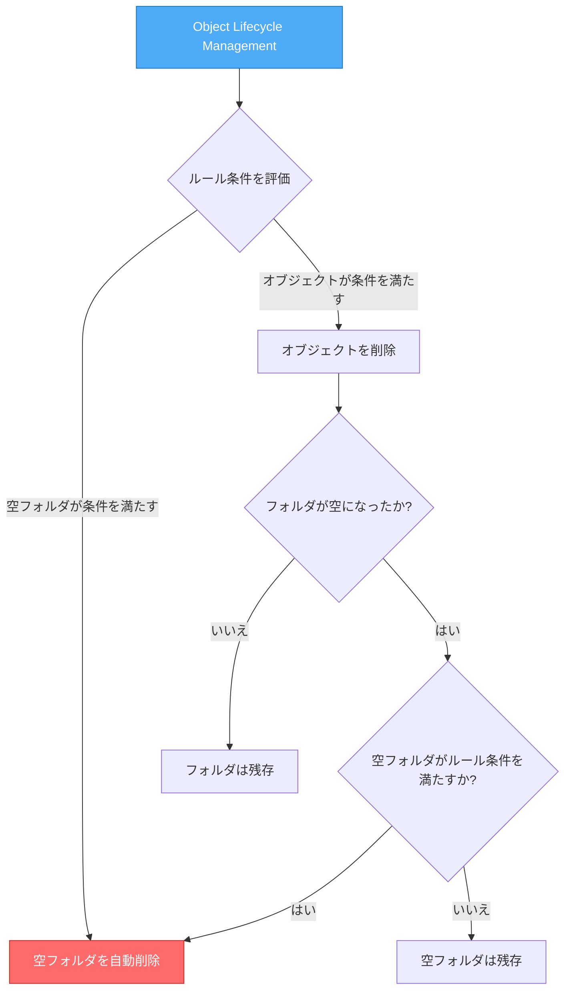

# Cloud Storage: 階層型名前空間バケットでライフサイクル管理の Delete アクションが空フォルダを削除する動作変更

**リリース日**: 2026-05-28

**サービス**: Cloud Storage

**機能**: Hierarchical Namespace (HNS) バケットにおける Object Lifecycle Management の動作変更

**ステータス**: Breaking Change (2026年8月26日施行)

:chart_with_upwards_trend: [このアップデートのインフォグラフィックを見る](https://takech9203.github.io/google-cloud-news-summary/20260528-cloud-storage-hns-lifecycle-folder-deletion.html)

## 概要

2026年8月26日以降、階層型名前空間（Hierarchical Namespace: HNS）が有効なバケットにおいて、Object Lifecycle Management の Delete アクションが、ライフサイクルルールの全条件を満たす空フォルダを自動的に削除するようになります。これは既存の動作を変更する Breaking Change であり、現在 HNS バケットを使用している全てのユーザーに影響する可能性があります。

従来、HNS バケットではフォルダは明示的に DeleteFolder 操作を行わない限り削除されませんでした。ライフサイクル管理の Delete アクションはオブジェクトのみを対象としており、空になったフォルダはそのまま残存していました。今回の変更により、ライフサイクルルールの条件（age、matchesPrefix、matchesSuffix 等）を満たす空フォルダも Delete アクションの対象となります。

この変更は、HNS バケットにおける空フォルダの蓄積によるパフォーマンス劣化を解消することを目的としていますが、フォルダ構造に依存したワークフローを持つシステムでは予期しない動作を引き起こす可能性があるため、事前の確認と対策が必要です。

**アップデート前の課題**

従来の HNS バケットにおけるライフサイクル管理では、以下の課題がありました。

- Object Lifecycle Management の Delete アクションはオブジェクトのみを削除し、空になったフォルダは残存し続けていた
- 空フォルダの蓄積によりオブジェクトリスト操作のパフォーマンスが劣化していた
- 空フォルダの削除には別途スクリプト（delete_empty_folders.py）や手動操作が必要だった

**アップデート後の改善**

今回の動作変更により、以下が実現されます。

- ライフサイクルルールの条件を満たす空フォルダが自動的に削除される
- 空フォルダの蓄積を防ぎ、オブジェクトリスト操作のパフォーマンスが維持される
- 空フォルダ削除のための追加スクリプトや手動運用が不要になる

## アーキテクチャ図



この図は、2026年8月26日以降の HNS バケットにおけるライフサイクル管理の動作フローを示しています。Delete アクションの評価対象にオブジェクトだけでなく空フォルダも含まれるようになります。

## サービスアップデートの詳細

### 主要機能

1. **空フォルダの自動ライフサイクル削除**
   - HNS バケットにおいて、ライフサイクルルールの全条件を満たす空フォルダが Delete アクションの対象となる
   - 既存のライフサイクルルールがそのまま空フォルダにも適用される
   - オブジェクトと同様に、条件評価は非同期で行われる

2. **条件ベースの評価**
   - 空フォルダは age（作成からの経過日数）等のライフサイクル条件に基づいて評価される
   - matchesPrefix や matchesSuffix 等のフィルタ条件も空フォルダのパスに対して適用される
   - 全ての条件を満たした場合にのみ削除が実行される

3. **パフォーマンス最適化との連携**
   - 空フォルダの蓄積を自動的に防止し、リスト操作のパフォーマンスを維持
   - Google Cloud が推奨する「定期的な空フォルダの削除」が自動化される
   - 大規模なデータパイプラインでのフォルダ管理負荷を軽減

## 技術仕様

### ライフサイクルルールの動作変更

| 項目 | 変更前（現在） | 変更後（2026/8/26以降） |
|------|---------------|----------------------|
| Delete アクションの対象 | オブジェクトのみ | オブジェクト + 空フォルダ |
| 空フォルダの削除 | 手動 / スクリプト必要 | ライフサイクルルールで自動削除可能 |
| 対象バケット | - | HNS 有効バケットのみ |
| フラットネームスペースバケット | 変更なし | 変更なし（影響なし） |
| 施行日 | - | 2026年8月26日 |

### ライフサイクル条件の適用

```json
{
  "lifecycle": {
    "rule": [
      {
        "action": {
          "type": "Delete"
        },
        "condition": {
          "age": 30,
          "matchesPrefix": ["temp/"]
        }
      }
    ]
  }
}
```

上記の例では、2026年8月26日以降、`temp/` プレフィックスに一致し作成から30日以上経過した空フォルダも削除対象となります。

## 設定方法

### 前提条件

1. HNS（階層型名前空間）が有効なバケットを使用していること
2. Object Lifecycle Management が設定されていること

### 手順

#### ステップ 1: 影響を受けるバケットの確認

```bash
# HNS が有効なバケットを一覧表示
gcloud storage buckets list --format="table(name,hierarchicalNamespace.enabled)" | grep True
```

HNS が有効で、かつ Delete アクションを含むライフサイクルルールが設定されているバケットが影響を受けます。

#### ステップ 2: 現在のライフサイクルルールの確認

```bash
# バケットのライフサイクル設定を確認
gcloud storage buckets describe gs://BUCKET_NAME --format="json(lifecycle)"
```

Delete アクションを含むルールの条件を確認し、空フォルダが意図せず削除されないかを検証してください。

#### ステップ 3: 必要に応じてルールの修正

```bash
# ライフサイクル設定ファイルを更新して適用
gcloud storage buckets update gs://BUCKET_NAME --lifecycle-file=lifecycle.json
```

空フォルダを保持する必要がある場合は、matchesPrefix や matchesSuffix を活用して削除対象を限定するか、該当フォルダにダミーオブジェクトを配置することを検討してください。

## メリット

### ビジネス面

- **運用コストの削減**: 空フォルダ削除のためのカスタムスクリプトや定期実行ジョブが不要になり、運用負荷が軽減される
- **ストレージ管理の簡素化**: フォルダのクリーンアップが自動化され、バケットの整理状態が維持される

### 技術面

- **パフォーマンスの維持**: 空フォルダの蓄積によるオブジェクトリスト操作の性能劣化を自動的に防止
- **一貫性のある動作**: ライフサイクル管理がオブジェクトとフォルダの両方に対して統一的に動作するようになる
- **大規模環境での効率化**: AI/ML パイプラインや Hadoop ワークロードで大量に生成される一時フォルダの自動クリーンアップ

## デメリット・制約事項

### 制限事項

- HNS バケットのみが対象であり、フラットネームスペースのバケットには影響しない
- フォルダ内にオブジェクトが1つでも存在する場合、そのフォルダは削除されない（空フォルダのみが対象）
- ライフサイクル管理は非同期で動作するため、条件を満たしてから実際の削除まで遅延が発生する可能性がある

### 考慮すべき点

- **Breaking Change**: 既存のライフサイクルルールが意図せず空フォルダを削除する可能性がある。特に、フォルダ構造そのものに意味を持たせているシステム（パーティション管理、メタデータ的な利用等）では影響が大きい
- **マネージドフォルダへの影響**: 空フォルダに関連付けられたマネージドフォルダがある場合、フォルダ削除時にマネージドフォルダとその IAM ポリシーも削除される
- **ロールバック不可**: 一度削除されたフォルダは復元できないため、事前の検証が重要
- **移行期間の活用**: 2026年8月26日までに既存のライフサイクルルールを精査し、必要に応じて条件を調整すること

## ユースケース

### ユースケース 1: データパイプラインの一時フォルダ管理

**シナリオ**: ETL パイプラインが日次で `staging/YYYY-MM-DD/` フォルダを作成し、処理完了後にオブジェクトを削除するが、空フォルダが残存し続ける

**実装例**:
```json
{
  "lifecycle": {
    "rule": [
      {
        "action": { "type": "Delete" },
        "condition": {
          "age": 7,
          "matchesPrefix": ["staging/"]
        }
      }
    ]
  }
}
```

**効果**: 7日以上経過した staging/ 配下の空フォルダが自動的にクリーンアップされ、リスト操作のパフォーマンスが維持される

### ユースケース 2: フォルダ構造を保持する必要があるケース

**シナリオ**: AI/ML ワークロードで、モデルのバージョン管理用にフォルダ構造（`models/v1/`, `models/v2/`）を維持する必要があるが、古いモデルファイルは削除したい

**効果**: matchesPrefix を活用してモデルフォルダ以外にのみ Delete ルールを適用するか、各フォルダにプレースホルダーファイルを配置して空フォルダにならないよう対策する

## 料金

本動作変更自体に追加料金は発生しません。ライフサイクル管理は Cloud Storage の標準機能として無料で利用できます。

### 関連する料金への影響

| 項目 | 影響 |
|------|------|
| ライフサイクル管理 | 無料（追加料金なし） |
| フォルダ削除操作 | Class A 操作として課金される可能性あり |
| ストレージ料金 | 空フォルダ削除によりメタデータ分の微小なコスト削減 |
| Pub/Sub 通知 | ライフサイクルイベント通知を有効にしている場合、通知数が増加する可能性 |

## 利用可能リージョン

この動作変更は、HNS が利用可能な全リージョンの Cloud Storage バケットに適用されます。リージョン固有の制限はありません。

## 関連サービス・機能

- **Cloud Storage Hierarchical Namespace (HNS)**: フォルダベースのオブジェクト管理を提供する機能。本変更の直接的な対象
- **Object Lifecycle Management**: オブジェクトの自動管理機能。Delete、SetStorageClass、AbortIncompleteMultipartUpload の各アクションを提供
- **Cloud Storage FUSE**: HNS バケットをファイルシステムとしてマウントする機能。フォルダ削除はマウントされたビューにも反映される
- **Cloud Storage Connector (Dataproc)**: Hadoop ワークロードからの HNS バケットアクセス。フォルダ構造の変更が影響する可能性
- **Managed Folders**: フォルダに IAM ポリシーを適用する機能。関連付けられたフォルダが削除されるとマネージドフォルダも削除される

## 参考リンク

- :chart_with_upwards_trend: [インフォグラフィック](https://takech9203.github.io/google-cloud-news-summary/20260528-cloud-storage-hns-lifecycle-folder-deletion.html)
- [公式リリースノート](https://docs.cloud.google.com/release-notes#May_28_2026)
- [Cloud Storage - Hierarchical Namespace 概要](https://docs.cloud.google.com/storage/docs/hns-overview)
- [Object Lifecycle Management ドキュメント](https://docs.cloud.google.com/storage/docs/lifecycle)
- [HNS バケットのベストプラクティス](https://docs.cloud.google.com/storage/docs/hns-buckets-best-practices)
- [Cloud Storage 料金](https://docs.cloud.google.com/storage/pricing)

## まとめ

本アップデートは、2026年8月26日から施行される Breaking Change であり、HNS バケットを使用している全てのユーザーが事前に影響を確認する必要があります。空フォルダの自動削除はパフォーマンス面で有益ですが、フォルダ構造に依存したワークフローがある場合は、ライフサイクルルールの条件を精査し、必要に応じて matchesPrefix/matchesSuffix による除外設定やプレースホルダーファイルの配置を検討してください。施行日までの約3ヶ月間を活用し、開発環境での動作検証を強く推奨します。

---

**タグ**: #CloudStorage #HierarchicalNamespace #HNS #ObjectLifecycleManagement #BreakingChange #フォルダ管理 #データパイプライン #ストレージ管理
