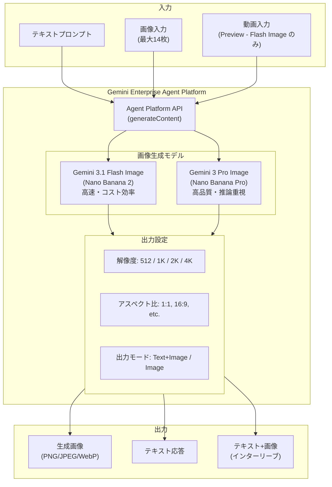

# Gemini Enterprise Agent Platform: Gemini 3.1 Flash Image / Gemini 3 Pro Image GA および Claude Opus 4.8 追加

**リリース日**: 2026-05-28

**サービス**: Gemini Enterprise Agent Platform

**機能**: Gemini 3.1 Flash Image and Gemini 3 Pro Image GA + Claude Opus 4.8

**ステータス**: Generally Available (GA) - 画像モデル本体 / Preview - 4K 出力およびビデオ入力

[このアップデートのインフォグラフィックを見る](https://takech9203.github.io/google-cloud-news-summary/20260528-gemini-agent-platform-image-models-ga.html)

## 概要

Google Cloud の Gemini Enterprise Agent Platform において、Gemini 3.1 Flash Image (コードネーム: Nano Banana 2) と Gemini 3 Pro Image (コードネーム: Nano Banana Pro) が GA (一般提供) となった。これらのモデルは、テキストと画像の両方を入出力として扱えるマルチモーダル画像生成モデルであり、高品質な画像生成・編集・テキストレンダリングが可能である。

今回のリリースでは、両モデルが 4K (4096x4096) 解像度での画像出力を Preview として新たにサポートする。さらに Gemini 3.1 Flash Image は動画入力 (Preview) にも対応し、動画からサムネイルや代表画像を生成するユースケースが新たに可能となった。

加えて、Anthropic の Claude Opus 4.8 が Model Garden に追加され、Agent Platform のパートナーモデルとして利用可能になった。これにより、複雑なコーディングやエンタープライズエージェントワークフローに最適化された最新の推論モデルを Google Cloud 上で利用できる。

**アップデート前の課題**

- Gemini 3.1 Flash Image と Gemini 3 Pro Image は Preview 段階であり、本番環境での利用に SLA が保証されていなかった
- 画像出力は最大 2K (2048x2048) 解像度に限定されており、印刷物や大型ディスプレイ向けの高解像度コンテンツ生成ができなかった
- 動画からの画像生成にはパイプラインの構築が必要で、動画を直接モデルに入力してサムネイルを自動生成することができなかった
- Claude の最新モデルは Agent Platform で直接利用できなかった

**アップデート後の改善**

- 両画像モデルが GA となり、SLA に基づいた本番環境での利用が可能になった
- 4K 解像度 (4096x4096) の画像出力が Preview として利用可能になり、超高解像度コンテンツの生成が実現した
- Gemini 3.1 Flash Image で動画入力が Preview サポートされ、動画から直接サムネイルや代表画像を生成できるようになった
- Claude Opus 4.8 が Model Garden に追加され、最先端の推論能力を持つパートナーモデルが利用可能になった

## アーキテクチャ図



Agent Platform API を通じてテキスト・画像・動画を入力し、Gemini 3.1 Flash Image または Gemini 3 Pro Image が解像度やアスペクト比の設定に基づいて画像を生成するパイプラインを示す。

## サービスアップデートの詳細

### 主要機能

1. **Gemini 3.1 Flash Image (Nano Banana 2) の GA**
   - 高速かつコスト効率に優れた画像生成・編集モデル
   - 最大入力トークン: 131,072 / 最大出力トークン: 32,768
   - 画像生成あたり最大 2,520 トークンを消費
   - Google Search によるグラウンディング、Thinking (推論) 機能をサポート
   - 動画入力によるサムネイル生成 (Preview) に対応

2. **Gemini 3 Pro Image (Nano Banana Pro) の GA**
   - 最先端の推論能力を組み込んだ高品質画像生成モデル
   - 複雑なマルチターン画像編集やインタラクティブな会話ベースの画像生成に最適
   - 最大入力トークン: 65,536 / 最大出力トークン: 32,768
   - Google Search によるグラウンディング、Thinking (推論) 機能をサポート

3. **4K 画像出力 (Preview)**
   - 両モデルで 4096x4096 (4K) 解像度の出力が Preview として利用可能
   - サポートされる解像度: 512, 1024 (1K), 2048 (2K), 4096 (4K)
   - 印刷物、大型ディスプレイ、プロフェッショナル用途に対応

4. **動画入力サポート (Preview - Flash Image のみ)**
   - 動画ファイルを直接入力して画像を生成
   - サムネイル生成や動画の代表画像抽出に最適
   - 動画コンテンツの視覚的要約に活用可能

5. **Claude Opus 4.8 (Model Garden)**
   - Anthropic の最新かつ最も高性能な GA モデル
   - 複雑なコーディング、エンタープライズエージェント、プロフェッショナルワークに最適化
   - 深い推論能力で技術的な組織タスクを処理

## 技術仕様

### モデル比較

| 項目 | Gemini 3.1 Flash Image | Gemini 3 Pro Image |
|------|------------------------|-------------------|
| モデル ID | gemini-3.1-flash-image | gemini-3-pro-image |
| コードネーム | Nano Banana 2 | Nano Banana Pro |
| 最大入力トークン | 131,072 | 65,536 |
| 最大出力トークン | 32,768 | 32,768 |
| 最大入力画像数 | 14 | 14 |
| 動画入力 | Preview サポート | 非サポート |
| 出力解像度 | 512, 1K, 2K, 4K (Preview) | 512, 1K, 2K, 4K (Preview) |
| サポートアスペクト比 | 1:1, 1:4, 1:8, 2:3, 3:2, 3:4, 4:1, 4:3, 4:5, 5:4, 8:1, 9:16, 16:9, 21:9 | 1:1, 3:2, 2:3, 3:4, 4:3, 4:5, 5:4, 9:16, 16:9, 21:9 |
| Thinking (推論) | サポート | サポート |
| Grounding with Google Search | サポート | サポート |
| 入力サイズ上限 | 500 MB | 500 MB |
| サポート MIME (画像) | PNG, JPEG, WebP, HEIC, HEIF | PNG, JPEG, WebP, HEIC, HEIF |

### API 呼び出し例

```python
from google import genai
from google.genai.types import GenerateContentConfig, Modality

client = genai.Client()

# 4K 画像生成の例
response = client.models.generate_content(
    model="gemini-3.1-flash-image",
    contents="東京タワーの夜景を幻想的な雰囲気で生成してください",
    config=GenerateContentConfig(
        response_modalities=[Modality.TEXT, Modality.IMAGE],
        response_format={
            "image": {
                "aspect_ratio": "16:9",
                "image_size": "4K",
            }
        },
    ),
)

for part in response.candidates[0].content.parts:
    if part.text:
        print(part.text)
    elif part.inline_data:
        # 画像データを保存
        with open("output.png", "wb") as f:
            f.write(part.inline_data.data)
```

## 設定方法

### 前提条件

1. Google Cloud プロジェクトで課金が有効であること
2. Agent Platform API (aiplatform.googleapis.com) が有効化されていること
3. ロケーションを `global` に設定すること

### 手順

#### ステップ 1: 環境変数の設定

```bash
export GOOGLE_CLOUD_PROJECT=your-project-id
export GOOGLE_CLOUD_LOCATION=global
export GOOGLE_GENAI_USE_VERTEXAI=True
```

#### ステップ 2: SDK のインストール

```bash
pip install --upgrade google-genai
```

#### ステップ 3: 画像生成の実行

```python
from google import genai
from google.genai.types import GenerateContentConfig, Modality
from PIL import Image
from io import BytesIO

client = genai.Client()

# テキストと画像のインターリーブ出力
response = client.models.generate_content(
    model="gemini-3-pro-image",
    contents="料理レシピをステップごとに画像付きで説明してください",
    config=GenerateContentConfig(
        response_modalities=[Modality.TEXT, Modality.IMAGE],
    ),
)

for i, part in enumerate(response.candidates[0].content.parts):
    if part.text:
        print(part.text)
    elif part.inline_data:
        image = Image.open(BytesIO(part.inline_data.data))
        image.save(f"step-{i}.png")
```

## メリット

### ビジネス面

- **本番環境での信頼性**: GA リリースにより SLA が保証され、エンタープライズアプリケーションでの画像生成が安心して利用可能
- **高解像度コンテンツ制作**: 4K 出力により印刷物やデジタルサイネージ向けの高品質画像を直接生成でき、デザインワークフローが効率化
- **動画コンテンツの自動処理**: 動画からサムネイルを自動生成することで、メディア制作・コンテンツ管理の工数を削減
- **マルチモデル戦略**: Claude Opus 4.8 の追加により、タスクに応じた最適なモデル選択肢が拡大

### 技術面

- **統合 API**: 画像生成・編集・テキスト生成がすべて同一の generateContent API で実行可能
- **マルチモーダル推論**: Thinking 機能により、複雑な指示を理解した上で正確な画像を生成
- **大規模コンテキスト**: Flash Image の 131K トークンの入力コンテキストにより、詳細な指示や多数の参照画像を含むリクエストが可能
- **柔軟なデプロイオプション**: Standard PayGo, Flex PayGo, Provisioned Throughput, Batch Prediction をサポート

## デメリット・制約事項

### 制限事項

- 4K 出力は Preview 段階であり、SLA の対象外
- 動画入力は Gemini 3.1 Flash Image のみのサポートで Preview 段階
- 画像生成モデルでは Function Calling、Code Execution、ファインチューニング、コンテキストキャッシュが非サポート
- リクエストあたりの出力画像数は 32,768 出力トークンの制約を受ける
- 安全でないコンテンツと判断された場合、画像生成が拒否される

### 考慮すべき点

- 画像生成あたりのトークン消費量が大きい (Flash Image で最大 2,520 トークン) ため、コスト計画に注意が必要
- Gemini 3 Pro Image の推奨言語は限定的 (ar-EG, de-DE, EN, es-MX, fr-FR, hi-IN, id-ID, it-IT, ja-JP, ko-KR, pt-BR, ru-RU, ua-UA, vi-VN, zh-CN)
- 複数画像の生成数は正確にコントロールできない場合がある
- テキストを含む画像の生成時は、先にテキストを生成してから画像に組み込むプロンプト設計が推奨される

## ユースケース

### ユースケース 1: EC サイトの商品画像自動生成

**シナリオ**: EC サイト運営者が新商品の登録時に、テキスト説明から商品画像のバリエーション (背景違い、アングル違い) を自動生成する。

**実装例**:
```python
response = client.models.generate_content(
    model="gemini-3-pro-image",
    contents=[
        "白いスニーカーの商品画像を3パターン生成してください: "
        "1. 白背景の正面ショット、2. 木目テーブルの上に配置、"
        "3. 屋外の自然光で撮影したイメージ"
    ],
    config=GenerateContentConfig(
        response_modalities=[Modality.TEXT, Modality.IMAGE],
        response_format={"image": {"aspect_ratio": "1:1", "image_size": "2K"}},
    ),
)
```

**効果**: 商品撮影のコストと時間を大幅に削減しながら、高品質な商品画像を複数パターン生成可能。

### ユースケース 2: 動画コンテンツのサムネイル自動生成

**シナリオ**: 動画配信プラットフォームで、アップロードされた動画からクリック率の高いサムネイル画像を自動生成する。

**実装例**:
```python
import base64

# 動画ファイルを読み込み
with open("video.mp4", "rb") as f:
    video_data = base64.b64encode(f.read()).decode()

response = client.models.generate_content(
    model="gemini-3.1-flash-image",
    contents=[
        {"mime_type": "video/mp4", "data": video_data},
        "この動画から最もインパクトのあるシーンを選び、"
        "YouTubeサムネイルとして適した画像を生成してください"
    ],
    config=GenerateContentConfig(
        response_modalities=[Modality.IMAGE],
        response_format={"image": {"aspect_ratio": "16:9", "image_size": "2K"}},
    ),
)
```

**効果**: 動画コンテンツの公開までのリードタイムを短縮し、視聴者の注目を集めるサムネイルを効率的に生成。

### ユースケース 3: 4K 印刷用マーケティング素材の生成

**シナリオ**: マーケティングチームがキャンペーン用のポスターやバナー画像を 4K 解像度で直接生成し、印刷物やデジタルサイネージに利用する。

**効果**: 外部デザインツールへの依存を減らし、アイデアから高解像度素材の作成までを一気通貫で実施。プロトタイプの高速イテレーションが可能に。

## 利用可能リージョン

| モデル | 利用可能リージョン |
|--------|-------------------|
| Gemini 3.1 Flash Image | global |
| Gemini 3 Pro Image | global |
| Claude Opus 4.8 | us-east5, europe-west1 (Agent Platform 経由) |

## 関連サービス・機能

- **Agent Studio**: ブラウザ上で画像生成モデルをインタラクティブに試用可能
- **Batch Prediction**: 大量の画像生成リクエストをバッチ処理で効率的に実行
- **Content Credentials (C2PA)**: 生成画像に来歴情報を埋め込み、AI 生成コンテンツの透明性を確保
- **Provisioned Throughput**: 予約済み容量で安定したスループットを確保
- **Model Garden**: Claude Opus 4.8 を含むパートナーモデルへの統一的なアクセスポイント

## 参考リンク

- [インフォグラフィック](https://takech9203.github.io/google-cloud-news-summary/20260528-gemini-agent-platform-image-models-ga.html)
- [Gemini 3.1 Flash Image ドキュメント](https://docs.cloud.google.com/gemini-enterprise-agent-platform/models/gemini/3-1-flash-image)
- [Gemini 3 Pro Image ドキュメント](https://docs.cloud.google.com/gemini-enterprise-agent-platform/models/gemini/3-pro-image)
- [Claude Opus 4.8 ドキュメント](https://docs.cloud.google.com/gemini-enterprise-agent-platform/models/partner-models/claude/opus-4-8)
- [画像生成ガイド](https://docs.cloud.google.com/gemini-enterprise-agent-platform/models/capabilities/image-generation)
- [料金ページ](https://cloud.google.com/gemini-enterprise-agent-platform/generative-ai/pricing)

## まとめ

Gemini 3.1 Flash Image と Gemini 3 Pro Image の GA リリースは、Agent Platform における画像生成機能の本格的な本番利用開始を意味する。4K 出力と動画入力の Preview サポートにより、エンタープライズ向けクリエイティブワークフローの自動化がさらに進展する。加えて Claude Opus 4.8 の追加は、Google Cloud 上でのマルチモデル AI 戦略の選択肢を拡充するものであり、画像生成と高度な推論を組み合わせたエージェントアプリケーションの構築を推奨する。

---

**タグ**: #GeminiEnterpriseAgentPlatform #ImageGeneration #Gemini3Flash #Gemini3Pro #4K #VideoInput #ClaudeOpus #ModelGarden #GA #MultiModal
