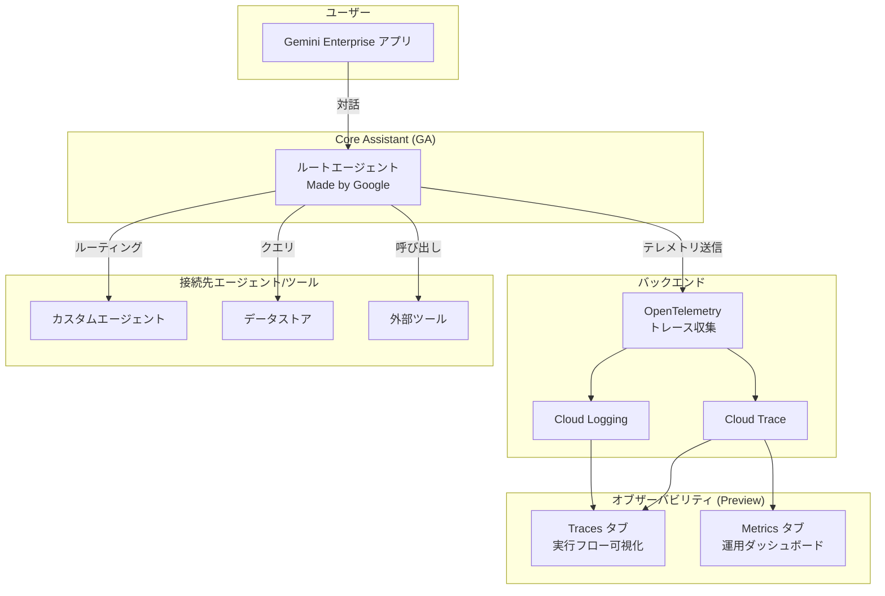

# Gemini Enterprise: Core Assistant の一般提供開始と Trace/Metrics 機能のプレビューリリース

**リリース日**: 2026-05-28

**サービス**: Gemini Enterprise

**機能**: Core Assistant (GA) / Trace and Metrics (Preview)

**ステータス**: GA (Core Assistant) / Public Preview (Trace and Metrics)

📊 [このアップデートのインフォグラフィックを見る](https://takech9203.github.io/google-cloud-news-summary/20260528-gemini-enterprise-core-assistant-ga.html)

## 概要

Google は Gemini Enterprise において、Core Assistant の一般提供 (GA) を開始しました。Core Assistant は Google が提供する「Made by Google」ルートエージェントであり、ユーザーが Gemini Enterprise アプリで特定のエージェントを指定せずに対話する際のデフォルトハンドラーとして機能します。これにより、Gemini Enterprise ユーザーは追加設定なしでインテリジェントなアシスタント機能を利用できるようになります。

さらに、Core Assistant には新しいオブザーバビリティ (可観測性) 機能として Trace タブと Metrics タブが Public Preview として追加されました。Traces 機能は OpenTelemetry ベースのトレースを可視化し、エージェントの実行フロー、レイテンシー、入出力を詳細に追跡できます。Metrics 機能はデフォルトで有効化されたダッシュボードで、セッション数、エージェント呼び出し回数、ツールコール数、エラーレートなどの運用メトリクスを追加課金なしで提供します。

このアップデートの対象ユーザーは、Gemini Enterprise を利用してエージェントベースの AI アプリケーションを構築・運用している組織の管理者と開発者です。なお、Gemini Enterprise Frontline Edition では「Made by Google」エージェントは利用できない点に注意が必要です。

**アップデート前の課題**

- エージェントの実行フローやパフォーマンスを把握するための統合的な可観測性ツールが Gemini Enterprise 内に組み込まれていなかった
- ユーザーが特定のエージェントを指定しない場合のデフォルト応答ハンドリングが限定的だった
- エージェントの運用状態 (セッション数、エラーレート、レイテンシーなど) をリアルタイムで監視するには外部ツールの別途構築が必要だった

**アップデート後の改善**

- Core Assistant が自動的にプロビジョニングされ、設定不要で即座にルートエージェントとして機能する
- Traces タブにより、OpenTelemetry ベースで実行スパンの親子関係、入出力、実行時間を 30 日間保持・可視化できる
- Metrics タブがデフォルトで有効化され、追加課金なしでセッション数・レイテンシー・エラーレートなどの運用ダッシュボードを利用可能

## アーキテクチャ図



Core Assistant がルートエージェントとしてユーザーのリクエストを処理し、必要に応じて他のエージェントやツールにルーティングします。オブザーバビリティ機能は OpenTelemetry 経由で収集されたテレメトリデータを Traces タブと Metrics タブで可視化します。

## サービスアップデートの詳細

### 主要機能

1. **Core Assistant (一般提供)**
   - Google が管理するルートエージェントで、ユーザーが特定のエージェントを指定しない場合にデフォルトで応答を処理
   - 完全に Google マネージドであり、構成の編集やダッシュボードのカスタマイズは不可
   - Gemini Enterprise アプリに自動的にプロビジョニングされ、即座に利用可能
   - Google Cloud コンソールから確認可能

2. **Traces タブ (Public Preview)**
   - トレースレコードの時系列サマリーを提供
   - Agent to Tool、Invoke Agent、Agent to Model のアクションにおける親子実行スパンの詳細を表示
   - 実行フロー、入力、出力、レイテンシーを検査可能
   - トレースデータは 30 日間保持
   - OpenTelemetry トレースの有効化が必要

3. **Metrics タブ (Public Preview)**
   - デフォルトで有効 (手動設定不要)
   - セッション数、エージェント呼び出し回数、トラフィック、ツールコール数、エラーレートを表示
   - 接続されたツールのレイテンシーメトリクスを含む
   - メトリクスデータは 6 週間 (42 日間) 保持
   - 追加課金なし

## 技術仕様

### Core Assistant の特性

| 項目 | 詳細 |
|------|------|
| 管理者 | Google (完全マネージド) |
| カスタマイズ | 不可 (設定変更・ダッシュボード編集不可) |
| プロビジョニング | 自動 (設定不要) |
| 対象エディション | Gemini Enterprise (Frontline Edition を除く) |
| アクセス方法 | Google Cloud コンソール |

### Traces 技術仕様

| 項目 | 詳細 |
|------|------|
| データ保持期間 | 30 日間 |
| トレース形式 | OpenTelemetry Semantic Conventions for Generative AI |
| 有効化 | 手動 (OpenTelemetry トレースとログの有効化が必要) |
| スパンタイプ | Agent to Tool / Invoke Agent / Agent to Model |
| 表示形式 | DAG (有向非巡回グラフ)、タイムライン |
| ステータス | Public Preview |

### Metrics 技術仕様

| 項目 | 詳細 |
|------|------|
| データ保持期間 | 42 日間 (6 週間) |
| 有効化 | デフォルトで有効 (設定不要) |
| 追加課金 | なし |
| ダッシュボード | Overview metrics / Tools latency metrics |
| ステータス | Public Preview |

## 設定方法

### 前提条件

1. Gemini Enterprise アプリが構成済みであること
2. 以下のいずれかのロールを持っていること:
   - Gemini Enterprise Admin ロール (`discoveryengine.agentspaceAdmin`)
   - Google Cloud コンソールの Gemini Enterprise User ロール
3. Traces 機能を使用する場合: Cloud Trace User ロール (`roles/cloudtrace.user`)

### 手順

#### ステップ 1: Core Assistant の確認

Core Assistant は自動的にプロビジョニングされるため、追加の設定手順は不要です。Google Cloud コンソールから Gemini Enterprise アプリにアクセスし、Core Assistant が有効であることを確認します。

```
Google Cloud コンソール > Gemini Enterprise > アプリ > Core Assistant
```

#### ステップ 2: Traces 機能の有効化

Traces 機能を使用するには、OpenTelemetry トレースとログの送信を有効化する必要があります。

```
Google Cloud コンソール > Gemini Enterprise > Observability Settings > OpenTelemetry Traces and Logs: ON
```

必要な IAM ロールの付与:

```bash
gcloud projects add-iam-policy-binding PROJECT_ID \
  --member="user:USER_EMAIL" \
  --role="roles/cloudtrace.user"
```

#### ステップ 3: Metrics ダッシュボードの確認

Metrics タブはデフォルトで有効であり、追加の設定は不要です。Google Cloud コンソールの Core Assistant ページから Metrics タブにアクセスしてダッシュボードを確認します。

```
Google Cloud コンソール > Gemini Enterprise > Core Assistant > Metrics タブ
```

## メリット

### ビジネス面

- **即時の運用可視化**: Metrics がデフォルトで有効なため、導入コストゼロでエージェントの運用状態を把握可能
- **追加課金なしのモニタリング**: Metrics ダッシュボードは追加の課金が発生せず、既存の Gemini Enterprise ライセンスに含まれる
- **障害対応の迅速化**: Traces により問題の根本原因を特定するまでの時間 (MTTR) を短縮
- **運用の標準化**: Google マネージドのルートエージェントにより、組織全体で一貫したユーザー体験を提供

### 技術面

- **OpenTelemetry 標準準拠**: ベンダーニュートラルなトレーシング標準に基づいており、既存の可観測性ツールとの統合が容易
- **ゼロコンフィグのメトリクス**: 手動設定なしでセッション数、レイテンシー、エラーレートを自動収集
- **詳細なスパン分析**: Agent to Tool、Agent to Model などのスパンタイプごとに実行フローを可視化
- **長期データ保持**: Traces 30 日 / Metrics 42 日のデータ保持によりトレンド分析が可能

## デメリット・制約事項

### 制限事項

- Core Assistant の設定やダッシュボードはカスタマイズ不可 (完全に Google マネージド)
- Gemini Enterprise Frontline Edition では「Made by Google」エージェントは利用不可
- Traces 機能は OpenTelemetry の有効化が必須であり、デフォルトでは OFF
- Trace and Metrics タブは Public Preview のため、SLA の対象外であり、本番環境での利用は「Pre-GA Offerings Terms」に準拠
- Traces データ保持期間は 30 日間に制限されており、長期保存には別途エクスポートが必要

### 考慮すべき点

- Preview 機能は将来的に仕様変更やサポート制限がある可能性がある
- OpenTelemetry トレースを有効化するとテレメトリデータの送信量が増加する可能性があり、Cloud Trace のコストに影響する場合がある
- Core Assistant はルートエージェントとして動作するため、カスタムエージェントとの優先順位設定に注意が必要
- プロンプトとレスポンスのデータは Trace スパンには直接保存されず、Cloud Logging または Cloud Storage に別途保存される (IAM によるアクセス制御が必要)

## ユースケース

### ユースケース 1: エージェントのパフォーマンスデバッグ

**シナリオ**: Gemini Enterprise アプリで特定のエージェント呼び出しが遅延している場合に、ボトルネックを特定する。

**実装例**:
```
1. Core Assistant > Traces タブを開く
2. 遅延が発生した時間帯のトレースをフィルタリング
3. スパンの DAG 表示で Agent to Tool スパンのレイテンシーを確認
4. 最もレイテンシーが高いツール呼び出しを特定
5. 該当ツールの設定やバックエンドの問題を調査
```

**効果**: 問題の根本原因を視覚的に特定でき、MTTR (平均復旧時間) を大幅に短縮。

### ユースケース 2: 運用状態の定期モニタリング

**シナリオ**: AI エージェントプラットフォームの SRE チームが、日次・週次で運用メトリクスを確認し、異常を早期に検知する。

**実装例**:
```
1. Core Assistant > Metrics タブを開く
2. Overview ダッシュボードでセッション数の推移を確認
3. エラーレートの急増がないか確認
4. Tools latency メトリクスで特定ツールの劣化を検知
5. 必要に応じてアラート設定を検討
```

**効果**: 追加コストなしで運用ヘルスチェックを実施でき、ユーザー影響が出る前に問題を検知。

### ユースケース 3: エージェント利用状況の可視化

**シナリオ**: 管理者がエージェントプラットフォームの ROI を評価するため、利用状況とパフォーマンスデータを収集する。

**効果**: Metrics ダッシュボードから セッション数、エージェント呼び出し回数、ツール利用頻度を定量的に把握でき、投資対効果の評価やキャパシティプランニングに活用可能。

## 料金

Core Assistant 自体は Gemini Enterprise ライセンスに含まれており、追加料金は発生しません。

### 料金に関する注意事項

| 項目 | 料金 |
|------|------|
| Core Assistant (GA) | Gemini Enterprise ライセンスに含まれる |
| Metrics タブ (Preview) | 追加課金なし |
| Traces タブ (Preview) | Core Assistant 内での表示は追加課金なし |
| OpenTelemetry トレース送信 | Cloud Trace の通常料金が適用される可能性あり |

Gemini Enterprise のライセンス料金については [Gemini Enterprise の料金ページ](https://cloud.google.com/gemini/enterprise/pricing) を参照してください。

## 利用可能リージョン

Core Assistant は Gemini Enterprise が利用可能な全リージョンで自動的にプロビジョニングされます。具体的な対応リージョンについては [Gemini Enterprise のドキュメント](https://docs.cloud.google.com/gemini/enterprise/docs) を参照してください。

## 関連サービス・機能

- **Gemini Enterprise Agent Platform**: エージェントの構築・デプロイ・管理を行うプラットフォーム。Core Assistant はそのルートエージェントとして機能
- **Cloud Trace**: OpenTelemetry トレースデータの保存・分析基盤。Core Assistant の Traces 機能のバックエンド
- **Cloud Logging**: エージェントのプロンプトとレスポンスのログ保存先
- **OpenTelemetry**: CNCF のオブザーバビリティフレームワーク。Gemini Enterprise のトレース標準として採用
- **Agent Registry**: Gemini Enterprise Agent Platform でエージェントを登録・管理するレジストリ

## 参考リンク

- 📊 [インフォグラフィック](https://takech9203.github.io/google-cloud-news-summary/20260528-gemini-enterprise-core-assistant-ga.html)
- [公式リリースノート](https://docs.cloud.google.com/release-notes#May_28_2026)
- [Core Assistant ドキュメント](https://docs.cloud.google.com/gemini/enterprise/docs/core-assistant)
- [Gemini Enterprise Agent Platform オブザーバビリティ](https://docs.cloud.google.com/gemini-enterprise-agent-platform/optimize/observability/overview)
- [Agent トレースの表示](https://docs.cloud.google.com/gemini-enterprise-agent-platform/optimize/observability/traces)
- [オブザーバビリティ設定の管理](https://docs.cloud.google.com/gemini/enterprise/docs/manage-observability-settings)

## まとめ

Gemini Enterprise Core Assistant の GA リリースにより、ユーザーは設定不要でインテリジェントなルートエージェント機能を利用できるようになりました。さらに、Public Preview として提供される Traces と Metrics のオブザーバビリティ機能は、追加コストなしでエージェントの実行フローと運用状態を可視化し、AI エージェントプラットフォームの本格運用に必要な監視基盤を提供します。Gemini Enterprise を利用している組織は、Metrics タブの確認から始め、詳細なデバッグが必要な場合には OpenTelemetry トレースを有効化することを推奨します。

---

**タグ**: #GeminiEnterprise #CoreAssistant #Observability #OpenTelemetry #Tracing #Metrics #GA #Preview #AgentPlatform #Monitoring
