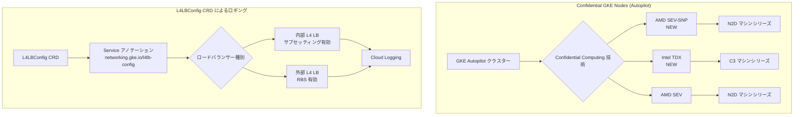

# Google Kubernetes Engine: Confidential GKE Nodes の Autopilot 対応拡張と L4 ロードバランサーのロギング設定 CRD

**リリース日**: 2026-05-28

**サービス**: Google Kubernetes Engine (GKE)

**機能**: Confidential GKE Nodes クラスターレベル AMD SEV-SNP/Intel TDX 対応 (Autopilot) および L4LBConfig CRD によるロギング設定

**ステータス**: GA (一般提供)

📊 [このアップデートのインフォグラフィックを見る](https://takech9203.github.io/google-cloud-news-summary/20260528-gke-confidential-nodes-l4lb-logging.html)

## 概要

Google Kubernetes Engine (GKE) に2つの重要なアップデートが発表されました。1つ目は、Confidential GKE Nodes がクラスターレベルで AMD SEV-SNP および Intel TDX をサポートするようになったことです。これにより、GKE Autopilot クラスターでもこれらの最新の機密コンピューティング技術を利用して、ハードウェアベースのメモリ暗号化によりデータを保護できるようになりました。

2つ目のアップデートは、GKE バージョン 1.36.0-gke.2459000 以降で、L4LBConfig CustomResourceDefinition (CRD) を使用して L4 ロードバランサーのバックエンドサービスに対する Cloud Logging を直接設定できるようになったことです。これは内部 L4 ロードバランサー（サブセッティング有効時）および外部 L4 ロードバランサー（リージョナルバックエンドサービス有効時）に対応しています。

これらのアップデートにより、セキュリティとオブザーバビリティの両面で GKE の機能が強化され、エンタープライズワークロードのコンプライアンス対応や、ネットワークトラフィックの可視化が大幅に改善されます。

**アップデート前の課題**

- Autopilot クラスターでの Confidential GKE Nodes は AMD SEV のみサポートされており、より高度なセキュリティ機能を持つ SEV-SNP や Intel TDX をクラスターレベルで利用できなかった
- L4 ロードバランサーのロギング設定は手動で Google Cloud コンソールや gcloud CLI から直接バックエンドサービスに対して行う必要があり、Kubernetes のマニフェストベースの管理ができなかった
- ロードバランサーのログ設定が Kubernetes のデプロイメントパイプラインと統合されておらず、Infrastructure as Code の一貫性が欠けていた

**アップデート後の改善**

- GKE Autopilot クラスターで AMD SEV-SNP および Intel TDX をクラスターレベルで有効化可能になり、全ノードに対して最新のハードウェアベースの機密コンピューティング保護を適用可能
- L4LBConfig CRD により、Kubernetes のネイティブなリソース定義として Cloud Logging の設定を宣言的に管理可能
- ロギング設定がアノテーション経由で Service に紐付けられ、GitOps ワークフローや CI/CD パイプラインとシームレスに統合可能

## アーキテクチャ図



上図は、今回のアップデートの2つの機能を示しています。上部は Autopilot クラスターでの Confidential Computing 技術の選択肢の拡張、下部は L4LBConfig CRD を通じたロードバランサーのロギング設定フローを表しています。

## サービスアップデートの詳細

### 主要機能

1. **Confidential GKE Nodes: Autopilot クラスターレベルでの AMD SEV-SNP / Intel TDX 対応**
   - GKE Autopilot クラスター作成時に `--confidential-node-type` フラグで `sev_snp` または `tdx` を指定可能
   - クラスター内の全ノードが選択した Confidential Computing 技術で保護される
   - クラスターレベルでの設定は不可逆であり、後からの無効化や個別ワークロードでのオーバーライドは不可
   - AMD SEV-SNP は Secure Nested Paging により、ハイパーバイザーからのメモリ攻撃に対する追加保護を提供
   - Intel TDX は Trust Domain Extensions により、VM 全体を信頼ドメインとして分離

2. **L4LBConfig CRD による Cloud Logging 設定**
   - `networking.gke.io/v1` API グループの L4LBConfig カスタムリソースで宣言的にロギングを設定
   - サンプルレート (0〜1,000,000) によるログ収集量の制御が可能
   - `optionalMode` フィールドで出力フィールドの詳細度を制御 (EXCLUDE_ALL_OPTIONAL / INCLUDE_ALL_OPTIONAL / CUSTOM)
   - Service のアノテーション `networking.gke.io/l4lb-config` で CRD リソースを参照
   - CRD を参照しない場合、コントローラーがロギングを無効化し、手動設定を上書き

3. **L4LBConfig のステータス管理とコースト動作**
   - `status.conditions` の `LoggingConfigManaged` 条件タイプで設定の同期状態を監視可能
   - アノテーション削除時は「コースト状態」に移行し、最後の正常な設定が維持される
   - バリデーションエラーや参照先リソース欠如時は条件ステータスで通知

## 技術仕様

### Confidential GKE Nodes 対応表

| 項目 | 詳細 |
|------|------|
| 対応技術 | AMD SEV, AMD SEV-SNP, Intel TDX |
| 対象クラスターモード | Autopilot, Standard |
| 必要 GKE バージョン (SEV-SNP/TDX) | 1.35.2-gke.1485000 以降 |
| 必要 GKE バージョン (SEV) | 1.30.2 以降 |
| デフォルトマシンシリーズ (SEV/SEV-SNP) | N2D |
| デフォルトマシンシリーズ (TDX) | C3 |
| クラスターレベル設定の変更可否 | 不可逆（後からの無効化不可） |

### L4LBConfig CRD 仕様

| 項目 | 詳細 |
|------|------|
| API バージョン | networking.gke.io/v1 |
| リソース種別 | L4LBConfig |
| 必要 GKE バージョン | 1.36.0-gke.2459000 以降 |
| 対応 LB (内部) | 内部パススルーネットワーク LB（サブセッティング有効） |
| 対応 LB (外部) | 外部パススルーネットワーク LB（RBS 有効） |
| サンプルレート範囲 | 0〜1,000,000 (1,000,000 = 100%) |

### L4LBConfig マニフェスト例

```yaml
apiVersion: networking.gke.io/v1
kind: L4LBConfig
metadata:
  name: svc-l4lb-config
  namespace: default
spec:
  logging:
    enabled: true
    sampleRate: 500000
    optionalMode: "INCLUDE_ALL_OPTIONAL"
```

## 設定方法

### 前提条件

1. Google Kubernetes Engine API が有効化されていること
2. gcloud CLI がインストール・初期化済みであること
3. Confidential GKE Nodes: GKE バージョン 1.35.2-gke.1485000 以降
4. L4LBConfig: GKE バージョン 1.36.0-gke.2459000 以降

### 手順

#### ステップ 1: Confidential GKE Nodes 対応 Autopilot クラスターの作成 (AMD SEV-SNP)

```bash
gcloud container clusters create-auto my-confidential-cluster \
    --location=us-central1 \
    --confidential-node-type=sev_snp
```

AMD SEV-SNP を有効にした Autopilot クラスターを作成します。全ノードがデフォルトで N2D マシンシリーズを使用し、ハードウェアベースのメモリ暗号化で保護されます。

#### ステップ 2: Intel TDX を使用する場合

```bash
gcloud container clusters create-auto my-tdx-cluster \
    --location=us-central1 \
    --confidential-node-type=tdx
```

Intel TDX を有効にした Autopilot クラスターを作成します。デフォルトで C3 マシンシリーズが使用されます。

#### ステップ 3: L4LBConfig CRD の作成

```yaml
# svc-l4lb-config.yaml
apiVersion: networking.gke.io/v1
kind: L4LBConfig
metadata:
  name: svc-l4lb-config
  namespace: default
spec:
  logging:
    enabled: true
    sampleRate: 500000
    optionalMode: "INCLUDE_ALL_OPTIONAL"
```

```bash
kubectl apply -f svc-l4lb-config.yaml
```

#### ステップ 4: Service に L4LBConfig を関連付け（内部 LB の例）

```yaml
# ilb-svc.yaml
apiVersion: v1
kind: Service
metadata:
  name: ilb-svc
  annotations:
    networking.gke.io/load-balancer-type: "Internal"
    networking.gke.io/l4lb-config: "svc-l4lb-config"
spec:
  type: LoadBalancer
  selector:
    app: store
  ports:
    - name: tcp-port
      protocol: TCP
      port: 8080
      targetPort: 8080
```

```bash
kubectl apply -f ilb-svc.yaml
```

#### ステップ 5: ロギング設定のステータス確認

```bash
kubectl get svc ilb-svc -o yaml
```

`status.conditions` の `LoggingConfigManaged` タイプが `True` / `Reconciled` であることを確認します。

## メリット

### ビジネス面

- **コンプライアンス対応の強化**: AMD SEV-SNP と Intel TDX により、金融・医療・政府機関など厳格なデータ保護要件を持つ組織が GKE Autopilot の運用効率を享受しつつセキュリティ基準を満たすことが可能
- **運用コストの削減**: L4LBConfig CRD による宣言的管理により、ロギング設定の手動作業が不要になり、運用チームの負荷を軽減
- **監査対応の簡素化**: ロードバランサーのログをネイティブに Kubernetes マニフェストとして管理することで、設定変更の追跡と監査が容易に

### 技術面

- **ゼロトラストセキュリティの強化**: SEV-SNP の Secure Nested Paging により、ハイパーバイザーレベルの攻撃からもワークロードを保護
- **GitOps 親和性**: L4LBConfig CRD はマニフェストファイルとして管理できるため、ArgoCD や Flux などの GitOps ツールとシームレスに統合
- **きめ細かなログ制御**: サンプルレートや optionalFields の設定により、必要な情報だけを収集してログストレージコストを最適化
- **Autopilot の完全マネージド環境での機密コンピューティング**: ノード管理不要の環境で最高レベルのハードウェアセキュリティを実現

## デメリット・制約事項

### 制限事項

- Confidential GKE Nodes のクラスターレベル設定は不可逆であり、一度設定すると無効化や技術の変更ができない
- AMD SEV-SNP / Intel TDX は対応するマシンタイプとゾーンが限定されるため、全リージョンで利用可能ではない
- L4LBConfig CRD は GKE バージョン 1.36.0-gke.2459000 以降でのみ利用可能
- 内部 L4 LB のロギングにはサブセッティングの有効化が前提条件
- 外部 L4 LB のロギングにはリージョナルバックエンドサービス (RBS) の有効化が前提条件

### 考慮すべき点

- Confidential Computing 技術の選択は永続的であるため、ワークロード要件とゾーン可用性を事前に十分検討する必要がある
- L4LBConfig CRD を参照しない Service にはコントローラーがロギングを無効化するため、既存の手動設定が上書きされる可能性がある
- ログのサンプルレートを高く設定すると Cloud Logging のコストが増加する可能性がある
- Autopilot での Confidential Computing 有効化により、使用可能なマシンタイプが制限され、一部のワークロードで性能影響が発生する可能性がある

## ユースケース

### ユースケース 1: 金融機関における機密データ処理

**シナリオ**: 金融機関が顧客の取引データを処理するマイクロサービスを GKE 上で運用しており、PCI DSS やデータ保護規制に準拠する必要がある。Autopilot のマネージド機能を活用しつつ、ハードウェアレベルのメモリ暗号化を全ワークロードに適用したい。

**実装例**:
```bash
gcloud container clusters create-auto financial-prod-cluster \
    --location=us-central1 \
    --confidential-node-type=sev_snp
```

**効果**: Autopilot の運用負荷軽減メリットを享受しながら、AMD SEV-SNP によるハイパーバイザーレベルの攻撃からのメモリ保護を実現。コンプライアンス要件への対応と運用効率の両立が可能。

### ユースケース 2: マイクロサービスのネットワークトラフィック分析

**シナリオ**: 複数のマイクロサービスが内部ロードバランサーを通じて通信しており、パフォーマンス問題やトラフィック異常を検知するためにロギングを有効化したいが、GitOps ワークフローの一環として管理したい。

**実装例**:
```yaml
apiVersion: networking.gke.io/v1
kind: L4LBConfig
metadata:
  name: monitoring-config
  namespace: production
spec:
  logging:
    enabled: true
    sampleRate: 100000
    optionalMode: "CUSTOM"
    optionalFields: "pod_name,pod_namespace,cluster_name"
```

**効果**: 10% のサンプルレートで必要な Pod 識別情報のみを収集し、コスト効率良くトラフィックの可視化とトラブルシューティングが可能。設定は Git リポジトリで管理され、変更履歴の追跡も容易。

### ユースケース 3: マルチテナント環境での機密ワークロード分離

**シナリオ**: SaaS プロバイダーが複数テナントのワークロードを同一 GKE 環境で運用しており、各テナントのデータをハードウェアレベルで分離したい。Intel TDX の Trust Domain による VM レベルの分離を活用する。

**効果**: Intel TDX により各 VM が独立した信頼ドメインとして動作し、テナント間のデータ漏洩リスクをハードウェアレベルで排除。C3 マシンシリーズの高性能と機密コンピューティングの両立を実現。

## 料金

### Confidential GKE Nodes

Confidential VM の利用にはマシンタイプに応じた追加料金が発生します。具体的な料金は Confidential Computing の料金ページを参照してください。

| 項目 | 料金への影響 |
|------|-------------|
| Confidential VM (SEV-SNP) | 通常の VM 料金 + Confidential Computing 追加料金 |
| Confidential VM (TDX) | 通常の VM 料金 + Confidential Computing 追加料金 |
| GKE Autopilot 管理料金 | 標準の Autopilot 料金体系に準拠 |

### L4LBConfig ロギング

| 項目 | 料金 |
|------|------|
| L4LBConfig CRD の利用 | 追加料金なし |
| Cloud Logging への取り込み | Cloud Logging の標準料金に準拠 |
| ロードバランサーの性能影響 | なし |

ロギングの有効化自体はロードバランサーの性能に影響を与えません。ログの取り込み量に応じて Cloud Logging の課金が発生するため、サンプルレートの適切な設定が推奨されます。

## 利用可能リージョン

### Confidential GKE Nodes

AMD SEV-SNP および Intel TDX は対応するマシンタイプとゾーンでのみ利用可能です。利用可能なゾーンは [Confidential VM のサポートされる構成](https://docs.cloud.google.com/confidential-computing/confidential-vm/docs/supported-configurations#supported-zones) で確認できます。

### L4LBConfig CRD

GKE バージョン 1.36.0-gke.2459000 以降が利用可能な全リージョンで使用可能です。

## 関連サービス・機能

- **Confidential Computing**: GKE の基盤となる Confidential VM 技術を提供し、AMD SEV/SEV-SNP/Intel TDX によるハードウェアベースのメモリ暗号化を実現
- **Cloud Logging**: L4LBConfig CRD と連携してロードバランサーのトラフィックログを収集・保存
- **GKE Autopilot**: 完全マネージドの Kubernetes 環境で、今回 Confidential Computing の選択肢が拡張
- **Cloud Load Balancing**: 内部/外部パススルーネットワークロードバランサーのバックエンドサービスとして動作
- **ComputeClass**: ワークロードレベルでの Confidential GKE Nodes 設定に使用される GKE リソース

## 参考リンク

- 📊 [インフォグラフィック](https://takech9203.github.io/google-cloud-news-summary/20260528-gke-confidential-nodes-l4lb-logging.html)
- [公式リリースノート](https://docs.cloud.google.com/release-notes#May_28_2026)
- [Confidential GKE Nodes ドキュメント](https://docs.cloud.google.com/kubernetes-engine/docs/how-to/confidential-gke-nodes)
- [AMD SEV-SNP 概要](https://docs.cloud.google.com/confidential-computing/confidential-vm/docs/confidential-vm-overview#amd_sev-snp)
- [Intel TDX 概要](https://docs.cloud.google.com/confidential-computing/confidential-vm/docs/confidential-vm-overview#intel_tdx)
- [内部 L4 LB ロギング設定](https://docs.cloud.google.com/kubernetes-engine/docs/how-to/internal-load-balancing#enable-logging)
- [外部 L4 LB ロギング設定](https://docs.cloud.google.com/kubernetes-engine/docs/how-to/backend-service-based-external-load-balancer#enable-logging)
- [Confidential Computing 料金](https://cloud.google.com/confidential-computing/pricing)

## まとめ

今回の GKE アップデートは、セキュリティとオブザーバビリティの2つの重要な領域を強化するものです。Confidential GKE Nodes の AMD SEV-SNP / Intel TDX 対応により、Autopilot クラスターでも最先端のハードウェアベース機密コンピューティングが利用可能になり、機密性の高いワークロードのクラウド移行を加速します。また、L4LBConfig CRD の導入により、ロードバランサーのロギングが Kubernetes ネイティブな宣言的管理に統合され、GitOps ワークフローとの一貫性が向上します。既に厳格なセキュリティ要件を持つワークロードを運用している組織や、L4 ロードバランサーのトラフィック可視化を必要としているチームは、これらの新機能の導入を検討することを推奨します。

---

**タグ**: #GoogleCloud #GKE #ConfidentialComputing #AMDSEVSNP #IntelTDX #Autopilot #L4LBConfig #CloudLogging #LoadBalancer #セキュリティ #オブザーバビリティ #Kubernetes
