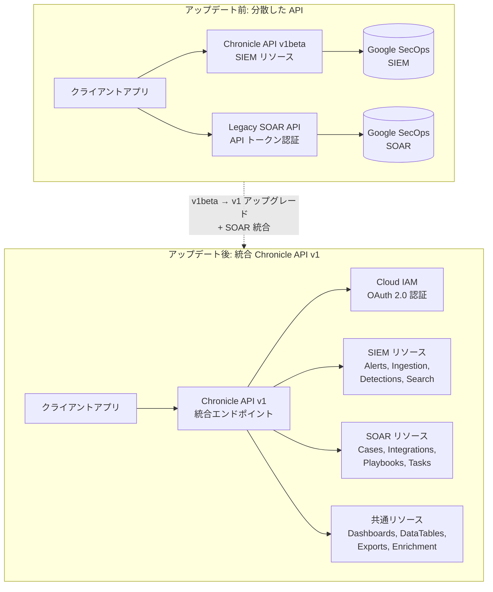

# Google SecOps: Chronicle API v1 統合アップグレードとプレビュー機能管理

**リリース日**: 2026-05-28

**サービス**: Google SecOps (SIEM + SOAR 統合プラットフォーム)

**機能**: Unified and Upgraded Chronicle API v1 + Manage access to preview features

**ステータス**: 一般提供開始 (GA - v1 安定版 API)

[このアップデートのインフォグラフィックを見る](https://takech9203.github.io/google-cloud-news-summary/20260528-google-secops-chronicle-api-v1-preview-features.html)

## 概要

Google SecOps において、Chronicle API がレガシー SOAR API のリソースと統合され、さらに多数の API リソースが v1 beta から v1 (安定版) にアップグレードされました。これにより、SIEM と SOAR の両機能を単一の統合 API サーフェスからアクセスできるようになり、API の安定性と機能的な完全性が確保されました。

今回のアップグレードは、アラート管理、ダッシュボード、データテーブル、インジェスション、正規化、検出、検索・調査、エクスポート、エンリッチメント、SOAR (ケース管理・レスポンス) といった幅広いリソースをカバーしています。v1 への昇格は Google の API 安定性ポリシー (AIP-181) に準拠しており、本番環境での利用やパートナー連携に適した段階に達したことを示します。

また、同時にテナント管理者がパブリックプレビュー機能のアクセスを自己管理できる新機能も導入されました。これまでサポートチャネル経由でのみ有効化できたプレビュー機能を、管理者が独自に有効化・無効化できるようになります。

**アップデート前の課題**

- SIEM 機能と SOAR 機能が別々の API (Chronicle API と Legacy SOAR API) に分散しており、統合的な自動化の構築が複雑だった
- 多くの API リソースが v1 beta のままで、本番環境での利用において API の安定性保証が不十分だった
- プレビュー機能の有効化・無効化には Google サポートへの問い合わせが必要で、迅速な機能評価ができなかった
- SOAR API は独自の認証方式 (API トークン) を使用しており、IAM ベースの統一的なアクセス制御が困難だった

**アップデート後の改善**

- Chronicle API v1 として SIEM・SOAR の全リソースが統合され、単一のエンドポイントで全機能にアクセス可能になった
- v1 安定版 API として破壊的変更がないことが保証され、本番環境での安心した利用とパートナー連携が可能になった
- テナント管理者が UI から直接プレビュー機能を有効化・無効化でき、新機能の迅速な評価が可能になった
- OAuth 2.0 / IAM ベースの統一認証により、セキュリティとアクセス制御が一元管理できるようになった

## アーキテクチャ図



SIEM と SOAR で分散していた API が、Chronicle API v1 として単一のエンドポイントに統合され、IAM ベースの認証で一元的にアクセスできるアーキテクチャに変更されたことを示しています。

## サービスアップデートの詳細

### 主要機能

1. **Chronicle API v1 統合アップグレード**
   - レガシー SOAR API の全リソースが Chronicle API に統合
   - v1 beta から v1 への昇格により API の安定性が保証 (AIP-181 準拠)
   - RESTful で標準化されたエンドポイント命名規則の採用
   - リソース指向のデータモデル設計への移行

2. **プレビュー機能のセルフサービス管理**
   - テナント管理者による Public Preview 機能の有効化・無効化が可能
   - 新しい「Public Preview Features」ページで全機能の状態と GA 予定日を一覧表示
   - サポートチャネルへの問い合わせ不要で迅速な機能評価が可能
   - コンプライアンス管理テナント (FedRAMP, HIPAA) では利用不可

3. **統合認証・認可モデル**
   - OAuth 2.0 による標準化された認証フロー
   - Cloud IAM を活用した細粒度のアクセス制御
   - サービスアカウントおよび Workload Identity Federation のサポート
   - Cloud Audit Logs との統合による監査証跡の確保

## 技術仕様

### v1 に昇格した API リソース一覧

| カテゴリ | 主要リソース |
|----------|-------------|
| アラート・脅威インテリジェンス | Alerts, ATIs, UEBA, Threat Collection, IoC, CoverageDetail, EntityRisk |
| ダッシュボード | NativeDashboard, DashboardChart, DashboardQuery, FeaturedContentNativeDashboard |
| データテーブル | DataTable, DataTableRow, DataTableOperationError |
| インジェスション | Logs, Feed, LogTypeSchema, FeedSourceSchema, FeedPack, Forwarder |
| 正規化 | Logtype, Parser, IngestionLogLabel |
| 検出 | FindingsRefinement, VerifyRuleText, FeaturedContentRule, RuleExecutionError |
| 検索・調査 | Event, Entity, SearchQuery, SavedColumnSet |
| エクスポート | BigQueryExportService |
| エンリッチメント | EnrichmentControl, EnrichmentCombination |
| SOAR (ケース管理) | Case, CaseAlert, CaseStageDefinition, CaseTagDefinition, CaseQueueFilter, CaseCloseDefinition |
| SOAR (エンティティ・タスク) | ContextProperty, InvolvedEntity, Task, CaseComment, CaseWallRecord, ChatMessage |
| SOAR (プラットフォーム) | View, VisualFamily, ContentPack, SocRole, EmailTemplate, DynamicParameter |
| SOAR (環境・統合) | EntitiesBlocklist, Environment, EnvironmentGroup, Integration, IntegrationAction |

### API エンドポイント構造

```
https://{region}-chronicle.googleapis.com/v1/projects/{project_id}/locations/{location}/instances/{instance_id}/{resource}
```

リージョナルエンドポイントの例:

| リージョン | エンドポイント |
|-----------|--------------|
| US | `https://chronicle.us.rep.googleapis.com` |
| EU | `https://chronicle.eu.rep.googleapis.com` |
| asia-northeast1 (東京) | `https://chronicle.asia-northeast1.rep.googleapis.com` |
| asia-southeast1 | `https://chronicle.asia-southeast1.rep.googleapis.com` |
| australia-southeast1 | `https://chronicle.australia-southeast1.rep.googleapis.com` |
| europe-west3 | `https://chronicle.europe-west3.rep.googleapis.com` |

### IAM ロール

| ロール | 説明 |
|--------|------|
| `roles/chronicle.admin` | Google SecOps の全アクセス権 (グローバル設定含む) |
| `roles/chronicle.editor` | Google SecOps リソースの変更権限 |
| `roles/chronicle.viewer` | Google SecOps リソースの読み取り専用権限 |
| `roles/chronicle.limitedViewer` | 検出ルール・レトロハントを除く読み取り専用権限 |
| `roles/chronicle.soarAdmin` | Google SecOps SOAR の全アクセス権 |

## 設定方法

### 前提条件

1. Google SecOps テナントが Google Cloud プロジェクトに紐付いていること
2. Chronicle API が有効化されていること
3. 適切な IAM ロールが付与されたサービスアカウントまたはユーザーアカウント

### 手順

#### ステップ 1: API バージョンの更新

既存の API 呼び出しのバージョンセグメントを `v1beta` から `v1` に変更します。

```bash
# 変更前
curl -H "Authorization: Bearer $(gcloud auth print-access-token)" \
  "https://chronicle.us.rep.googleapis.com/v1beta/projects/${PROJECT_ID}/locations/us/instances/${INSTANCE_ID}/cases"

# 変更後
curl -H "Authorization: Bearer $(gcloud auth print-access-token)" \
  "https://chronicle.us.rep.googleapis.com/v1/projects/${PROJECT_ID}/locations/us/instances/${INSTANCE_ID}/cases"
```

#### ステップ 2: レガシー SOAR API からの移行 (該当する場合)

レガシー SOAR API を使用している場合は、Chronicle API v1 エンドポイントに移行します。

```bash
# レガシー SOAR API (非推奨 - 2026年9月30日に廃止)
# https://{instance}.siemplify-soar.com/api/external/v1/cases

# Chronicle API v1 (推奨)
curl -H "Authorization: Bearer $(gcloud auth print-access-token)" \
  "https://chronicle.us.rep.googleapis.com/v1/projects/${PROJECT_ID}/locations/us/instances/${INSTANCE_ID}/cases"
```

#### ステップ 3: プレビュー機能の管理

1. Google SecOps コンソールにテナント管理者としてログイン
2. **Settings** > **Public Preview Features** ページに移動
3. 有効化・無効化したい機能のトグルを切り替え
4. 各機能の GA 予定日を確認して導入計画を策定

## メリット

### ビジネス面

- **運用効率の向上**: SIEM と SOAR を単一の API で操作できるため、セキュリティ運用の自動化が大幅に簡素化される
- **パートナーエコシステムの拡大**: v1 安定版 API の提供により、サードパーティベンダーやパートナーが安心して連携ソリューションを構築できる
- **迅速な機能評価**: プレビュー機能をサポート不要で即座に試行でき、新技術の導入判断を加速できる
- **コンプライアンス対応の強化**: IAM ベースの統一認証と Cloud Audit Logs による完全な監査証跡

### 技術面

- **API 安定性保証**: AIP-181 に基づく v1 API は破壊的変更がなく、長期的な保守が容易
- **統一認証モデル**: OAuth 2.0 / Workload Identity Federation による標準的な認証フローで、シークレット管理が簡素化
- **リソース指向設計**: RESTful な一貫した API 設計により、学習コストが低減し開発生産性が向上
- **IAM による細粒度制御**: Chronicle 固有のパーミッション (`chronicle.{feature}.{action}`) による精密なアクセス制御

## デメリット・制約事項

### 制限事項

- コンプライアンス管理テナント (FedRAMP, HIPAA) ではプレビュー機能管理ページが利用不可
- レガシー SOAR API は 2026年9月30日に完全廃止されるため、それまでに移行が必須
- 一部のフィールドやパラメータが v1beta から v1 への移行で変更・廃止されている可能性あり

### 考慮すべき点

- 既存の自動化スクリプトやインテグレーションは API バージョンの更新が必要
- レガシー SOAR API からの移行では認証方式 (API トークン → OAuth 2.0) の変更が伴う
- サービスアカウントに対して SOAR 側のロール・環境マッピングが必要な場合がある
- v1 API と v1beta/v1alpha API で一部レスポンススキーマが異なる場合があるため、移行前のテストが推奨される

## ユースケース

### ユースケース 1: 統合セキュリティ自動化パイプライン

**シナリオ**: SOC チームが SIEM アラートの検出からインシデント対応までを単一の自動化パイプラインで構築する

**実装例**:
```python
from google.auth import default
from google.auth.transport.requests import AuthorizedSession

credentials, project = default(scopes=['https://www.googleapis.com/auth/cloud-platform'])
session = AuthorizedSession(credentials)

BASE_URL = "https://chronicle.us.rep.googleapis.com/v1"
INSTANCE = f"projects/{project}/locations/us/instances/{INSTANCE_ID}"

# 1. アラート取得 (SIEM)
alerts = session.get(f"{BASE_URL}/{INSTANCE}/alerts").json()

# 2. 高優先度アラートのケース作成 (SOAR)
for alert in alerts.get('alerts', []):
    if alert.get('severity') == 'HIGH':
        case_data = {"displayName": alert['name'], "priority": "P1"}
        session.post(f"{BASE_URL}/{INSTANCE}/cases", json=case_data)
```

**効果**: SIEM と SOAR の機能を単一の認証セッションとエンドポイントで連携でき、コードの複雑性が大幅に低減

### ユースケース 2: プレビュー機能を活用した段階的導入

**シナリオ**: セキュリティチームが新しい AI ベースの検出機能を本番環境に導入する前に、限定的に評価する

**効果**: サポートへの問い合わせなしで即座にプレビュー機能を有効化し、評価期間終了後に無効化できるため、新機能の評価サイクルが数週間から数分に短縮

### ユースケース 3: マルチテナント環境での統合管理

**シナリオ**: MSSP (Managed Security Service Provider) が複数顧客のテナントを Chronicle API v1 で一元管理する

**効果**: 安定版 API と IAM ベースの認証により、マルチテナント管理のための自動化ツールを安心して構築・運用でき、SLA の向上に寄与

## 料金

Google SecOps の料金は Chronicle API の利用自体に対する追加課金はなく、Google SecOps のサブスクリプションライセンスに含まれます。API バージョンのアップグレードによる追加コストは発生しません。詳細な料金体系については Google Cloud の営業担当にお問い合わせください。

## 関連サービス・機能

- **Cloud IAM**: Chronicle API v1 の認証・認可基盤として利用。細粒度のアクセス制御を提供
- **Cloud Audit Logs**: API 呼び出しの監査ログを自動記録し、コンプライアンス要件を充足
- **BigQuery**: BigQueryExportService を通じたセキュリティデータのエクスポートと高度な分析
- **Cloud Monitoring**: Google SecOps の運用メトリクスの監視とアラート設定
- **Workload Identity Federation**: 外部 IdP からの認証フェデレーションによるサービスアカウントキー不要の認証

## 参考リンク

- [このアップデートのインフォグラフィック](https://takech9203.github.io/google-cloud-news-summary/20260528-google-secops-chronicle-api-v1-preview-features.html)
- [Chronicle API REST リファレンス](https://docs.cloud.google.com/chronicle/docs/reference/rest)
- [Legacy SOAR API (非推奨)](https://docs.cloud.google.com/chronicle/docs/soar/reference/working-with-chronicle-soar-apis)
- [API 安定性ポリシー (AIP-181)](https://google.aip.dev/181)
- [プレビュー機能管理](https://docs.cloud.google.com/chronicle/docs/secops/preview-features-manage)
- [API バージョン移行ガイド](https://docs.cloud.google.com/chronicle/docs/reference/migrate-api-version)
- [SOAR API 移行ガイド](https://docs.cloud.google.com/chronicle/docs/soar/admin-tasks/advanced/api-migration-guide)
- [IAM 権限リファレンス](https://docs.cloud.google.com/chronicle/docs/reference/feature-rbac-permissions-roles)

## まとめ

今回の Chronicle API v1 統合アップグレードは、Google SecOps プラットフォームにおける SIEM と SOAR の API 統合の完了を示す重要なマイルストーンです。レガシー SOAR API は 2026年9月30日に廃止されるため、まだ移行していない組織は速やかに Chronicle API v1 への移行計画を策定し、既存の自動化スクリプトとインテグレーションの更新を開始することを強く推奨します。併せて、プレビュー機能管理の新機能を活用し、最新のセキュリティ機能の評価を加速させてください。

---

**タグ**: #GoogleSecOps #ChronicleAPI #SIEM #SOAR #SecurityOperations #API #GA #プレビュー機能 #セキュリティ運用
