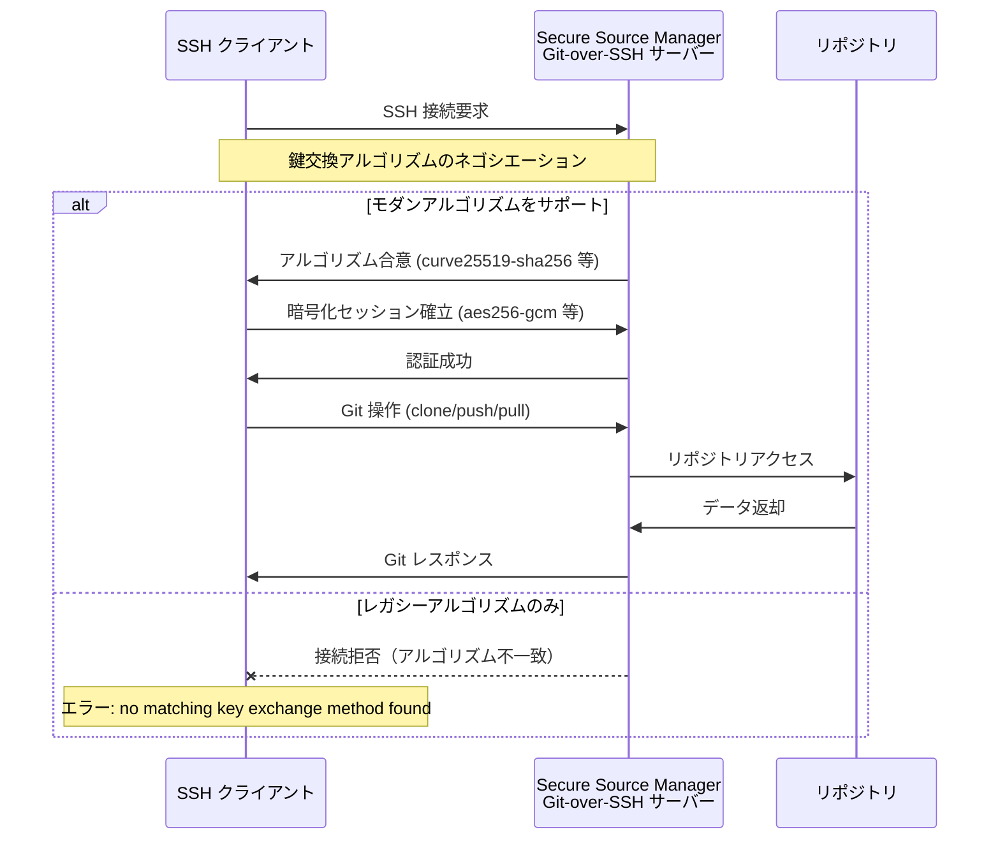

# Secure Source Manager: Git-over-SSH レガシーアルゴリズムのサポート廃止

**リリース日**: 2026-05-28

**サービス**: Secure Source Manager

**機能**: SSH サーバー構成におけるレガシー暗号アルゴリズムの削除

**ステータス**: Breaking Change

📊 [このアップデートのインフォグラフィックを見る](https://takech9203.github.io/google-cloud-news-summary/20260528-secure-source-manager-ssh-algorithms.html)

## 概要

Google Cloud Secure Source Manager の Git-over-SSH サーバー構成において、セキュリティ強化と潜在的な脆弱性（GHSA-3m6q-h5gj-7mrw）への対応として、複数のレガシーおよび安全でない SSH アルゴリズムのサポートが削除されました。これは破壊的変更（Breaking Change）であり、古い SSH クライアントを使用しているユーザーは即座に接続不能になる可能性があります。

この変更により、SSH クライアントは接続時にモダンなアルゴリズム（curve25519-sha256、aes256-gcm など）を少なくとも1つサポートしている必要があります。OpenSSH 7.3 以降を使用している場合は通常影響を受けませんが、古いバージョンや非標準の SSH クライアントを使用している環境では、Git 操作（clone、push、pull など）が失敗します。

Secure Source Manager はリージョナルにデプロイされるシングルテナントのマネージドソースコードリポジトリであり、HTTPS と SSH の両方の認証をサポートしています。今回の変更は SSH 認証のみに影響し、HTTPS 認証には影響しません。

**アップデート前の課題**

- レガシーな SSH アルゴリズム（SHA-1 ベースの鍵交換、CBC モード暗号など）がサポートされており、GHSA-3m6q-h5gj-7mrw などの脆弱性に対して潜在的なリスクが存在していた
- 古い暗号方式を使った中間者攻撃（MITM）や暗号解読のリスクがあった
- セキュリティポリシーの厳格化が不十分で、コンプライアンス要件を満たしにくい状況があった

**アップデート後の改善**

- モダンで安全な暗号アルゴリズムのみが許可され、既知の脆弱性に対する防御が強化された
- GHSA-3m6q-h5gj-7mrw で報告されたセキュリティリスクが解消された
- 暗号化通信のセキュリティレベルが業界標準に準拠し、コンプライアンス要件を満たしやすくなった

## アーキテクチャ図



SSH クライアントが Secure Source Manager に接続する際、サーバーはモダンなアルゴリズムのみを提示します。クライアントが対応するアルゴリズムを持たない場合、接続はネゴシエーション段階で拒否されます。

## サービスアップデートの詳細

### 主要機能

1. **鍵交換アルゴリズムの制限**
   - サポートされるアルゴリズムが `curve25519-sha256` と `diffie-hellman-group14-sha256` の2種類に限定
   - SHA-1 ベースの鍵交換（diffie-hellman-group1-sha1、diffie-hellman-group14-sha1 など）は廃止

2. **暗号化方式（Ciphers）の制限**
   - ChaCha20-Poly1305 および AES-CTR/GCM モードのみサポート
   - CBC モード暗号（aes128-cbc、aes256-cbc、3des-cbc など）は廃止

3. **MAC アルゴリズムの制限**
   - HMAC-SHA2-256 系（ETM モードを含む）のみサポート
   - HMAC-SHA1、HMAC-MD5 などのレガシー MAC は廃止

## 技術仕様

### サポートされる SSH アルゴリズム一覧

| カテゴリ | アルゴリズム | 説明 |
|----------|-------------|------|
| 鍵交換 | `curve25519-sha256` | 楕円曲線 Diffie-Hellman（最推奨） |
| 鍵交換 | `diffie-hellman-group14-sha256` | 2048-bit DH グループ 14 + SHA-256 |
| 暗号化 | `chacha20-poly1305@openssh.com` | ChaCha20 ストリーム暗号 + Poly1305 MAC |
| 暗号化 | `aes128-ctr` | AES 128-bit CTR モード |
| 暗号化 | `aes192-ctr` | AES 192-bit CTR モード |
| 暗号化 | `aes256-ctr` | AES 256-bit CTR モード |
| 暗号化 | `aes128-gcm@openssh.com` | AES 128-bit GCM（認証付き暗号） |
| 暗号化 | `aes256-gcm@openssh.com` | AES 256-bit GCM（認証付き暗号） |
| MAC | `hmac-sha2-256-etm@openssh.com` | HMAC-SHA2-256 Encrypt-then-MAC |
| MAC | `hmac-sha2-256` | HMAC-SHA2-256 |

### SSH クライアントバージョン互換性

| SSH クライアント | 最低互換バージョン | 備考 |
|-----------------|-------------------|------|
| OpenSSH | 7.3 以降 | curve25519-sha256 サポート |
| PuTTY | 0.68 以降 | ChaCha20-Poly1305 サポート |
| libssh | 0.8.0 以降 | モダンアルゴリズムサポート |
| Dropbear | 2018.76 以降 | curve25519 サポート |

## 設定方法

### 前提条件

1. Secure Source Manager インスタンスで SSH 認証を使用している
2. SSH クライアントがモダンアルゴリズムに対応している

### 手順

#### ステップ 1: SSH クライアントのバージョン確認

```bash
# OpenSSH のバージョンを確認
ssh -V
```

OpenSSH 7.3 以降であれば、デフォルト設定で今回のサポート対象アルゴリズムが使用可能です。

#### ステップ 2: サポートされるアルゴリズムの確認

```bash
# 現在の SSH クライアントがサポートする鍵交換アルゴリズムを確認
ssh -Q kex

# 現在の SSH クライアントがサポートする暗号化方式を確認
ssh -Q cipher

# 現在の SSH クライアントがサポートする MAC アルゴリズムを確認
ssh -Q mac
```

出力に `curve25519-sha256` または `diffie-hellman-group14-sha256` が含まれていれば、鍵交換は問題ありません。

#### ステップ 3: 接続テスト

```bash
# Secure Source Manager への SSH 接続テスト
ssh -T -v INSTANCE_ID-PROJECT_NUMBER-ssh.LOCATION.sourcemanager.dev
```

verbose モード（`-v`）で接続し、ネゴシエーションされたアルゴリズムを確認します。

#### ステップ 4: SSH 設定の明示的指定（必要な場合）

```bash
# ~/.ssh/config に以下を追加（特定のアルゴリズムを明示する場合）
Host *.sourcemanager.dev
    KexAlgorithms curve25519-sha256,diffie-hellman-group14-sha256
    Ciphers chacha20-poly1305@openssh.com,aes256-gcm@openssh.com,aes128-gcm@openssh.com,aes256-ctr,aes192-ctr,aes128-ctr
    MACs hmac-sha2-256-etm@openssh.com,hmac-sha2-256
```

#### ステップ 5: SSH クライアントのアップデート（非互換の場合）

```bash
# Ubuntu/Debian
sudo apt-get update && sudo apt-get install openssh-client

# CentOS/RHEL
sudo yum update openssh-clients

# macOS (Homebrew)
brew install openssh
```

## メリット

### ビジネス面

- **コンプライアンス強化**: NIST SP 800-131A や FedRAMP などのセキュリティ基準に準拠したアルゴリズムのみを使用することで、監査要件を満たしやすくなる
- **リスク低減**: 既知の脆弱性（GHSA-3m6q-h5gj-7mrw）への対応により、ソースコードの機密性が強化され、情報漏洩リスクが低減

### 技術面

- **前方秘匿性（Forward Secrecy）**: curve25519-sha256 や diffie-hellman-group14-sha256 は完全前方秘匿性を提供し、過去の通信が将来的に解読されるリスクを排除
- **認証付き暗号（AEAD）**: AES-GCM や ChaCha20-Poly1305 は暗号化と認証を一体化し、パディングオラクル攻撃などを防止
- **Encrypt-then-MAC**: ETM 方式の MAC により、暗号文の改ざん検知が暗号化解除前に行われ、より堅牢なセキュリティを実現

## デメリット・制約事項

### 制限事項

- OpenSSH 7.3 より古いバージョンを使用している環境では SSH 経由の Git 操作が不可能になる
- 一部のレガシー組み込みシステムやカスタム SSH クライアントでは対応が困難な場合がある
- CI/CD パイプラインで古い SSH クライアントを使用している場合、パイプラインが即座に失敗する

### 考慮すべき点

- **即時適用**: この変更は段階的な移行期間なく即座に適用されるため、事前の互換性確認が重要
- **代替手段**: SSH が使用できない場合は HTTPS 認証への切り替えを検討する必要がある
- **鍵の種類と暗号アルゴリズムの混同に注意**: Secure Source Manager は SSH 鍵タイプとして RSA、ECDSA、Ed25519 をサポートしているが、今回の変更はトランスポート層のアルゴリズムに関するものであり、鍵タイプとは別の問題

## ユースケース

### ユースケース 1: CI/CD パイプラインの互換性確認

**シナリオ**: GitHub Actions や Cloud Build から SSH 経由で Secure Source Manager のリポジトリにアクセスしている CI/CD パイプラインが突然失敗する。

**実装例**:
```bash
# CI/CD 環境の SSH バージョンを確認
ssh -V

# サポートされるアルゴリズムを確認
ssh -Q kex | grep -E "curve25519-sha256|diffie-hellman-group14-sha256"

# 接続テストを実行
ssh -T -o KexAlgorithms=curve25519-sha256 INSTANCE-PROJECT-ssh.REGION.sourcemanager.dev
```

**効果**: パイプライン障害の原因を迅速に特定し、SSH クライアントのアップデートまたは HTTPS への切り替えで復旧できる。

### ユースケース 2: エンタープライズ環境での一括対応

**シナリオ**: 大規模開発チームで多数の開発者が Secure Source Manager を使用しており、一部の開発者が古い OS やカスタム SSH クライアントを使用している。

**効果**: IT 部門が全社的に SSH クライアントのバージョンを確認し、`~/.ssh/config` の標準テンプレートを配布することで、統一的な対応が可能になる。アップデートが困難な端末については HTTPS 認証への移行を案内する。

### ユースケース 3: セキュリティ監査への対応

**シナリオ**: 情報セキュリティ監査において、ソースコード管理システムの暗号化通信に使用されるアルゴリズムの安全性を証明する必要がある。

**効果**: Secure Source Manager が業界標準のモダンアルゴリズムのみをサポートしていることを示すことで、監査要件を容易に満たすことができる。

## 関連サービス・機能

- **Cloud Source Repositories**: Google Cloud の別のソースコード管理サービス。同様に SSH 認証をサポートしており、RSA（2048-bit 以上）、ECDSA、Ed25519 の鍵タイプに対応
- **Developer Connect**: Secure Source Manager と統合可能な接続サービス。Git プロキシ機能を使用した HTTPS 経由のアクセスが可能で、SSH が使えない場合の代替手段として利用可能
- **Cloud Build**: Secure Source Manager のリポジトリと連携してビルドを自動実行。トリガーファイルまたは Webhook 経由で接続
- **Secret Manager**: SSH 秘密鍵の安全な保管に使用可能

## 参考リンク

- 📊 [インフォグラフィック](https://takech9203.github.io/google-cloud-news-summary/20260528-secure-source-manager-ssh-algorithms.html)
- [公式リリースノート](https://docs.cloud.google.com/release-notes#May_28_2026)
- [Secure Source Manager ドキュメント](https://docs.cloud.google.com/secure-source-manager/docs/overview)
- [SSH 認証の設定](https://docs.cloud.google.com/secure-source-manager/docs/ssh-keys)
- [Git SCM の使用](https://docs.cloud.google.com/secure-source-manager/docs/use-git)
- [GHSA-3m6q-h5gj-7mrw (セキュリティアドバイザリ)](https://github.com/advisories/GHSA-3m6q-h5gj-7mrw)

## まとめ

Secure Source Manager の Git-over-SSH サーバーからレガシー SSH アルゴリズムが削除され、モダンで安全なアルゴリズムのみがサポートされるようになりました。この破壊的変更は GHSA-3m6q-h5gj-7mrw への対応を含むセキュリティ強化策です。影響を受ける可能性があるユーザーは、SSH クライアントのバージョンを確認し、必要に応じてアップデートするか、HTTPS 認証への切り替えを検討してください。

---

**タグ**: #SecureSourceManager #SSH #セキュリティ #BreakingChange #暗号化 #Git #SourceCodeManagement #GoogleCloud
