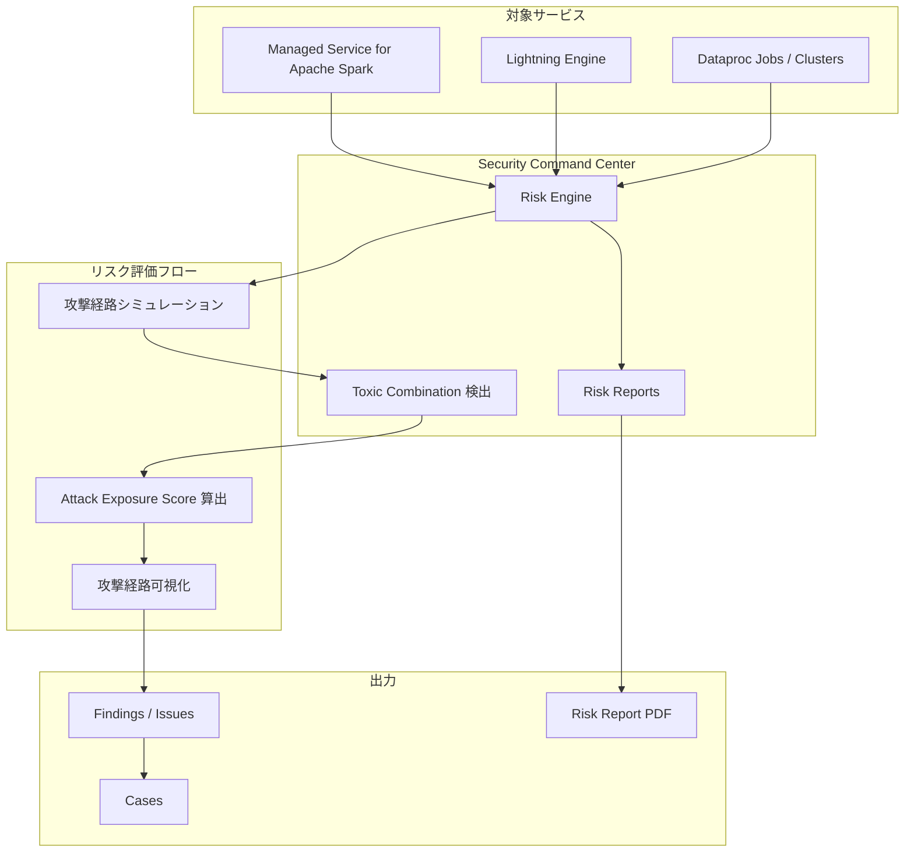

# Security Command Center: Risk Engine が Apache Spark 関連の Toxic Combination 検出に対応 + Risk Reports の更新

**リリース日**: 2026-05-28

**サービス**: Security Command Center

**機能**: Risk Engine detects toxic combinations for Apache Spark + Risk reports update

**ステータス**: Feature update

[このアップデートのインフォグラフィックを見る](https://takech9203.github.io/google-cloud-news-summary/20260528-security-command-center-risk-engine-spark.html)

## 概要

Security Command Center の Risk Engine が、Managed Service for Apache Spark（旧 Dataproc）に関連する Toxic Combination（有害な組み合わせ）の検出に対応しました。Lightning Engine を含む Apache Spark 環境に対して、攻撃経路シミュレーションによるリスク評価が可能になります。

また、Risk Reports（リスクレポート）が更新され、「Risk Engine introduction」セクションと「System attack exposure」セクションにより詳細なコンテンツが追加されました。これにより、組織のセキュリティ態勢をより包括的に把握し、経営層やセキュリティチームとの情報共有が容易になります。

本アップデートは、Apache Spark ワークロードを Google Cloud 上で運用する組織のセキュリティチーム、および Risk Reports を活用してリスク管理を行うセキュリティマネージャーを主な対象としています。

**アップデート前の課題**

- Risk Engine の攻撃経路シミュレーションが Managed Service for Apache Spark（旧 Dataproc）のリソースを対象に含んでおらず、Spark ワークロードに関連するセキュリティリスクの組み合わせを自動検出できなかった
- Lightning Engine を使用する Apache Spark 環境における複合的な脆弱性パターンが可視化されていなかった
- Risk Reports の「Risk Engine introduction」と「System attack exposure」セクションの情報が限定的で、リスク評価結果の全体像を把握しづらかった

**アップデート後の改善**

- Managed Service for Apache Spark（Lightning Engine 含む）に関連する Toxic Combination が自動検出されるようになり、Spark ワークロードのセキュリティリスクを包括的に評価可能に
- Apache Spark クラスタやジョブに対する攻撃経路の可視化が実現し、高価値リソースへの潜在的な攻撃ルートを特定可能に
- Risk Reports の内容が拡充され、Risk Engine の動作原理やシステム全体の攻撃露出状況をより詳細に把握可能に

## アーキテクチャ図



Risk Engine が Managed Service for Apache Spark のリソース情報を取り込み、攻撃経路シミュレーションを実行して Toxic Combination を検出する流れを示しています。検出結果は Findings や Cases として表示され、Risk Reports として PDF 出力も可能です。

## サービスアップデートの詳細

### 主要機能

1. **Managed Service for Apache Spark の Toxic Combination 検出**
   - Risk Engine の攻撃経路シミュレーションに Managed Service for Apache Spark（旧 Dataproc）が追加
   - Lightning Engine を含む Spark 環境のリソースが高価値リソースセットの対象に
   - 複数のセキュリティ問題が組み合わさることで生じる攻撃経路を自動的に検出

2. **Attack Exposure Score の算出**
   - Apache Spark 関連リソースに対する攻撃露出スコアを計算
   - スコアが 10 以上の場合は Critical、10 未満の場合は High の重大度が割り当て
   - 高価値リソースセット内の Spark リソースへの到達可能性を定量評価

3. **Risk Reports の拡充**
   - 「Risk Engine introduction」セクションに高価値リソースセットの構成状況、リスク露出の概要などが追加
   - 「System attack exposure」セクションに組織全体の露出スコア推移、プロジェクト別リスク分布などが追加
   - セキュリティ管理者向けにより包括的なリスクサマリーを提供

## 技術仕様

### Risk Engine がサポートする Google Cloud サービス一覧（更新後）

| カテゴリ | サービス |
|------|------|
| データ分析 | BigQuery, Managed Service for Apache Spark |
| コンピューティング | Compute Engine, Cloud Run, GKE |
| ストレージ | Cloud Storage |
| データベース | Cloud SQL |
| AI/ML | Gemini Enterprise Agent Platform |
| セキュリティ | Cloud KMS, IAM |
| ネットワーキング | Cloud Load Balancing, Cloud NAT, Cloud Router, VPC |
| CI/CD | Cloud Build, Artifact Registry |
| その他 | Cloud Run functions, Resource Manager |

### 高価値リソースセットに追加可能な Dataproc リソースタイプ

| リソースタイプ | 説明 |
|------|------|
| `dataproc.googleapis.com/Cluster` | Dataproc / Managed Service for Apache Spark クラスタ |
| `dataproc.googleapis.com/Job` | Dataproc / Managed Service for Apache Spark ジョブ |

### 必要な IAM ロール

```
roles/securitycenter.attackPathsViewer    # 攻撃経路の閲覧
roles/securitycenter.findingsViewer       # Findings の閲覧（Toxic Combination 含む）
roles/securitycenter.assetsViewer         # アセットの閲覧
roles/securitycenter.valuedResourcesViewer # 高価値リソースの閲覧
roles/securitycenter.riskReportsViewer    # Risk Reports のダウンロード
```

## メリット

### ビジネス面

- **データ分析基盤のリスク可視化**: Apache Spark を活用したデータ分析基盤に対する潜在的な攻撃リスクを定量的に把握でき、適切なセキュリティ投資判断が可能に
- **コンプライアンス対応の強化**: Risk Reports の拡充により、監査やコンプライアンスレビューに必要なセキュリティ態勢の文書化が容易に
- **経営層への説明力向上**: Risk Reports の PDF 出力を活用して、技術的なリスク情報を経営層に分かりやすく共有可能

### 技術面

- **攻撃面の包括的評価**: Spark ワークロードを含むエンドツーエンドの攻撃経路が可視化され、見落としていた脆弱性の組み合わせを発見可能
- **優先度に基づく修復**: Attack Exposure Score により、最もリスクの高い Toxic Combination から優先的に対処可能
- **Chokepoint の特定**: 複数の攻撃経路が収束するポイントを特定し、効率的な修復戦略を立案可能

## デメリット・制約事項

### 制限事項

- Risk Engine は組織レベルでの Security Command Center 有効化が必須（プロジェクトレベルでは利用不可）
- Premium または Enterprise サービスティアが必要
- 攻撃経路シミュレーションは約 6 時間ごとに実行されるため、リアルタイムでの検出ではない
- 組織内のアクティブなアセットが 26,000,000 件、アクティブな Findings が 250,000,000 件を超えるとシミュレーションが実行されない

### 考慮すべき点

- 高価値リソースセットには最大 1,000 個のリソースインスタンスを含めることが可能（クラウドサービスプロバイダーごと）
- リソース値の構成は組織ごとに最大 100 個まで作成可能
- Toxic Combination の検出結果に対する Pub/Sub 通知のトリガーとして Attack Exposure Score の変更は使用不可

## ユースケース

### ユースケース 1: データレイク環境のセキュリティ評価

**シナリオ**: 大規模なデータレイクを Managed Service for Apache Spark で運用している企業が、IAM の設定ミスとネットワーク構成の脆弱性が組み合わさることで、機密データへの不正アクセス経路が生じていないか評価したい。

**効果**: Risk Engine が Spark クラスタへのアクセス権限、ネットワーク設定、ストレージバケットのアクセス制御を総合的に分析し、Toxic Combination として検出。Attack Exposure Score により優先度を定量化し、修復手順を提示。

### ユースケース 2: 定期的なリスクレポートによる経営報告

**シナリオ**: CISO が月次の経営会議でクラウド環境のセキュリティ態勢を報告する必要がある。更新された Risk Reports を活用して、Risk Engine の概要やシステム全体の攻撃露出状況を包括的に共有したい。

**効果**: 拡充された「Risk Engine introduction」セクションでリスク評価の仕組みを説明し、「System attack exposure」セクションで露出スコアの推移やプロジェクト別リスク分布を視覚的に示すことで、技術的な内容を非技術者にも伝達可能。

## 料金

Security Command Center の Risk Engine 機能は、Premium または Enterprise サービスティアに含まれています。Toxic Combination 検出機能の利用に追加料金は発生しません。

| サービスティア | Toxic Combination | Risk Reports | 対応プラットフォーム |
|--------|-----------------|-----------------|-----------------|
| Premium | Google Cloud のみ | 利用可能 | Google Cloud |
| Enterprise | Google Cloud, AWS (Preview), Azure (Preview) | 利用可能 | マルチクラウド |

## 関連サービス・機能

- **Managed Service for Apache Spark（旧 Dataproc）**: 今回のアップデートで Risk Engine のシミュレーション対象に追加されたサービス。フルマネージドの Apache Spark 環境を提供
- **Security Command Center Premium/Enterprise**: Risk Engine を含む高度なセキュリティ機能を提供するサービスティア
- **Sensitive Data Protection**: データ機密性の分類結果を Risk Engine に連携し、高価値リソースの優先度を自動設定
- **Cloud Asset Inventory**: Risk Engine がシミュレーションに使用するリソースインベントリ情報を提供

## 参考リンク

- [インフォグラフィック](https://takech9203.github.io/google-cloud-news-summary/20260528-security-command-center-risk-engine-spark.html)
- [公式リリースノート](https://docs.cloud.google.com/release-notes#May_28_2026)
- [Attack Exposure Supported Features ドキュメント](https://docs.cloud.google.com/security-command-center/docs/attack-exposure-supported-features)
- [Risk Reports Overview ドキュメント](https://docs.cloud.google.com/security-command-center/docs/risk-reports-overview)
- [Toxic Combinations Overview](https://docs.cloud.google.com/security-command-center/docs/toxic-combinations-overview)
- [Security Command Center 料金ページ](https://cloud.google.com/security-command-center/pricing)

## まとめ

今回のアップデートにより、Managed Service for Apache Spark を利用する組織は、データ分析基盤に対する複合的なセキュリティリスクを Risk Engine で自動検出できるようになりました。また、Risk Reports の拡充によりセキュリティ態勢の全体像をより明確に把握し共有することが可能です。Apache Spark ワークロードを運用している組織は、高価値リソースセットに Spark クラスタやジョブを追加し、Toxic Combination の検出結果を確認することを推奨します。

---

**タグ**: #SecurityCommandCenter #RiskEngine #ToxicCombinations #ApacheSpark #Dataproc #LightningEngine #RiskReports #AttackExposure #セキュリティ
