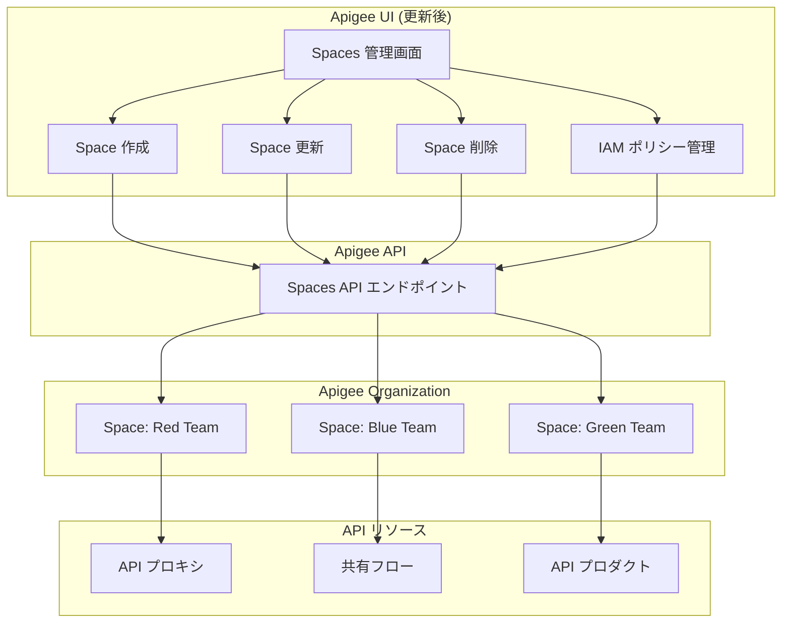

# Apigee X: Apigee UI での Spaces 管理機能の追加

**リリース日**: 2026-05-29

**サービス**: Apigee X

**機能**: Apigee UI での Spaces の作成・表示・更新・削除および IAM ポリシー管理

**ステータス**: GA (一般提供)

📊 [このアップデートのインフォグラフィックを見る](https://takech9203.github.io/google-cloud-news-summary/20260529-apigee-x-manage-spaces-ui.html)

## 概要

2026年5月29日、Google Cloud は Apigee UI のアップデートを発表し、Apigee Spaces の管理機能が UI から直接利用可能になりました。これにより、Spaces の作成、表示、更新、削除、および IAM (Identity and Access Management) ポリシーの管理を、Apigee のグラフィカルユーザーインターフェースから実行できるようになります。

Apigee Spaces は、Apigee 組織内で API リソース (API プロキシ、共有フロー、API プロダクト) をチーム単位で論理的にグループ化し、きめ細かな IAM 制御を実現する機能です。これまで Spaces 自体の管理操作は API 経由でのみ可能でしたが、今回のアップデートにより、開発者や管理者はコマンドラインツールを使用せずに、直感的な UI 操作で Spaces のライフサイクル全体を管理できるようになりました。

このアップデートは、複数チームが単一の Apigee 組織内で作業する大規模な組織に特に有益であり、API リソースのアクセス制御をより簡単に設定・管理できるようになります。

**アップデート前の課題**

これまでの Apigee UI では、Spaces に関する以下の操作が制限されていました。

- Spaces の作成・取得・更新・削除・一覧表示は API (curl コマンドなど) でのみ実行可能だった
- Spaces の IAM ポリシー管理 (メンバーの追加・削除、ロールの割り当て) も API 経由でのみ可能だった
- 非技術系の管理者やコマンドラインに不慣れなユーザーが Spaces を管理するためのハードルが高かった

**アップデート後の改善**

今回のアップデートにより、以下の操作が Apigee UI から直接実行可能になりました。

- Spaces の作成・表示・更新・削除を UI 上のフォームやボタン操作で完結できるようになった
- IAM ポリシーの設定 (メンバーの追加・削除、ロールの付与) が UI から直感的に管理可能になった
- API コマンドの知識がなくても、組織管理者が Spaces のライフサイクルを管理できるようになった

## アーキテクチャ図



Apigee UI から Spaces 管理画面を通じて、Apigee API を経由して組織内の各 Space およびそのリソースを管理するフローを示しています。

## サービスアップデートの詳細

### 主要機能

1. **Spaces の CRUD 操作の UI 対応**
   - Apigee UI から新しい Space を作成し、名前や表示名を設定可能
   - 既存の Space の詳細情報を表示し、設定を更新可能
   - 不要になった Space を UI から削除可能 (リソースが存在しない場合)

2. **IAM ポリシーの UI 管理**
   - Space に対するメンバーの追加・削除を UI から実行可能
   - IAM ロール (apigee.spaceContentEditor、apigee.spaceContentViewer など) の割り当てを視覚的に管理
   - グループ単位でのアクセス制御設定も UI から操作可能

3. **既存の API リソース管理との統合**
   - Space に関連付けられた API プロキシ、共有フロー、API プロダクトの一覧表示
   - Space フィルターを使用したリソースの絞り込み表示
   - Space 間のリソース管理の効率化

## 技術仕様

### Spaces 管理に必要な権限

| 操作 | 必要な権限 |
|------|------|
| Space の作成 | `apigee.spaces.create` |
| Space の更新 | `apigee.spaces.update` |
| Space の削除 | `apigee.spaces.delete` |
| Space の詳細取得 | `apigee.spaces.get` |
| Space の一覧表示 | `apigee.spaces.list` |
| IAM ポリシーの取得 | `apigee.spaces.getIamPolicy` |
| IAM ポリシーの設定 | `apigee.spaces.setIamPolicy` |

### Spaces 用の事前定義ロール

| ロール | 説明 | スコープ |
|------|------|------|
| `apigee.spaceContentEditor` | Space に関連付けられたリソースへのフルアクセスを提供 | Apigee Space |
| `apigee.spaceContentViewer` | Space に関連付けられたリソースへの読み取り専用アクセスを提供 | Apigee Space |
| `apigee.spaceConsoleUser` | Google Cloud コンソールで Space のリソースを管理するために必要な最小権限を提供 | Google Cloud プロジェクト |

### IAM ポリシー設定例

```json
{
  "policy": {
    "bindings": [
      {
        "members": ["user:developer@example.com", "group:api-team@example.com"],
        "role": "roles/apigee.spaceContentEditor"
      }
    ]
  }
}
```

## 設定方法

### 前提条件

1. Apigee Subscription または Pay-as-you-go 組織がプロビジョニングされていること
2. `apigee.admin` ロールまたは Apigee Organization Admin ロールが付与されていること
3. Apigee hybrid を使用する場合は、バージョン 1.13 以上であること

### 手順

#### ステップ 1: Apigee UI へのアクセス

Google Cloud コンソールから Apigee UI にアクセスし、Spaces 管理セクションに移動します。

#### ステップ 2: Space の作成

UI 上の作成フォームから以下の情報を入力して新しい Space を作成します。

- Space 名 (ID として使用される)
- 表示名 (オプション)

#### ステップ 3: IAM ポリシーの設定

作成した Space に対して、UI からメンバーを追加し、適切なロールを割り当てます。

- `apigee.spaceContentEditor` : リソースの作成・編集・削除が可能
- `apigee.spaceContentViewer` : リソースの読み取りのみ可能

#### ステップ 4: (参考) API からの操作

UI を使用せず API から Space を作成する場合は、以下のコマンドを使用します。

```bash
curl -X POST -H "Authorization: Bearer $TOKEN" -H "Content-Type: application/json" \
  "https://apigee.googleapis.com/v1/organizations/ORG_NAME/spaces" \
  --data-raw '{
    "name": "SPACE_NAME",
    "displayName": "DISPLAY_NAME"
  }'
```

## メリット

### ビジネス面

- **管理者の生産性向上**: コマンドラインの知識がなくても Spaces の管理が可能になり、非技術系の管理者でも操作できる
- **ガバナンスの強化**: 視覚的な IAM ポリシー管理により、アクセス制御の設定ミスを削減し、コンプライアンス対応を容易にする
- **オンボーディングの迅速化**: 新しいチームの Space セットアップが UI から簡単に行えるため、チームの立ち上げが高速化される

### 技術面

- **操作の簡素化**: curl コマンドや API リクエストの構築が不要になり、操作ミスが減少する
- **可視性の向上**: Space の一覧、メンバー構成、IAM ポリシーを一目で確認可能
- **一貫した管理体験**: API リソースの管理と Spaces の管理が同一の UI 内で完結する

## デメリット・制約事項

### 制限事項

- 1つの Apigee 組織あたり最大 20 Spaces まで作成可能
- API プロキシ、API プロダクト、共有フローのリスト操作は 10 QPS (クエリ毎秒) の制限あり
- Space を削除する前に、関連するすべてのリソースを削除する必要がある
- Apigee hybrid ユーザーはバージョン 1.13 以上が必須

### 考慮すべき点

- Space メンバーに API プロキシや共有フローのデプロイ/アンデプロイ権限を付与するには、Apigee 環境レベルまたはプロジェクトレベルで別途 `apigee.environment.admin` ロールの付与が必要
- Space レベルの IAM ポリシーは Google Cloud のリソース階層に従って継承されるため、組織レベルのポリシーとの相互作用を理解しておく必要がある

## ユースケース

### ユースケース 1: マルチチーム API 開発環境の構築

**シナリオ**: 大規模な組織で、フロントエンドチーム、バックエンドチーム、パートナーチームがそれぞれ独立した API プロキシを管理する必要がある場合。

**効果**: 各チーム用の Space を UI から素早く作成し、チームメンバーに適切な権限を割り当てることで、リソースの分離とアクセス制御を実現。管理者は各 Space の IAM ポリシーを視覚的に確認・変更できる。

### ユースケース 2: プロジェクトベースのリソース管理

**シナリオ**: 新規プロジェクトの開始時に、プロジェクトチーム専用の Space を作成し、プロジェクト終了時に Space をクリーンアップする。

**効果**: UI から Space のライフサイクル管理を簡単に行え、プロジェクトの開始・終了に合わせたリソースの組織化が容易になる。

### ユースケース 3: セキュリティ監査と権限レビュー

**シナリオ**: 定期的なセキュリティ監査で、各 Space に割り当てられたメンバーとロールを確認する必要がある場合。

**効果**: UI から各 Space の IAM ポリシーを一目で確認でき、不要なアクセス権限の特定と削除を迅速に実行可能。

## 料金

Apigee Spaces 機能自体には追加料金はかかりません。Apigee Spaces は Apigee Subscription および Pay-as-you-go 組織で利用可能です。Apigee の料金体系については、公式の料金ページを参照してください。

- [Apigee 料金ページ](https://cloud.google.com/apigee/pricing)

## 関連サービス・機能

- **Apigee API プロキシ**: Space に関連付けて管理される主要な API リソース
- **Apigee 共有フロー**: 複数の API プロキシ間で再利用可能なロジックフローで、Space 単位で管理可能
- **Apigee API プロダクト**: API のパッケージ化とアクセス制御の単位で、Space に関連付け可能
- **Cloud IAM (Identity and Access Management)**: Space レベルのアクセス制御の基盤となるサービス
- **Apigee hybrid**: オンプレミスまたはマルチクラウド環境での Apigee 実行環境 (バージョン 1.13 以上で Spaces 対応)

## 参考リンク

- 📊 [インフォグラフィック](https://takech9203.github.io/google-cloud-news-summary/20260529-apigee-x-manage-spaces-ui.html)
- [公式リリースノート](https://docs.cloud.google.com/release-notes#May_29_2026)
- [Apigee Spaces 概要](https://docs.cloud.google.com/apigee/docs/api-platform/system-administration/spaces/apigee-spaces-overview)
- [Spaces の作成と管理](https://docs.cloud.google.com/apigee/docs/api-platform/system-administration/spaces/create-spaces)
- [Spaces のロールと権限](https://docs.cloud.google.com/apigee/docs/api-platform/system-administration/spaces/spaces-roles-permissions)
- [Space リソースの管理](https://docs.cloud.google.com/apigee/docs/api-platform/system-administration/spaces/manage-space-resources)
- [Spaces の IAM 権限階層](https://docs.cloud.google.com/apigee/docs/api-platform/system-administration/spaces/iam-permission-hierarchy-spaces)
- [Apigee 料金](https://cloud.google.com/apigee/pricing)

## まとめ

今回のアップデートにより、Apigee Spaces の管理がコマンドライン操作不要で完結するようになり、API リソースのチーム単位での分離とアクセス制御がより手軽になりました。複数チームが 1 つの Apigee 組織を共有する環境では、管理者の負担軽減とガバナンス強化の両面で大きな効果が期待されます。まずは既存の Apigee 組織で Spaces 管理画面を確認し、チーム構成に合わせた Space の設計を検討することを推奨します。

---

**タグ**: #ApigeeX #Spaces #IAM #UI #API管理 #アクセス制御 #マルチチーム #GA
