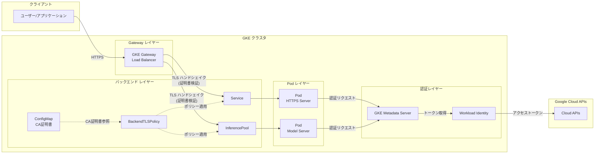

# Google Kubernetes Engine: Gateway バックエンド認証 TLS サポートと Workload Identity 接続問題

**リリース日**: 2026-05-29

**サービス**: Google Kubernetes Engine (GKE)

**機能**: Gateway バックエンド認証 TLS / Workload Identity 既知の問題

**ステータス**: Feature (GA) / Known Issue

📊 [このアップデートのインフォグラフィックを見る](https://takech9203.github.io/google-cloud-news-summary/20260529-gke-gateway-backend-tls-workload-identity.html)

## 概要

2026年5月29日、Google Kubernetes Engine (GKE) に関する2つの重要なアップデートが発表されました。1つ目は、GKE Gateway がバックエンド認証 TLS (Backend Authenticated TLS) を新たにサポートし、Gateway からバックエンド Pod や InferencePool への接続においてサーバー証明書の検証が可能になったことです。これにより、Gateway ロードバランサーとバックエンド間の通信セキュリティが大幅に強化されます。

2つ目は、GKE バージョン 1.35 以降において、Workload Identity を使用して Google Cloud API に認証するワークロードが、ノード起動直後に GKE メタデータサーバーへの一時的な接続タイムアウトまたは接続拒否を経験する可能性があるという既知の問題です。この問題は特にノードのスケールアップやローリングアップデート時に顕在化する可能性があり、運用上の注意が必要です。

バックエンド TLS 機能は、特に AI/ML 推論ワークロードにおいて InferencePool へのセキュアな接続を実現する重要な機能であり、GKE Inference Gateway を利用するユーザーにとって待望のアップデートとなります。一方、Workload Identity の既知の問題については、適切なワークアラウンドを適用することで影響を最小限に抑えることができます。

**アップデート前の課題**

- Gateway からバックエンド Pod への通信において、TLS ハンドシェイク時のサーバー証明書検証ができなかった
- InferencePool を使用した推論ワークロードへの通信でバックエンドの身元確認が不十分だった
- バックエンド TLS を利用できる GatewayClass が限定されていた
- GKE 1.35 にアップグレードしたクラスタでノード起動時の Workload Identity 認証失敗が発生する可能性があった

**アップデート後の改善**

- BackendTLSPolicy リソースを使用して、Gateway とバックエンド Pod 間の TLS 認証が設定可能になった
- Service、InferencePool、ServiceImport、GCPInferencePoolImport をターゲットとした BackendTLSPolicy の適用が可能になった
- 主要な5つの GatewayClass でバックエンド認証 TLS がサポートされた
- Workload Identity タイムアウト問題の公式ワークアラウンドが提供された

## アーキテクチャ図



上図は、GKE Gateway のバックエンド認証 TLS の構成と Workload Identity の認証フローを示しています。Gateway は BackendTLSPolicy で指定された CA 証明書を使用してバックエンド Pod の証明書を検証し、Pod は GKE メタデータサーバーを経由して Workload Identity で Google Cloud API に認証します。

## サービスアップデートの詳細

### 主要機能

1. **バックエンド認証 TLS (Backend Authenticated TLS)**
   - GKE Gateway ロードバランサーが接続先バックエンドの身元を TLS ハンドシェイク中に検証する機能
   - Gateway が TLS クライアントとして動作し、設定された信頼済み CA に対してバックエンドサーバーの証明書を検証
   - 新しい接続が確立されるたびに検証が実行され、Gateway が信頼されたバックエンドとのみ通信することを保証

2. **対応 GatewayClass**
   - `gke-l7-global-external-managed`: グローバル外部アプリケーションロードバランサー (シングルクラスタ)
   - `gke-l7-regional-external-managed`: リージョン外部アプリケーションロードバランサー (シングルクラスタ)
   - `gke-l7-rilb`: リージョン内部アプリケーションロードバランサー (シングルクラスタ)
   - `gke-l7-global-regional-managed-mc`: グローバル/リージョンマネージド (マルチクラスタ)
   - `gke-l7-global-external-managed-mc`: グローバル外部マネージド (マルチクラスタ)

3. **BackendTLSPolicy のターゲットリソース**
   - Service (`group: ""`): 標準的な Kubernetes Service
   - InferencePool (`group: "inference.networking.k8s.io"`): AI/ML 推論ワークロード用プール
   - ServiceImport (`group: "net.gke.io"`): マルチクラスタ Service
   - GCPInferencePoolImport (`group: "networking.gke.io"`): GCP 推論プールインポート

### 既知の問題: Workload Identity タイムアウト

1. **影響範囲**
   - GKE バージョン 1.35 以降のクラスタ
   - Workload Identity を使用して Google Cloud API に認証するすべてのワークロード
   - ノード起動直後の数秒間に発生

2. **症状**
   - GKE メタデータサーバーへの一時的な接続タイムアウト
   - 接続拒否 (Connection Refused) エラー
   - Pod 起動直後の認証失敗

3. **根本原因**
   - GKE メタデータサーバーが新しく作成された Pod 上でリクエストの受付を開始するまでに数秒を要する
   - ノード起動直後はメタデータサーバーの準備が完了していない状態でワークロードが認証を試行する

## 技術仕様

### BackendTLSPolicy フィールドリファレンス

| フィールド | 説明 |
|------|------|
| `targetRefs` | ポリシーを適用するバックエンドリソース。Service、InferencePool、ServiceImport、GCPInferencePoolImport をサポート |
| `validation.hostname` | Gateway が TLS ハンドシェイク時に使用するホスト名 (SNI) |
| `validation.subjectAltNames` | バックエンド証明書に対して検証する SAN (Hostname および URI/SPIFFE ID をサポート) |
| `validation.caCertificateRefs` | 同一 Namespace 内の ConfigMap リソースのリスト (最大8つ)。各 ConfigMap は `ca.crt` キーに PEM エンコードされた CA 証明書を含む |
| `validation.wellKnownCACertificates` | 自己管理 TrustConfig 使用時は `System` を設定 |
| `options` | GKE 固有オプション。`networking.gke.io/backend-trust-config` で外部 TrustConfig リソースを参照 |

### GatewayClass 対応マトリクス

| GatewayClass | ロードバランサータイプ | スコープ | バックエンド TLS 制限 |
|------|------|------|------|
| `gke-l7-global-external-managed` | グローバル外部 ALB | シングルクラスタ | Service と ServiceImport のみ |
| `gke-l7-regional-external-managed` | リージョン外部 ALB | シングルクラスタ | 全ターゲットタイプ対応 |
| `gke-l7-rilb` | リージョン内部 ALB | シングルクラスタ | 全ターゲットタイプ対応 |
| `gke-l7-global-external-managed-mc` | グローバル外部 ALB | マルチクラスタ | Service と ServiceImport のみ |
| `gke-l7-global-regional-managed-mc` | グローバル/リージョン管理 | マルチクラスタ | 全ターゲットタイプ対応 |

## 設定方法

### 前提条件

1. GKE クラスタがバックエンド TLS をサポートするバージョンで稼働していること
2. バックエンド Pod が HTTPS サーバーを実行していること (対象 Service または InferencePool のポートで)
3. CA 証明書が PEM 形式で準備されていること

### 手順

#### ステップ 1: CA 証明書を ConfigMap として作成

```yaml
apiVersion: v1
kind: ConfigMap
metadata:
  name: my-backend-ca
data:
  ca.crt: |
    -----BEGIN CERTIFICATE-----
    <PEM エンコードされた CA 証明書データ>
    -----END CERTIFICATE-----
```

ConfigMap は BackendTLSPolicy と同じ Namespace に作成する必要があります。1つの ConfigMap には1つの CA 証明書のみを含めてください。

#### ステップ 2: Service をターゲットとした BackendTLSPolicy の作成

```yaml
apiVersion: gateway.networking.k8s.io/v1
kind: BackendTLSPolicy
metadata:
  name: secure-backend-policy
spec:
  targetRefs:
    - group: ""
      kind: Service
      name: my-service-name
  validation:
    hostname: "backend.example.com"
    caCertificateRefs:
      - group: ""
        kind: ConfigMap
        name: my-backend-ca
```

#### ステップ 3: InferencePool をターゲットとした BackendTLSPolicy の作成

```yaml
apiVersion: gateway.networking.k8s.io/v1
kind: BackendTLSPolicy
metadata:
  name: secure-backend-policy-inferencepool
spec:
  targetRefs:
    - group: "inference.networking.k8s.io"
      kind: InferencePool
      name: my-inference-pool
  validation:
    hostname: "backend.example.com"
    caCertificateRefs:
      - group: ""
        kind: ConfigMap
        name: my-backend-ca
```

#### ステップ 4: ポリシーの適用状態を確認

```bash
kubectl describe backendtlspolicy secure-backend-policy
```

`Status.Ancestors` セクションに `Accepted` と `ResolvedRefs` の条件が `Status: "True"` で表示されることを確認します。

### Workload Identity タイムアウト問題のワークアラウンド

#### 方法 1: initContainer を使用してメタデータサーバーの準備を待機

```yaml
apiVersion: v1
kind: Pod
metadata:
  name: pod-with-initcontainer
spec:
  serviceAccountName: <KSA_NAME>
  initContainers:
    - image: gcr.io/google.com/cloudsdktool/cloud-sdk:alpine
      name: workload-identity-initcontainer
      command:
        - '/bin/bash'
        - '-c'
        - |
          curl -sS -H 'Metadata-Flavor: Google' \
            'http://169.254.169.254/computeMetadata/v1/instance/service-accounts/default/token' \
            --retry 30 --retry-connrefused --retry-max-time 60 \
            --connect-timeout 3 --fail --retry-all-errors > /dev/null \
            && exit 0 \
            || echo 'Retry limit exceeded. Failed to wait for metadata server.' >&2; exit 1
  containers:
    - image: gcr.io/your-project/your-image
      name: your-main-application-container
```

#### 方法 2: アプリケーションコード内でリトライロジックを実装

アプリケーション起動時に数秒間待機し、認証リクエストをリトライするロジックを実装します。

#### 方法 3: Google Cloud クライアントライブラリを最新バージョンに更新

最新のクライアントライブラリには、メタデータサーバーへの接続リトライ機能が組み込まれています。

## メリット

### ビジネス面

- **コンプライアンス強化**: バックエンド TLS 認証によりゼロトラストセキュリティモデルの実装が可能になり、規制要件への準拠が容易になる
- **AI/ML ワークロードの保護**: InferencePool をターゲットとした TLS 認証により、推論サービスへの通信を暗号化し、モデルデータの機密性を確保
- **マルチクラスタ対応**: マルチクラスタ GatewayClass のサポートにより、分散環境でも一貫したセキュリティポリシーを適用可能

### 技術面

- **標準 Gateway API 準拠**: BackendTLSPolicy は Gateway API 標準に準拠しており、ポータビリティが高い
- **柔軟な証明書管理**: ConfigMap ベース (標準) と TrustConfig ベース (高度な設定) の2つの方法をサポート
- **きめ細かな検証**: SAN (Subject Alternative Name) による検証で SPIFFE ID なども利用可能
- **InferencePool 統合**: GKE Inference Gateway との統合により、AI 推論ワークロードのエンドツーエンドセキュリティを実現

## デメリット・制約事項

### 制限事項

- `gke-l7-global-external-managed` と `gke-l7-global-external-managed-mc` では Service と ServiceImport バックエンドのみサポート (InferencePool は非対応)
- BackendTLSPolicy はターゲットリソースと同一 Namespace に配置する必要がある (クロスネームスペース参照は不可)
- `caCertificateRefs` で参照可能な ConfigMap は最大8つまで
- `wellKnownCACertificates: "System"` と `caCertificateRefs` を同一オブジェクトで同時に使用することはできない
- バックエンド Pod が HTTPS サーバーを実行している必要がある

### 考慮すべき点

- GKE 1.35 以降では Workload Identity のタイムアウト問題が発生する可能性があり、ノードスケーリング時に一時的な認証失敗が起こりうる
- TrustConfig を使用する場合、Gateway と同じプロジェクト・ロケーションに作成する必要がある
- 複数の Gateway から Service が使用される場合、各ロケーションに同名の TrustConfig を作成する必要がある

## ユースケース

### ユースケース 1: AI 推論サービスのセキュア化

**シナリオ**: 社内の LLM 推論サービスを GKE Inference Gateway 経由で提供しており、Gateway からモデルサーバーへの通信を暗号化・認証したい。

**実装例**:
```yaml
apiVersion: inference.networking.k8s.io/v1
kind: InferencePool
metadata:
  name: llm-inference-pool
spec:
  selector:
    matchLabels:
      app: vllm-server
  targetPorts:
    - number: 8443
---
apiVersion: gateway.networking.k8s.io/v1
kind: BackendTLSPolicy
metadata:
  name: llm-backend-tls
spec:
  targetRefs:
    - group: "inference.networking.k8s.io"
      kind: InferencePool
      name: llm-inference-pool
  validation:
    hostname: "llm.internal.example.com"
    caCertificateRefs:
      - group: ""
        kind: ConfigMap
        name: llm-ca-cert
```

**効果**: Gateway と推論サーバー間の通信がTLS で保護され、中間者攻撃のリスクを排除。モデルへのリクエストとレスポンスの機密性を確保。

### ユースケース 2: Workload Identity タイムアウトへの対策

**シナリオ**: GKE 1.35 クラスタで Workload Identity を使用するマイクロサービスが、ノードのオートスケーリング時に認証エラーを経験している。

**実装例**:
```yaml
apiVersion: apps/v1
kind: Deployment
metadata:
  name: my-microservice
spec:
  template:
    spec:
      serviceAccountName: my-ksa
      initContainers:
        - name: wait-for-metadata
          image: gcr.io/google.com/cloudsdktool/cloud-sdk:alpine
          command:
            - '/bin/bash'
            - '-c'
            - |
              curl -sS -H 'Metadata-Flavor: Google' \
                'http://169.254.169.254/computeMetadata/v1/instance/service-accounts/default/token' \
                --retry 30 --retry-connrefused --retry-max-time 60 \
                --connect-timeout 3 --fail --retry-all-errors > /dev/null && exit 0 || exit 1
      containers:
        - name: app
          image: my-app:latest
```

**効果**: initContainer がメタデータサーバーの準備完了を確認してからメインコンテナが起動するため、認証失敗を防止。

### ユースケース 3: マルチクラスタ環境でのエンドツーエンド暗号化

**シナリオ**: 複数のリージョンに分散した GKE クラスタで、マルチクラスタ Gateway を使用してサービスを公開しており、すべてのバックエンド通信を暗号化したい。

**実装例**:
```yaml
apiVersion: gateway.networking.k8s.io/v1
kind: BackendTLSPolicy
metadata:
  name: multi-cluster-backend-tls
spec:
  targetRefs:
    - group: "net.gke.io"
      kind: ServiceImport
      name: my-service-import
  validation:
    hostname: "service.internal.example.com"
    subjectAltNames:
      - type: Hostname
        name: "*.internal.example.com"
    caCertificateRefs:
      - group: ""
        kind: ConfigMap
        name: internal-ca-cert
```

**効果**: マルチクラスタ環境でも一貫したバックエンド TLS ポリシーを適用し、クラスタ間通信のセキュリティを確保。

## 料金

バックエンド認証 TLS 機能自体には追加料金は発生しません。ただし、以下のコストが関連します:

| 項目 | 料金 |
|--------|------|
| GKE Gateway (Application Load Balancer) | ロードバランサーの種類に応じた標準料金 |
| Certificate Manager (TrustConfig 使用時) | Certificate Manager の標準料金 |
| GKE クラスタ | クラスタ管理費 + ノード費用 |

## 利用可能リージョン

- **グローバル GatewayClass** (`gke-l7-global-external-managed`, `gke-l7-global-external-managed-mc`): すべてのリージョンで利用可能
- **リージョン GatewayClass** (`gke-l7-regional-external-managed`, `gke-l7-rilb`): GKE がサポートするすべてのリージョンで利用可能
- **Workload Identity 既知の問題**: GKE 1.35 以降を実行するすべてのリージョンのクラスタに影響

## 関連サービス・機能

- **GKE Inference Gateway**: AI/ML 推論ワークロード向けの Gateway 拡張。InferencePool と BackendTLSPolicy の組み合わせでセキュアな推論サービスを構築
- **Certificate Manager**: TrustConfig リソースを管理し、高度な証明書検証シナリオ (証明書許可リストなど) をサポート
- **Workload Identity Federation for GKE**: Pod から Google Cloud API への認証を提供。バージョン 1.35 でのタイムアウト問題に注意が必要
- **Cloud Service Mesh / Istio**: サービスメッシュ環境では istio-proxy との相互作用に注意。`holdApplicationUntilProxyStarts` アノテーションの使用を推奨
- **Gateway API Inference Extension**: InferencePool、InferenceObjective などの CRD を定義する OSS プロジェクト

## 参考リンク

- 📊 [インフォグラフィック](https://takech9203.github.io/google-cloud-news-summary/20260529-gke-gateway-backend-tls-workload-identity.html)
- [公式リリースノート](https://cloud.google.com/release-notes#May_29_2026)
- [Gateway のバックエンド TLS 設定ドキュメント](https://docs.cloud.google.com/kubernetes-engine/docs/how-to/secure-gateway)
- [Workload Identity トラブルシューティング](https://docs.cloud.google.com/kubernetes-engine/docs/troubleshooting/authentication#troubleshoot-timeout)
- [GKE Inference Gateway の概要](https://docs.cloud.google.com/kubernetes-engine/docs/concepts/about-gke-inference-gateway)
- [GatewayClass 機能一覧](https://docs.cloud.google.com/kubernetes-engine/docs/how-to/gatewayclass-capabilities)

## まとめ

今回のアップデートにより、GKE Gateway のセキュリティが大幅に強化され、特に AI/ML 推論ワークロードにおけるバックエンド通信の保護が容易になりました。BackendTLSPolicy を活用することで、Gateway API の標準に準拠した形でゼロトラストアーキテクチャを実現できます。一方、GKE 1.35 以降では Workload Identity のタイムアウト問題に注意が必要であり、initContainer によるメタデータサーバー待機パターンの適用を推奨します。

---

**タグ**: #GKE #Gateway #TLS #BackendTLS #Security #InferencePool #WorkloadIdentity #KnownIssue #Kubernetes #ZeroTrust #AI #ML #Inference
