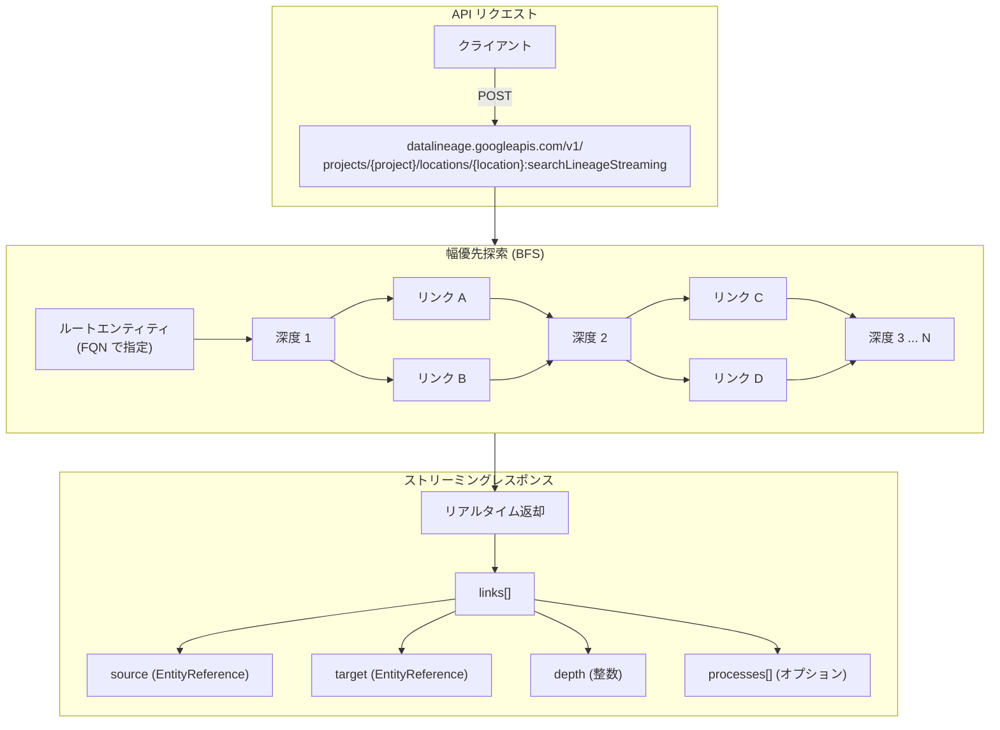

# Knowledge Catalog (旧 Dataplex): Data Lineage API searchLineageStreaming メソッド

**リリース日**: 2026-05-29

**サービス**: Knowledge Catalog (旧 Dataplex)

**機能**: Data Lineage API searchLineageStreaming メソッド

**ステータス**: Preview

📊 [このアップデートのインフォグラフィックを見る](https://takech9203.github.io/google-cloud-news-summary/20260529-knowledge-catalog-lineage-streaming-api.html)

## 概要

Google Cloud の Knowledge Catalog (旧 Dataplex) において、Data Lineage API に `searchLineageStreaming` メソッドが追加されました。このメソッドは、指定されたアセットの Fully Qualified Name (FQN) を起点として、幅優先探索 (BFS: Breadth-First Search) によりリネージリンクをストリーミング形式で取得する機能を提供します。

従来の `searchLinks` メソッドでは単一レベルのリネージ検索のみが可能でしたが、`searchLineageStreaming` は複数レベル、複数リージョン、複数プロジェクトにまたがるリネージグラフの探索を一度のリクエストで実行できます。ストリーミングレスポンスにより、大規模なリネージグラフでもタイムアウトすることなく効率的に結果を取得できます。

このメソッドは、データエンジニア、データガバナンス担当者、プラットフォームチームなど、データの流れを包括的に把握する必要があるユーザーを対象としています。特に影響分析やコンプライアンス監査において、データパイプライン全体の依存関係を瞬時に可視化できることが大きな価値となります。

**アップデート前の課題**

- `searchLinks` メソッドでは単一レベルのリネージしか取得できず、多段階のデータ変換を追跡するには複数回の API 呼び出しが必要だった
- 大規模なリネージグラフの探索ではリクエストタイムアウトが発生する可能性があった
- 複数プロジェクト・複数リージョンにまたがるリネージの統合的な検索が困難だった
- カラムレベルのリネージとテーブルレベルのリネージを同時に取得する手段が限定的だった

**アップデート後の改善**

- 幅優先探索により最大深度 100 までのマルチレベルリネージを一度のリクエストで取得可能に
- ストリーミングレスポンスにより、リンクが発見され次第リアルタイムで返却されるためタイムアウトを回避
- 複数リージョン・複数プロジェクトを横断したリネージグラフの自動探索が可能に
- ワイルドカードによるカラムレベルリネージの一括取得をサポート
- パイプライン (プロセス) のメタデータもオプションで取得可能に

## アーキテクチャ図



`searchLineageStreaming` はルートエンティティから幅優先探索を実行し、各深度のリネージリンクを発見次第ストリーミングレスポンスとして返却します。探索方向は上流 (UPSTREAM) または下流 (DOWNSTREAM) を指定可能です。

## サービスアップデートの詳細

### 主要機能

1. **幅優先探索 (Breadth-First Search)**
   - リネージグラフをレイヤーごとに探索し、各リンクの深度を正確に算出
   - 探索方向は `UPSTREAM` (上流) または `DOWNSTREAM` (下流) を指定
   - 最大深度 100 まで設定可能 (デフォルト: 5)

2. **ストリーミングレスポンス**
   - バックエンドがリネージリンクを発見次第、リアルタイムでサブグラフを返却
   - 広範囲または深いリネージグラフでも効率的にデータを取得
   - リクエストタイムアウトの回避に効果的

3. **マルチロケーション・マルチプロジェクト横断探索**
   - リクエストパスで指定するのは 1 つの課金プロジェクトのみ
   - `locations` パラメータに複数のリージョンを指定することで横断的に探索
   - 適切な権限があれば複数プロジェクトのリネージを自動的に発見

4. **カラムレベルリネージ (CLL)**
   - テーブルレベルだけでなくカラム単位の依存関係を追跡
   - FQN にワイルドカード (`*`) を付与することでエンティティの全カラムリネージを一括取得
   - テーブルレベルとカラムレベルの同時検索も可能

5. **パイプラインインサイト**
   - `limits.maxProcessPerLink` を設定することでリンクを生成したプロセス情報を取得
   - FieldMask を使用して `displayName`、`system` 属性などの完全なプロセスメタデータを取得可能

## 技術仕様

### API エンドポイント

| 項目 | 詳細 |
|------|------|
| サービス名 | `datalineage.googleapis.com` |
| HTTP メソッド | POST |
| エンドポイント | `https://datalineage.googleapis.com/v1/{parent}:searchLineageStreaming` |
| parent 形式 | `projects/{project}/locations/{location}` |
| OAuth スコープ | `cloud-platform`, `datalineage.readonly`, `datalineage.read-write` |
| IAM 権限 | `datalineage.locations.searchLinks` (エンティティレベル), `datalineage.events.getFields` (カラムレベル) |

### リクエストボディ

| フィールド | 型 | 必須 | 説明 |
|------------|------|------|------|
| `locations[]` | string | 必須 | 検索対象のロケーション一覧 |
| `rootCriteria` | object | 必須 | 検索のルートとなるエンティティ条件 |
| `direction` | enum | 必須 | `UPSTREAM` または `DOWNSTREAM` |
| `filters` | object | 任意 | 検索フィルタ (依存タイプ、エンティティセット、時間範囲) |
| `limits` | object | 任意 | 検索制限パラメータ |

### SearchLimits パラメータ

| パラメータ | デフォルト | 最大値 | 説明 |
|-----------|-----------|--------|------|
| `maxDepth` | 5 | 100 | 探索の最大深度 |
| `maxResults` | 1,000 | 10,000 | 返却するリンクの最大数 |
| `maxProcessPerLink` | 0 | 100 | リンクあたりのプロセス最大数 |

### レスポンス構造

```json
{
  "links": [
    {
      "source": { "fullyQualifiedName": "bigquery:project.dataset.source_table" },
      "target": { "fullyQualifiedName": "bigquery:project.dataset.target_table" },
      "processes": [{ "process": { "name": "projects/.../processes/..." } }],
      "dependencyInfo": [{ "dependencyType": "EXACT_COPY" }],
      "depth": 1,
      "location": "us"
    }
  ],
  "unreachable": []
}
```

## 設定方法

### 前提条件

1. Data Lineage API が有効化されていること
2. 適切な IAM ロール (`roles/datalineage.viewer` 以上) が付与されていること
3. エンティティレベルのリネージ: `datalineage.events.get` 権限
4. カラムレベルのリネージ: `datalineage.events.getFields` 権限

### 手順

#### ステップ 1: API の有効化

```bash
gcloud services enable datalineage.googleapis.com --project=PROJECT_ID
```

#### ステップ 2: 下流リネージの検索 (基本)

```bash
curl -H "Authorization: Bearer $(gcloud auth print-access-token)" \
  -H "Content-Type: application/json" \
  -X POST https://datalineage.googleapis.com/v1/projects/my-project/locations/us:searchLineageStreaming \
  --data '{
    "parent": "projects/my-project/locations/us",
    "locations": ["us"],
    "rootCriteria": {
      "entities": {
        "entities": [{
          "fullyQualifiedName": "bigquery:my-project.dataset.source_table"
        }]
      }
    },
    "direction": "DOWNSTREAM"
  }'
```

#### ステップ 3: マルチリージョン・深層探索

```bash
curl -H "Authorization: Bearer $(gcloud auth print-access-token)" \
  -H "Content-Type: application/json" \
  -X POST https://datalineage.googleapis.com/v1/projects/my-project/locations/us:searchLineageStreaming \
  --data '{
    "parent": "projects/my-project/locations/us",
    "locations": ["us", "us-east1", "europe-west1"],
    "rootCriteria": {
      "entities": {
        "entities": [{
          "fullyQualifiedName": "bigquery:my-project.dataset.source_table"
        }]
      }
    },
    "direction": "DOWNSTREAM",
    "limits": {
      "maxDepth": 10,
      "maxResults": 5000,
      "maxProcessPerLink": 5
    }
  }'
```

#### ステップ 4: カラムレベルリネージの取得 (ワイルドカード)

```bash
curl -H "Authorization: Bearer $(gcloud auth print-access-token)" \
  -H "Content-Type: application/json" \
  -X POST https://datalineage.googleapis.com/v1/projects/my-project/locations/us:searchLineageStreaming \
  --data '{
    "parent": "projects/my-project/locations/us",
    "locations": ["us"],
    "rootCriteria": {
      "entities": {
        "entities": [{
          "fullyQualifiedName": "bigquery:my-project.dataset.my_table",
          "field": ["*"]
        }]
      }
    },
    "direction": "DOWNSTREAM"
  }'
```

## メリット

### ビジネス面

- **影響分析の迅速化**: スキーマ変更やテーブル削除の前に、下流への影響範囲を即座に特定できるため、計画外のダウンタイムや障害を防止
- **コンプライアンス対応**: データの出自と変換履歴を完全に追跡でき、規制要件 (GDPR、SOC2 など) への対応を支援
- **データ品質管理**: 問題のあるデータソースから影響を受ける全てのダウンストリームアセットを特定し、品質問題の波及範囲を即時把握

### 技術面

- **タイムアウト回避**: ストリーミングレスポンスにより、大規模グラフでもリクエストが途中で切断されるリスクを排除
- **API 呼び出し回数の削減**: 従来の `searchLinks` を複数回呼び出す必要がなくなり、単一リクエストでマルチレベルリネージを取得
- **きめ細かい制御**: `maxDepth`、`maxResults`、フィルタ (依存タイプ、時間範囲) により、必要な範囲のみを効率的に取得
- **クロスプロジェクト対応**: 組織内の複数プロジェクトにまたがるデータパイプラインの全体像を単一 API コールで把握

## デメリット・制約事項

### 制限事項

- 現在 **Preview** ステータスであり、GA (一般提供) 前の「Pre-GA Offerings Terms」が適用される
- `maxDepth` の上限は 100、`maxResults` の上限は 10,000
- レスポンスの `unreachable` フィールドに到達不能なリソースが含まれる場合、結果セットが不完全な可能性がある
- カラムレベルリネージには追加の権限 (`datalineage.events.getFields`) が必要
- Data Lineage API は CMEK (顧客管理暗号鍵) をサポートしていない

### 考慮すべき点

- Preview 機能のため、サポートが限定的であり、本番ワークロードでの利用は慎重に検討が必要
- リクエストパスの `parent` とリクエストボディ内の `parent` プロパティが一致している必要がある
- 大規模なリネージグラフでは `maxResults` の設定に注意し、不要なデータ転送を避けること

## ユースケース

### ユースケース 1: スキーマ変更の影響分析

**シナリオ**: BigQuery のソーステーブルからカラムを削除する前に、そのカラムに依存する全ての下流テーブルやダッシュボードを特定したい。

**実装例**:
```bash
curl -H "Authorization: Bearer $(gcloud auth print-access-token)" \
  -H "Content-Type: application/json" \
  -X POST https://datalineage.googleapis.com/v1/projects/my-project/locations/us:searchLineageStreaming \
  --data '{
    "parent": "projects/my-project/locations/us",
    "locations": ["us"],
    "rootCriteria": {
      "entities": {
        "entities": [{
          "fullyQualifiedName": "bigquery:my-project.dataset.source_table",
          "field": ["email"]
        }]
      }
    },
    "direction": "DOWNSTREAM",
    "limits": { "maxDepth": 20 }
  }'
```

**効果**: カラム削除によって破損する可能性のある Looker ダッシュボードや下流テーブルを事前に特定し、安全なスキーマ変更を実現。

### ユースケース 2: データ品質問題のルート原因分析

**シナリオ**: 下流のレポートでデータ品質の問題が報告された。問題の発生源を特定するために上流を遡り、データの出自を確認したい。

**実装例**:
```bash
curl -H "Authorization: Bearer $(gcloud auth print-access-token)" \
  -H "Content-Type: application/json" \
  -X POST https://datalineage.googleapis.com/v1/projects/my-project/locations/us:searchLineageStreaming \
  --data '{
    "parent": "projects/my-project/locations/us",
    "locations": ["us", "us-east1"],
    "rootCriteria": {
      "entities": {
        "entities": [{
          "fullyQualifiedName": "bigquery:my-project.analytics.report_table"
        }]
      }
    },
    "direction": "UPSTREAM",
    "limits": { "maxDepth": 15, "maxProcessPerLink": 3 }
  }'
```

**効果**: 問題のあるレポートテーブルから上流に遡り、どの変換プロセスがデータを加工したかを含めて完全なデータフローを可視化。

### ユースケース 3: マルチリージョンのデータガバナンス監査

**シナリオ**: 組織のデータガバナンスポリシーに基づき、特定の機密データが複数リージョンにわたってどのように流通しているかを監査したい。

**効果**: 単一の API コールで複数リージョン・プロジェクトを横断したデータフローの全体像を把握し、データレジデンシー要件の遵守を確認。

## 関連サービス・機能

- **Knowledge Catalog (旧 Dataplex)**: データリネージ機能の母体となるデータガバナンスサービス
- **BigQuery**: リネージ追跡の主要なデータソースおよびデスティネーション
- **Cloud Data Fusion**: パイプライン実行時のリネージ自動記録に対応
- **Looker**: セマンティックレイヤーを通じたリネージ統合を提供
- **Vertex AI**: ML パイプラインのデータリネージ可視化に対応
- **searchLinks API**: 単一レベルのリネージ検索を行う従来のメソッド (本メソッドはその拡張版)

## 参考リンク

- 📊 [インフォグラフィック](https://takech9203.github.io/google-cloud-news-summary/20260529-knowledge-catalog-lineage-streaming-api.html)
- [公式リリースノート](https://docs.cloud.google.com/release-notes#May_29_2026)
- [searchLineageStreaming API リファレンス (REST)](https://docs.cloud.google.com/dataplex/docs/reference/data-lineage/rest/v1/projects.locations/searchLineageStreaming)
- [searchLineageStreaming 使用ガイド](https://docs.cloud.google.com/dataplex/docs/search-lineage-streaming-api)
- [Data Lineage API 概要](https://docs.cloud.google.com/dataplex/docs/reference/data-lineage/rest)
- [データリネージの表示](https://docs.cloud.google.com/dataplex/docs/use-lineage)

## まとめ

Knowledge Catalog の Data Lineage API に追加された `searchLineageStreaming` メソッドは、マルチレベル・マルチリージョンのデータリネージ探索を単一のストリーミング API コールで実現する重要な機能強化です。従来は複数回の API 呼び出しと手動での結果統合が必要だったデータフローの全体把握が、BFS ベースの探索と制御パラメータにより大幅に簡素化されます。Preview ステータスではあるものの、データガバナンスや影響分析のワークフローに即座に適用可能であり、対象組織では早期に評価を開始することを推奨します。

---

**タグ**: #KnowledgeCatalog #Dataplex #DataLineage #searchLineageStreaming #BFS #DataGovernance #Preview #API
